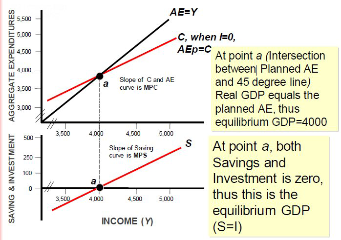
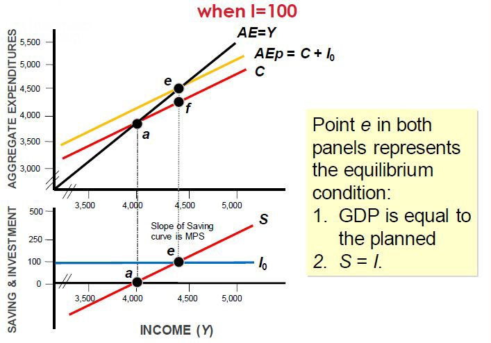
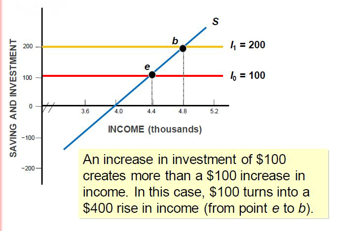
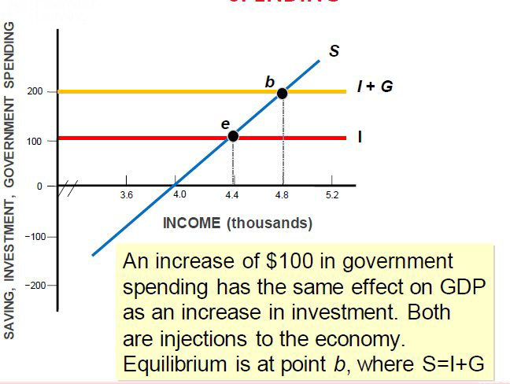
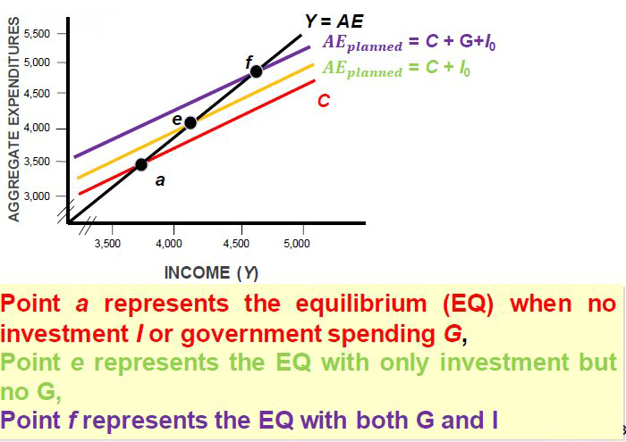

class: center,middle,mctitle-slide 


# Midterm 2

## Manolis Chatzikonstantinou  

---


# Midterm 2 review

1. Aggregate expenditures

---

# SIMPLE AGGREGATE EXPENDITURES MODEL

```{r  out.width = "100%",out.length = "100%", fig.align = 'center',echo=FALSE}
 
```


---

# SIMPLE AGGREGATE EXPENDITURES MODEL: INCREASE IN I

```{r  out.width = "100%",out.length = "100%", fig.align = 'center',echo=FALSE}
 
```

---

# IMPACT OF INVESTMENT INCREASE


```{r  out.width = "100%",out.length = "100%", fig.align = 'center',echo=FALSE}
 
```


---

# THE MULTIPLIER


```{r  out.width = "100%",out.length = "100%", fig.align = 'center',echo=FALSE}
knitr::include_graphics("midterm2/mid4.png") 
```


---

# SAVING, INVESTMENT, AND GOVERNMENT SPENDING


```{r  out.width = "100%",out.length = "100%", fig.align = 'center',echo=FALSE}
 
```


---

# DIFFERENT MODELS


```{r  out.width = "100%",out.length = "100%", fig.align = 'center',echo=FALSE}
 
```

