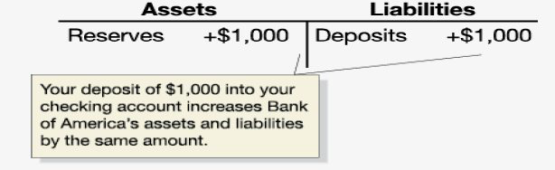

class: center,middle,mctitle-slide 


# Midterm 2

## Manolis Chatzikonstantinou  

---


# Midterm 2 review

1. Aggregate expenditures

---

# SIMPLE AGGREGATE EXPENDITURES MODEL

```{r  out.width = "100%",out.length = "100%", fig.align = 'center',echo=FALSE}
knitr::include_graphics("midterm2/mid1.png") 
```


---

# SIMPLE AGGREGATE EXPENDITURES MODEL: INCREASE IN I

```{r  out.width = "100%",out.length = "100%", fig.align = 'center',echo=FALSE}
knitr::include_graphics("midterm2/mid2.png") 
```

---

# IMPACT OF INVESTMENT INCREASE


```{r  out.width = "100%",out.length = "100%", fig.align = 'center',echo=FALSE}
knitr::include_graphics("midterm2/mid3.png") 
```


---

# THE MULTIPLIER


```{r  out.width = "100%",out.length = "100%", fig.align = 'center',echo=FALSE}
knitr::include_graphics("midterm2/mid4.png") 
```


---

# SAVING, INVESTMENT, AND GOVERNMENT SPENDING


```{r  out.width = "100%",out.length = "100%", fig.align = 'center',echo=FALSE}
knitr::include_graphics("midterm2/mid5.png") 
```


---

# DIFFERENT MODELS


```{r  out.width = "100%",out.length = "100%", fig.align = 'center',echo=FALSE}
knitr::include_graphics("midterm2/mid6.png") 
```


---

# MONEY CREATION AT BANK OF AMERICA

```{r  out.width = "100%",out.length = "100%", fig.align = 'center',echo=FALSE}
 
```

When you deposit $1,000 in currency at Bank of America, its
reserves increase by $1,000 and so do its deposits.
The currency component of the money supply decreases by the
$1,000, since that $1,000 is no longer in circulation; but the
checking deposits component increases by $1,000. So there is
no net change in the money supply yet.

But
Bank of America needs to make a profit so it keeps
10 percent of the deposit as reserves, and lends out the
rest, creating a 900 checking account deposit

---

# MONEY CREATION AT PNC

```{r  out.width = "100%",out.length = "100%", fig.align = 'center',echo=FALSE}
knitr::include_graphics("midterm2/mid8.png") 
```


The $900 initially appears in a
BoA checking account, but will
soon be spent; and Bank of America will transfer $900 in
currency to the bank at which the $900 check is deposited.
And the cycle will continue, with PNC now making a loan.

---

# Money creation

| Bank | Increase in Checking Account Deposits |
| :--- | :--- |
| Bank of America | $1,000 |
| PNC | +900(=0.9 xx$1,000) |
| Third Bank | +810(=0.9 xx$900) |
| Fourth Bank | +729(=0.9 xx$810) |
| * | +* |
| * | +* |
| * | +* |
| Total change in checking account deposits | =$10,000 |


An alternative way to find out how much money the
original $1,000 in currency will create is to add up all of
the checking account deposits.

$$\$ 1,000+[0.9 \times \$ 1,000]+[(0.9 \times 0.9) \times \$ 1,000]+\cdots$$
--
$=\$ 1,000\left(1+0.9+0.9^{2}+\cdots\right)$
$=\$ 1,000\left(\frac{1}{1-0.9}\right)$
$=\$ 1,000\left(\frac{1}{0.10}\right)$
$=\$ 1,000(10)=\$ 10,000$