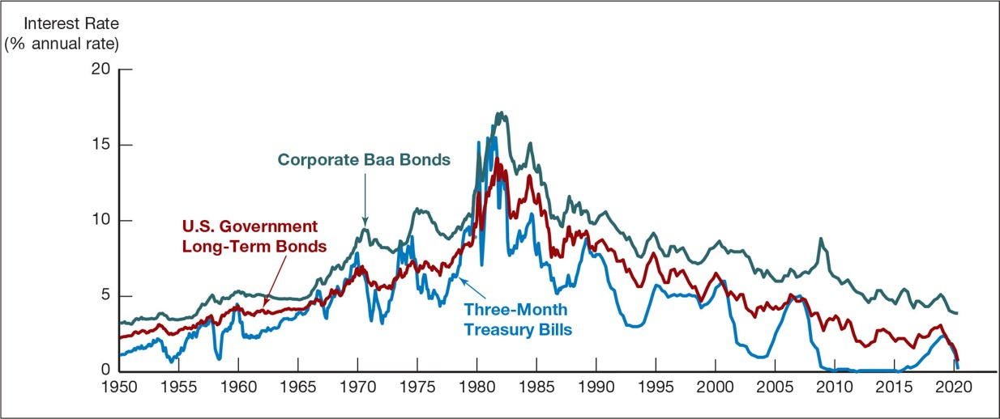
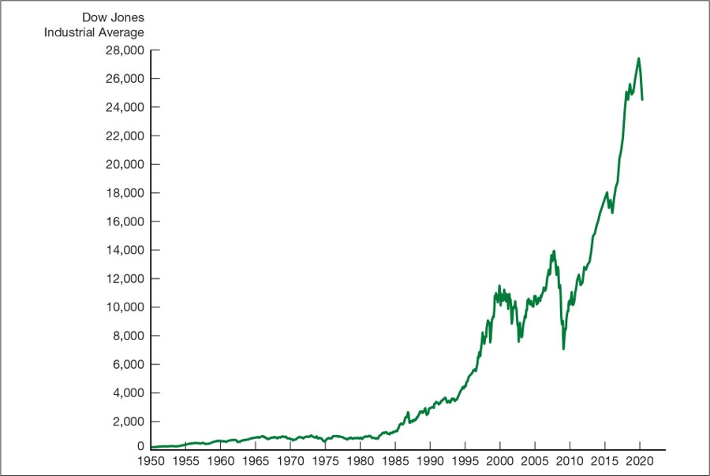
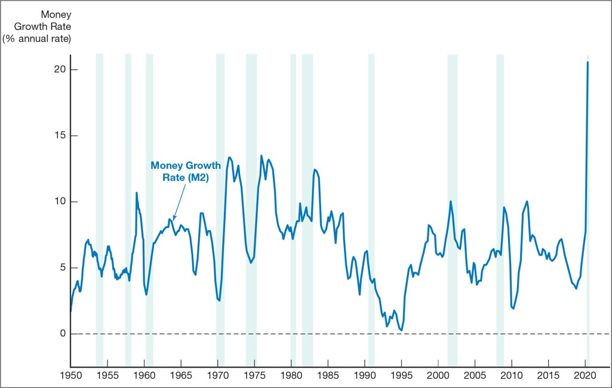
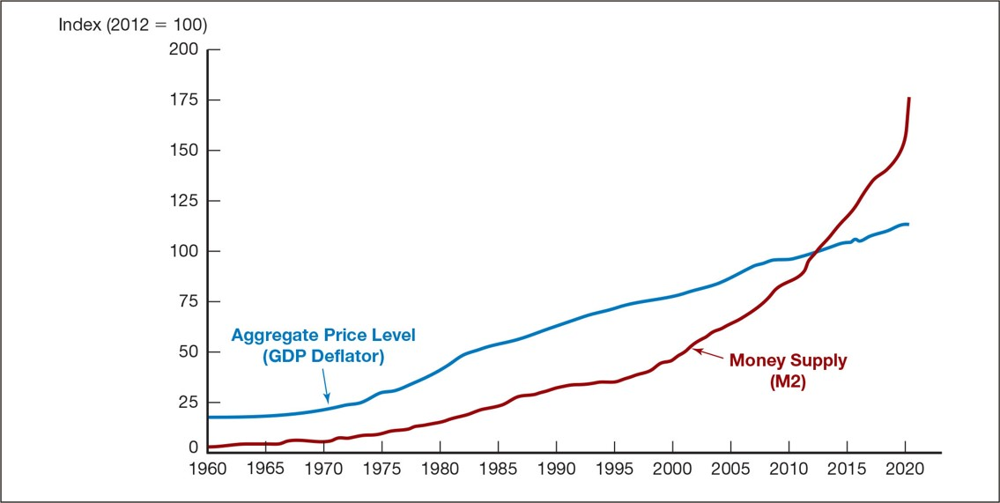
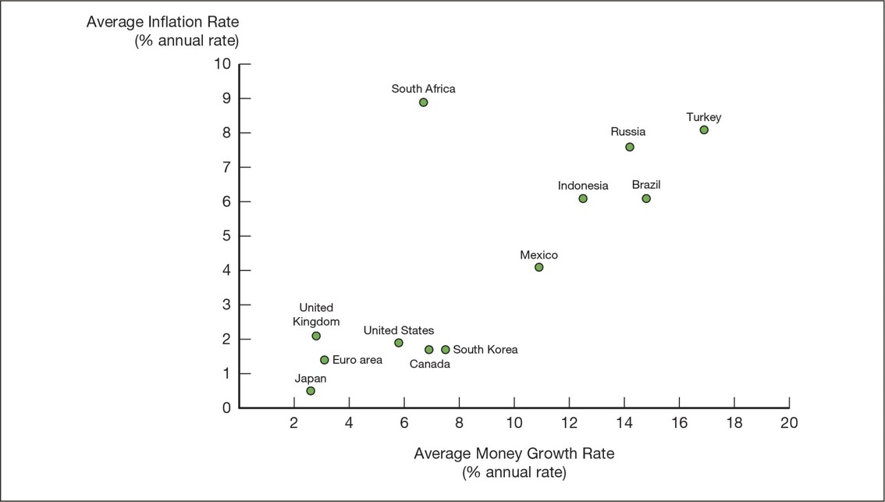
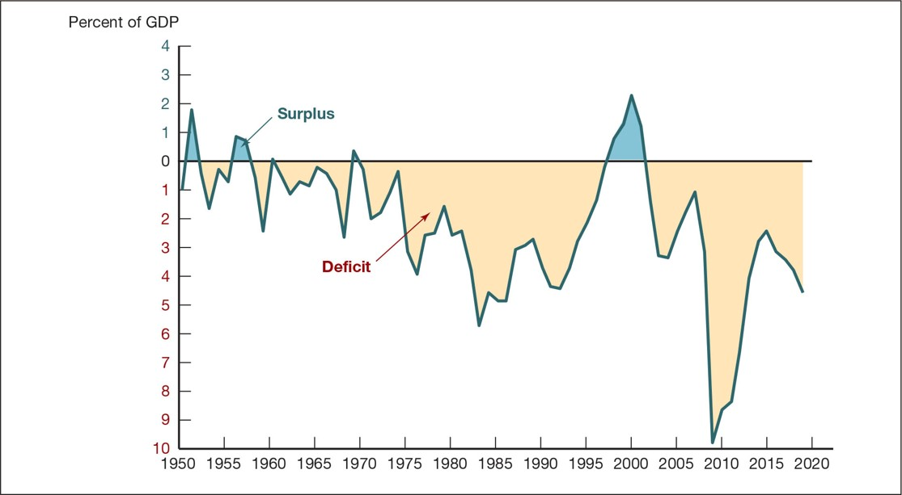
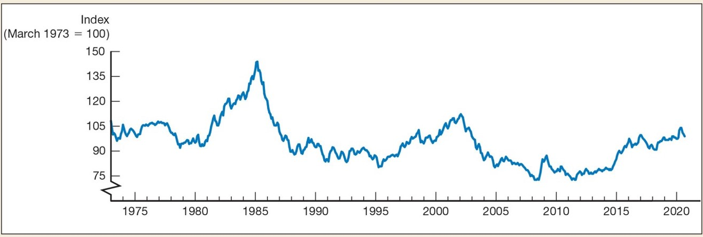

class: center,middle,mctitle-slide 


# Money and Banking : an Introduction

## Why Study Money, Banking, and Financial Markets?

### Manolis Chatzikonstantinou  

---


# Syllabus

- Class Format: $\quad 2$ lectures weekly by Prof. Chatzikonstantinou
  - MW 4:00 pm - 5:15 pm	
  - Georgetown Building-Qatar 0A08

--
  
- Grading:  

  1. Midterm #1 (12.5 %):  $\text{Monday, September 5th}$
  2. Midterm #2 (12.5 %):  $\text{Monday, October 24th}$
  3. Presentations  (12.5 %): $\text{October 26-31}$
  4. Paper submission (25 %): $\text{November 8th}$
  5. Problem Sets(25%): There will be bi-weekly problem sets
  6. Participation Quizzes(12.5%): Given at the beginning of every lecture
  
--

- Material: 
  - Textbook 
  - Lecture slides 
  - Mandatory and Optional Readings

--

- Skills: Data Analysis + Presentation + Report Writing (R programming?)


???
How and why participation quiz will work,
we will do a test on Monday and then Wednesday we will have the first one


---


# Contact Information

- Instructor: __Manolis Chatzikonstantinou__.

	- E-mail: ec1269@georgetown.edu 
	- Office: 0D26.
	- Office Hours: Mon. and Wed. 2:30-4:00 pm or by appointment (use e-mail).
  - Zoom Room: by appointment.

--

- Office hours start this week and can also be held virtually (by appointment). 
- Make sure to inform me, beforehand even during office hours, to avoid long waiting times!
- Do not attend office hours only before exams!
- Consult me if you face any issues with the material, presentation and final paper.
- Make use of canvas discussion section.

--

- About me:
  -  Phd in Economics, UCLA 2021
  -  International Macroeconomics, Finance, Multinational firms

--

- __What about you?__

???
Greece, Phd in Economics, Macroeconomics and Finance -I like to study how firms grow and what that means for the aggregate economy and financial markets
Ask the TA to introduce themselves
---


# What you will learn 

- How financial markets such as bond and stock  markets affect your everyday life.
- How financial institutions such as banks, investment and insurance companies work.
- The role of money in the economy!


--

__Class discussion:__
  - Can you think why financial markets are important for an economist ?
  - How do you think money and banking will be helpful?

--

__Some important questions:__

- What are the basic links among monetary policy, the business cycle, and economic variables ?

--

- What causes financial markets to crash ?

--

- Why banks are vulnerable?

--

- What policies can we use to stabilize financial markets, banks and the economy>


???
Ask students= if they think this is a  macroeconomics or microeconomics. Ask students their major and why studying money and banking might be important for all students regardless of their major. 

---

# Why Study Financial Markets?


- 2007-2009 Financial Crisis: 
  - the collapse of housing markets led to 
  - financial difficulties, e.g. the default of a major investment bank Lehman Brothers,

--

  - credit contraction and reduced profitability,
  - economic crisis, firms defaulted, firms freezed hiring and fired workers. 

--

  - The crisis transmitted  in several countries 
  
--

- 2019-2022: 
  - the recent pandemic led to a huge decline in production and consumption.
  - Firms could not support operations, increased subsidized lending + Fiscal Transfers

--

  - Fiscal Transfers in 2021 led to high demand and high prices
  - High commodity prices and high inflation changed expectations of consumers about prices
  
--
  - -> Increase in interest rates -> Recession???  __Poll__

---

# The Bond Market and Interest Rates
  - A __security__ (financial instrument) is a claim on the issuer’s future income or assets.
  - A __bond__ is a debt security that promises to make payments periodically for a specified period of time.
  - An __interest rate__ is the cost of borrowing or the price paid for the rental of funds.


```{r  out.width = "65%",echo=FALSE,fig.align="center"}
 
```


- Source: Federal Reserve Bank of St. Louis, FRED database:
    - https://fred.stlouisfed.org/series/TB3MS;
    - https://fred.stlouisfed.org/series/GS10;
    - https://fred.stlouisfed.org/series/BAA;
    
    
---

# The Stock Market


  - __Common stock__ represents a share of ownership in a corporation.
  - __A share of stock__ is a claim on the residual earnings and assets of the corporation.

```{r  out.width = "50%",echo=FALSE,fig.align="center"}
 
```


- Source: Federal Reserve Bank of St. Louis:
    - https://fred.stlouisfed.org/series/TB3MS;


---

class: my-one-page-font

# Why Study: 

_Financial Institutions and Banking?_

- __Financial intermediaries:__ institutions that borrow funds from investors and in turn provide funds
    - _Banks:_ accept deposits and make loans
    - _Other financial institutions:_ insurance companies, finance companies, pension funds, mutual funds

--

- __Financial innovation:__ the development of new financial products and services  
  - Can be an important force for good by making the financial system more efficient
  - _E-finance:_ the ability to deliver financial services electronically

--

- __Financial crises:__ major disruptions in financial markets that are characterized by sharp declines in asset prices and bank failures


---

class: my-one-page-font

# Why Study:

_Study Money and Monetary Policy?_

- Evidence suggests that money, defined as anything that is generally accepted as payment for goods or services or in the repayment of debts, plays an important role in generating business cycles.
  - Recessions (unemployment) and expansions affect all of us.
  - Monetary theory ties changes in the money supply to changes in aggregate economic activity and the price level.
  
--

- The __aggregate price level__ is the average price of goods and services in an economy
- A continual rise in the price level (__inflation__) affects all economic players
- Data show a connection between the money supply and the price level

---

# Money, Business Cycles, and Inflation


- Money Growth (M2 Annual Rate)

```{r  out.width = "50%",echo=FALSE,fig.align="center"}
 
```


- Source: Federal Reserve Bank of St. Louis:
  - https://fred.stlouisfed.org/series/M2SL

---

# Prices and Money Supply

- Aggregate Price Level and the Money Supply in the United States, 1960–2020


```{r  out.width = "65%",echo=FALSE,fig.align="center"}
 
```


- Source: Federal Reserve Bank of St. Louis:
  - https://fred.stlouisfed.org/series/M2SL
  - https://fred.stlouisfed.org/series/GDPDEF
  
  
---

# Inflation and Money Growth

- Average Inflation Rate Versus Average Rate of Money Growth for Selected Countries, 2009–2019

```{r  out.width = "70%",echo=FALSE,fig.align="center"}
 
```

---

# Money and Interest Rates

- Interest rates = the price of money
- Prior to 1980, the rate of money growth and the interest rate on long-term Treasury bonds were closely tied
- Since then, the relationship is less clear, but the rate of money growth is still an important determinant of interest rates

```{r  out.width = "50%",echo=FALSE,fig.align="center"}
knitr::include_graphics("week1graphs/Picture6.jpg") 
```


- Source: Federal Reserve Bank of St. Louis:
  - https://fred.stlouisfed.org/series/M2SL
  - https://fred.stlouisfed.org/series/GS10

---

class: my-one-page-font

# Stabilization policies

- __Monetary policy__ is the management of the money supply and interest rates
  - Responsibility of the __Central Bank__
  - Conducted in the United States by the Federal Reserve System (Fed)

--

- __Fiscal policy__ deals with government spending and taxation
  - Budget deficit is the excess of expenditures over revenues for a particular year
  - Budget surplus is the excess of revenues over expenditures for a particular year
  - Any deficit must be financed by borrowing


---

# Government Budget 


```{r  out.width = "70%",echo=FALSE,fig.align="center"}
 
```


- Source: Federal Reserve Bank of St. Louis:
  - https://fred.stlouisfed.org/series/FYFSGDA188S


---

# The foreign exchange market

- The __foreign exchange market:__ where funds are converted from one currency into another
- The __foreign exchange rate__ is the price of one currency in terms of another currency.


```{r  out.width = "70%",echo=FALSE,fig.align="center"}
 
```


- Source: Federal Reserve Bank of St. Louis:
  - https://fred.stlouisfed.org/series/TWEXM


 
---

# Money, Banking, and Financial Markets and Your Career

- Understanding monetary policy can help you 
  1. predict when interest rates will rise or fall, 
  2. make decisions about whether it is better to borrow now or to wait until later,
  3. know how banks and other financial institutions are managed which may
    - better deals when you need to borrow from them and 
    - better investment decisions, whether for yourself or for the company you work for

--

How We Will Study Money, Banking, and Financial Markets

- A simplified approach to the demand for assets
- The concept of equilibrium
- Basic supply and demand to explain behavior in financial markets
- An approach to financial structure based on transaction costs and asymmetric information

---

# Exploring the Web and Software

- The importance of the World Wide Web and statistical software is important several times:
  1. when we view the most current data for a high percentage of data figures (Federal Reserve Bank of St. Louis’s FRED) 
  2.  at the end of almost every chapter there are several real-time data analysis problems, which ask you to download the most recent data from the Federal Reserve Bank of St. Louis’s FRED database and then use these data to answer interesting questions.
  3. when we access additional Web exercises at the end of many chapters that prompt you to visit sites related to the chapter and use them to learn more about macroeconomic issues.
  4. when you prepare your presentation and paper.
  5. to automate process to follow the data and topics we study in the future.

--

- Take Home Exercise: 


- [Global Markets Headlines](https://www.reuters.com/markets/)
- [Rstudio and R for free online](https://rstudio.cloud/plans/free)
- [Explore FRED](https://fred.stlouisfed.org/)
- [Obtain a FRED API](https://fred.stlouisfed.org/docs/api/api_key.html)


