class: center,middle,mctitle-slide 


# Macroeconomics: The Big Picture

## Manolis Chatzikonstantinou  

---


# Syllabus

- Class Format: $\quad 2$ lectures weekly by Prof. Chatzikonstantinou $+$ Recitiation by TA
  - First two weeks virtually, see syllabus
  - After week 3, every lecture takes place in Georgetown Building-Qatar 0A11
  
- Grading:  

  - Exams (25 % M + 25 % F):

  1. Midterm #1:  $\text{Thursday, February 17th}$

  2. Midterm #2:  $\text{Thursday, March 31st}$
  3. Final:  $\text{TBA}$

- Problem Sets(25%): There will be weekly problem sets

- Participation Quizzes(25%): Given at the beginning of every lecture

- Material: Textbook + Lecture slides


???

_if not asked to lend money_.

---


# Contact Information

- Instructor: __Manolis Chatzikonstantinou__.

	- E-mail: ec1269@georgetown.edu 
	- Office: 0D26.
	- Office Hours: Mon. and Wed. 1:30-3:00 pm or by appointment (use e-mail).
  - Zoom Room: Available on Canvas.


- Teaching Assistants: __Fatima Hamady__
  - E-mail: fh311@georgetown.edu 
	- Zoom Room: TBD.
	- Office: 1G34.
	- Office Hours: Mon. and Wed. 12:00 to 13:30

- Office hours start next week and will be virtually. After week 3, we will be available by appointment in person 
- Make sure to inform us, beforehand even during office hours, to avoid long waiting times!
---


# What you will learn 

- What makes macroeconomics different from microeconomics ?

--

  - Can you name some micro economic questions?

  -  How do you think macro economic thinking will be helpful?

--

__Some macroeconomic questions:__

--

- What is a business cycle is how would you measure the state of the aggregate economy ?

--

- What is long-run economic growth and how it determines a country's standard of living  ?

--

- What is the meaning of inflation and deflation and why price stability is preferred  ?

--

- The importance of monetary and fiscal policy as tools against economic downturns 

---

# Would you ask a microeconomist this ?


| Microeconomic Questions | Macroeconomic Questions |
| :--- | :--- |
| Should I go to business school or take a job right now? | How many people are employed in the economy as a whole this year? |
| What determines the salary Google offers to Cherie Camajo, a new MBA? | What determines the overall salary levels paid to workers in a given year? |
| What determines the cost to a university or college of offering a new course? | What determines the overall level of prices in the economy as a whole? |


---

# Would you ask a microeconomist this ?


| Microeconomic Questions | Macroeconomic Questions |
| :--- | :--- |
| Should I go to business school or take a job right now? | How many people are employed in the economy as a whole this year? |
| What determines the salary Google offers to Cherie Camajo, a new MBA? | What determines the overall salary levels paid to workers in a given year? |
| What determines the cost to a university or college of offering a new course? | What determines the overall level of prices in the economy as a whole? |
|  | What government policies should be adopted to promote employment and growth in the economy as a whole? |


---

# Would you ask a microeconomist this ?


| Microeconomic Questions | Macroeconomic Questions |
| :--- | :--- |
| Should I go to business school or take a job right now? | How many people are employed in the economy as a whole this year? |
| What determines the salary Google offers to Cherie Camajo, a new MBA? | What determines the overall salary levels paid to workers in a given year? |
| What determines the cost to a university or college of offering a new course? | What determines the overall level of prices in the economy as a whole? |
| What government policies should be adopted to make it easier for lowincome students to attend college? | What government policies should be adopted to promote employment and growth in the economy as a whole? |
 
 

---

# Would you ask a microeconomist this ?


| Microeconomic Questions | Macroeconomic Questions |
| :--- | :--- |
| Should I go to business school or take a job right now? | How many people are employed in the economy as a whole this year? |
| What determines the salary Google offers to Cherie Camajo, a new MBA? | What determines the overall salary levels paid to workers in a given year? |
| What determines the cost to a university or college of offering a new course? | What determines the overall level of prices in the economy as a whole? |
| What government policies should be adopted to make it easier for lowincome students to attend college? | What government policies should be adopted to promote employment and growth in the economy as a whole? |
| What determines whether Citibank opens a new office in Shanghai? |  |

---

# Would you ask a microeconomist this ?


| Microeconomic Questions | Macroeconomic Questions |
| :--- | :--- |
| Should I go to business school or take a job right now? | How many people are employed in the economy as a whole this year? |
| What determines the salary Google offers to Cherie Camajo, a new MBA? | What determines the overall salary levels paid to workers in a given year? |
| What determines the cost to a university or college of offering a new course? | What determines the overall level of prices in the economy as a whole? |
| What government policies should be adopted to make it easier for lowincome students to attend college? | What government policies should be adopted to promote employment and growth in the economy as a whole? |
| What determines whether Citibank opens a new office in Shanghai? | What determines the overall trade in goods, services, and financial assets between the United States and the rest of the world? |


---

# Microeconomics versus Macroeconomics


- Microeconomics focuses on how decisions are made by individuals and firms and the consequences of those decisions.

--

  - Example: How much it would cost for a university or college to offer a new course ─ the cost of the instructor’s salary, the classroom facilities, the class materials, and so on.

  - Having determined the cost, the school can then decide whether to
offer the course by weighing the costs and benefits.

--

- Macroeconomics examines the aggregate behavior of the economy (that is, how the actions of all the individuals and firms in the economy interact to produce a particular level of economic performance as a whole).

--

  - Example: Overall level of prices in the economy (how high or how low they are relative to prices last year) rather than the price of a particular good or service.

--

- In macroeconomics, the behavior of the whole macroeconomy is greater than the sum of
individual actions:


--
  - __Paradox of thrift:__ when families and businesses are worried about the possibility of
economic hard times, they prepare by cutting their spending $\rightarrow$ This reduction in spending depresses the economy as consumers spend less and businesses react by laying off workers $\rightarrow$  families and businesses may end up worse off than if they hadn’t tried to act responsibly by cutting their spending.

---

# Theory and Policy

> “The long run is a misleading guide to current
affairs. In the long run we are all dead . Economists
set themselves too easy, too useless a task if in
tempestuous seasons they can only tell us that
when the storm is past the ocean is flat again.”

John Maynard Keynes, A Tract on Monetary Reform (1923) Ch. 3

--

- Modern Macroeconomics were born as a result of a need to deal with Great Depression

--

-  In a self regulating economy, problems such as unemployment
are resolved without government intervention, through the
working of the "invisible hand".

--

- According to Keynesian economics, economic slumps are
caused by inadequate spending and they can be mitigated by
government intervention.

--

- Monetary policy uses changes in the quantity of money to alter
interest rates and affect overall spending.

--

-  Fiscal policy uses changes in government spending and taxes to
affect overall spending.

---

# The Business Cycle

```{r  out.width = "70%",echo=FALSE}
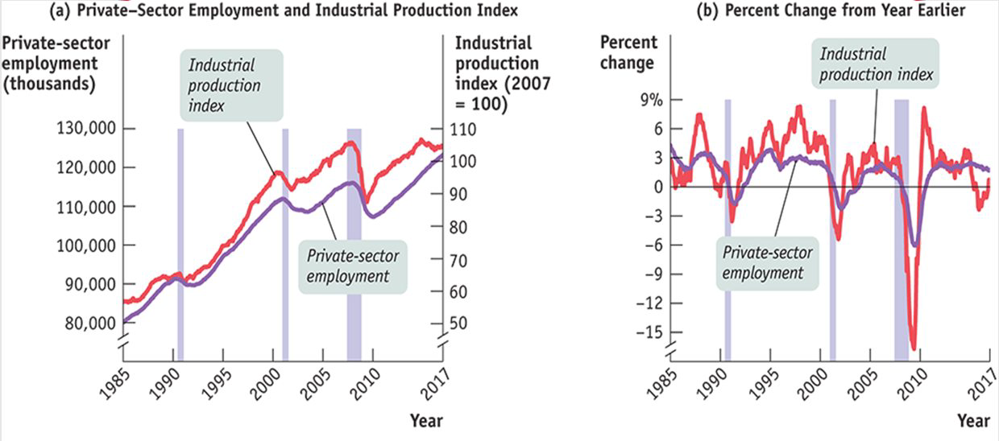 
```


- The business cycle is the short run alternation between
economic downturns and economic upturns. 
- Recessions are periods of economic downturns when output
and employment are falling. 
- Expansions , sometimes called recoveries , are periods of
economic upturns when output and employment are rising.


???

_The point at which the economy turns from expansion to
recession is a business cycle peak_.

_The point at which the economy turns from recession to
expansion is a business cycle trough_.


---

# What will we learn?

```{r  out.width = "50%",echo=FALSE}
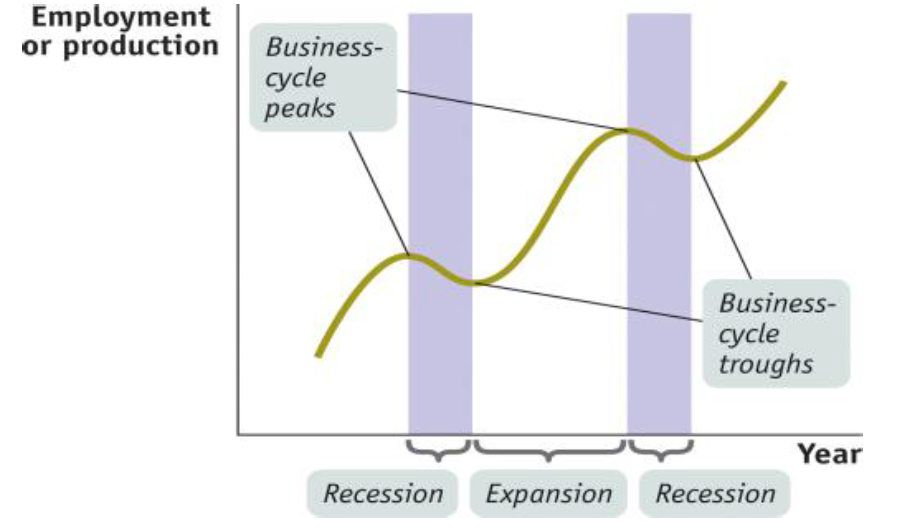 
```

???

- What happens during a business cycle, and what can be done about it?

??? 

--

- Fluctuations in unemployment and aggregate output

--

  - Recession: Employment $\downarrow$  
--
  
  - Recession: Output $\downarrow$


--

- What causes recession and how can policy makers change the economy?


---

# Taming the Business Cycle

```{r  out.width = "60%",echo=FALSE}
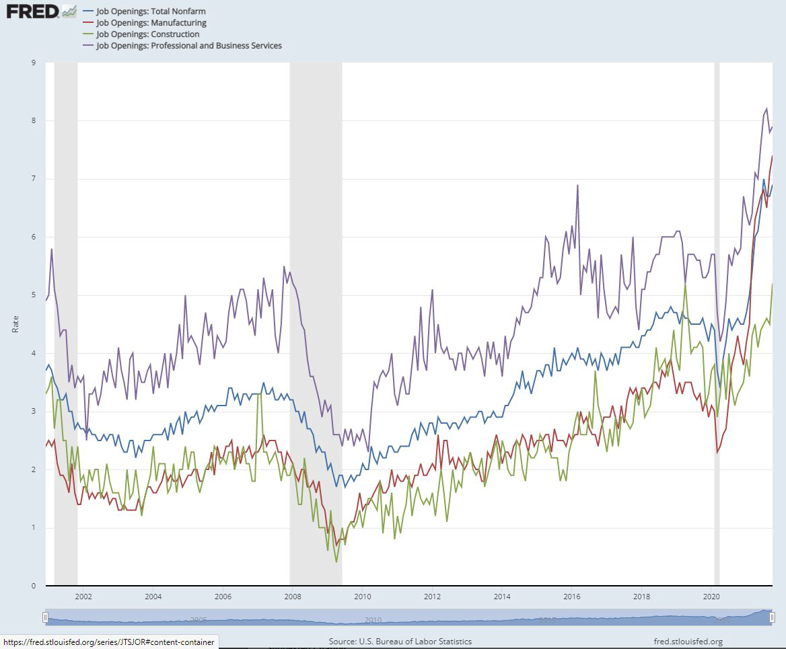 
```

---

# Taming the Business Cycle


- The business cycle is a main concern of modern policy makers in macroeconomics:
they try to smooth out the business cycle and reduce unemployment.

--

- Policy efforts undertaken to reduce the severity of recessions are
called stabilization policies .

--

- Two type of stabilization policies: 1. monetary policy : changes in the interest rate. 2. fiscal policy : changes in government spending, taxes, or both.

--

- To understand the impact of policies we need models! Classical vs. Keynesian models:

  - The classical approach: the idea that if there are free markets
and individuals conduct their economic affairs in their own
best interests, the overall economy will work well. Wages and prices adjust rapidly to get to equilibrium
  – Equilibrium: a situation in which the quantities
demanded and supplied are equal

--

  - Conclusion: Government should have only a limited role in the
economy

--

  - The Keynesian approach: Classical theory failed to explain persistent high unemployment during  The Great Depression. Keynes: Persistent unemployment occurs because wages and prices adjust slowly, so markets remain out of equilibrium for long periods
  
--

  - Conclusion: Government should intervene to restore full employment

??? 

Do we only care about fluctuations in employment and output?
---

# Inflation and Deflation


- A rising aggregate price level is __inflation__.

--

- A falling aggregate price level is __deflation__.

--

- The inflation rate is the annual percent change in the aggregate price level.

--

```{r  out.width = "70%",echo=FALSE}
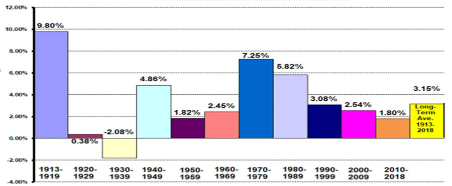 
```

--

- The economy has price stability when the aggregate price level is changing only slowly.

---
# Long Run Economic Growth

--

- Long run economic growth is the sustained upward trend in the economy’s
output over time.

--

- A country can achieve a permanent increase in the standard of living of its
citizens only through long run growth.

--

```{r  out.width = "50%",echo=FALSE}
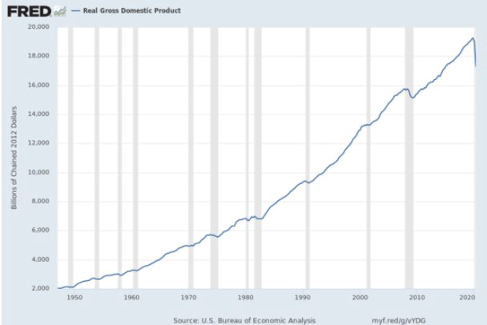 
```

-  A central concern of macroeconomics is what determines long run economic growth.

---

# Summary of main topics to cover

Macroeconomics studies the structure of aggregate economies and the impact of policies on their performance.

--

- What determines economic fluctuations? (__business cycle__)

--

- Why some countries grow faster than others? (__economic growth__)

--

- What causes __unemployment__?

--

- What drives price changes? (__inflation__)

--

- What is the role of economic policies and the government? (__monetary and fiscal policies__)

--

Useful Material:

- Graphs in Economics (Appendix after Chapter 2: Graphs in Economics)

- Microeconomics Review (Chapters 2,3 and 4)

- [NBER's The Digest](https://www.nber.org/digest-2021-09)

- [Macroeconomists as policy makers](https://www-nber-org.proxy.library.georgetown.edu/news/gita-gopinath-tapped-new-imf-role)


--

---

# Short Review

  - A competitive market has many buyers and sellers of the same good or service, none of whom can influence the price.
  - The supply and demand model is a model of how a competitive market behaves.
The five key elements of this model:
  1. The demand curve
  2. The supply curve
  3. Factors that shift the demand curve and factors that shift the supply curve
  4. The market equilibrium
  5. Changes in the market equilibrium
  
--


__Key topics__

- Demand represents the behavior of buyers. Supply Represents the behavior of producers/sellers.

  - A demand schedule is a table showing how much of a good or service consumers will want to buy at different prices. A supply schedule shows how much of a good or service would be supplied at different prices. 

  - A demand curve shows the quantity demanded at various prices. A supply curve shows the quantity supplied at various prices


  - The law of demand and the law of supply

---

# Demand Schedule and Curve


```{r  out.width = "60%",echo=FALSE}
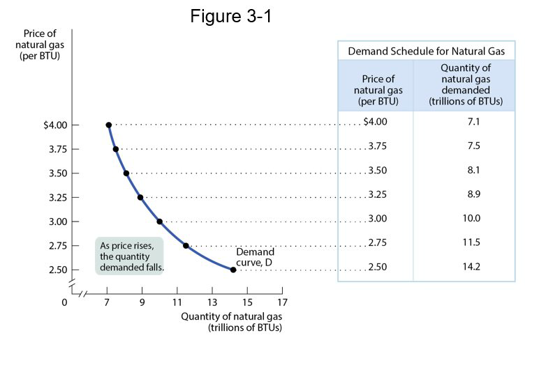 
```


---

# Demand Shifts

.pull-left[

```{r  out.width = "80%",echo=FALSE}
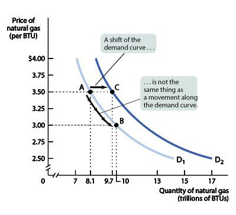 
```
]
--


.pull-right[

```{r  out.width = "80%",echo=FALSE}
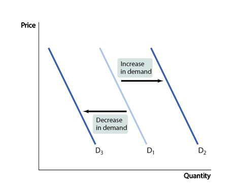 
```
]
 
???

Five factors that shift the demand curve: 
Changes in the prices of related goods or services 
Changes in income 
Changes in tastes 
Changes in expectations 
Changes in the number of consumers


---

# Supply Shifts


.pull-left[

```{r  out.width = "120%",echo=FALSE}
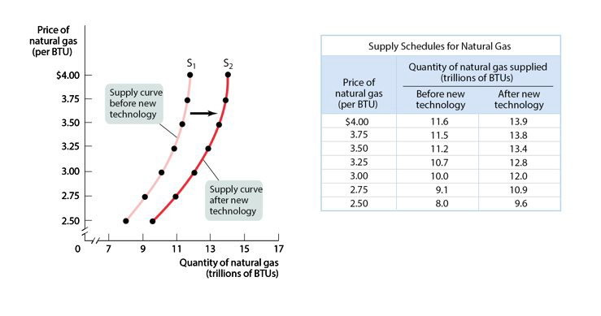 
```
]
--


.pull-right[

```{r  out.width = "80%",echo=FALSE}
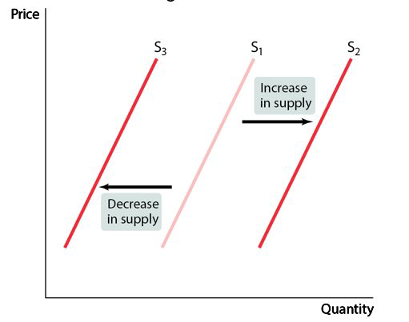 
```
]
 
 
???
Important supply shifters include changes in:
input prices.
the prices of related goods or services.
technology.
expectations.
the number of producers.

---

# Market Equilibrium

 - When $Q_s = Q_d$ at a certain price, the market is in equilibrium.

 - That is, the amount consumers would purchase at this price is matched exactly by the amount producers wish to sell.
 
 
```{r  out.width = "40%",echo=FALSE}
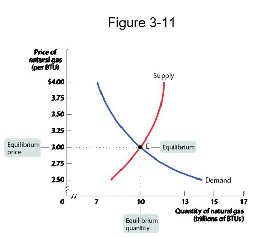 
```
 
 
 
???
 The price at which this takes place is the equilibrium price, also referred to as the market-clearing price. The quantity of the good or service bought and sold at that price is the equilibrium quantity
Ask class what happens:
  if price is too high or too low?
 if demand shifts down
 if supply shifts up
