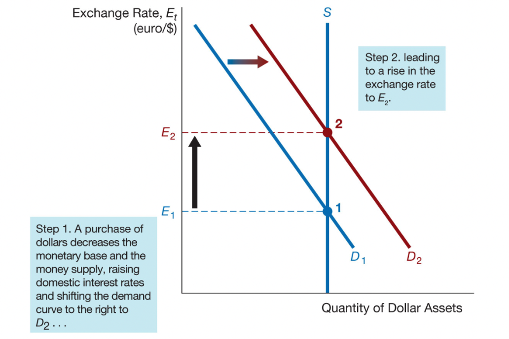

class: center,middle,mctitle-slide 


# Income and Expenditure

## The International Financial System

---


# What will you learn in this lecture?

- 19.1 Use graphs and T-accounts to illustrate the
distinctions between the effects of sterilized and
unsterilized interventions on foreign exchange markets.

19.2 Interpret the relationships among the current
account, the capital account, and official reserve
transactions balance.

19.3 Identify the mechanisms for maintaining a fixed
exchange rate and assess the challenges faced by fixed
exchange rate regimes.

19.4 Summarize the advantages and disadvantages of
capital controls.

19.5 Assess the role of the I M F as an international lender
of last resort.

19.6 Identify the ways in which international monetary
policy and exchange rate arrangements can affect
domestic monetary policy operations.

19.7 Summarize the advantages and disadvantages of
exchange-rate targeting.

---

# Intervention in the Foreign Exchange Market

| Federal Reserve System |  |  |  |
| :--- | :--- | :--- | :--- |
| Assets |  | Liabilities |  |
| Foreign Assets | -1 Billion | Currency in Circulation | -1 Billion|
| (International Reserves) |  |  |  |

--

| Federal Reserve System |  |  |  |
| :--- | :--- | :--- | :--- |
| Assets |  | Liabilities |  |
| Foreign Assets | -1 Billion| Deposits with the Fed | -1 Billion |
| (International Reserves) |  | (reserves) |  |

--

A central bank’s purchase of domestic currency and
corresponding sale of foreign assets in the foreign
exchange market lead to an equal decline in its
international reserves and the monetary base.

--

A central bank’s sale of domestic currency to purchase
foreign assets in the foreign exchange market results in
an equal rise in its international reserves and the
monetary base.

---

# Unsterilized foreign exchange intervention:

- Domestic currency is sold to purchase foreign assets 

```{r  out.width = "80%", fig.align="center",echo=FALSE}

```

---

# Sterilized foreign exchange intervention

| Federal Reserve System |  |  |  |
| :--- | :---: | :--- | :---: |
| Assets |  | Liabilities |  |
| Foreign Assets (International Reserves) | -$1" "B | Monetary Base (reserves) | 0 |
| Government Bonds | +$1" "B |  |  |

To counter the effect of the foreign exchange
intervention, conduct an offsetting operation about domestic assets

- No effect on the exchange rate.
