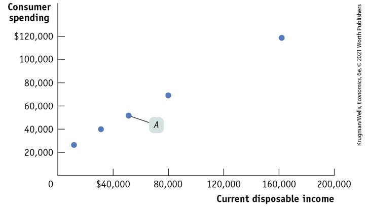
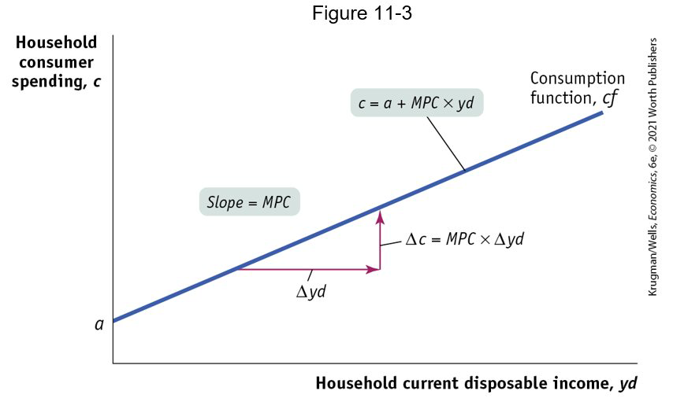
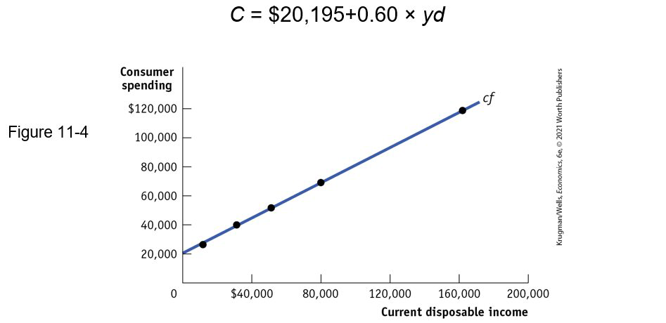
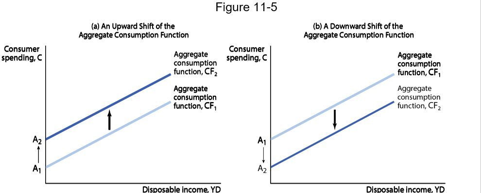
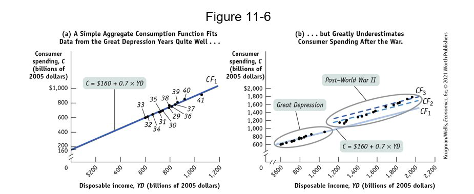
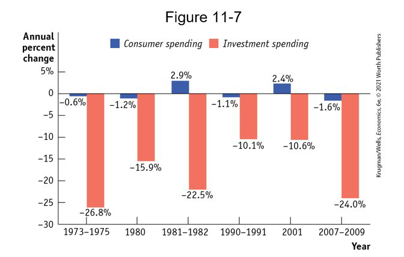
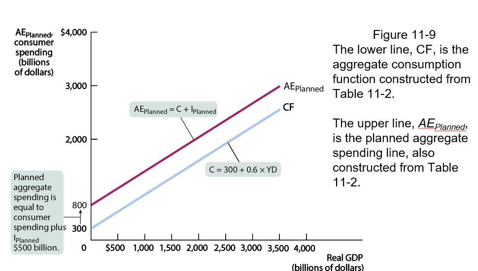
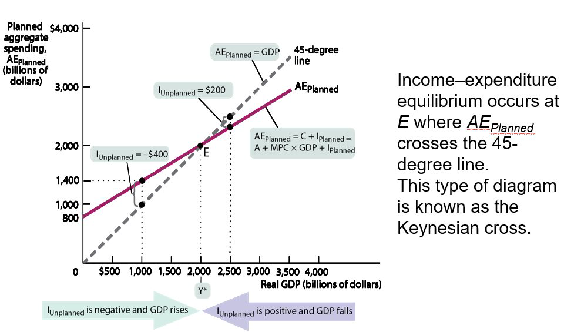

class: center,middle,mctitle-slide 


# Income and Expenditure

## Manolis Chatzikonstantinou  

---


# What will you learn in this lecture?

- What is the importance of the multiplier, which  summarizes how initial changes in spending lead to  further changes?
- What is the aggregate consumption function? 
- How do expected future income and aggregate wealth  affect consumer spending?
- What determines investment spending, and why do we need to distinguish between planned investment spending and unplanned inventory investment?
- How does the inventory adjustment process move the  economy to a new equilibrium after a change in demand?

- Why is investment spending considered a leading  indicator of the future state of the economy?


---

# The Multiplier: an informal introduction 

A rise or fall in aggregate spending leads to changes in income, which lead to further changes in aggregate spending. Let’s examine that chain reaction more closely. 
Four simplifying assumptions: 
Producers are willing to supply additional output at a fixed price.
Changes in aggregate spending translate into  changes in aggregate output (NOT PRICES)
We take the interest rate as given.
There is no government spending and no taxes.
Exports and imports are zero.

--

Suppose home builders spend an extra $100 billion on home construction: Aggregate output will increase by $100 billion. 
This increase in aggregate output will increase profits and wages that flow to households, which will increase consumer spending, which, in turn, will induce firms to increase output yet again. 
There are multiple rounds of increases in aggregate output. 
How large is the total effect on aggregate output if we sum the effect from all these rounds of spending increases? 
???
Since households and firms are mutually
interdependent (recall the circular flow), booms
and busts involve chain reactions
The multiplier helps us understand the extent of the
chain reactions
---

# The Multiplier: an informal introduction 

Marginal propensity to consume, or MPC: the increase in consumer spending when disposable income rises by $1.

$$ M P C=\frac{\Delta \text { consumer spending }}{\Delta \text { disposable income }(\text { where } \Delta=\text { change })}$$

--

For example, if consumer spending goes up by $6 and disposable income goes up by $10, MPC = $6/10 = 0.6

--

- Marginal propensity to save, or MPS: the fraction of an additional dollar of disposable income that is saved.

$$MPS = 1 − MPC \text{ (Whatever is not spent is saved)} $$
--

The $\$ 100$ billion increase in investment spending raises real GDP by $\$ 100$ billion.
This leads to a second-round increase in real GDP:
$M P C \times \$ 100$ billion.
This leads to a third-round increase in real GDP:
$M P C \times M P C \times \$ 100$ billion.
After an infinite number of rounds, the total effect on real GDP:
$\left(1+M P C+M P C^{2}+M P C^{3}+\ldots\right) \times \$ 100$ billion
Mathematical fact:
$1+x+x^{2}+x^{3}+\cdots=\frac{1}{1-x}$ if $x$ is between 0 and 1 .
Total increase in real GDP from a $\$ 100$ billion rise is
$\frac{1}{1-M P C} \times \$ 100$ billion

---

# The multiplier

It’s important to distinguish between the initial change and the additional change in aggregate spending as the chain reaction unfolds. 
An initial change in aggregate spending at a given level of real GDP is called an autonomous change in aggregate spending. 
Formally, the multiplier is the ratio of the total change in real GDP caused by an autonomous change in aggregate spending to the size of that autonomous change.

--

- If ΔAAS is an autonomous change in aggregate spending and ΔY = change in real GDP,

$\Delta Y=$ change in real GDP
$$
\begin{array}{l}\Delta Y=\frac{1}{1-\mathrm{MPC}} \times \Delta \mathrm{AAS} \\ \text { Andthemultiplier }=\frac{\Delta Y}{\Delta \mathrm{AAS}}=\frac{1}{1-\mathrm{MPC}}\end{array}
$$
Let $\mathrm{MPC}=0.8$ and $\Delta \mathrm{AAS}=100$ Multiplier $=\frac{1}{1-0.8}=5$
$$ \Delta Y=\frac{1}{1-0.8}(100)=5(100)=500 $$

---

# CURRENT DISPOSABLE INCOME AND CONSUMER SPENDING

Consumer spending accounts for two-thirds of total spending on final goods and services. 
But what determines how much consumers spend? The most important factor is current disposable income. 

--

- Current disposable income: income after taxes are paid and government transfers are received 

$$\text{2018 average income } = 51,211$$

$$\text{2018 average spending = $51,729$$

--

```{r  out.width = "100%",out.length = "100%", fig.align = 'center',echo=FALSE}
 
```

---

# The consumption function

Consumption function: an equation showing how an individual household’s consumer spending varies with the household’s disposable income

$$ c=a+M P C \times y d$$

Where
$c=a$ household's consumer spending
$y d=$ household disposable income
$M P C=$ marginal propensity to consume
$a=a$ constant, autonomous consumer spending-what a
family would spend even with zero income

--

Recall

$M P C=\Delta \mathrm{c} / \Delta \mathrm{yd}$
Multiplying both sides of the equation by $\Delta \mathrm{yd}$, we get: $M P C \times \Delta y d=\Delta C$

In other words, when $y d$ goes up by $\$ 1, c$ goes up by $M P C \times \$ 1 .$

--

Aggregate consumption function: the relationship for the economy as a whole between aggregate disposable income and aggregate consumer spending
C = A + MPC × YD
Same form as consumption function, just aggregate

---

# The consumption function: Graph

```{r  out.width = "100%",out.length = "100%", fig.align = 'center',echo=FALSE}
 
```


---

# The consumption function in the data

```{r  out.width = "100%",out.length = "100%", fig.align = 'center',echo=FALSE}
 
```

---

# Shifts in the aggregate consumption function 

```{r  out.width = "100%",out.length = "100%", fig.align = 'center',echo=FALSE}
 
```

---

# What causes shifts?

Changes in Expected Future Disposable Income: Consumer spending depends on the income people expect to have over the long term rather than on their current income: the permanent income hypothesis.
For example, expectations of higher incomes lead consumers to spend more, shifting the aggregate consumption function up.

--

Changes in Aggregate Wealth: consumers plan their spending— they try to smooth their consumption—over their lifetimes: the life-cycle hypothesis. 
For example, a rise in aggregate wealth—say, because of a booming stock market—increases aggregate autonomous consumer spending, shifting the aggregate consumption function up.

--

- Did the aggregate consumption function shift after WWII? 

---

# Aggregate consumption shifted after WWII 

```{r  out.width = "100%",out.length = "100%", fig.align = 'center',echo=FALSE}
 
```

- Panel (a) shows aggregate data on disposable income and consumer spending from 1929 to 1941 when a simple linear consumption function, CF1, fitted the data well.

- Panel (b) shows that the aggregate consumption function shifted up after World War II because consumers grew increasingly confident that economic boom would continue, and wealth was steadily increasing.

---

# Model with Tax

A lump-sum tax will decrease disposal income
$Y d=Y-T$
Thus, consumption function becomes:
$C=a+M P C *(Y-T)=a+M P C * Y-M P C * T$
The only difference is that the consumption decreases by $M P C * T$

--

Equal changes in government spending and
taxation lead to an equal change in income.
•
If a $1 billion increase in spending is financed by
a $1 billion tax increase, GDP rises $1 billion
regardless of the MPC.

__THE BALANCED BUDGET MULTIPLIER IS ALWAYS 1__

---

# The Balanced Budget Multiplier

- Suppose we increase government spending and taxes
both by $10 billion; what would happen to real GDP?

$\Delta Y$ from government purchases increase $=\Delta G \times \frac{1}{1-M P C}$
$\Delta Y$ from tax increase $=\Delta T \times \frac{-M P C}{1-M P C}$
So the overall $\Delta Y$ is the sum of these:
$\Delta Y=\$ 10$ billion $\times \frac{1}{1-M P C}+\$ 10$ billion $\times \frac{-M P C}{1-M P C}$
$\Delta Y=\$ 10$ billion $\times\left[\frac{1}{1-M P C}+\frac{-M P C}{1-M P C}\right]$
$\Delta Y=\$ 10$ billion $\times\left[\frac{1-M P C}{1-M P C}\right]$
$\Delta Y=\$ 10$ billion

--

RECESSIONARY GAP
THE
INCREASE IN AGGREGATE SPENDING NECESSARY TO
BRING A DEPRESSED ECONOMY BACK TO FULL EMPLOYMENT
SLIDE
40
INFLATIONARY GAP
THE
DECREASE IN AGGREGATE SPENDING NECESSARY TO
BRING AN OVERHEATED ECONOMY BACK TO FULL
EMPLOYMENT
•
Inflationary pressures occur when an economy produces output
above full employment Excess spending results in higher
prices, which can lead to other economic problems
•
This is not the total deficiency in GDP, which is called the GDP
gap The recessionary gap is the spending needed to close the
GDP gap when boosted by the multiplier

---

# Investment Spending


```{r  out.width = "100%",out.length = "100%", fig.align = 'center',echo=FALSE}
 
```


- Small yet powerful: Although much smaller than consumer spending, investment spending tends  to drive the booms and busts in the business cycle. 

--

Planned investment spending: the investment spending that businesses intend to undertake during a given period
It depends on:
Interest rate
Expected future real GDP
Current level of production capacity

---

# The interest rate and investment spending

Firms with investment spending projects will only go ahead with a project if they expect a rate of return higher than the cost of the project. 
If the interest rate rises, fewer projects will pass that test, and as a result investment spending will be lower. 
Conversely, a fall in the interest rate makes some investment projects profitable so that more projects will be funded.
If a firm pays for projects out of retained earnings (past profits used to finance investment spending), the trade-off is the same because the firm must consider the opportunity cost of the funds. 

--

If your firm has extra capacity and doesn’t expect sales to increase, its investment will be lower.
Other things equal, the higher the current capacity, the lower the investment spending.
According to the accelerator principle: 
A higher rate of growth in real GDP leads to higher planned investment spending.
A lower growth rate of real GDP leads to lower planned investment spending.

--

Inventories: stocks of goods held to satisfy future sales
Inventory investment: the value of the change in total inventories held in the economy during a given period
Unplanned inventory investment: unplanned changes in inventories that occur when actual sales are more or less than businesses expected
Actual investment spending: the sum of planned investment spending and unplanned inventory investment
So, in any period:    I = IUnplanned + IPlanned


---

# THE INCOME–EXPENDITURE MODEL

- We’ll see that the multiple rounds of changes in real GDP are accomplished through changes in the amount of output produced by firms—changes they make in response to changes in inventories. 


Recall the assumptions underling the multiplier process:
Changes in overall spending lead to changes in aggregate output.
The interest rate is fixed.
Taxes, government transfers, and government purchases are all zero.
Exports and imports are both zero.

--

Since we assume that there are no taxes or transfers,
$$
\begin{aligned}
&G D P=C+I \text { and } \\
&Y D=G D P
\end{aligned}
$$
and our aggregate consumption function is
$$
C=A+M P C \times Y D
$$
and we assume $I_{\text {planned }}$ is fixed, so
$$
A E_{\text {Planned }}=C+I_{\text {Planned }}
$$
where $A E_{\text {Planned, }}$ planned aggregate spending is the total amount of planned spending in the economy.

--

- Example: If C = 300 + 0.6 × YD

---

# Planned aggregate spending and real GDP

| Real GDP (billions of dollars) | YD (billions of dollars) | C (billions of dollars) | IPlanned (billions of dollars) | AE__Planned (billions of dollars) |
| :---: | :---: | :---: | :---: | :---: |
| $0 | $0 | $300 | $500 | $800 |
| 500 | 500 | 600 | 500 | 1,100 |
| 1,000 | 1,000 | 900 | 500 | 1,400 |
| 1,500 | 1,500 | 1,200 | 500 | 1,700 |
| 2,000 | 2,000 | 1,500 | 500 | 2,000 |
| 2,500 | 2,500 | 1,800 | 500 | 2,300 |
| 3,000 | 3,000 | 2,100 | 500 | 2,600 |
| 3,500 | 3,500 | 2,400 | 500 | 2,900 |

--

- Equilibrium When Real GDP = YD = AEPlanned


---

# THE AGGREGATE CONSUMPTION FUNCTION AND PLANNED AGGREGATE SPENDING 


```{r  out.width = "100%",out.length = "100%", fig.align = 'center',echo=FALSE}
 
```


---

# Income expenditure equilibrium

- The economy moves to a situation in which there is no unplanned inventory investment: the income–expenditure equilibrium. 


| Real GDP | $AE_("Planned ")$ | $I_("Unplanned ")$ |
| ---: | :---: | ---: |
|  | (billions of dollars) |  |
| $0 | $800 | -$800 |
| 500 | 1,100 | -600 |
| 1,000 | 1,400 | -400 |
| 1,500 | 1,700 | -200 |
| 2,000 | 2,000 | 0 |
| 2,500 | 2,300 | 200 |
| 3,000 | 2,600 | 400 |
| 3,500 | 2,900 | 600 |

--

Planned aggregate spending can be different from real GDP only if there is unplanned inventory investment, IUnplanned, in the economy.
If firms have overestimated sales and produced too much, there will be unintended additions to inventories (and IUnplanned will be positive).
If firms have underestimated sales and produced too little, there will be unintended drops in inventories (and IUnplanned will be negative).

---

# Income expenditure equilibrium

$$
\begin{aligned}
\text { GDP } &=C+I \\
&=C+I_{\text {Planned }}+I_{\text {unplanned }} \\
&=A E_{\text {Planned }}+I_{\text {unplanned }}
\end{aligned}
$$
- Whenever real GDP exceeds $A E_{\text {Planned }}, I_{\text {Unplanned }}$ is positive.

- Whenever real GDP is less than $A E_{\text {Planned, }} I_{\text {Unplanned }}$ is negative.

-- 

> But firms will act to correct their mistakes. We’ve assumed that they don’t change their prices, but they can adjust their output. These responses will eventually eliminate the unanticipated changes in inventories and move the economy to a point at which real GDP is equal to planned aggregate spending.

--

The economy is in income–expenditure equilibrium when aggregate output (real GDP) is equal to planned aggregate spending.
Income–expenditure equilibrium GDP (Y*): the level of real GDP at which real GDP equals planned aggregate spending.

---

# Income expenditure equilibrium: Graph

```{r  out.width = "100%",out.length = "100%", fig.align = 'center',echo=FALSE}
 
```


---

# The multiplier and inventory adjustment

What happens when there’s a shift of the planned aggregate spending line? 
In our simple model, there are only two possible sources of a shift of the planned aggregate spending line: 
a change in planned investment spending, IPlanned,  
a shift of the aggregate consumption function, CF. 
A change in IPlanned can occur because of a change in the interest rate. 
A shift of the aggregate consumption function (a change in its vertical intercept, A) can occur because of a change in aggregate wealth—say, due to a rise in house prices. 

--

- Autonomous spending $\uparrow$ by 400 ($MPC = 0.6$)

| Real GDP | AE_("Planned ") before autonomous change | AE_("Planned ") after autonomous change |
| :---: | :---: | :---: |
|  | (billions of dollars) |  |
| $0 | $800 | $1,200 |
| 500 | 1,100 | 1,500 |
| 1,000 | 1,400 | 1,800 |
| 1,500 | 1,700 | 2,100 |
| 2,000 | 2,000 | 2,400 |
| 2,500 | 2,300 | 2,700 |
| 3,000 | 2,600 | 3,000 |
| 3,500 | 2,900 | 3,300 |
| 4,000 | 3,200 | 3,600 |

--

When planned spending does not equal the aggregate output, this difference shows up in changes in inventories. 
Firms respond to inventory changes and move real GDP to the point at which real GDP and planned aggregate spending are equal. 
That’s why changes in inventories are a leading indicator of future economic activity.

---

# The multiplier and inventory adjustment


```{r  out.width = "100%",out.length = "100%", fig.align = 'center',echo=FALSE}
knitr::include_graphics("week10graphs/equil2.png") 
```

--

We can summarize these results in an equation, where ∆AAEPlanned represents the autonomous change in AEPlanned, and ΔY*=Y*2 – Y*1, the subsequent change in income–expenditure equilibrium GDP:

$$\Delta Y^{*}=\text { Multiplier } \times \Delta A A E_{\text {Planned }}=\frac{1}{1-M P C} \times \Delta A A E_{\text {Planned }}$$

???
Since MPC < 1, each round of increases in disposable income leaks out into savings. As a result, increases in real GDP diminish from one round to the next. At some point the increase in real GDP is negligible, and the economy converges to a new income–expenditure equilibrium GDP.


