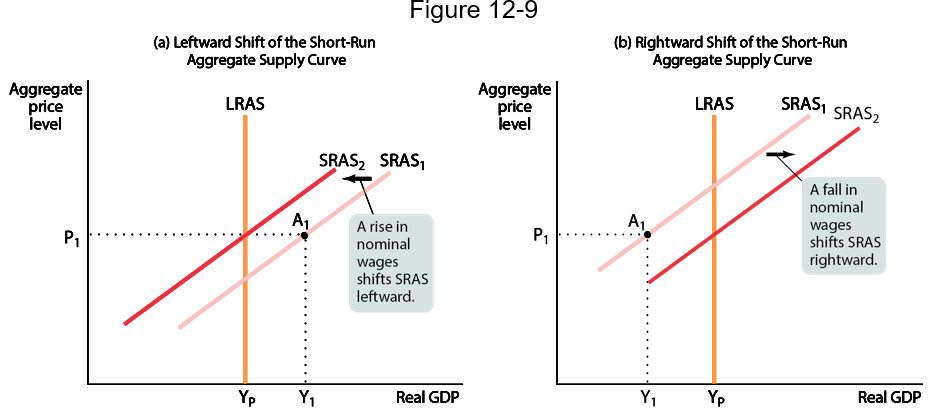
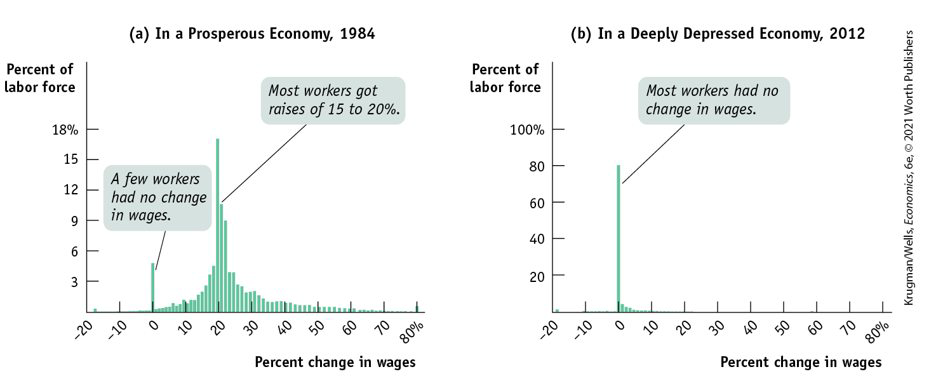
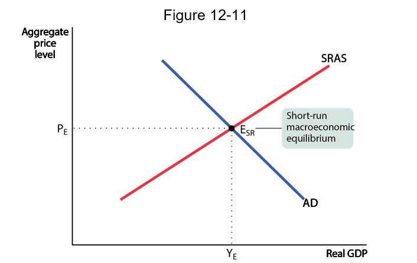
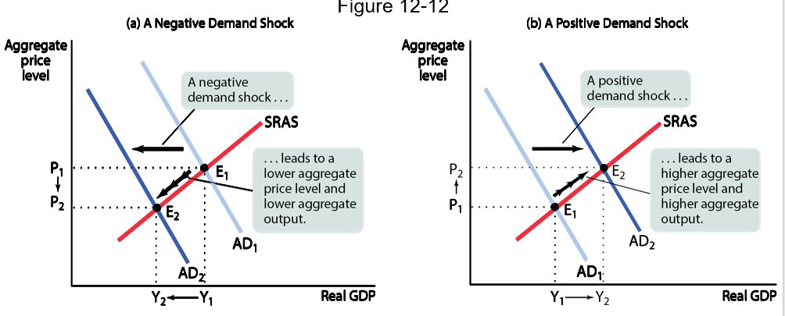
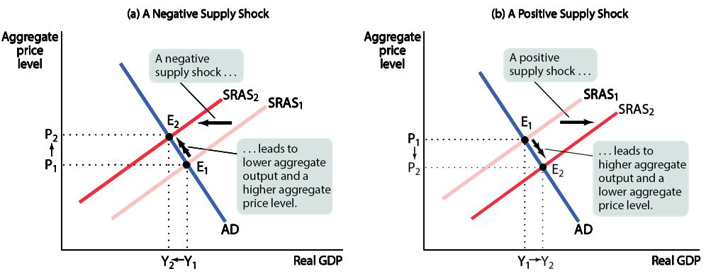
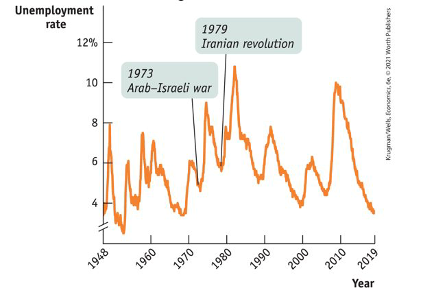
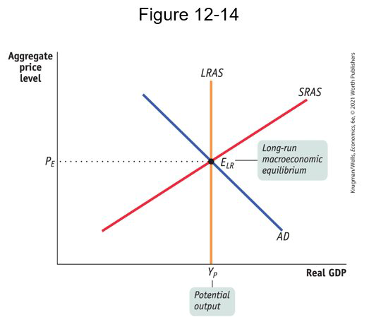
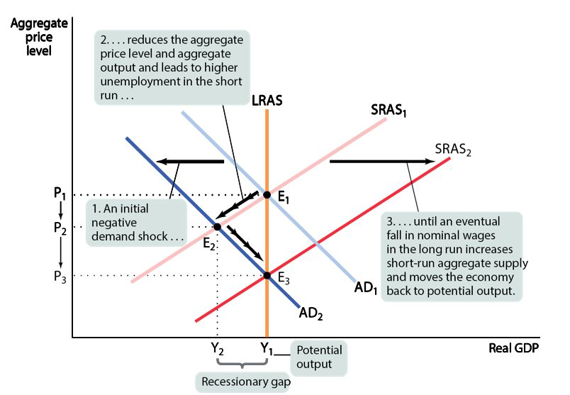
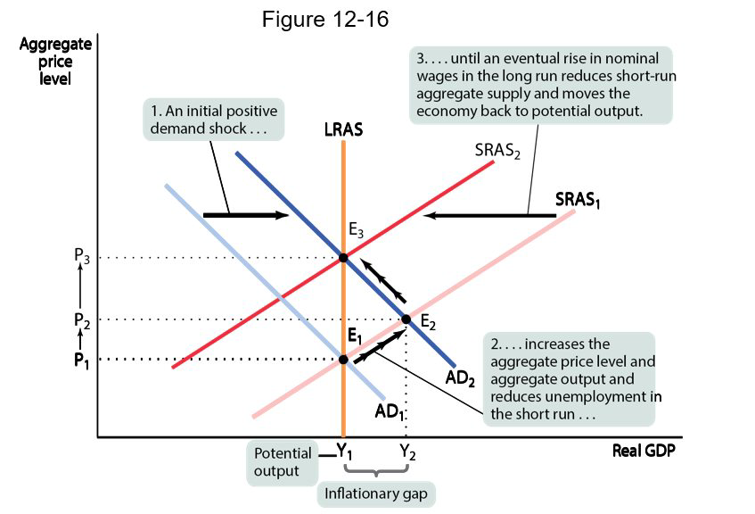
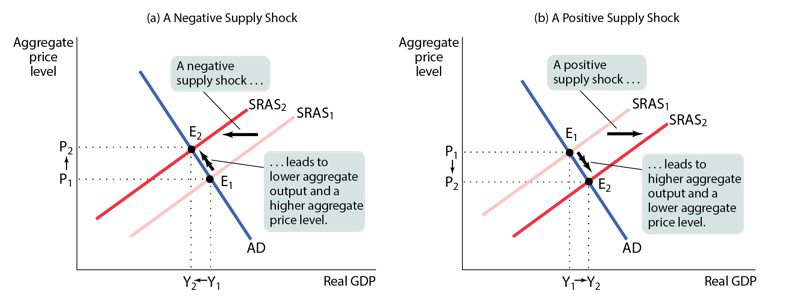

class: center,middle,mctitle-slide 


# Aggregate Demand and Supply

## Manolis Chatzikonstantinou  

---


# What will you learn in this lecture?

-  How does the aggregate demand curve illustrate the relationship between the aggregate price level and the quantity of aggregate output demanded?

--

-  How does the aggregate supply curve illustrate the relationship between the aggregate price level and the quantity of aggregate output supplied?

-- 

-  Why is the aggregate supply curve different in the short run compared to the long run?

-- 


-  How is the AD–AS model used to analyze economic fluctuations?

-- 

-  How can monetary policy and fiscal policy stabilize the economy?


---

#  Aggregate demand curve


```{r  out.width = "100%",out.length = "100%", fig.align = 'center',echo=FALSE}
knitr::include_graphics("week11graphs/ADcurve.png") 
```

--


- __Aggregate demand curve:__ the relationship between the aggregate price level and the quantity of aggregate output demanded by households, businesses, the government, and the rest of the world. 

- The AD curve is __downward sloping:__ if the price level in 1933 had been 5 instead of 9.4, the quantity of domestic final goods and services demanded would have been $1,109 billion instead of $817 billion.
 
---

# Downward sloping ?

Recall: 

$$GDP = C + I + G + X − IM$$


- Why does a rise in the aggregate price level reduce C, I, and X − IM? 
 

--

- __The wealth effect:__ A higher aggregate price level reduces the purchasing power of households’ wealth and reduces consumer spending.

  - FIXME
--

- __The interest rate effect:__ A higher aggregate price level makes households hold more money and  leads to a rise in interest rates (and a fall in investment spending and consumer spending).

  - FIXME
  
---

# Aggregate demand curve and Income-Expenditure


```{r  out.width = "100%",out.length = "100%", fig.align = 'center',echo=FALSE}
knitr::include_graphics("week11graphs/ADmovement.png") 
```

--


- The AD curve is derived from the income–expenditure model.

- We now drop the assumption that the overall price level is fixed. When the aggregate price level changes, the $AE_{Planned}$ curve shifts.


--


- If the price level drops, planned spending rises at all output levels (from the wealth and interest-rate effects).
- This leads to a multiplier process that moves the income–expenditure equilibrium from E1 to E2 and raises real GDP from Y1 to Y2.


---

# Shifts in the Aggregate demand curve


```{r  out.width = "100%",out.length = "100%", fig.align = 'center',echo=FALSE}
knitr::include_graphics("week11graphs/ADshifts.png") 
```


---

# Shifts in the Aggregate demand curve 

What happens when some factor changes spending patterns at every price level?
The aggregate demand curve shifts because of changes in:
Expectations: If consumers and firms become more optimistic, aggregate spending rises; if they become more pessimistic, aggregate spending falls.
Wealth: When the real value of household assets rises, their purchasing power also rises, leading to an increase in aggregate spending.
Size of the existing stock of physical capital: Firms plan investment spending depending on how much physical capital they already have: the more they have, the less they will feel a need to add more. 
Fiscal policy: 
Government purchases of final goods and services, G, directly affect the aggregate demand curve because government purchases are a component of aggregate demand. 
Taxes and government transfers influence the aggregate demand curve indirectly through their effect on disposable income. 
Monetary policy: 
When the central bank increases the quantity of money in circulation, households and firms have more money to lend out which drives the interest rate down, leading to higher investment spending and higher consumer spending.


---

# Factors that shift the Aggregate demand curve 

```{r  out.width = "100%",out.length = "100%", fig.align = 'center',echo=FALSE}
knitr::include_graphics("week11graphs/ADshiftfactor1.png") 
```

--

```{r  out.width = "100%",out.length = "100%", fig.align = 'center',echo=FALSE}
knitr::include_graphics("week11graphs/ADshiftfactor2.png") 
```


--

```{r  out.width = "100%",out.length = "100%", fig.align = 'center',echo=FALSE}
knitr::include_graphics("week11graphs/ADshiftfactor3.png") 
```

--

```{r  out.width = "100%",out.length = "100%", fig.align = 'center',echo=FALSE}
knitr::include_graphics("week11graphs/ADshiftfactor4.png") 
```

--

- __Q: Does a change in wealth move us along the AD curve (wealth effect) or shift it?__

???
A: It depends on the source of the change in wealth.
If it’s a change in price level that affects our wealth, it’s a movement along the AD.
Example: Rapid inflation shrinks our wealth.
If it’s a change in something else that affects our wealth, it’s a shift in the AD.
Example: The housing market crashes.


---

# Aggregate Supply

The aggregate supply curve shows the relationship between the aggregate price level and the quantity of aggregate output producers are willing to supply in the economy:
The short-run aggregate supply curve
The long-run aggregate supply curve

--

```{r  out.width = "100%",out.length = "100%", fig.align = 'center',echo=FALSE}
knitr::include_graphics("week11graphs/AScurve.png") 
```


---

# Short run Aggregate Supply

Why does the SRAS curve slope upward?
Nominal wages are sticky in the short run.
Nominal wage: the dollar amount of the wage paid
Sticky wages: nominal wages that are slow to fall even in the face of high unemployment and slow to rise even in the face of labor shortages
In perfectly competitive markets, if prices rise, the producer receives a higher profit per unit of output rises and output increases. 
In imperfectly competitive markets, if demand rises, the producer will likely increase prices as well as output.
Both responses lead to an upward-sloping relationship between aggregate output and the aggregate price level.

--

How do sticky wages affect SRAS?
Profit per unit = price per unit − production cost per unit
Nominal wages are often determined by contracts that were signed some time ago. Even when there are no formal contracts, there are often informal contracts between management and workers, making companies reluctant to change wages in response to economic conditions. 
A higher aggregate price level leads to higher profits and increased aggregate output in the short run given fixed nominal wages.


---

# Shifts in the Aggregate supply curve


```{r  out.width = "100%",out.length = "100%", fig.align = 'center',echo=FALSE}
knitr::include_graphics("week11graphs/ASshifts.png") 
```


---

# Shifts in the Aggregate supply curve 

What happens when some factor changes production levels at every price level?
The SRAS curve shifts because of changes in:
Commodity prices: A commodity is a standardized input bought and sold in bulk quantities. An increase in the price of a commodity raises production costs and reduces the quantity of aggregate output supplied at any given aggregate price level. This shifts the aggregate supply curve to the left.

Nominal wages: A rise in nominal wages increases production costs and shifts the short-run aggregate supply curve to the left.

Productivity: If a worker can produce more output with the same inputs, the short-run aggregate supply curve shifts to the right.

---

# Factors that shift the Aggregate Supply Curve 

```{r  out.width = "100%",out.length = "100%", fig.align = 'center',echo=FALSE}
knitr::include_graphics("week11graphs/ASshiftfactor1.png") 
```

--

```{r  out.width = "100%",out.length = "100%", fig.align = 'center',echo=FALSE}
knitr::include_graphics("week11graphs/ASshiftfactor2.png") 
```


--

```{r  out.width = "100%",out.length = "100%", fig.align = 'center',echo=FALSE}
knitr::include_graphics("week11graphs/ASshiftfactor3.png") 
```

---

# Long run Aggregate Supply


.pull-left[
```{r  out.width = "100%",out.length = "100%", fig.align = 'center',echo=FALSE}
knitr::include_graphics("week11graphs/LRAS.png") 
```
]

.pull-right[
Since contracts are renegotiated in the long run, in the long run, nominal wages will fully adjust to the aggregate price level (they are flexible, not sticky). In the long run, the aggregate price level has no effect on the quantity of aggregate output supplied. 

The long-run aggregate supply curve shows the relationship between the aggregate price level and the quantity of aggregate output supplied that holds if all prices, including nominal wages, were fully flexible.

The long run is the time it takes for all prices (including nominal wages) to adjust.
In the long run, prices have no effect on aggregate output because prices (including nominal wages) are fully flexible.

Potential output is the level of real GDP the economy would produce if all prices, including nominal wages, were fully flexible.
]

---

# Actual and Potential Output

```{r  out.width = "100%",out.length = "100%", fig.align = 'center',echo=FALSE}
knitr::include_graphics("week11graphs/potential.png") 
```

---

# From the Short Run to the Long Run


```{r  out.width = "100%",out.length = "100%", fig.align = 'center',echo=FALSE}
 
```

---

# Sticky wages in the great recession


```{r  out.width = "100%",out.length = "100%", fig.align = 'center',echo=FALSE}
 
```

???
If the theory of sticky wages were true, we’d find evidence that wages fail to fall even during periods of high unemployment. We do.

---

# Equilibrium: The AD-AS model

```{r  out.width = "100%",out.length = "100%", fig.align = 'center',echo=FALSE}
 
```

--

The economy is in short-run macroeconomic equilibrium when the quantity of aggregate output supplied is equal to the quantity demanded.
The short-run equilibrium aggregate price level is the aggregate price level in the short-run macroeconomic equilibrium.
Short-run equilibrium aggregate output is the quantity of aggregate output produced in the short-run macroeconomic equilibrium.
An event that shifts the aggregate demand curve is a demand shock.
An event that shifts the aggregate supply curve is a supply shock.


---

# Demand Shocks

```{r  out.width = "100%",out.length = "100%", fig.align = 'center',echo=FALSE}
 
```


---

# Supply Shocks

```{r  out.width = "100%",out.length = "100%", fig.align = 'center',echo=FALSE}
 
```

- __stagflation:__ the combination of inflation and falling aggregate output. 

---


# Supply Shocks or Demand Shocks


- Which type of recession is more common? Demand shocks are the usual culprit. Negative supply shocks are rare but nasty.

```{r  out.width = "100%",out.length = "100%", fig.align = 'center',echo=FALSE}
 
```

---

# Long run Aggregate Supply


.pull-left[
```{r  out.width = "100%",out.length = "100%", fig.align = 'center',echo=FALSE}
 
```
]

.pull-right[
Since contracts are renegotiated in the long run, in the long run, nominal wages will fully adjust to the aggregate price level (they are flexible, not sticky). In the long run, the aggregate price level has no effect on the quantity of aggregate output supplied. 

The long-run aggregate supply curve shows the relationship between the aggregate price level and the quantity of aggregate output supplied that holds if all prices, including nominal wages, were fully flexible.

The long run is the time it takes for all prices (including nominal wages) to adjust.
In the long run, prices have no effect on aggregate output because prices (including nominal wages) are fully flexible.

Potential output is the level of real GDP the economy would produce if all prices, including nominal wages, were fully flexible.
]

$$
\text { Output gap }=\frac{\text { Actual aggregate output }-\text { Potential output }}{\text { Potential output }} \times 100
$$

???
Recessionary gap: when aggregate output is below potential
output.Inflationary gap: when aggregate output is above potential
output. Output gap: the percent difference between actual aggregate
output and potential output
---

# A negative Demand Shock

```{r  out.width = "100%",out.length = "100%", fig.align = 'center',echo=FALSE}
 
```


???
In the long run the economy is self-correcting: demand shocks have only a short-run effect on aggregate output.
A negative demand shock shifts AD leftward, the economy moves to E2 and a recessionary gap arises: the aggregate price level and aggregate output both decline, and unemployment rises. 
But in the long run nominal wages fall in response to high unemployment, and SRAS shifts  rightward. Long-run macroeconomic equilibrium is restored at E3.


---

# A positive Demand Shock

```{r  out.width = "100%",out.length = "100%", fig.align = 'center',echo=FALSE}
 
```


???
Starting at E1, a positive demand shock shifts AD rightward, and the economy moves to E2 in the short run.
This results in an inflationary gap as aggregate output and the aggregate price level both rise, and unemployment falls. 
In the long run, nominal wages rise in response to low unemployment, and SRAS1 shifts leftward. The economy returns to long-run macroeconomic equilibrium.

---

# Policy response to Demand Shocks

> “But this long run is a misleading guide to current affairs. In the long run we are all dead. Economists set themselves too easy, too useless a task if in tempestuous seasons they can only tell us that when the storm is long past the ocean is flat again.”
—J. M. Keynes

--

If policy makers react quickly to the fall in aggregate demand, they can use monetary or fiscal policy to shift the aggregate demand curve back to the right.
Instead of going through a recession, the government could make the economy stay at the original equilibrium.
Macroeconomic policy would be desirable because: 
The temporary fall in aggregate output is associated with high unemployment.
Preventing deflation is a good thing.
Does this mean that policy makers should always act to offset declines in aggregate demand? Not necessarily. Some policy measures may have long-term costs in terms of lower long-run growth (budget deficits, for example). Also, policy makers aren’t perfectly informed, and the effects of their policies aren’t perfectly predictable. This creates the danger that stabilization policy will do more harm than good.

---

# Policy response to Supply Shocks

```{r  out.width = "100%",out.length = "100%", fig.align = 'center',echo=FALSE}
 
```

--

A negative supply shock leads to a rise in prices and a rise in unemployment, which poses a policy dilemma:
Stabilization of unemployment requires an increase in aggregate demand. This leads to inflation.
Stabilization of prices requires a decrease in aggregate demand. This leads to higher unemployment.
In the 1970s, the United States chose to stabilize prices at the cost of higher unemployment.
