class: center,middle,mctitle-slide 


# Aggregate Demand and Supply

## Manolis Chatzikonstantinou  

---

class: my-one-page-font

# What will you learn in this lecture?

-  How does the aggregate demand curve illustrate the relationship between the aggregate price level and the quantity of aggregate output demanded?

--

-  How does the aggregate supply curve illustrate the relationship between the aggregate price level and the quantity of aggregate output supplied?

--

-  Why is the aggregate supply curve different in the short run compared to the long run?

--


-  How is the AD–AS model used to analyze economic fluctuations?

--

-  How can monetary policy and fiscal policy stabilize the economy?


---

class: my-one-page-font


#  Aggregate demand curve

```{r  out.width = "65%",out.length = "100%", fig.align = 'center',echo=FALSE}
knitr::include_graphics("week11graphs/ADcurve.png") 
```

--


- __Aggregate demand curve:__ relates the aggregate price level and the quantity of aggregate output demanded 

 
---

class: my-one-page-font

# Downward sloping ?

Recall:  $GDP = C + I + G + X − IM$

- Why does a rise in the aggregate price level reduce C, I, and X − IM? 
 
--

- __The wealth effect:__ A higher aggregate price level reduces the purchasing power of households’ wealth and reduces consumer spending.


--

- __The interest rate effect:__ A higher aggregate price level makes households hold more money, households need more liquid money for payments when prices are high, less savings leads to a rise in interest rates (and a fall in investment spending).
  
---

class: my-one-page-font

# Aggregate demand curve and Income-Expenditure


```{r  out.width = "80%",out.length = "100%", fig.align = 'center',echo=FALSE}
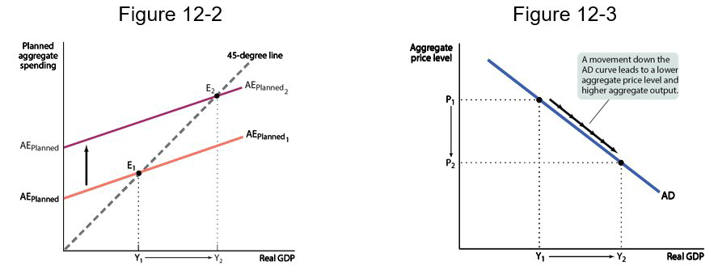 
```

--

- When the aggregate price level changes, the $AE_{Planned}$ curve shifts.

--

- If the price level drops, planned spending rises at all output levels.
- A multiplier process that moves the income–expenditure equilibrium from E1 to E2.


---

# Shifts in the Aggregate demand curve


```{r  out.width = "100%",out.length = "100%", fig.align = 'center',echo=FALSE}
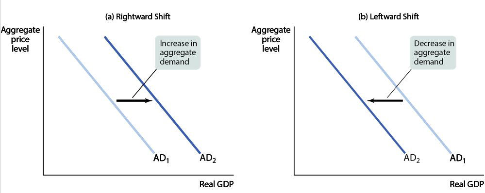 
```

---

class: my-one-page-font

# Shifts in the Aggregate demand curve 

- What happens when some factor changes spending patterns at every price level?

--

- The aggregate demand curve shifts because of changes in:
  - __Expectations:__ If consumers and firms become more optimistic, aggregate spending rises; if they become more pessimistic, aggregate spending falls.
  - __Wealth:__ When the real value of household assets rises, their purchasing power also rises, leading to an increase in aggregate spending.
  - __Size of the existing stock of physical capital:__ Firms plan investment spending depending on how much physical capital they already have.
  - __Fiscal policy: __ Taxes and government transfers influence the aggregate demand curve indirectly through their effect on disposable income. 
  - __Monetary policy:__ If the quantity of money in circulation, households lend out more money driving the interest rate down, leading to higher spending.


---

# Factors that shift the Aggregate demand curve 

```{r  out.width = "100%",out.length = "100%", fig.align = 'center',echo=FALSE}
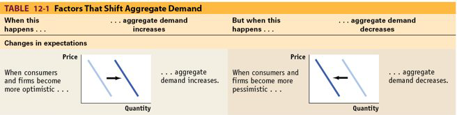 
```

--

```{r  out.width = "100%",out.length = "100%", fig.align = 'center',echo=FALSE}
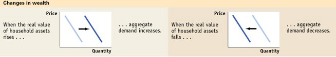 
```

---

class: my-one-page-font

# Factors that shift the Aggregate demand curve 


```{r  out.width = "80%",out.length = "100%", fig.align = 'center',echo=FALSE}
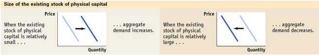 
```

--

```{r  out.width = "80%",out.length = "100%", fig.align = 'center',echo=FALSE}
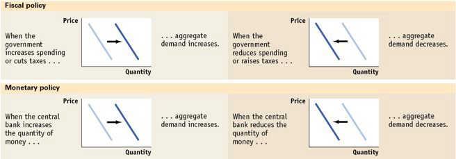 
```

- __Q: Does a change in wealth move us along the AD curve (wealth effect) or shift it?__

???
A: It depends on the source of the change in wealth.
If it’s a change in price level that affects our wealth, it’s a movement along the AD.
Example: Rapid inflation shrinks our wealth.
If it’s a change in something else that affects our wealth, it’s a shift in the AD.
Example: The housing market crashes.

---

# Aggregate Supply

The curve shows the relationship between the aggregate price level and the quantity of aggregate output supplied:

--

```{r  out.width = "80%",out.length = "80%", fig.align = 'center',echo=FALSE}
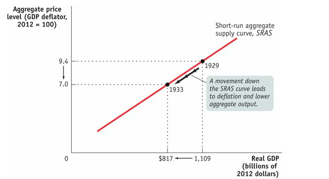 
```

???
Short run Aggregate Supply
Long run Aggregate Supply

---

# Short run Aggregate Supply

- Why does the SRAS curve slope upward?
  - Nominal wages are sticky in the short run.
  - Nominal wage: the dollar amount of the wage paid

--

- __Sticky wages:__ nominal wages that are slow to fall even in the face of high unemployment and slow to rise even in the face of labor shortages
  - In perfectly competitive markets, if prices rise, the producer receives a higher profit per unit of output rises and output increases. 
  - In imperfectly competitive markets, if demand rises, the producer will likely increase prices as well as output.

Both responses lead to an upward-sloping relationship between aggregate output and the aggregate price level.

--

- How do sticky wages affect SRAS?
  - Profit per unit = price per unit − production cost per unit
  - A higher aggregate price level leads to higher profits and increased aggregate output in the short run given fixed nominal wages.

???
Nominal wages are often determined by contracts that were signed some time ago. Even when there are no formal contracts, there are often informal contracts between management and workers, making companies reluctant to change wages in response to economic conditions. 

---

# Shifts in the Aggregate supply curve


```{r  out.width = "70%",out.length = "100%", fig.align = 'center',echo=FALSE}
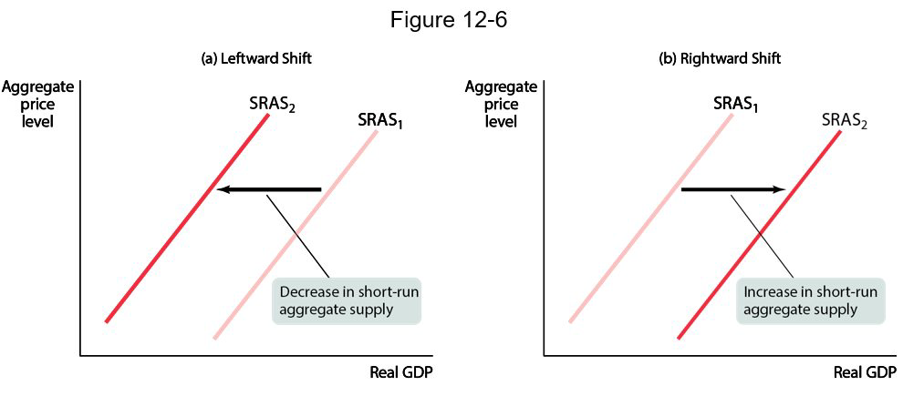 
```

--


The SRAS curve shifts because of changes in:
- __Commodity prices__
- __Nominal wages__
- __Productivity__ 

???
What happens when some factor changes production levels at every price level?
A commodity is a standardized input bought and sold in bulk quantities. An increase in the price of a commodity raises production costs and reduces the quantity of aggregate output supplied at any given aggregate price level. This shifts the aggregate supply curve to the left.
A rise in nominal wages increases production costs and shifts the short-run aggregate supply curve to the left.
If a worker can produce more output with the same inputs, the short-run aggregate supply curve shifts to the right.

---

# Factors that shift the Aggregate Supply Curve 

```{r  out.width = "70%",out.length = "100%", fig.align = 'center',echo=FALSE}
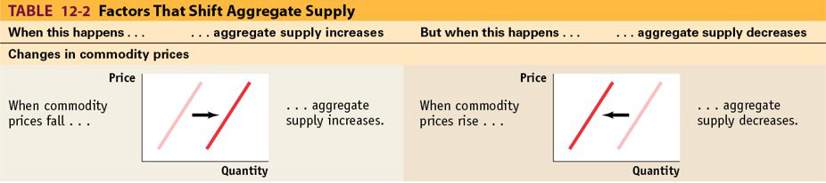 
```

--

```{r  out.width = "70%",out.length = "100%", fig.align = 'center',echo=FALSE}
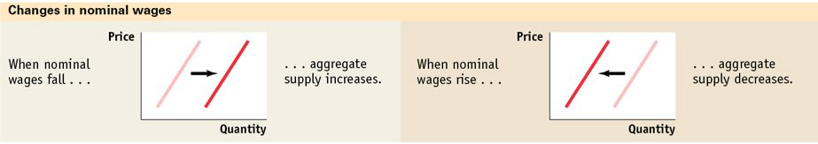 
```

--

```{r  out.width = "70%",out.length = "100%", fig.align = 'center',echo=FALSE}
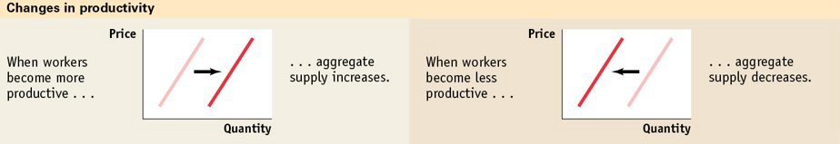 
```

---

# Long run Aggregate Supply


.pull-left[
```{r  out.width = "100%",out.length = "100%", fig.align = 'center',echo=FALSE}
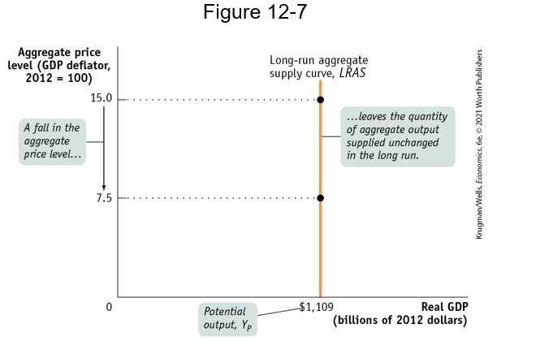 
```
]

.pull-right[

- Since contracts are renegotiated in the long run. In the long run, nominal wages will fully adjust to the aggregate price level.

- In the long run, the aggregate price level has no effect on the quantity of aggregate output supplied. 

- The long-run aggregate supply curve shows the relationship between the aggregate price level and the quantity of aggregate output supplied that holds if all prices are fully flexible.

- Potential output is the level of real GDP the economy would produce if all prices, including nominal wages, were fully flexible.

]

$$\text { Output gap }=\frac{\text { Actual Ag. output }-\text { Potential output }}{\text { Potential output }} \times 100$$
???
(they are flexible, not sticky). 
The long run is the time it takes for all prices (including nominal wages) to adjust.
In the long run, prices have no effect on aggregate output because prices (including nominal wages) are fully flexible.

---

# Actual and Potential Output

```{r  out.width = "80%",out.length = "100%", fig.align = 'center',echo=FALSE}
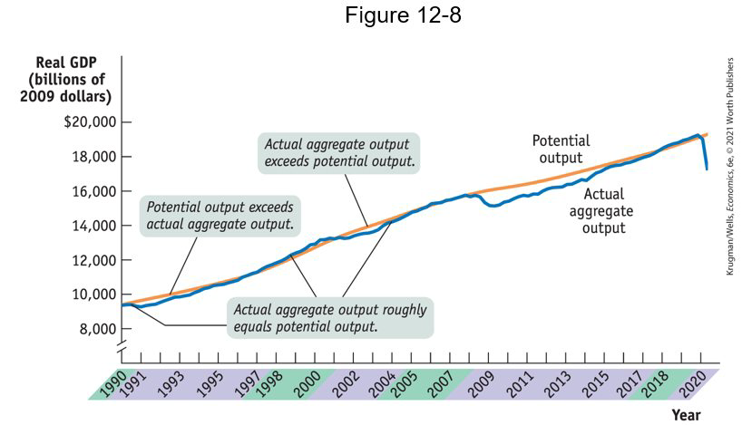 
```

