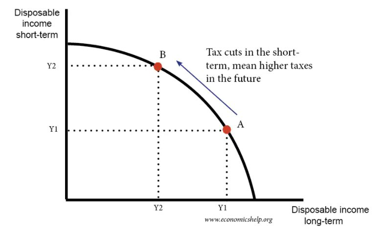
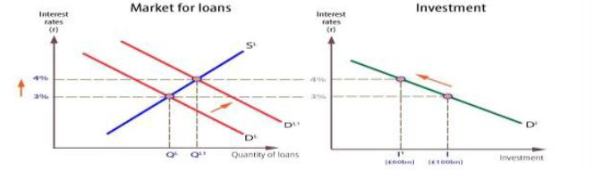
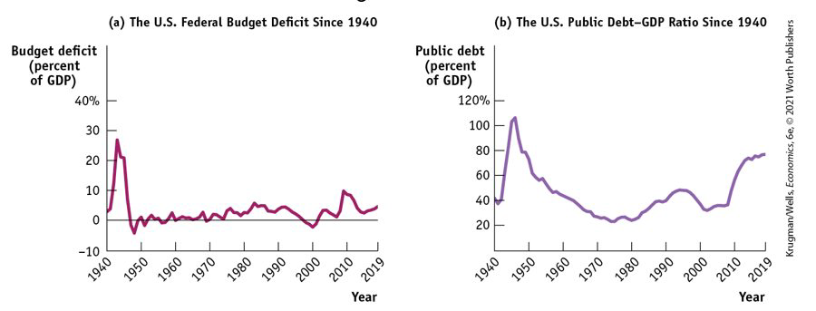

class: center,middle,mctitle-slide 


# Fiscal Shocks

## Manolis Chatzikonstantinou  

---


# What will you learn in this lecture?

-  What is fiscal policy, and why is it an essential tool in managing economic fluctuations?

--

-  Which policies constitute an expansionary fiscal policy, and which constitute a contractionary fiscal policy?

-- 

-  Why does fiscal policy have a multiplier effect, and how is this effect influenced by automatic stabilizers?

-- 

-  Why do governments calculate the cyclically adjusted budget balance?

-- 

-  Why can a large public debt and implicit liabilities of the government also be a cause for concern?

---

#  Aggregate demand curve


```{r  out.width = "100%",out.length = "100%", fig.align = 'center',echo=FALSE}
knitr::include_graphics("week12graphs/fiscal1.png") 
```

--

- __Government transfers:__ payments by the government to households for which no good or service is provided in return
- __Social insurance programs:__ government programs (transfer payments) intended to protect families against economic hardship
  - __Social Security__ provides guaranteed income to older Americans, disabled Americans, and spouses and children of deceased or retired beneficiaries.
  - Medicare covers much of the cost of health care for Americans over age 65 or with low incomes.

???
The government funds many programs through tax revenues.Some important terms: Similar programs in many countries.
---

# Sources of Tax Revenues

```{r  out.width = "100%",out.length = "100%", fig.align = 'center',echo=FALSE}
knitr::include_graphics("week12graphs/taxes.png") 
```


???
Personal income taxes, taxes on corporate profits, and social insurance taxes account for most government tax revenue. The rest is a mix of property taxes, sales taxes, and other sources of revenue. 

---

# Government Spending

```{r  out.width = "100%",out.length = "100%", fig.align = 'center',echo=FALSE}
knitr::include_graphics("week12graphs/spending.png") 
```


- __Government purchases:__ National defense and education are the biggest categories.
- __Government transfers:__ Social Security, Medicare, and Medicaid are the biggest programs.


---

# The Government Budget

- Recall the formula for GDP:

$$GDP = C + I + G + X – IM$$
--

- The government directly controls G and indirectly affects $C$ and $I$. How?
  - _Disposable income_ is the income that households receive from wages, dividends, interest, and rent, minus taxes, plus government transfers. 
  - Changes in taxes or government transfers change disposable income, which changes consumer spending. 
  - The government affects business investment by taxes and regulations.

--

- Because the government can affect spending by consumers and firms, the government can shift the aggregate demand curve.

--

- __Why would the government want to shift the aggregate demand curve?__

---

# Fiscal Policy

- It wants to close either a recessionary gap or an inflationary gap.
- __Fiscal policy:__ the use of taxes, government transfers, or government purchases of goods and services to shift the aggregate demand curve

--

- __Expansionary fiscal policy:__ fiscal policy that increases aggregate demand 
  - an increase in government purchases of goods and services 
  - a cut in taxes
  - an increase in government transfers
  
--

- __Contractionary fiscal policy:__ fiscal policy that decreases aggregate demand
  - a reduction in government purchases of goods and services
  - an increase in taxes
  - a reduction in government transfers

---

# Expansionary Fiscal Policy

```{r  out.width = "100%",out.length = "100%", fig.align = 'center',echo=FALSE}
knitr::include_graphics("week12graphs/expansion.png") 
```


---

# Contractionary Fiscal Policy

```{r  out.width = "100%",out.length = "100%", fig.align = 'center',echo=FALSE}
knitr::include_graphics("week12graphs/contraction.png") 
```


---

# Discussion

- __What are some of your arguments in favor and against the government massive spending during recessions?__

  - What if the recession is driven by the balance sheet of banks?

  - What if the recession is driven by a pandemic?
  
---

# Can expansionary fiscal policy actually work?

- There are critics who argue:
  1. “Government spending always crowds out private spending.”
  2. “Government borrowing always crowds out private investment spending.”
  3. “Government budget deficits reduce private spending.”

--

1.  “Government spending always crowds out private spending.”

__Government spending crowds out private spending only when the economy is operating at full employment.¨__

--

2. Claim 2: “Government borrowing always crowds out private investment spending.”

__If it is, a fiscal expansion will lead to higher incomes, which lead to increased savings__.

--

3. Claim 3: “Government budget deficits reduce private spending.”


???
Assumption: resources are always fully employed and, as a result, the aggregate income is fixed—which isn’t true. 
When the economy is suffering from a recessionary gap, there are unemployed resources in the economy, and output (and therefore income) is below its potential level. Expansionary fiscal policy puts unemployed resources to work and generates higher spending and higher income. 
Assumption: effect on interest rate. The Recovery Act of 2009 was a case in point: Despite high levels of government borrowing, U.S. interest rates stayed near historic lows. Although both the Obama stimulus of 2009 and the Trump plan of 2017 were similar (tax cuts and increased spending on infrastructure), many economists supported the Obama stimulus and were dubious about the Trump plan, because the state of the economy had changed.

---

# Balanced budget over time

```{r  out.width = "100%",out.length = "100%", fig.align = 'center',echo=FALSE}
 
```

--

This is known as Ricardian equivalence after the nineteenth-century economist David Ricardo.
It assumes that consumers, seeing the higher debt levels, will cut their spending today to save for inevitable increases in future tax rates necessary to pay down the debt.
In reality, it’s doubtful that consumers behave with such foresight and budgeting discipline. Most people would spend extra cash (generated by the fiscal expansion) so that fiscal policy would have an expansionary effect.
Moreover, even with Ricardian equivalence, a rise in government spending would still lead to a boost in total spending in the near term: even if consumers cut back their current spending, they would do so over an extended period, while the additional government spending happens now, when the economy needs it.

???
Because of these lags, fiscal policy may take too long to get going. If by the time fiscal policy takes effect, the recessionary gap turned into an inflationary gap, expansionary fiscal policy will make things worse instead of better.


---

# The Crowding-Out Effect

```{r  out.width = "100%",out.length = "100%", fig.align = 'center',echo=FALSE}
knitr::include_graphics("week12graphs/crowd1.png") 
```

---

# The Crowding-Out Effect

```{r  out.width = "100%",out.length = "100%", fig.align = 'center',echo=FALSE}
 
```

--

```{r  out.width = "100%",out.length = "100%", fig.align = 'center',echo=FALSE}
knitr::include_graphics("week12graphs/crowd3.png") 
```

---

# The Crowding-Out Effect

```{r  out.width = "100%",out.length = "100%", fig.align = 'center',echo=FALSE}
knitr::include_graphics("week12graphs/crowd4.png") 
```

---

# What is the multiplier?

 - __Discuss__
 
???
The multiplier magnifies new spending into greater levels of income and output because each round of spending becomes income for someone else

---

# Fiscal policy and the multiplier

- The multiplier magnifies new spending into greater levels of income and output because each round of spending becomes income for someone else.

--

An expansionary fiscal policy pushes the aggregate demand curve to the right. 
A contractionary fiscal policy pushes the aggregate demand curve to the left. 
How much would a given policy shift the aggregate demand curve? To get the estimate, we use the concept of the multiplier.
The multiplier is the ratio of the change in real GDP caused by an autonomous change in aggregate spending to the size of that autonomous change. 

The multiplier is $1/(1 − MPC)$

--

-Assume no taxes, no trade, a fixed interest rate, and fixed prices. If MPC = 0.5, the multiplier would be 2.

- So, $50 billion of new government spending would create $100 b. increase in GDP.

---

# Multiplier effects of government spending

- Fiscal policy changes: 
  - government purchases of goods and services.
  - transfer payments or taxes. 

--

- A change in government transfers or taxes shifts the aggregate demand curve by less than an equal-sized change in government purchases, resulting in a smaller effect on real GDP.

--

- Imagine two expansionary fiscal policies: 
  - The government directly purchases $50 billion in goods and services. 
  - The government makes transfer payments, sending out $50 billion in checks to consumers. 
  - __Which will affect GDP more?__

-- 

- In the second case, households spend some of that $50 billion, but they won’t spend it all.
-  [Consumer spending in the pandemic](https://www.kansascityfed.org/ten/2021-spring-ten-magazine/study-shows-surge-in-savings-during-the-pandemic/)

---

# Taxes vs Spending

```{r  out.width = "100%",out.length = "100%", fig.align = 'center',echo=FALSE}
knitr::include_graphics("week12graphs/taxesvsspend.png") 
```

---

# Taxes and the multiplier

Taxes change the size of the multiplier. 
Lump-sum taxes (taxes independent of income) don’t change the multiplier, but they are rare.
Most taxes are non-lump-sum taxes, and they reduce the size of the multiplier.
Before, we assumed that a $1 increase in real GDP raised disposable income by $1. 
In fact, government taxes capture some part of the increase in real GDP, and disposable income increases by less than $1.
The multiplier tells us who should get tax cuts or government transfers. For example, an increase in unemployment benefits will boost the economy more than a dividend tax cut.

-- 

The effect of taxes on the multiplier is similar to the effect of international trade, which also reduces the multiplier:
In one case the multiplier process is weakened because at each stage some spending “leaks” into imports.
In the other case, income “leaks” into taxes.

Economists believe it’s a good thing that taxes reduce the multiplier. 
If, for example, a negative demand shock causes a recession, incomes fall, taxes fall, and the negative demand shock hurts the economy less than it would if there were no taxes. 
The automatic decrease in government tax revenue acts like an automatic expansionary fiscal policy. 

---

# Types of fiscal policy

Automatic stabilizers: government spending and taxation rules that cause fiscal policy to be automatically expansionary when the economy contracts and automatically contractionary when the economy expands (for example, unemployment insurance)

In contrast, discretionary fiscal policy arises from deliberate actions by policy makers rather than rules (for example, the Obama stimulus).

Some nations were forced into “austerity” (sharp cuts in spending plus tax increases), while many were not.

--

- __How do surpluses and deficits fit into the analysis of fiscal policy? Are deficits ever a good thing and surpluses a bad thing?__

???
People usually think of budget surpluses as good: 
When the federal government ran a record surplus in 2000, many people regarded it as a cause for celebration. 
People usually think of budget deficits as bad: 
When the U.S. federal government ran record deficits from 2009 to 2011, many people regarded it as a cause for concern

---

# The budget balance as a measure of fiscal policy 

- The budget balance is the difference between tax revenue and government spending, both on goods and services and on government transfers: 

$$S_{Government} = T − G − TR$$
--

Budget balance (government savings) = tax revenues (T) – government purchases (G) and transfers (TR)
A budget surplus is a positive budget balance, and a budget deficit is a negative budget balance.
Other things equal, discretionary expansionary fiscal policies reduce the budget balance for that year.
Other things equal, discretionary contractionary fiscal policies increase the budget balance for that year.

--

Economists often use the budget balance as a “quick-and-dirty” way to assess whether current fiscal policy is expansionary or contractionary. 
But keep in mind two reasons this quick-and-dirty approach is sometimes misleading: 
Two different changes in fiscal policy that have equal-sized effects on the budget balance may have quite unequal effects on the economy. 
For example, changes in government purchases affect real GDP more than equal-sized changes in taxes and government transfers. 
Often, changes in the budget balance are the result, not the cause, of the business cycle.

---

# The budget balance and the business cycle

```{r  out.width = "100%",out.length = "100%", fig.align = 'center',echo=FALSE}
knitr::include_graphics("week12graphs/bcbudget.png") 
```

--

- The budget tends to move into deficit when the economy is in a recession (look at the shaded areas), but deficits tend to get smaller or even turn into surpluses when the economy is expanding.
- The budget deficit rises when the unemployment rate rises and falls when the unemployment rate falls.

---

# The business cycle and the cyclically adjusted budget balance

```{r  out.width = "100%",out.length = "100%", fig.align = 'center',echo=FALSE}
knitr::include_graphics("week12graphs/adjusted.png") 
```

--

- To separate the effects of the business cycle from the effects of discretionary fiscal policy, governments estimate the cyclically adjusted budget balance (an estimate of the budget balance if GDP equaled potential output).
Years of large budget deficits tend to be years when the economy has a large recessionary gap.

---

# Should the budget be balanced?

- __Discuss!__

--

Most economists don’t think so. 
They believe that the government should only balance its budget on average—that it is okay to run deficits in bad years, offset by surpluses in good years. 
The government should be forced to run a balanced budget every year because this would undermine the role of taxes and transfers as automatic stabilizers. 

--


.pull-left[
```{r  out.width = "100%",out.length = "100%", fig.align = 'center',echo=FALSE}
knitr::include_graphics("week12graphs/adjusted.png") 
```

]

.pull-right[

- __Persistent budget deficits__ -> Large public debt

- The case of Greece
]

---

# Deficits vs Debt


```{r  out.width = "100%",out.length = "100%", fig.align = 'center',echo=FALSE}
knitr::include_graphics("week12graphs/debt.png") 
```

--

- A deficit is the difference between the amount of money a government spends and the amount it receives in taxes over a given period. 
- A debt is the sum of money a government owes at a particular time. 
- Deficits and debt are linked, because government debt grows when governments run deficits. But they aren’t the same thing, and they can tell different stories.

- To assess the government’s ability to pay its debt, we use the debt–GDP ratio. 


???
How does the U.S. public debt stack up internationally? In dollar terms, we’re number one—but this isn’t informative, since the U.S. economy is much larger than those of other nations. A more informative comparison is the ratio of public debt to GDP. 

---

# DANGERS POSED BY RISING GOVERNMENT DEBT


```{r  out.width = "100%",out.length = "100%", fig.align = 'center',echo=FALSE}
 
```

--

Crowding out: the government’s borrowing may crowd out private investments, raising interest rates and reducing the economy’s long-run growth.
Financial pressure and default: 
Deficits place financial pressure on future budgets. 
A government paying large sums in interest must raise taxes, cut spending—or it must borrow even more. If it borrows to pay the interest, it pushes itself even deeper into debt—the debt spiral. The debt spiral may end up in a default when the government stops paying what it owes, resulting in economic and financial turmoil.
Can’t a government that has trouble borrowing just print money to pay its bills?
Yes, it can, but this leads to another problem: inflation. More on this in a later chapter…

---

# Implicit liabilities

```{r  out.width = "100%",out.length = "100%", fig.align = 'center',echo=FALSE}
knitr::include_graphics("week12graphs/implicit.png") 
```

--

Experts on long-run budget issues view the situation of the United States (and other countries such as Japan and Italy) with alarm. 
The reason is implicit liabilities: spending promises made by governments that are effectively a debt despite the fact that they are not included in the usual debt statistics. The aging population and rising health care costs will soon pose real problems for the federal budget

Social Security and part of Medicare are supported by dedicated taxes (special taxes on wages). At times, these dedicated taxes yield more revenue than is needed to pay current benefits. 
Since the mid-1980s the Social Security system has been taking in more revenue than it needs. This surplus has been used to accumulate a Social Security trust fund, which was $2.8 trillion at the end of fiscal 2019. 


---

# Useful links

Here DEBT TO GDP over pandemic!!
```{r  out.width = "100%",out.length = "100%", fig.align = 'center',echo=FALSE}
knitr::include_graphics("week12graphs/implicit.png") 
```


- Visit this site for current debt and deficit figures:
	https://www.cbo.gov/topics/budget
