class: center,middle,mctitle-slide 


# Fiscal Shocks

## Manolis Chatzikonstantinou  

---

class: my-one-page-font

# What will you learn in this lecture?

-  What is fiscal policy, and why is it an essential tool in managing economic fluctuations?

--

-  Which policies constitute an expansionary fiscal policy, and which constitute a contractionary fiscal policy?

--

-  Why does fiscal policy have a multiplier effect, and how is this effect influenced by automatic stabilizers?

--

-  Why do governments calculate the cyclically adjusted budget balance?

--

-  Why can a large public debt and implicit liabilities of the government also be a cause for concern?

---

class: my-one-page-font

#  Government Spending and Revenues


```{r  out.width = "80%",out.length = "80%", fig.align = 'center',echo=FALSE}
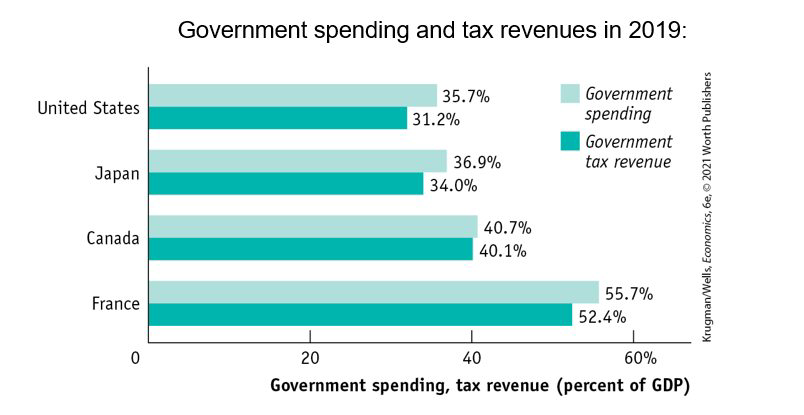 
```

--

- __Government transfers:__ payments by the government to households, no services returned
- __Social insurance programs:__ government programs intended to protect households 


???
The government funds many programs through tax revenues.Some important terms: Similar programs in many countries.
__Social Security__ provides guaranteed income to older Americans, disabled Americans, and spouses and children of deceased or retired beneficiaries.
Medicare covers much of the cost of health care for Americans over age 65 or with low incomes.
---

# Sources of Tax Revenues

```{r  out.width = "55%",out.length = "80%", fig.align = 'center',echo=FALSE}
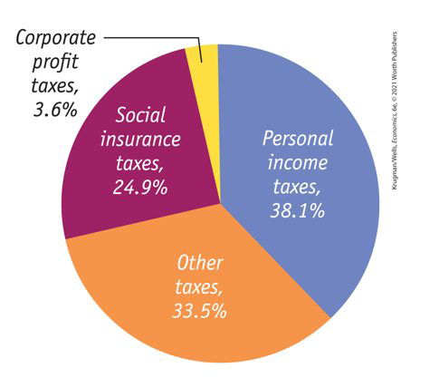 
```


???
Personal income taxes, taxes on corporate profits, and social insurance taxes account for most government tax revenue. The rest is a mix of property taxes, sales taxes, and other sources of revenue. 

---

# Government Spending

```{r  out.width = "55%",out.length = "80%", fig.align = 'center',echo=FALSE}
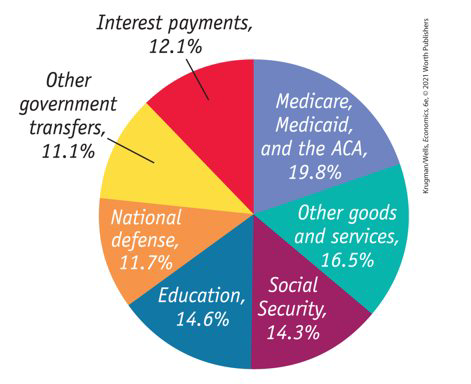 
```


???
__Government purchases:__ National defense and education are the biggest categories.
__Government transfers:__ Social Security, Medicare, and Medicaid are the biggest programs.


---

class: my-one-page-font

# The Government Budget

$$GDP = C + I + G + X – IM$$
--

- The government directly controls $G$ and indirectly affects $C$ and $I$. How?
  - _Disposable income:_  wages, dividends, interest, and rent, minus taxes, plus government transfers. 
  - Changes in taxes or government transfers change disposable income and profits, which changes consumer and investment spending. 
  
--

- Because the government can affect spending by consumers and firms, the government can shift the aggregate demand curve.

--

- __Why would the government want to shift the aggregate demand curve?__

---

class: my-one-page-font

# Fiscal Policy

- The government may want to close either a recessionary gap or an inflationary gap.
- __Fiscal policy:__ the use of taxes, government transfers, or government purchases of goods and services to shift the aggregate demand curve

--

- __Expansionary fiscal policy:__ $\uparrow$ aggregate demand 
  - $\uparrow$ G, $\uparrow$ TR, $\downarrow$ T
  
--

- __Contractionary fiscal policy:__ $\downarrow$ aggregate demand
  - $\downarrow$ G, $\downarrow$ TR, $\uparrow$ T

---

# Class Discussion:Explain the case

```{r  out.width = "60%",out.length = "80%", fig.align = 'center',echo=FALSE}
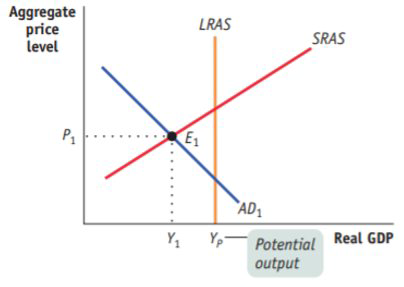 
```


---

# Expansionary Fiscal Policy

```{r  out.width = "60%",out.length = "80%", fig.align = 'center',echo=FALSE}
knitr::include_graphics("week12graphs/expansion.png") 
```


---

# Class Discussion:Explain the case

```{r  out.width = "60%",out.length = "80%", fig.align = 'center',echo=FALSE}
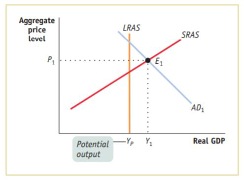 
```


---

# Contractionary Fiscal Policy

```{r  out.width = "60%",out.length = "80%", fig.align = 'center',echo=FALSE}
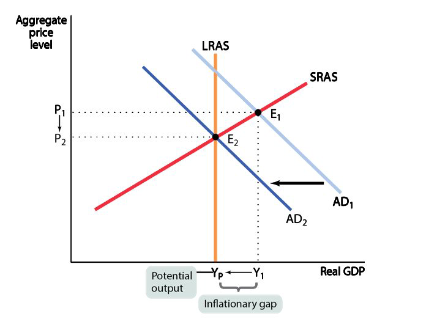 
```


---

class: my-one-page-font

# Discussion

- __What are some of your arguments in favor and against the government massive spending during recessions?__

  - What if the recession is driven by a stock market crush?

  - What if the recession is driven by a war in commodity producing countries?
  
---

class: my-one-page-font

# Can expansionary fiscal policy actually work?

- There are critics who argue:

--

-  “Government spending always crowds out private spending.”

__Government spending crowds out private spending only when the economy is operating at full employment.¨__

--

- Claim 2: “Government borrowing always crowds out private investment spending.”

__If it is, a fiscal expansion will lead to higher incomes, which lead to increased savings__.

--

- Claim 3: “Government budget deficits reduce private spending.”


???
Assumption: resources are always fully employed and, as a result, the aggregate income is fixed—which isn’t true. 
When the economy is suffering from a recessionary gap, there are unemployed resources in the economy, and output (and therefore income) is below its potential level. Expansionary fiscal policy puts unemployed resources to work and generates higher spending and higher income. 
Assumption: effect on interest rate. The Recovery Act of 2009 was a case in point: Despite high levels of government borrowing, U.S. interest rates stayed near historic lows. Although both the Obama stimulus of 2009 and the Trump plan of 2017 were similar (tax cuts and increased spending on infrastructure), many economists supported the Obama stimulus and were dubious about the Trump plan, because the state of the economy had changed.

---

class: my-one-page-font

# The Crowding-Out Effect


---

# The Crowding-Out Effect

```{r  out.width = "80%",out.length = "80%", fig.align = 'center',echo=FALSE}
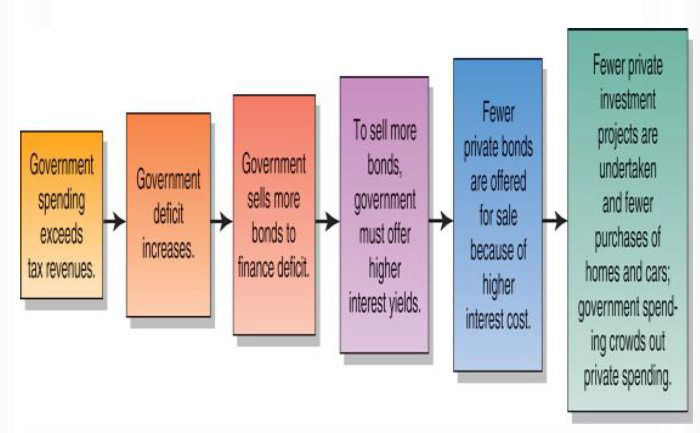 
```

???
loanable funds example, do
---

# The Crowding-Out Effect

```{r  out.width = "75%",out.length = "80%", fig.align = 'center',echo=FALSE}
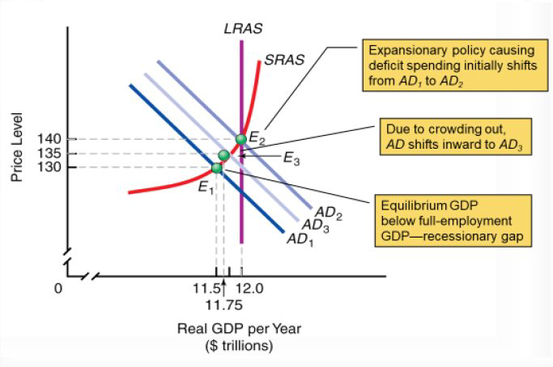 
```

---


class: my-one-page-font

# What is the multiplier?


---

class: my-one-page-font


# Fiscal policy and the multiplier


- An expansionary fiscal policy pushes the aggregate demand curve to the right. 


```{r  out.width = "80%",out.length = "80%", fig.align = 'center',echo=FALSE}
knitr::include_graphics("week12graphs/empty.png") 
```


---

class: my-one-page-font


# Fiscal policy and the multiplier


- A contractionary fiscal policy pushes the aggregate demand curve to the left. 


```{r  out.width = "80%",out.length = "80%", fig.align = 'center',echo=FALSE}
knitr::include_graphics("week12graphs/empty.png") 
```

---

class: my-one-page-font


# Fiscal policy and the multiplier


- How much would a given policy shift the aggregate demand curve? To get the estimate, we use the concept of the multiplier.

--

- Assume no trade, a fixed interest rate, and fixed prices. If MPC = 0.5, the multiplier is 2.

- So, $50 billion of new government spending would create $100 b. increase in GDP.


- __Tax vs Spending__
  - A change in $TR$ or $T$ shifts the aggregate demand curve by __less__ than a change in $G$. Why?
  - Imagine two expansionary fiscal policies: 
    1. The government directly purchases $50 billion in goods and services. 
    2. The government makes transfer payments, sending out $50 billion in checks to consumers. 


---

# Subsidies vs Spending

```{r  out.width = "80%",out.length = "80%", fig.align = 'center',echo=FALSE}
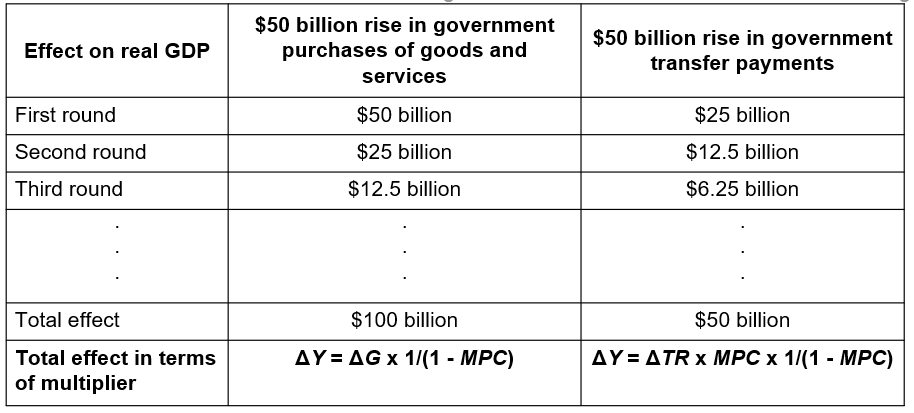 
```


---

class: my-one-page-font

# Taxes and the multiplier

- Taxes may change the size of the multiplier. 

--

- Sp far, we assumed that a $1 increase in real GDP raised disposable income by $1.

- In fact, government taxes capture some part of the increase in disposable income.

--

- The effect of taxes on the multiplier is similar to the effect of international trade, reducing the multiplier:
  - Economists believe it’s a good thing that taxes reduce the multiplier. 
  - The automatic decrease in government tax revenue acts like an automatic expansionary fiscal policy. 

???
In one case the multiplier process is weakened because at each stage some spending “leaks” into imports.
In the other case, income “leaks” into taxes.
If, for example, a negative demand shock causes a recession, incomes fall, taxes fall, and the negative demand shock hurts the economy less than it would if there were no taxes. 

---

class: my-one-page-font

# Types of fiscal policy

- __Automatic stabilizers:__ government spending and taxation rules that cause fiscal policy to be automatically 
  1. expansionary when the economy contracts and 
  2. contractionary when the economy expands (for example, unemployment insurance)

--

- In contrast, discretionary fiscal policy arises from deliberate actions (not rules) by policy makers

- Some nations were forced into “austerity” (sharp cuts in spending plus tax increases), while many were not.

--

- __How do surpluses and deficits fit into the analysis of fiscal policy? Are deficits ever a good thing and surpluses a bad thing?__

???
People usually think of budget surpluses as good: 
When the federal government ran a record surplus in 2000, many people regarded it as a cause for celebration. 
People usually think of budget deficits as bad: 
When the U.S. federal government ran record deficits from 2009 to 2011, many people regarded it as a cause for concern

---

class: my-one-page-font

# The budget balance as a measure of fiscal policy 

- The budget balance is the difference of tax revenue and government spending, both on goods and government transfers: 

$$S_{Government} = T − G − TR$$
--

- A __budget surplus__ is a positive budget balance, and a __budget deficit__ is a negative balance.
  - Other things equal, discretionary expansionary fiscal policies reduce the budget balance for that year.
  - Other things equal, discretionary contractionary fiscal policies increase the budget balance for that year.

--

- Two different changes in fiscal policy may
  1. have equal-sized effects on the budget balance but
  2. have quite unequal effects on the economy. 

???
Economists often use the budget balance as a “quick-and-dirty” way to assess whether current fiscal policy is expansionary or contractionary. 
Often, changes in the budget balance are the result, not the cause, of the business cycle.


---

class: my-one-page-font

# The budget balance and the business cycle

```{r  out.width = "80%",out.length = "70%", fig.align = 'center',echo=FALSE}
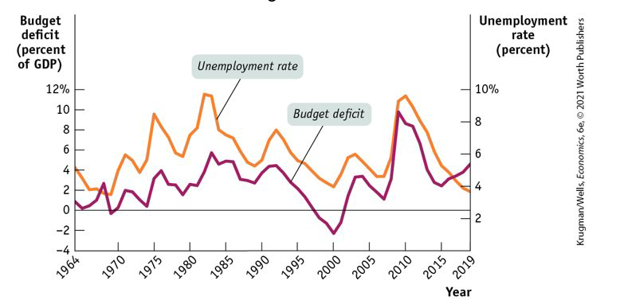 
```

--

1. The budget moves into deficit when the economy is in a recession, and 
2. gets smaller or even turn into a surplus when the economy is expanding.
---

# The business cycle and the cyclically adjusted budget balance

```{r  out.width = "70%",out.length = "80%", fig.align = 'center',echo=FALSE}
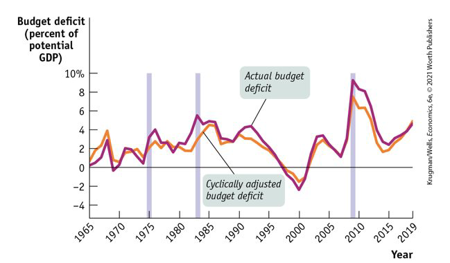 
```


???
- To separate the effects of the business cycle from the effects of discretionary fiscal policy, governments estimate the cyclically adjusted budget balance (an estimate of the budget balance if GDP equaled potential output).
Years of large budget deficits tend to be years when the economy has a large recessionary gap.

---

# Should the budget be balanced?

- __Discuss!__

---

class: my-one-page-font

# Should the budget be balanced?


- A balanced budget every year would undermine the role of taxes and transfers as automatic stabilizers. 

- The government should only balance its budget on average

- The case of Greece:

--

```{r  out.width = "60%",out.length = "60%", fig.align = 'center',echo=FALSE}
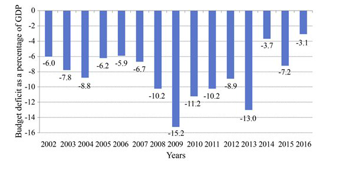 
```


---

class: my-one-page-font

# The budget should be balanced on average


```{r  out.width = "70%",out.length = "80%", fig.align = 'center',echo=FALSE}
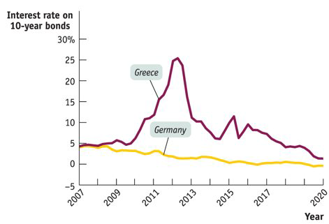 
```


---

# Deficits vs Debt


```{r  out.width = "60%",out.length = "80%", fig.align = 'center',echo=FALSE}
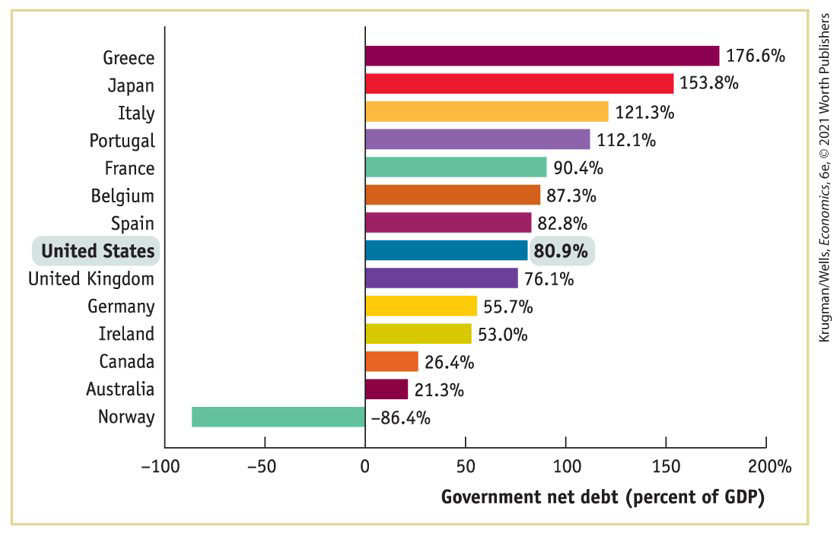 
```

--

- A deficit is the difference between the amount a government spends and  the taxes received over a period. __(Flow)__ 
- A debt is the sum of money a government owes at a particular time. __(Stock)__


???
How does the U.S. public debt stack up internationally? In dollar terms, we’re number one—but this isn’t informative, since the U.S. economy is much larger than those of other nations. A more informative comparison is the ratio of public debt to GDP. 
To assess the government’s ability to pay its debt, we use the debt–GDP ratio. 
- Deficits and debt are linked, because government debt grows when governments run deficits. But they aren’t the same thing, and they can tell different stories.


---

class: my-one-page-font

# Dangers posed by rising government debt


- __Crowding out:__ the government’s borrowing may crowd out private investments, raising interest rates and reducing the economy’s long-run growth.

- __Financial pressure and default:__  Deficits place financial pressure on future budgets. 
  - A government paying large sums in interest must
  1. raise taxes, 
  2. cut spending
  3. or it must borrow even more. 
  

- Can’t a government that has trouble borrowing just print money to pay its bills?

- Yes, it can, but this leads to another problem: __inflation.__ 

---


# Where we are now:


```{r  out.width = "80%",out.length = "80%", fig.align = 'center',echo=FALSE}
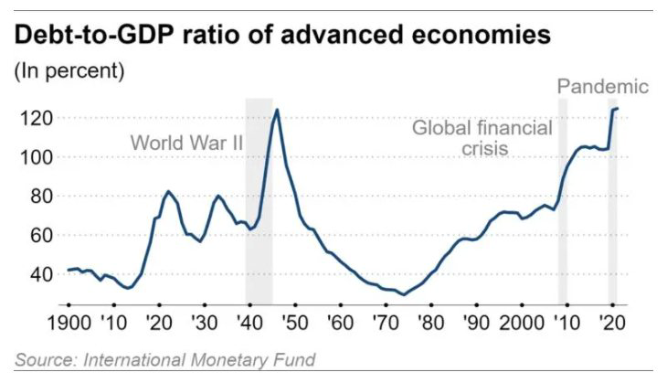 
```
