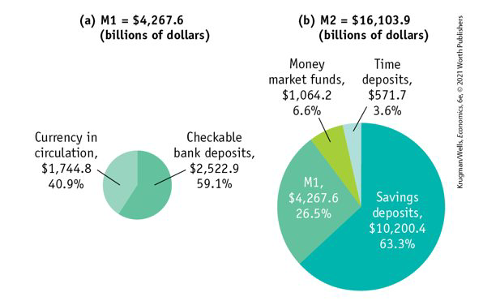
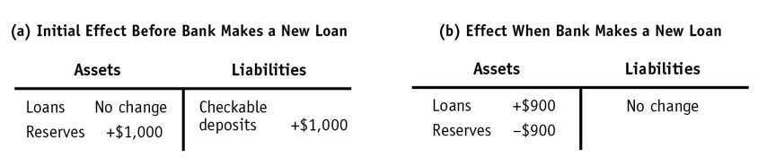
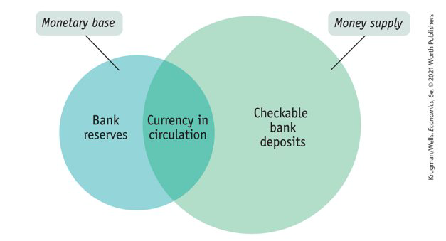

class: center,middle,mctitle-slide 


# Money, Banking and the Federal Reserve System

## Manolis Chatzikonstantinou  

---

class: my-one-page-font

# What will you learn in this lecture?

- What are the various roles money plays and what forms does it take?

--

- Why is the level of the money supply so important to the state of the economy?

--

- How do the actions of private banks and the Federal Reserve determine the money supply?

--

- How does the Federal Reserve use open market operations to change the monetary base?

---


class: my-one-page-font

#  The meaning of money

- We often use the word money to mean wealth, but for economists, money doesn’t include all forms of wealth. 

- Liquidity distinguishes money from other forms of wealth? 

--

- __Money:__ any asset that can easily be used to purchase goods and services
  - __Currency in circulation:__ cash held by the public
  - __Checkable bank deposits:__ bank accounts on which people can write checks

--

- __The money supply:__ total value of financial assets, considered money.
  - __The narrower definition__ of money(most liquid):  currency in circulation and checkable bank deposits. 
  - __The broader definition__ narrow definition + “almost” checkable assets such as savings account deposits. 
 

??? 
dollars vs stocks

---

class: my-one-page-font

# The roles of money

Money functions as: 
  - a medium of exchange:
     - something people accept as payment for goods and services


--

Money functions as: 
  - a store of value:
     - Money is a means of holding purchasing power over time.
     - It enables people to save the money they earn today and use tomorrow.
     
--

Money functions as: 
  - a unit of account:
    - Money provides a yardstick for measuring and comparing the values of a wide variety of goods and services.

---

class: my-one-page-font

# Types of money

1.    __Commodity money:__ a good, normally gold or silver, used as a medium of exchange that has intrinsic value in other uses. 
2.    __Commodity-backed money:__ a medium of exchange with no intrinsic value; the ultimate value is guaranteed by a promise that it can be converted into valuable goods. 
  - The big advantage of commodity-backed money was that it tied up fewer resources: 
  - note-issuing banks kept only enough gold to  satisfy demands for redemption,
  - and it could lend out the remaining gold and silver.
3.    __Fiat money:__ money whose value derives entirely from its official status as a means of payment
  - Fiat money has two advantages. First, it doesn’t use up any real resources beyond the paper it’s printed on. 
  - Second, the supply of money can be adjusted based on the needs of the economy.
  - Fiat money has two disadvantages: it can be counterfeited, and 
  - governments can abuse the privilege of printing money. 
  
---

class: my-one-page-font

# Measuring the money supply

__Monetary aggregate:__ an overall measure of the money supply

- __M1:__ includes only the most liquid forms of money.
- __M2:__ includes near-moneys: financial assets that can’t be directly used as a medium of exchange.

```{r  out.width = "50%",out.length = "100%", fig.align = 'center',echo=FALSE}
 
```
---

class: my-one-page-font

# Banks and monetary policy

- Roughly 43% of M1 is currency in circulation.
- Bank deposits make up more than half of M1 and most of M2.
- How does the banking system create money?

--

- Banks are financial intermediaries that use liquid assets to finance the illiquid investments of borrowers.
- Banks create liquidity, but do not lend all the deposits:
  - a bank must keep currency in the its vault or deposits at the Federal Reserve, 
- __Bank reserves:__ the currency that banks hold in their vaults plus their deposits at the Federal Reserve


---


# Banks: A review

__Bank:__ a financial intermediary that provides liquid assets to lenders and finances illiquid investment spending


--

- __Bank deposit:__ a claim on a bank that obliges the bank to give the depositor their cash when demanded
- __Bank Loan:__ a claim of a bank that determines the time of payments from lenders

--

- A bank is lending for long periods of time while deposits can be demanded  at any time. How can it manage that?
  - On average, only a small fraction of depositors will want their cash at the same time.
  - a bank keeps only a limited amount of cash on hand to satisfy its depositors.
  - bank deposits are guaranteed up to $250,000 by the Federal Deposit Insurance Corporation, or FDIC.
  - __Bank runs__
  
  
--

- Companies have assets and liabilities, how can we understand their financial situation?

???
This reduces the incentive to withdraw funds if there are concerns about the bank.
U.S. businesses are more inclined to take risks. Also, European banks have more money than 
U.S. banks because Europeans tend to keep more money in banks than Americans


---

class: my-one-page-font

# Reserve ratios and Bank runs

.pull-left[
| Assets |  | Liabilities |  |
| :--- | ---: | :--- | :---: |
| Loans | $1,200,000 | Deposits | $1,000,000 |
| Reserves | $100,000 |  |  |
]

.pull-right[

- __T-account:__ a tool for analyzing a business’s financial position by showing the business’s assets and liabilities
- __The reserve ratio:__ the fraction of bank deposits that a bank holds as reserves 
- The Federal Reserve sets a minimum required reserve ratio for banks.
]

--

- From time to time, people get worried about banks losing their money.
- __Bank run:__ a phenomenon in which many of a bank’s depositors try to withdraw their funds because they fear a bank failure
- In the 1930s, for example, the wave of bank runs swept across the United States. 
- In response to bank runs, the United States established a system of bank regulations that protect depositors.

---

class: my-one-page-font


# The Balance Sheet of a Bank

$$ \text { Leverage }=\frac{\text { Assets }}{\text { Your Skin in the Game }}=\frac{\text { Assets }}{\text { Equity }}$$

--

__How much capital should a bank have?__
  - remember that the reason banks hold equity is to absorb possible losses on the assets they own
  - What is the probability that a bank will go broke? 
    - It is the probability, that after a negative shock, the net worth becomes negative.
--

When is it higher?
  -  the higher the leverage ratio of the bank is. 
  - the higher the fraction of  risky loans, loans that often lose their value


---

# Bank regulation

Bank regulation has four main features: 

--

__Deposit insurance:__  a guarantee that a bank’s depositors will be paid even if the bank can’t come up with the funds 

--

__Capital requirements:__ requirement that the owners of banks hold substantially more assets than the value of bank deposits
  - Due to deposit insurance, banks can take more risks since they are insured.
  - __Solution:__ banks’ capital is required to equal 7% or more of their assets.

--

__Reserve requirements:__ rules set by the Federal Reserve that determine the minimum reserve ratio for a bank

__The discount window:__ an arrangement in which the Federal Reserve stands ready to lend money to banks in trouble

---

class: my-one-page-font

# Limits to regulation: Shadow Banking

- the financial crisis showed us, there are many large financial firms that don’t accept deposits:
  - so they aren’t covered by deposit insurance or 
  - regulation that make conventional banks safer.


These ”shadow banks” include:
  - investment banks
  - insurance companies
  - hedge fund companies
  - money market fund companies


---

class: my-one-page-font

# How Banks create money

- Silas keeps a shoebox full of cash under his bed. 
- Deciding to enter the twenty-first century, he deposits this cash at the bank.
- What’s the effect of his $1,000?

--

- Assume that the reserve ratio is 10%. The bank will  lend out 90% of the deposit.

```{r  out.width = "80%",out.length = "100%", fig.align = 'center',echo=FALSE}
 
```

---

class: my-one-page-font

# How Banks create money


- The first bank lends $900 to Maya, who pays the money  to Anne, who deposits it at her bank—and the cycle starts 


|  | Currency in circulation | Checkable bank deposits | Money supply |
| :--- | :---: | :---: | :---: |
| __First stage__ Silas keeps his cash under his bed. | 1,000 | 0 | 1,000 |
| __Second stage__ Silas deposits cash in First Street Bank, which lends out $900 to Maya, who then pays it to Anne. | 900 | 1,000 | 1,900 |
| __Third stage__ Anne Acme deposits $900 in Second Street Bank, which lends out $810 to another borrower. | 810 | 1,900 | 2,710 |


---

class: my-one-page-font

# Required and excess reserves

- The bank must keep some cash available for its depositors;

- Banks in the U.S. are required to hold required reserves :
  - reserves that a bank is legally required to hold, based on its checking account deposits.
  - The __required reserve ratio (RR)__ is the minimum fraction of deposits banks are required by law to keep as reserves.

- Banks might choose to hold excess reserves : reserves over
the legal requirement.


- __Excess reserves:__ bank's reserves over and above its required reserves
- Increase in bank deposits from $1,000$ in excess reserves =
$$ 1,000+[ 1,000 \times(1-r r)]+\left[ 1,000 \times(1-r r)^{2}\right]+[ 1,000 \times(1- rr) \left.^{3}\right]+\ldots$$
This can be simplified to $1,000/rr$.

---

class: my-one-page-font

# The money multiplier in reality 

.pull-left[
```{r  out.width = "100%",out.length = "100%", fig.align = 'center',echo=FALSE}
 
```
]

.pull-right[
- Monetary base = currency in circulation + bank reserves.
- The monetary base is different from the money supply in two ways:
   - Bank reserves: 
   - Checkable bank deposits:
]


- The money multiplier is the ratio of the money supply to the monetary base.
  - Before the financial crisis of 2008, it was 1.6; after the crisis, it was 0.7.

- The minimum reserve ratio is 10%. Why is the money multiplier not 1/0.1=10? 
  - People hold significant amounts of cash, which reduces bank deposits.

???
If X for example, can increase the money supply by
pulling cash out from under her bed and injecting into the
banking system, the reverse can happen anytime people
carry cash.

---

class: my-one-page-font


# The Federal Reserve System

- The Federal Reserve is a central bank
  — an institution that oversees and regulates the banking system and controls the monetary base

- The Federal Reserve has two parts: 
  - the Board of Governors and the 12 regional Federal Reserve Banks. 
  - Each Federal Reserve Bank serves a certain region.

- Decisions about monetary policy are made by the Federal Open Market Committee.


The three tools of the Fed:
  1. reserve requirements, 
  2. the discount rate, 
  3. open-market operations.


---

class: my-one-page-font

# What if a bank can not meet the requirement?


- If a bank can’t meet the Fed’s reserve requirement, it can borrow reserves at the federal funds market.
 - The federal funds market: lend and borrow funds from excess reserves.
 - The federal funds rate is the interest rate in the federal funds market.
  - Alternatively, banks can borrow from the Fed via the discount window. The discount rate is the interest rate the Fed charges on those loans. 

- Like any bank, the Federal Reserve has assets and liabilities. 
  - Assets are mainly short-term U.S. government bonds, known as Treasury bills or T-bills. 
  - Liabilities are currency in circulation and bank reserves. 

- The Fed rarely changes the minimum reserve requirement and rarely uses the discount rate. 


---

class: my-one-page-font


# Open Market Operations

- Monetary policy is conducted almost exclusively using the Fed’s third policy tool: open-market operations.
  - In an open-market operation the Federal Reserve buys or sells U.S. Treasury bills, normally through a transaction with banks.

  - The Fed never buys T-bills directly from the federal government. 

  - If it did, it would be printing money to fund the budget deficit, which would trigger inflation.

- The Fed buys $100 million of T-bills from banks. 
  - The Fed electronically increases the sellers’ reserves. 
  - With more reserves, banks increase loans. 
  - As banks increase loans, the money supply increases via the money multiplier. 


---

class: my-one-page-font

# Open Market Operations

- Open Market __Purchase__

.pull-left[
|  | Assets |  | Liabilities |  |
| :--- | :--- | :--- | :---: | :---: |
| Federal Reserve | Treasury bills | +$100 million | Monetary base | +$100 million |
|  |  |  |  |  |
]

.pull-right[
|  | Assets |  | Liabilities |
| ---: | :--- | :---: | :--- |
| Commercial banks | Treasury bills | - $100 million | No change |
|  | Reserves | +$100 |  |
]


--

- Open Market __Sale__

.pull-left[
|  | Assets |  | Liabilities |  |
| :--- | :--- | :---: | :--- | :---: |
| Federal Reserve | Treasury bills | -$100 million | Monetary base | -$100 million |
|  |  |  |  |  |
]

.pull-right[
|  | Assets |  | Liabilities |
| ---: | :--- | :---: | :--- |
| Commercial banks | Treasury bills | + $100 million | No change |
|  | Reserves | -$100 |  |
|  |  | million |  |
]

---

class: my-one-page-font


# The ECB

- The European Central Bank (ECB) rivals the Fed in terms of importance to the world economy.

--

-  ECB and the Fed:
 - Europe’s national banks (the Bank of France, the Bank of Italy, etc.) are like regional Feds: they provide financial services to local banks and businesses and conduct open-market operations.
  - The counterpart of Fed’s Board of Governors is the ECB’s Executive Board.
`- The counterpart of the Federal Open Market Committee is the ECB’s Governing Council.

- The ECB tries to maintain its independence from short-term political pressures.


---

class: my-one-page-font


# Banking crises

- Is the money supply sufficiently responsive?
  - It was difficult to shift currency around US to respond to local economic changes.
  - Rumors that a bank had insufficient currency leads to bank runs.
  - The __Panic of 1907__ led to a four-year national recession and showed how vulnerable the system had become.

--

- In 1913, the Federal Reserve was created.

--


- The __S&L__ crisis of the 1980s arose because Congress deregulated S&Ls:
  - The intent was to allow them to offer higher rates of return
  - They incurred huge losses.
  - The crisis caused steep losses in the financial and real estate sectors, resulting in a recession.

???
Bank reserves became centralized and standardized—but not immune to bank runs.
A series of bank runs in 1930, 1931, and 1933 convinced the Fed that banks needed more regulation.
Regulators closed nonviable banks and expanded banks’ ability to borrow from the Federal Reserve. 
The Glass-Steagall Act (1933) separated banks into two categories:
Commercial banks accepted deposits and were covered by deposit insurance.
Investment banks traded in financial assets (stocks and corporate bonds); did not accept deposits and but were not covered by deposit insurance.

---


# The financial crisis of 2008

- By the early twenty-first century, a new problem had emerged: 
  - Regulations didn’t cover shadow banking—activities. 
  - In 2008 shadow banking was at the center of the crisis.

--

- Subprime lending helped create the U.S. housing bubble of the 2000s and was made worse with securitization. 
  - __Subprime lending:__ lending to home buyers who don’t meet the usual criteria for being able to make the payments
  - __Securitization:__ a pool of loans assembled and shares of it sold to investors

--

- the Fed and the U.S. Treasury provided capital through the purchase of bank shares, and purchased private debt.
- The Fed and the Treasury Department rescued individual firms that were “too big to fail”

--

- The Federal Reserve engaged in new forms of open-market operations: 


- In July 2010, President Obama signed the Dodd-Frank Act (the Wall Street Reform and Consumer Protection Act).
    - the Financial Stability Oversight Council, 
    - new rules on the trading of derivatives
    - Created the Consumer Financial Protection Bureau
    