class: center,middle,mctitle-slide 


# Monetary Policy

## Manolis Chatzikonstantinou  

---

class: my-one-page-font

# What will you learn in this lecture?

-  What is the money demand curve?

--

-  Why does the liquidity preference model determine the interest rate in the short run?

--

-  How does the Federal Reserve implement monetary policy?

--

-  Why is monetary policy the main tool for stabilizing the economy?

--

-  Why do economists believe in monetary neutrality?

---

class: my-one-page-font

#  Who decides what the global interest rate is? 

.pull-left[

```{r  out.width = "100%",out.length = "100%", fig.align = 'center',echo=FALSE}
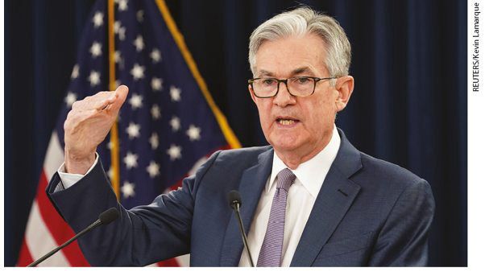 
```

]


.pull-right[

```{r  out.width = "100%",out.length = "100%", fig.align = 'center',echo=FALSE}
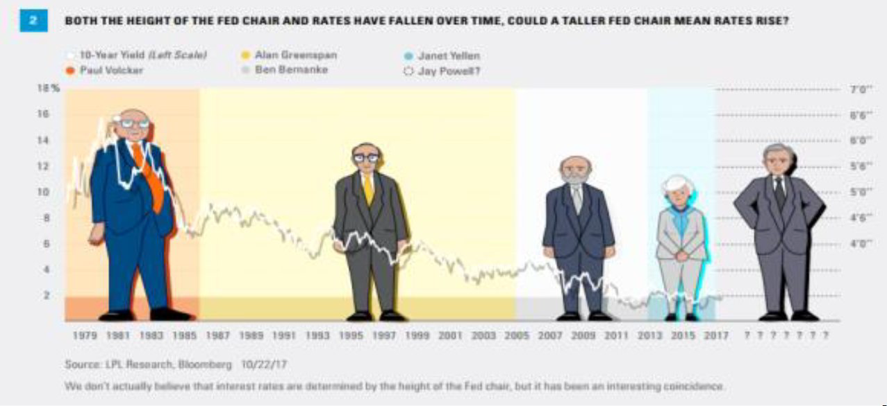 
```

]
--

- The chairmanship of the Federal Reserve is arguably the most powerful position in the U.S. government.

---

class: my-one-page-font

# The opportunity cost of holding money

- We all carry some cash for the convenience, but that convenience comes with a price:
  - Cash yields no return, no interest
--

- Trade off: the benefit of holding cash versus the benefit of interest-bearing assets. 

| One-month Treasury bills | 2.45% |
| :--- | :--- |
| Interest-bearing demand deposits | 0.06% |
| Cash | 0 |

--

- Funds in demand deposits are more accessible than those in Treasury bills, but they earn only 0.06%. 
- The most accessible asset—cash in your wallet—earns zero. 

---

class: my-one-page-font

# The opportunity cost of holding money

- __Short-term interest rates:__ financial assets that mature within less than a year
- __Long-term interest rates:__ financial assets that mature a number of years in the future

--

|  | March 2019 | March 2020 |
| :--- | :---: | :---: |
| Federal funds rate | 2.41% | 0.65% |
| One-month Treasury bills | 2.45% | 0.37% |
| Interest-bearing demand deposits | 0.06% | 0.06% |
| Treasury bills minus interest-bearing demand deposits | 2.35 | 0.31 |
| Treasury bills minus currency| 2.41 | 0.37 |

- What happened to the opportunity cost of holding money between 2019 and 2020? 

???
The opportunity cost of holding money declined sharply between 2019 and 2020. 

---

class: my-one-page-font

# The money demand curve


```{r  out.width = "70%",out.length = "100%", fig.align = 'center',echo=FALSE}
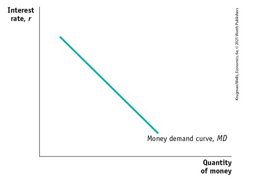 
```


--

- It slopes downward: Why?

---

class: my-one-page-font

# Shifts the money demand curve 

- __What shifts the money demand curve?__

--

- Changes in aggregate price level

--

- Changes in real GDP


--

- Changes in credit markets and banking technology

--

- Changes in institutions or trust
  - __Example:__ U.S. banks weren’t allowed to offer interest on checking accounts until 1980. When regulation changed, the MD curve to the right.
  - __Japan is still a cash society:__ The many small businesses haven’t invested in credit card technology.

---

# Shifts the money demand curve 


```{r  out.width = "60%",out.length = "100%", fig.align = 'center',echo=FALSE}
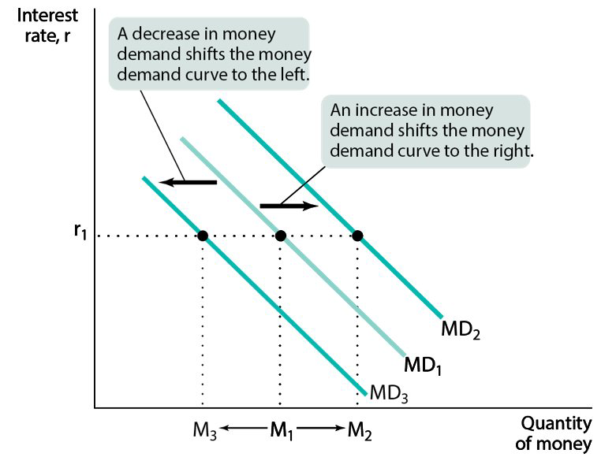 
```

---
class: my-one-page-font


# Liquidity preference model

- So how does the Fed control interest rates? __open-market operations, the discount window, or reserve requirements__
  - The interest rate is determined by the supply and demand for money.
  - It combines the money demand curve, MD, with the money supply curve, MS.
  - Model: __open-market operations, the discount window, or reserve requirements = MS__


.pull-left[

```{r  out.width = "75%",out.length = "100%", fig.align = 'center',echo=FALSE}
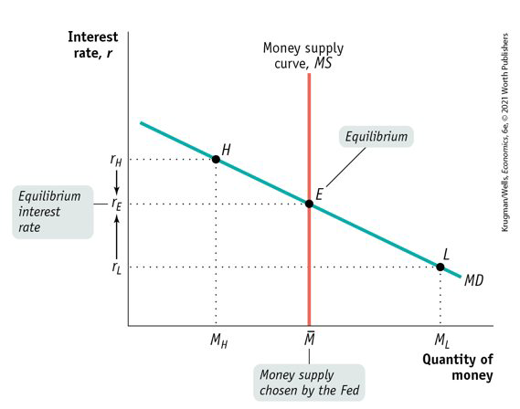 
```

]

.pull-right[

At low interest rates , MD > MS.  Investors will drive the interest rate up.

At high interest rates , MD < MS. Investors will drive the interest rate down.

]


---

class: my-one-page-font

# Monetary policy and interest rates

- By adjusting the money supply up or down, the Fed can set the interest rate.
- The Fed sets __Target federal funds rate:__ the Federal Reserve’s desired federal funds rate
- The Fed uses open-market operations to move the interest rate to the target rate.

--


```{r  out.width = "80%",out.length = "100%", fig.align = 'center',echo=FALSE}
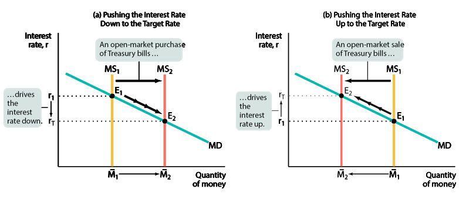 
```

???
A common mistake is to imagine that changes in the way the Federal Reserve operates alter the way the money market works.
In fact, the money market works the same way as always: The interest rate is determined by the supply and demand for money.
The only difference is that now the Fed adjusts the supply of money to achieve its target interest rate.


---

class: my-one-page-font


# Long-term interest rates


```{r  out.width = "90%",out.length = "100%", fig.align = 'center',echo=FALSE}
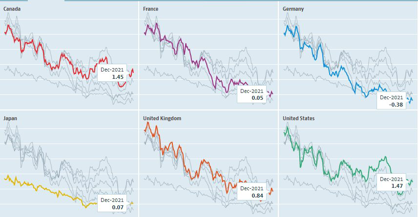 
```

???
Long-term interest rates—rates on bonds or loans that mature in several years—are quite different from short-term rates. Why?
Long-term rates reflect expected future monetary policy, which largely depend on the future economic outlook.
For example, if investors expect interest rates to rise, they will buy short-term bonds to reinvest the money later at higher interest rates. Long-term rates are usually higher than short-term rates because long-term bonds and loans carry extra risk.

--

---

class: my-one-page-font

# Up the down staircase

- When the crisis hit in 2008, the Fed cut rates and kept them low for seven years. 
  - Even in 2019, the federal funds rate was still well below what it had been in 2007. 
  - Why was the Fed moving so slowly? Inflation was well below the target.
  - Aging population and slowing productivity growth, we need low interest rates. Why?
--

```{r  out.width = "70%",out.length = "100%", fig.align = 'center',echo=FALSE}
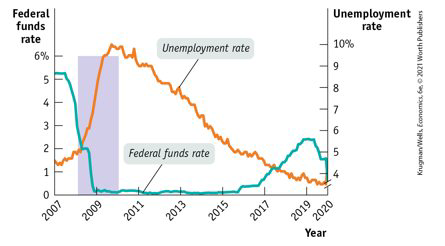 
```

---

class: my-one-page-font

# Monetary policy and aggregate demand

- Expansionary monetary policy: increase aggregate demand ( “loose monetary policy”)
- Contractionary monetary policy: reduce aggregate demand ( “tight monetary policy”)

--

```{r  out.width = "100%",out.length = "100%", fig.align = 'center',echo=FALSE}
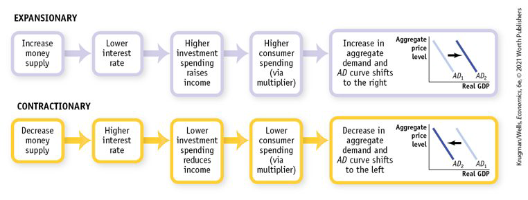 
```

---

class: my-one-page-font

# Monetary policy in practice

- How does the Fed decide whether to use expansionary or contractionary monetary policy?
   -  fight recessions and high inflation.
   - Actual monetary policy reflects a combination of these goals.

--

```{r  out.width = "90%",out.length = "100%", fig.align = 'center',echo=FALSE}
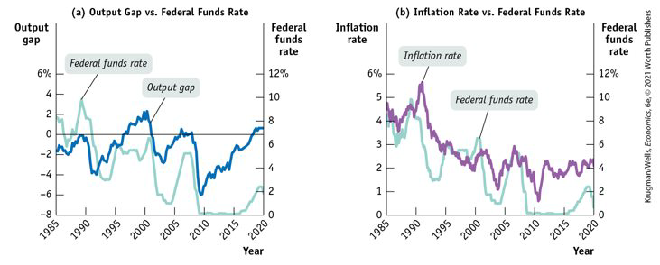 
```

---

class: my-one-page-font

# The effect of monetary policy

- In the United States, the inflation rate peaked at 14% at the beginning of the 1980s. In Britain, the inflation rate reached 26% in 1975. 
  - Why did policy makers allow this to happen?
  - In the short run, Policies that reduce inflation tend to depress the economy. 

- This creates both temptations and dilemmas for governments:
  - Inflationary policies produce short-term political gains.
  - Policies to bring inflation down carry short-term political costs.
  - Macroeconomic policy activism lends itself to political manipulation,
    - e.g.: Pump up the economy in an election year
- Richard Nixon’s expansionary fiscal and monetary policy led to rapid growth just before the 1972 election and a sharp acceleration in inflation after the election. 
  - What can we do?

---

class: my-one-page-font

# The Taylor rule:


- A monetary policy rule is a formula that determines the central bank’s actions.

- set the federal funds rate according to the level of the inflation rate/the output gap:

$$ \text{Federal funds target rate} = 2.07 + 1.28 × \text{inflation rate}  – 1.95 × \text{unemployment gap} $$

```{r  out.width = "50%",out.length = "100%", fig.align = 'center',echo=FALSE}
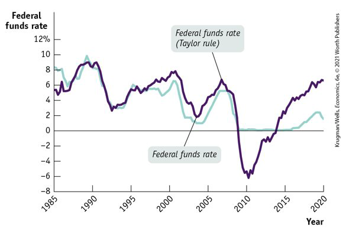 
```

---


class: my-one-page-font

# Inflation Targeting


.pull-left[
```{r  out.width = "100%",out.length = "100%", fig.align = 'center',echo=FALSE}
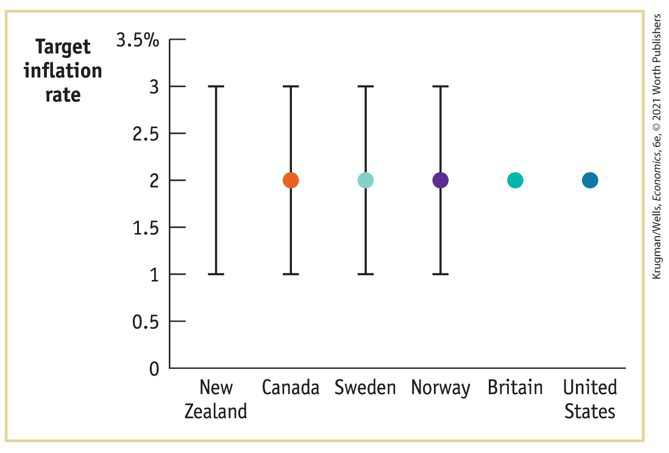 
```
]

.pull-right[
- Instead of using a Taylor rule, many central banks use inflation targeting.
- The central bank sets an explicit target for the inflation rate.
]


--

- Inflation targeting is forward-looking (based on a forecast of future inflation).
- The Taylor rule is backward-looking (adjusts monetary policy in response to past inflation).

---

class: my-one-page-font

# The zero lower bound problem

- Zero lower bound for interest rates: Interest rates can’t go below zero without causing significant problems.
- By 2016, the Swiss equivalent of the federal funds rate was −0.75% 
- No central bank has tried to push rates significantly below zero.


- Is there a problem? If there is a Recessionary gap, normal monetary policy runs out of room to operate because  of zero interest rates. 
- November 2010:  Interest rates were at or near zero, and the Fed tried new tools. 
- Despite the Fed’s efforts, the pace of recovery remained disappointingly slow.

---

class: my-one-page-font

# What the FED wants, the FED gets?

__Causality problem:__ high interest rates go along with a strong economy;

- Romer and Romer: cases when Fed decided “to reduce inflation.” 


```{r  out.width = "65%",out.length = "100%", fig.align = 'center',echo=FALSE}
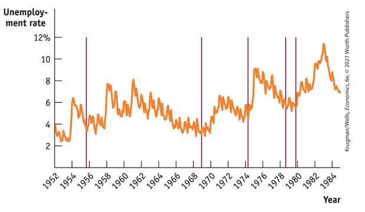 
```


---

class: my-one-page-font

# Money, output and prices in the long run

- What about the economy’s ability to self-correct toward long-run equilibrium through flexible wages and SRAS shifts?

--

```{r  out.width = "50%",out.length = "100%", fig.align = 'center',echo=FALSE}
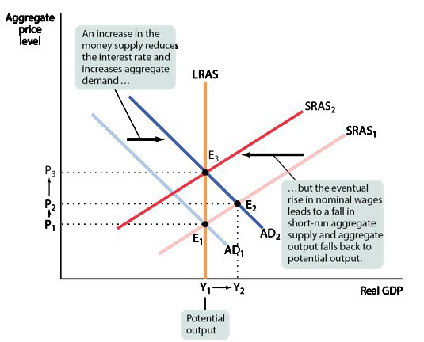 
```

---

class: my-one-page-font

# Monetary neutrality

- In the long run, changes in the money supply don’t affect the interest rate.
  - __Monetary neutrality:__ changes in the money supply have no real effect on the economy.

--

```{r  out.width = "60%",out.length = "100%", fig.align = 'center',echo=FALSE}
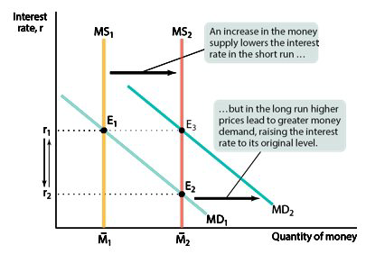 
```

---

class: my-one-page-font

#  International evidence of Monetary neutrality

- Do increases in the money supply really lead to equal percentage rises in the price level? 

--

```{r  out.width = "70%",out.length = "100%", fig.align = 'center',echo=FALSE}
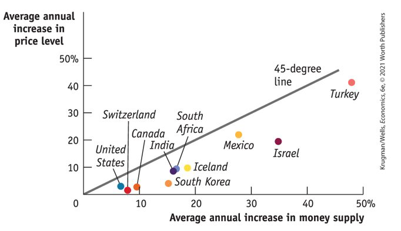 
```


