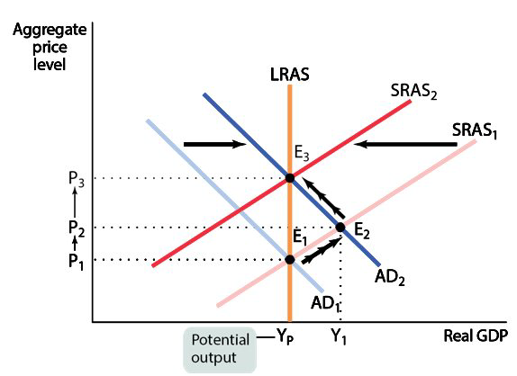
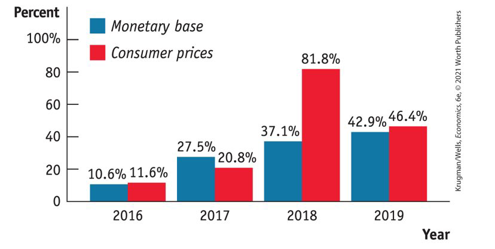
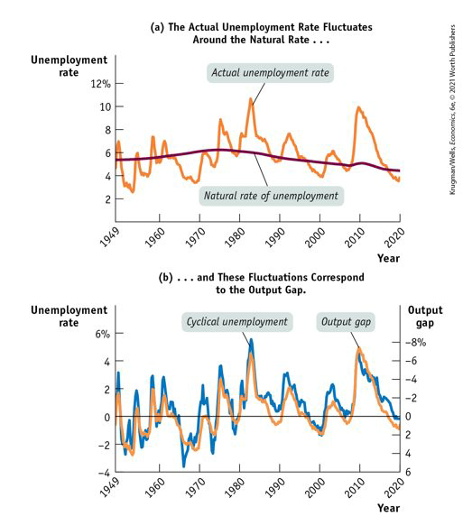
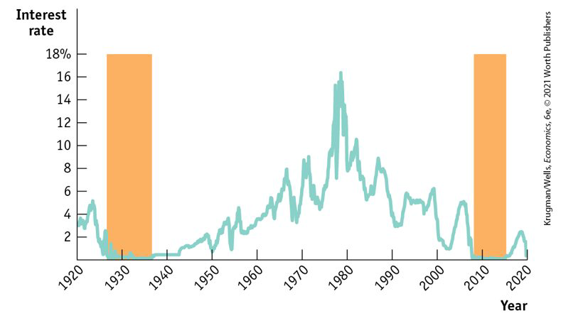
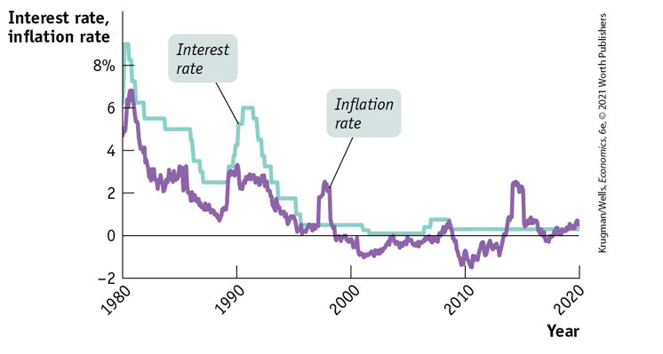
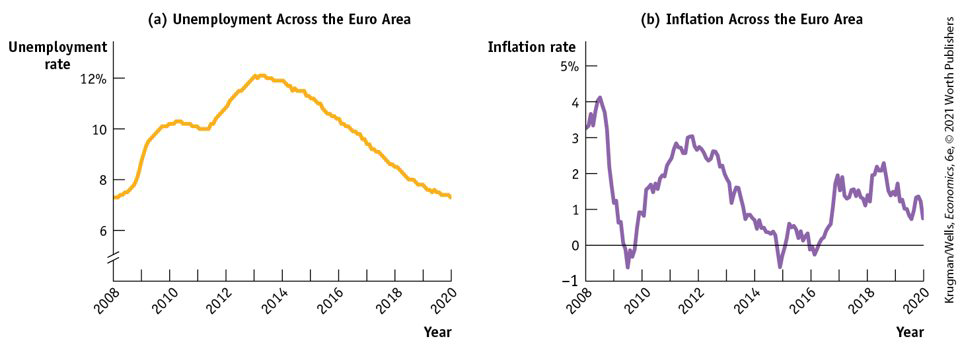

class: center,middle,mctitle-slide 


# Inflation, Deflation and Disinflation

## Manolis Chatzikonstantinou  

---


# What will you learn in this lecture?

-  Why can printing money lead to higher rates of inflation and hyperinflation?

--

-  How does the Phillips curve describe the short run trade off between inflation and unemployment?

-- 

-  Why does the trade off between inflation and unemployment cease in the long run?

-- 

-  Why can even moderate levels of inflation be hard to end?

-- 

-  Why is deflation a problem for economic policy makers?

---

# Hyperinflation

Very high rates of inflation—in excess of 100 percent per year—
are known as hyperinflation.
• Hyperinflation results when central banks increase the money
supply at a rate far in excess of the growth rate of real GDP.
• This might happen when governments want to spend much more
than they raise through taxes; so they force their central bank to
“buy” government bonds.
• Recently, hyperinflation has occurred in Zimbabwe; during the
2000s, prices increased by (on average) 7500 percent per year.
• At that rate, a can of soda costing $1 this year would cost $75
next year, and over $5,600 the year after that.
• Hyperinflation tends to be associated with slow growth, if not
severe recession.

--

- __What caused 500 billion percent inflation in Zimbabwe(2008) and Germany (1922-1923)?__

- __Why did inflation spiral out of control in Armenia (27,000%) and Nicaragua (60, 000%)?__

--

- High inflation is always associated with rapid increases in the money supply.


---

#  The quantity theory of money

We explain the quantity theory of money and use it to explain how
high rates of inflation occur
Beginning in the sixteenth century, Spain sent gold and silver from
Mexico and Peru back to Europe.

These metals were minted into coins, increasing the money
supply.
Prices in Europe rose steadily during those years.

This helped people to make the connection between the
amount of money in circulation, and the price level.

--

- In the early twentieth century, Irving Fisher formalized the relationship between money and prices as the quantity equation:

$$M \times V=P \times Y$$

- M: Money supply, P: Price level, Y: Real output
- $V: \underline{\text { Velocity of money: the average number of times each dollar }}$ in the money supply is used to purchase goods and services included in GDP.

---

# Calculating the velocity of money

Measuring:
•
The money supply ( M ) with
•
The price level ( P ) with the GDP deflator, and
•
The level of real output ( Y ) with real

--

We obtain the following value for velocity:

$$
V=\frac{P \times Y}{M}
$$

$$
V=\frac{1.09 \times \$ 16.0 \text { trillion }}{2.8 \text { trillion }}=6.2
$$
We can always calculate $V$. But will we always get the same answer? The quantity theory of money asserts that, subject to measurement error, we will:
- Quantity theory of money: A theory about the connection between money and prices that assumes that the velocity of money is constant.

---

# The quantity theory of money and inflation


$$M \times V=P \times Y$$
--

$$\ln M + \ln V= \ln P + \ln Y$$

--

Expressing the equation of exchange in growth rates:
$$
\% \Delta M +\% \Delta V= \% \Delta P+ \% \Delta Y
$$
--
- In the long run, velocity does not change, so
$$
\% \Delta P = \% \Delta M - \% \Delta Y
$$
Inflation rate = Growth Rate of Money Supply − Growth Rate of Real GDP

---

# The classical model of the price level


The classical model of the price level: the real quantity of money is always at its long-run equilibrium level.

$$\text{Real quantity of money} = M/P$$

--

-pull-left[
```{r  out.width = "100%",out.length = "100%", fig.align = 'center',echo=FALSE}
 
```
]

-pull-right[
If money supply increases, AD increases and the economy moves to E2. Higher prices drive nominal wages up, and the SRAS shifts to the left.
The percentage increase in the price level from P1 to P3 equals the percentage increase in the money supply.
Changes in money supply have no effect on real GDP–money is neutral.  

]

--

- The classical model assumes the economy moves directly from E1 to E3.

???
This is a poor assumption when inflation is low because wages are sticky. But it’s good assumption when inflation is high because the stickiness of wages vanish. Result: In countries with high inflation, changes in money supply are quickly translated into changes in inflation.

---

# Evidence from Venezuela

```{r  out.width = "100%",out.length = "100%", fig.align = 'center',echo=FALSE}
 
```

---

# The inflation tax


What is to prevent a government from paying for its expenses by printing money? Nothing. 
The Treasury issues debt, and the Fed monetizes it by buying it back from the public through open-market purchases of Treasury bills. 
The U.S. government can and does raise revenue by printing money.

Seignorage: the revenue generated by a government’s right to print money (usually less than 1% of the U.S. government’s budget).
By printing money, a government increases the money supply, which triggers inflation. 
Inflation erodes the purchasing power of money.

The inflation tax: the reduction in the real value of money held by the public caused by inflation

--

$$Seignorage = ΔM$$

It’s more useful to look at real seignorage, the revenue created by printing money, divided by the price level, P:

$$\text{Real seignorage} = ΔM/P$$
$$\text{Real seignorage}  = (ΔM/M) × (M/P) $$or

- In the face of high inflation the public reduces the real amount of money it holds, so M/P gets smaller. The government responds by accelerating the rate of growth of the money supply, ∆M/M increasing inflation. This leads to a self-reinforcing process can easily spiral out of control.

???
Real seignorage = rate of growth of the money supply × real money supply.

---

# Moderate inflation and disinflation

In the United States, the inflation rate peaked at 14% at the beginning of the 1980s. In Britain, the inflation rate reached 26% in 1975. 
Why did policy makers allow this to happen?
In the short run, policies that produce a booming economy lead to higher inflation, and 
Policies that reduce inflation tend to depress the economy. 
This creates both temptations and dilemmas for governments:
Inflationary policies produce short-term political gains.
Policies to bring inflation down carry short-term political costs.

---

# The output gap and the unemployment rate

Recall that aggregate output fluctuates around potential output in the short run: 
When aggregate output falls short of potential output, a recessionary gap arises;
When aggregate output exceeds potential output, an inflationary gap arises.
The output gap: the percentage difference between the actual level of real GDP and potential output.
When actual aggregate output is equal to potential output, the actual unemployment rate is equal to the natural rate of unemployment.
When the output gap is positive (an inflationary gap), the unemployment rate is below the natural rate.
When the output gap is negative (a recessionary gap), the unemployment rate is above the natural rate.
Fluctuations of aggregate output around the long-run potential output correspond to fluctuations of the unemployment around the natural rate.

---

# Cyclical unemployment and the output gap 

```{r  out.width = "100%",out.length = "100%", fig.align = 'center',echo=FALSE}
 
```

-- 

- The actual unemployment rate fluctuates around the natural rate—and these fluctuations correspond to the output gap.

---

# Okun's Law

Cyclical unemployment seems to move less than the output gap.
In 1982, for example, the output gap reached −8%, but cyclical unemployment reached only 4%.
Arthur Okun, John F. Kennedy’s chief economic adviser, discovered this.
Okun’s law: There is a predictable negative relationship between the output gap and the unemployment rate. Modern estimates find that a rise in the output gap of 1% reduces the unemployment rate by about 0.5%.
Example: If the natural rate of unemployment is 5.2% and the economy is producing at 98% of potential output (the output gap is −2%), then Okun’s law predicts an unemployment rate of 
5.2% − 0.5 × (−2%) = 6.2%.


---

# The Phillips Curve


.pull-left[

```{r  out.width = "100%",out.length = "100%", fig.align = 'center',echo=FALSE}
knitr::include_graphics("week15graphs/phillips1.png") 
```
]


.pull-right[
In 1958, A. W. H. Phillips found that for Britain, 
when the unemployment rate was high, the wage rate tended to fall, and 
when the unemployment rate was low, the wage rate tended to rise. 
The short-run Phillips curve (SRPC):  the negative short-run relationship between the unemployment rate and the inflation rate
]

--

```{r  out.width = "100%",out.length = "100%", fig.align = 'center',echo=FALSE}
knitr::include_graphics("week15graphs/phillips2.png") 
```

---

# The AD-AS model and the Phillips Curve

```{r  out.width = "100%",out.length = "100%", fig.align = 'center',echo=FALSE}
knitr::include_graphics("week15graphs/phillips3.png") 
```

---

# What can shift the short-run Phillips Curve

Supply shocks
A negative supply shock shifts SRPC up as the inflation rate increases for every level of the unemployment rate.
A positive supply shock shifts it down as the inflation rate falls for every level of the unemployment rate. 
The expected inflation rate 
It’s the rate of inflation that employers and workers expect in the near future. 
The expected inflation rate is the most important factor, other than the unemployment rate, affecting inflation.

--

```{r  out.width = "100%",out.length = "100%", fig.align = 'center',echo=FALSE}
knitr::include_graphics("week15graphs/phillips5.png") 
```

--

- An increase in expected inflation shifts the short-run Phillips curve up. 

---

# Unemployment and inflation 1961-1990


```{r  out.width = "100%",out.length = "100%", fig.align = 'center',echo=FALSE}
knitr::include_graphics("week15graphs/phillips6.png") 
```


--

The Phillips curve seemed to hold in the 1950s and 1960s. 
Then it broke down as the United States experienced both high unemployment and high inflation. This was the result of negative supply shocks and years of higher- than-expected inflation. 
Inflation came down during the 1980s, and the 1990s were a time of both low unemployment and low inflation.

---

# THE NAIRU AND THE LONG-RUN PHILLIPS CURVE

The NAIRU is another name for the natural rate of unemployment. 
The natural rate of unemployment is the part of the unemployment rate unaffected by the swings of the business cycle.
In 2017, the CBO estimate of the U.S. natural rate was 4.7%.


--

```{r  out.width = "100%",out.length = "100%", fig.align = 'center',echo=FALSE}
knitr::include_graphics("week15graphs/phillips7.png") 
```


--

Suppose the economy is at EO with a 6% unemployment rate.
Policy makers use fiscal and monetary policies to reduce unemployment below 6%. 

At point A, inflation is 2%, and people will expect a 2% inflation rate, which will shift SRPC up. 

At point B, inflation is 4%, and people will expect a 4% inflation, which will shift SRPC up again. 

At point C, people will expect a 6% inflation, which will shift SRPC up again, etc. 


---

# Unemployment and inflation in the Long run

The short-run Phillips curve says that at any given point in time, there is a trade-off between unemployment and inflation. 
In the short run, expectations may diverge from reality, but in the long run, expectations adjust. What does the trade-off between inflation and unemployment look like in the long run?
The long-run Phillips curve: the relationship between unemployment and inflation after expectations of inflation have had time to adjust to experience

--

An attempt to reduce unemployment leads to accelerating inflation.
To avoid accelerating inflation over time, the unemployment rate must be high enough that the actual rate of inflation matches the expected rate of inflation. 
The natural rate hypothesis: the relationship between accelerating inflation and the unemployment rate
The nonaccelerating inflation rate of unemployment, or NAIRU, is the unemployment rate at which inflation does not change over time.
The vertical line LRPC is the long-run Phillips curve, the relationship between unemployment and inflation in the long run, after inflation expectations adjusted to experience. 
It is vertical because any unemployment rate below the NAIRU leads to ever-accelerating inflation. 
An unemployment rate below the NAIRU cannot be maintained in the long run.

---

# THE GREAT DISINFLATION OF THE 1980S

Beginning in late 1979, the Federal Reserve imposed strongly contractionary monetary policies, which pushed the economy into its worst recession since the Great Depression.

--

```{r  out.width = "100%",out.length = "100%", fig.align = 'center',echo=FALSE}
knitr::include_graphics("week15graphs/disinflation.png") 
```

--

Disinflation is the process of bringing down inflation that is embedded in expectations.
Once inflation has become embedded in peoples’ expectations, reducing it can be difficult.
Disinflation can require a recession.
However, policy makers in the United States and other wealthy countries were willing to pay that price to bring down the high inflation of the 1970s.

---

# Deflation

Deflation: a falling aggregate price level
Deflation used to be as common as inflation before World War II.
After the war, inflation became the norm.
But in the 1990s, deflation reappeared in Japan and proved difficult to reverse.
Like inflation, deflation produces winners and losers—but in the opposite direction: lenders gain, and borrowers lose.
Borrowers, short of cash, are forced to cut their spending; lenders, however, do not increase spending. Deflation reduces aggregate demand, deepening an economic slump. 
Debt deflation: the reduction in aggregate demand arising from the increase in the real burden of outstanding debt caused by deflation

--

__Effects of expected deflation__

With expected deflation, nominal interest rates fall.
There is a zero bound on the nominal interest rate: it cannot go below zero.
Liquidity trap: the inability to use monetary policy because nominal interest rates are too low and cannot fall below the zero bound.
A liquidity trap can occur whenever there is a sharp reduction in demand for loanable funds.

---

# Zero Lower Bound 

```{r  out.width = "100%",out.length = "100%", fig.align = 'center',echo=FALSE}
 
```

--

- The U.S. experienced the zero lower bound in the 1930s and in 2009–2017 when interest rates were virtually zero.

---

# Japan's lost decades

```{r  out.width = "100%",out.length = "100%", fig.align = 'center',echo=FALSE}
 
```

--

- After the 1980s housing and property boom went bust, Japan fell into persistent deflation. Monetary policy can go only so far.

---

# Trouble in Europe

```{r  out.width = "100%",out.length = "100%", fig.align = 'center',echo=FALSE}
 
```

--

- The European Central Bank was out of options in June 2014 so began charging banks a fee for holding their money a negative interest rate.


---

# Useful links

Here DEBT TO GDP over pandemic!!
```{r  out.width = "100%",out.length = "100%", fig.align = 'center',echo=FALSE}
knitr::include_graphics("week12graphs/implicit.png") 
```


- Visit this site for current debt and deficit figures:
	https://www.cbo.gov/topics/budget
