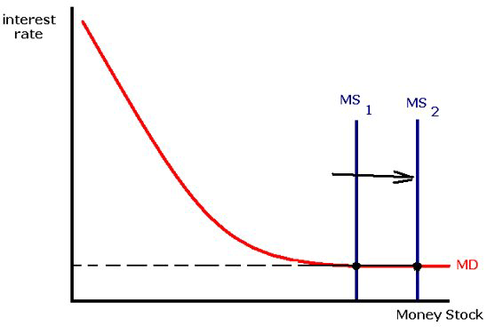

class: center,middle,mctitle-slide 


# Inflation and Deflation

## Manolis Chatzikonstantinou  

---

class: my-one-page-font

# What will you learn in this lecture?

--

-  Why is deflation a problem for economic policy makers?

--

-  Why can printing money lead to higher rates of inflation and hyperinflation?

--


-  How does the Phillips curve describe the short run trade off between inflation and unemployment?

--

-  Why does the trade off between inflation and unemployment cease in the long run?

--

-  Why can even moderate levels of inflation be hard to end?


---

class: my-one-page-font

# Inflation Targeting


.pull-left[
```{r  out.width = "100%",out.length = "100%", fig.align = 'center',echo=FALSE}
knitr::include_graphics("week14graphs/Itarget.png") 
```
]

.pull-right[
- Most Central banks use either a version of the Taylor rule or inflation targeting.
]

- Recently, many CBs moved to inflation targeting
- The central bank sets an explicit target for the inflation rate.


---

class: my-one-page-font


# Hyperinflation

- Very high rates of inflation—in excess of 100 percent per year— are known as hyperinflation.

--

-  For example, when governments want to spend much more than they raise through taxes;
  - so they force their central bank to “buy” government bonds.
  -  Hyperinflation occurred in Zimbabwe during the 2000s, 
    - prices increased by (on average) 7500 percent per year.
    - Hyperinflation tends to be associated with slow growth, if not severe recession.

--

- __What caused 500 billion percent inflation in Zimbabwe(2008) and Germany (1922-1923)?__
  - High inflation is always associated with rapid increases in the money supply.
  - Hyperinflation tends to be a small emerging countries problem.
  
-  But high levels of inflation, but not hyperinflation, used to be prevalent also across developed economies in the 1970s and 1980s.
    - High inflation is not necessarily be associated with slow growth.
---

class: my-one-page-font

# Deflation

- In crises, we often face a drop in the price level, e.g. during the Great Depression.
- In the 1990s, deflation reappeared in Japan and proved difficult to reverse.
- __Debt deflation__ in Europe, low loan rate by banks, low spending, reduction in AD.
  - lenders gain, and borrowers lose.
  - Deflation reduces aggregate demand, deepening an economic slump. 
  
- With expected deflation, nominal interest rates fall.
  - There is a zero bound on the nominal interest rate: it cannot go below zero.
  - __Liquidity trap:__ the inability to use monetary policy because nominal interest rates are too low 
  - [ZLB in the Pandemic](https://som.yale.edu/blog/conventional-monetary-policy-and-the-zero-lower-bound)

---

class: my-one-page-font

# Liquidity Trap


```{r  out.width = "60%",out.length = "100%", fig.align = 'center',echo=FALSE}
 
```

- Interest rates are unaffected by the monetary authority! 
  - Can not generate higher output in the short run!
  - [Monetary policy in April 2020](https://som.yale.edu/blog/conventional-monetary-policy-and-the-zero-lower-bound)

---

# Japan's lost decades

```{r  out.width = "80%",out.length = "100%", fig.align = 'center',echo=FALSE}
knitr::include_graphics("week15graphs/japan.png") 
```


- After the 1980s housing and property boom went bust, Japan fell into persistent deflation.

---

class: my-one-page-font

# The classical model of the price level


.pull-left[
```{r  out.width = "100%",out.length = "100%", fig.align = 'center',echo=FALSE}
knitr::include_graphics("week15graphs/longruntheory.png") 
```
]

.pull-right[
- If money supply increases, AD increases and the economy moves to E2.
  - Higher prices drive nominal wages up, and the SRAS shifts to the left.

- The percentage increase in the price level from P1 to P3 equals the percentage increase in the money supply.
- Changes in money supply have no effect on real GDP–money is neutral.  

]

--

- The classical model assumes the economy moves directly from E1 to E3.

???
This is a poor assumption when inflation is low because wages are sticky. But it’s good assumption when inflation is high because the stickiness of wages vanish. Result: In countries with high inflation, changes in money supply are quickly translated into changes in inflation.

---

class: my-one-page-font

#  The quantity theory of money

- Beginning in the sixteenth century, Spain sent gold and silver from Mexico and Peru back to Europe. 
  - These metals were minted into coins, increasing the money supply.
  - Prices in Europe rose steadily during those years.

- This helped people to make the connection between the amount of money in circulation, and the price level.

--

- In the early twentieth century, Irving Fisher formalized the relationship between money and prices as the quantity equation:

$$M \times V=P \times Y$$

- $M:\text {  Money supply}$, $P:\text {  Price level}$, 
- $Y:\text {  Real output}$, $V:\text { Velocity of money.}$

???
the average number of times each dollar  in the money supply is used to purchase goods and services included in GDP.}}$

---

class: my-one-page-font

# Calculating the velocity of money

Measuring:

- The money supply ( $M$ ) with M1+M2

- The price level ( $P$ ) with the GDP deflator, and

- The level of real output ( $Y$ ) with real GDP.

--

We obtain the following value for velocity:

$$
V=\frac{P \times Y}{M}
$$

$$
V=\frac{1.09 \times \$ 16.0 \text { trillion }}{2.8 \text { trillion }}=6.2
$$

- We can always calculate $V$. But will we always get the same answer? 


---

class: my-one-page-font

# The quantity theory of money and inflation

- The quantity theory of money asserts that, subject to measurement error, we will!

$$M \times V=P \times Y$$
--

$$\ln M + \ln V= \ln P + \ln Y$$

--

Expressing the equation of exchange in growth rates:
$$
\% \Delta M +\% \Delta V= \% \Delta P+ \% \Delta Y
$$

--

- In the long run, velocity does not change, so
$$
\% \Delta P = \% \Delta M - \% \Delta Y
$$
Inflation rate = Growth Rate of Money Supply − Growth Rate of Real GDP

---

class: my-one-page-font

# Evidence from Venezuela

```{r  out.width = "100%",out.length = "100%", fig.align = 'center',echo=FALSE}
knitr::include_graphics("week15graphs/venezuela.png") 
```

---

class: my-one-page-font

# The inflation tax


- What is to prevent a government from paying for its expenses by printing money? 

--


- The Treasury issues debt, and the Fed monetizes it by buying it back from the public through open-market purchases of Treasury bills. 
- The U.S. government can and does raise revenue by printing money.

--

__Seignorage:__ the revenue generated by a government’s right to print money.
  - By printing money, a government increases the money supply, which triggers inflation. 
  - Inflation erodes the purchasing power of money.
  - __The inflation tax:__ the reduction in the real value of money held by the public caused by inflation

---

class: my-one-page-font

# Seignorage

$$\text{Seignorage} = ΔM$$


$$\text{Real seignorage} = ΔM/P$$
$$\text{Real seignorage}  = (ΔM/M) × (M/P) $$

- In the face of high inflation the public reduces the real amount of money it holds, 
  - so M/P gets smaller. 
- The government responds by accelerating the rate of growth of the money supply, 
  - ∆M/M increasing inflation. 
- This leads to a self-reinforcing process can easily spiral out of control.

???
Real seignorage = rate of growth of the money supply × real money supply.
