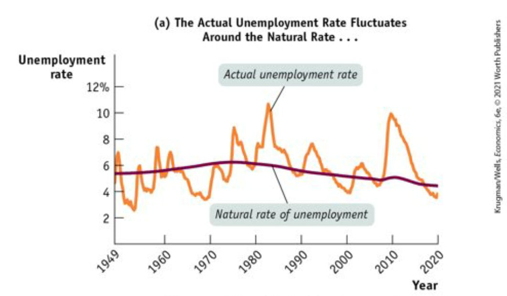
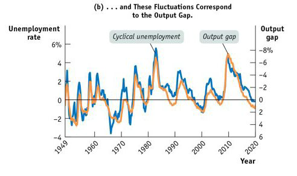
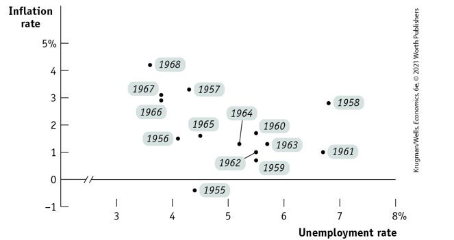
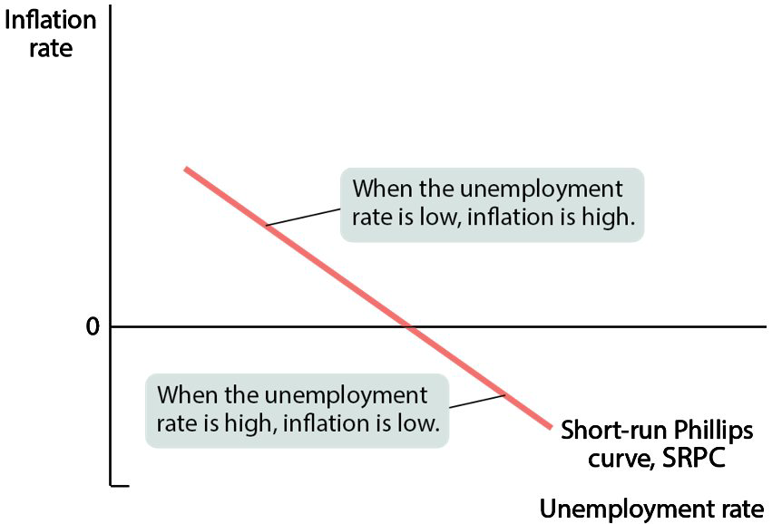
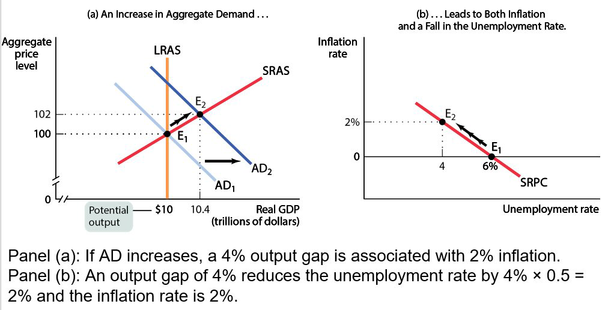
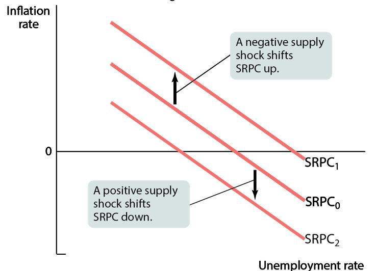
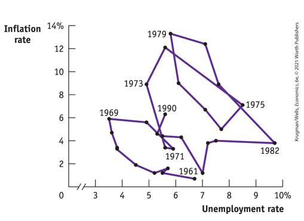
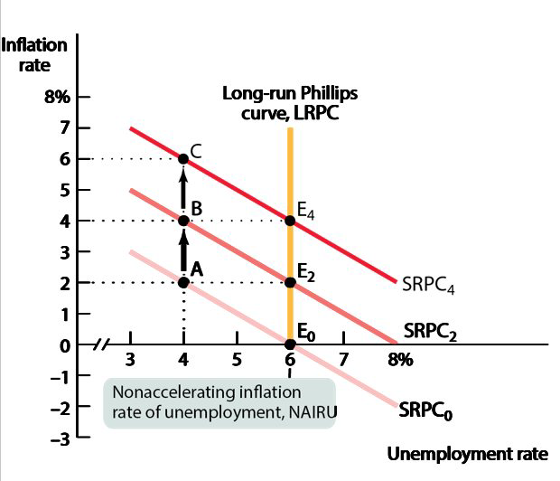
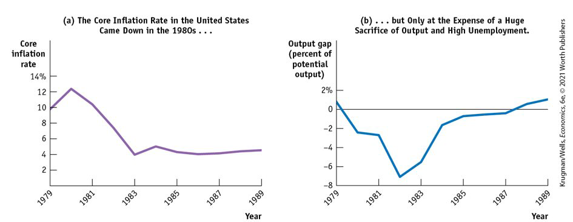

class: center,middle,mctitle-slide 


# Inflation and the cost of Disinflation

## Manolis Chatzikonstantinou  

---

class: my-one-page-font

# What will you learn in this lecture?

--

-  Why is deflation a problem for economic policy makers?

--

-  Why can printing money lead to higher rates of inflation and hyperinflation?

--


-  How does the Phillips curve describe the short run trade off between inflation and unemployment?

--

-  Why does the trade off between inflation and unemployment cease in the long run?

--

-  Why can even moderate levels of inflation be hard to end?


---

class: my-one-page-font

# Review: The output gap and the unemployment rate

- The aggregate output fluctuates around potential output in the short run: 
  - When aggregate output falls short of potential output, a recessionary gap arises;
  - When aggregate output exceeds potential output, an inflationary gap arises.
- The output gap: the percentage difference between the actual level of real GDP and potential output.
  - When the output gap is positive (an inflationary gap), the unemployment rate is below the natural rate.
  - When the output gap is negative (a recessionary gap), the unemployment rate is above the natural rate.

- Fluctuations of aggregate output around the long-run potential output correspond to fluctuations of the unemployment around the natural rate.

---

class: my-one-page-font

# Cyclical unemployment and the output gap 

```{r  out.width = "70%",out.length = "100%", fig.align = 'center',echo=FALSE}
 
```


---

class: my-one-page-font

# Cyclical unemployment and the output gap 

```{r  out.width = "70%",out.length = "100%", fig.align = 'center',echo=FALSE}
 
```


---

class: my-one-page-font

# Okun's Law

- Cyclical unemployment seems to move less than the output gap.
  - In 1982, for example, the output gap reached −8%, but cyclical unemployment reached only 4%.

__Okun’s law:__ 
  - There is a predictable negative relationship between the output gap and unemployment. 
  - Modern studies: a rise in the output gap of 1% reduces unemployment by about 0.5%.
  
  
__Example:__ If the natural rate of unemployment is 5.2% and the economy is producing at 98% of potential output (the output gap is −2%), then Okun’s law predicts an unemployment rate of 

$$5.2\% − 0.5 × (−2\%) = 6.2\%.$$


---

class: my-one-page-font

# The Phillips Curve


```{r  out.width = "60%",out.length = "100%", fig.align = 'center',echo=FALSE}
 
```

- Phillips(1958), in Britain:
  - when unemployment was high, wages tended to fall 
  - when unemployment was low, wages tended to rise. 

- Short-run Phillips curve:  negative short-run relationship of unemployment and inflation
---

class: my-one-page-font

# The Phillips Curve


```{r  out.width = "70%",out.length = "80%", fig.align = 'center',echo=FALSE}
 
```

---

class: my-one-page-font

# The AD-AS model and the Phillips Curve

```{r  out.width = "80%",out.length = "100%", fig.align = 'center',echo=FALSE}
 
```

---

class: my-one-page-font

# What can shift the short-run Phillips Curve

- A negative/positive supply shock shifts SRPC up/down 
  - as the inflation rate increases/falls for every level of the unemployment rate.
- An increase in expected inflation shifts the short-run Phillips curve up. 

--

```{r  out.width = "50%",out.length = "100%", fig.align = 'center',echo=FALSE}
 
```


???
The expected inflation rate 
It’s the rate of inflation that employers and workers expect in the near future. 
The expected inflation rate is the most important factor, other than the unemployment rate, affecting inflation.


---

class: my-one-page-font

# Unemployment and inflation 1961-1990


```{r  out.width = "55%",out.length = "100%", fig.align = 'center',echo=FALSE}
 
```

--

- The Phillips curve seemed to hold in the 1950s and 1960s. 
- 1980s:Inflation came down,1990s: both low unemployment and low inflation.

???
Then it broke down as the United States experienced both high unemployment and high inflation. This was the result of negative supply shocks and years of higher- than-expected inflation. 

---

class: my-one-page-font

# The NAIRU and the Long Run Phillips curve

```{r  out.width = "60%",out.length = "100%", fig.align = 'center',echo=FALSE}
 
```

---

class: my-one-page-font

# The NAIRU and the Long Run Phillips curve

.pull-left[
```{r  out.width = "100%",out.length = "100%", fig.align = 'center',echo=FALSE}
knitr::include_graphics("week15graphs/lrphillips.png") 
```
]

.pull-right[


- Suppose the economy is at $E_O$ with a 6% unemployment rate.

- At point A, inflation is 2%, and people expect a 2% inflation rate, which will shift SRPC up. 

- At point B, inflation is 4%, and people expect a 4% inflation, which will shift SRPC up again. 

]

---

class: my-one-page-font

# Unemployment and inflation in the Long run


- Short-run Phillips curve: trade-off between unemployment and inflation. 
- In the SR, expectations diverge from reality, but in the long run, expectations adjust. 

.pull-left[
```{r  out.width = "100%",out.length = "100%", fig.align = 'center',echo=FALSE}
knitr::include_graphics("week15graphs/lrphillips.png") 
```
]

.pull-right[

  - What does the trade-off between inflation and unemployment look like in the long run?

  - __The long-run Phillips curve:__ the relationship between unemployment and inflation after expectations of inflation have had time to adjust to experience.
]
---


class: my-one-page-font

# Unemployment and inflation in the Long run


- An attempt to reduce unemployment leads to accelerating inflation.
- To avoid accelerating inflation over time,  the actual rate of inflation matches the expected rate of inflation. 
  - This means unemployment also needs to be higher
  - The natural rate hypothesis: the relationship between accelerating inflation and the unemployment rate
- The vertical line LRPC is the long-run Phillips curve, tells us that inflation expectations adjusted to experience. 
  - any unemployment rate below the NAIRU leads to ever-accelerating inflation. 
  - An unemployment rate below the NAIRU cannot be maintained in the long run.

---

class: my-one-page-font

# The great disinflation of the 1980S


```{r  out.width = "100%",out.length = "100%", fig.align = 'center',echo=FALSE}
 
```

--

- Disinflation is the process of bringing down inflation that is embedded in expectations.
  - Once inflation has become embedded in peoples’ expectations, reducing it can be difficult. Disinflation may require a recession.


