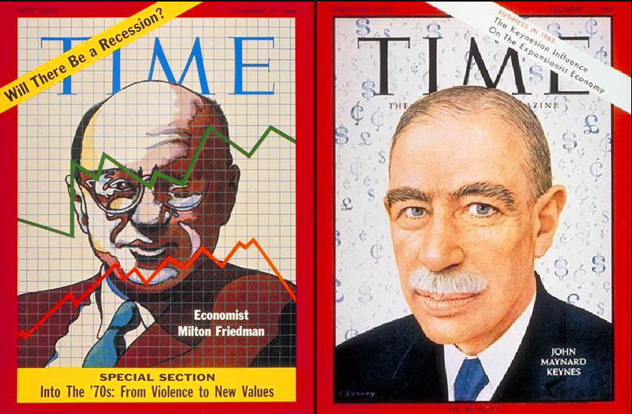
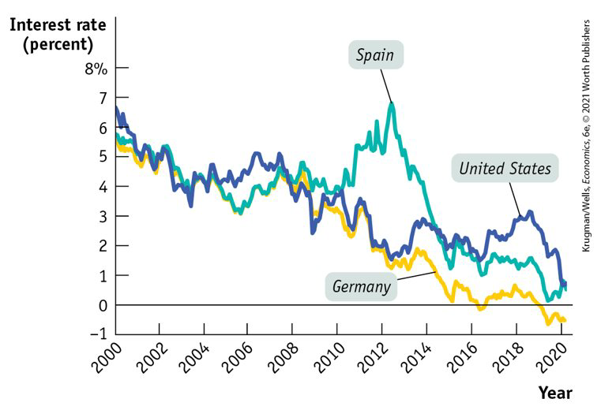
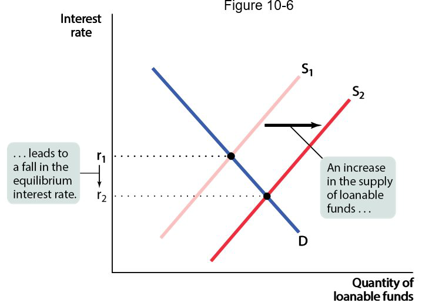

class: center,middle,mctitle-slide 


# Macroeconomics Review of Ideas

## Manolis Chatzikonstantinou  

---

class: my-one-page-font

# What will you learn in this lecture?


```{r  out.width = "70%",out.length = "100%", fig.align = 'center',echo=FALSE}
 
```
---

class: my-one-page-font


# True and False Questions
 
- Monetary neutrality occurs when changes in the money supply have no effect on real aggregate output, __TRUE, by definition__.

- The Quantity Theory of Money is always assuming money in neutral,  __FALSE, not necessarily__. The quantity theory of money describes only the relationship of inflation, gdp and money supply gorwth. 

- During periods of hyperinflation, economists believe that the long run equilibrium provides better prediction on the effect of money supply growth on output  and prices.  __TRUE, economists believe wages are flexible when there is hyperinflation and the SRAS is the same as the LRAS__.

---

class: my-one-page-font

# True and False Questions

- Unexpected deflation affects negatively lenders and positively borrowers. __FALSE, the opposite is true__.


---

class: my-one-page-font


# Very important  TF Question

- An increase in the money supply causes an increase in output in the short run and an increase in output in the long run.  __FALSE, in the long run, real variables are not affected__.

---

class: my-one-page-font


# Very important  TF Question

- An increase in the interest rate, without a change in the money supply curve, can happen due to    __shifts in the money demand curve__              

---

class: my-one-page-font

# True and False Questions

- The zero lower bound implies that monetary policy can not be used after a shock to the oil price, caused by the war in Ukraine, to deal with inflationary pressure.   __FALSE, the zero lower bound restricts only the implementation of contractionary monetary policy__.


---

# Policy in a low-interest rate world

```{r  out.width = "70%",out.length = "100%", fig.align = 'center',echo=FALSE}
 
```


---


class: my-one-page-font


# Why the zero lower bound is important?

-  __The Great Moderation:__ Recessions after 1990–1991 were mild, and the inflation rate stayed below 4%
  - During the Great Moderation, economists and policy makers believed that monetary policy was highly effective
--

- The crisis of 2008 undermined any sense that central banks had things under control
  - In 2008, however, cutting the federal funds rate all the way to zero wasn’t enough to prevent a severe recession
  — and recovery from that recession was disappointingly slow. 
  
- Great Recession showed that monetary policy wasn’t as successful
- Low interest rates also mean that the central banks don’t have enough room to __cut interest rates__. 
  - "we should strengthen the economy’s automatic fiscal stabilizers" 
  - This led to a revival of interest in expansionary fiscal policy, or fiscal stimulus.
  - But expansionary fiscal policy means higher budget deficits. __Shouldn’t this be a source of concern?__

---

class: my-one-page-font


# Policy in a low-interest rate world


- But Why are interest rates so low? 
  - Declining population growth and slow technological progress 
  - secular stagnation: "full employment is achieved when interest rate is close to zero."

- If zero interest rates is normal
  - We shouldn’t worry much about debt, and 
  - We should worry a lot about fiscal responses to downturns.

---

class: my-one-page-font


# Problem Set 10

The Fed between September 18, 2007,  and December 16, 2008, lowered the federal funds rate in a series of steps from a high of 5.25% to a  rate between zero and 0.25%. The idea was to provide a boost to the economy by increasing  aggregate demand.  Use the liquidity preference model to explain how the Federal Open Market Committee lowers the  Fed Funds rate in the short run:

In the short run;
  1. The FOMC will decide to do open market purchases,  buying gov.bonds off of comercial banks' balance sheets.
  2. More money will be available to banks as excess reserves. 
  3. The monetary base and the money supply increases.
  4. I move to a new point in the money demand curve, where
    - the quantity of money is larger
    - the interest rate is lower.


---

class: my-one-page-font


# Problem Set 10

 Draw a typical graph that illustrates the mechanism in the liquidity preference model.


```{r  out.width = "50%",out.length = "100%", fig.align = 'center',echo=FALSE}
knitr::include_graphics("msshift.png") 
```
 

---

class: my-one-page-font


# Problem Set 10 

Explain why the reduction in the Fed Funds rate causes a change in the interest rate in the market for loans. Draw a typical graph that illustrates the mechanism:

__The expansionary monetary policy will cause an increase in GDP in the new equilibrium-this also means an increase in savings__

```{r  out.width = "30%",out.length = "100%", fig.align = 'center',echo=FALSE}
 
```
 
---

class: my-one-page-font


# Problem Set 10 

Explain why the reduction in the interest rate causes aggregate demand to increase in the short run.

- The reduction of interest rates in the new short run equilibrium:
  1. Increases Quantity of loans - Investment
  2. Increases Consumption due to the multiplier effect 
  3. Increases aggregate demand - shifts the AD to the left.

---

class: my-one-page-font


# Problem Set 10-Q3


The  economy is in long-run macroeconomic equilibrium at point E1 when an oil shock shifts the short-run aggregate supply curve.How do the aggregate price level and aggregate output change in the short run as a result of the oil shock? Draw a typical graph of the macroeconomic equilibrium:

- The aggregate price level increases and the actual output ( real GDP falls.)


```{r  out.width = "50%",out.length = "100%", fig.align = 'center',echo=FALSE}
knitr::include_graphics("srasshift.png") 
```


---

class: my-one-page-font


# Problem Set 10-Q3

 Assume that the level of Real GDP before the shock is at 80 but after the shock the shock, the output gap is -10 % ? What is the new level of Real GDP? What is the new level of unemployment if the natural rate of unemployment is 5% and the Okun’s law holds in this particular case?
 
 
---

class: my-one-page-font


# Review

 
Before I answer this question, it is important to remember: 

$$
\text{Output Gap} = \frac{\text{Actual Output}-\text{Potential Output}}{\text{Potential Output}} \times 100
$$

- The level of unemployment when the output gap is zero is called natural rate of unemployment or NAIRU.

$$
\text{ Unemployment rate }=  \text{ Natural rate of Unemployment  }+  \text{ Cyclical rate of Unemployment  }
$$

- Okun's law helps me calculate (approximately) the cyclical rate: if the output gap is $X$, then the cyclical rate of unemployment is $X/2$.


---

class: my-one-page-font


# Problem Set 10-Q3

 Assume that the level of Real GDP before the shock is at 80 but after the shock the shock, the output gap is -10 % ? What is the new level of Real GDP? What is the new level of unemployment if the natural rate of unemployment is 5% and the Okun’s law holds in this particular case?
 
Now we can answer this question:

- In the original equilibrium E1, the output gap is zero, so $80 =RGDP=\text{Potential Output}$

- This means that the new Real GDP is $90\%$ the Potential output since the output gap is $-10\%$, so real GDP is 72.


---

class: my-one-page-font


# Problem Set 10-Q3

- In the original equilibrium E1, the output gap is zero, so cyclical unemployment is zero, and
$$
\text{ Unemployment rate }=  \text{ Natural rate  }+  \text{ Cyclical rate of Unemployment  }
$$
$$
\text{ Unemployment rate }=5\%
$$
- In the original equilibrium E2, the output gap is $-10\%$, so cyclical unemployment is $5\%$, and
$$
\text{ Unemployment rate }=  \text{ Natural rate   }+  \text{ Cyclical rate of Unemployment  }
$$
$$
\text{ Unemployment rate }=5\%+5\%=10\%.
$$

---

class: my-one-page-font


# Problem Set 10-Q3

Assume that P1 is equal to 100, and the new equilibrium level of prices after the shock is equal to 120. What is the level of inflation rate?

Again, just a quick reminder:


$$
\text{Inflation Rate} = \frac{P_2-P_1}{P_1} \times 100, why?
$$

well, because $P$ is usually either the CPI or GDP deflator, what we use to calculate inflation. Then 
$$
\text{Inflation Rate} = \frac{P_2-P_1}{P_1} \times 100=\frac{20}{100}\times 100=20\%
$$

---

class: my-one-page-font


# Problem Set 10-Q3

What monetary policies can the government use to address the effects of the supply shock? Use a diagram that shows the effect of policies chosen to address the change in real GDP. 

First we need to understand what is the macroeconomic situation: 
  1. $20\%$ inflation
  2. $-10\%$ output gap or recessionary gap.
  
To deal with this sitation we need:
  1. Contractionary policy to deal with inflation
  2. Expansionary policy to deal with recession-real GDP.

---

class: my-one-page-font


# Problem Set 10-Q3

Use a diagram that shows the effect of policies chosen to address the change in real GDP.


To deal with this sitation we need:
  1. Expansionary policy to deal with recession


---

class: my-one-page-font


# Problem Set 10-Q3

Use another diagram to show the effect of policies chosen to address the change in the aggregate price level.


To deal with this sitation we need:
  1. Contractionary policy to deal with inflation


---

class: my-one-page-font


# Problem Set 10-Q3

Assuming that equal decreases in unemployment caused by demand shocks, lead to equal increases in inflation. How much more inflation would there be to reach the old level of unemployment?

If equal  decreases in unemployment caused by demand shocks, lead to equal increases in inflation, or in other words the Phillips curve has a very special form where:

$$ \text{Cyclical Unemployment} = \text{-Inflation Rate}$$
Then to reach the old level of unemployment, which is the natural rate $5\%$, I need an increase in inflation rate by $5\%$. If the tradeoff is even worse,e.g. 


$$ \text{Cyclical Unemployment} = \text{-0.25 Inflation Rate}$$

Then to reduce inflation by $5\%$, inflation has to go up by $20\%$ . This is the tradeoff faced by the monetary authority.
---

class: my-one-page-font


# Problem Set 10-Q3

Why would you prefer to have a SRAS that is horizontal? What type of policy would you choose then?

If there is a horizontal curve, I can not affect the price level with demand shock, as shown below. This means, I do not face a dilemma, since I can only deal with real GDP and as a result I pick an expansioraty monetary policy.


---

class: my-one-page-font


# Not Very important  TF Question

- The independence of the central bank can help reduce the inflation rate caused by political temptation __TRUE, independence means the decisions are made independent of fiscal policy, if political temptation leads to expansionary fiscal policy (eg before election years), the monetary authority, if it is not affected by fiscal policy, will implement a contractionary monetary policy__.

- The fact that in the long run, money is neutral means monetary policy can not stabilize the economy __FALSE,  stabilization policies are dealing with short run fluctuation (Keynes: "In the long run, we are all dead". Only if the SRAS was identical to LRAS would imply that monetary policy can not stabilize the economy__.
  - Not very important for final, but can help you understand the difference among economic schools of thought. __Chapter 17:not covered__


---

