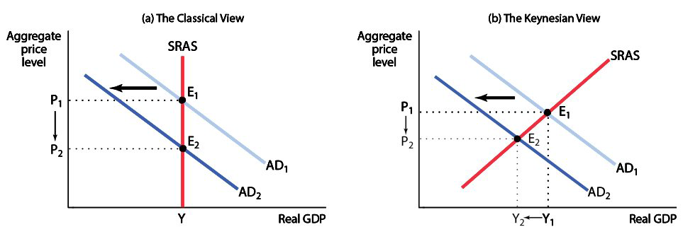
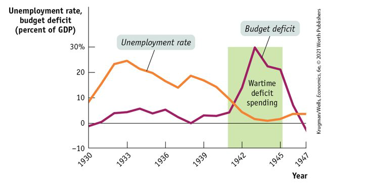
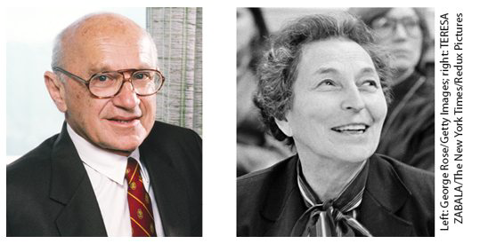
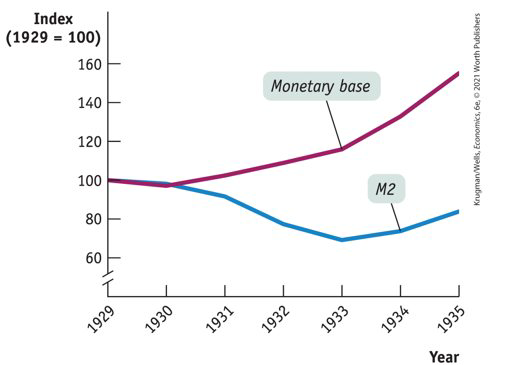

class: center,middle,mctitle-slide 


# Macroeconomics: Events and Ideas

## Manolis Chatzikonstantinou  

---


# What will you learn in this lecture?

-  Why was classical macroeconomics inadequate for the problems posed by the Great Depression?

--

- How did John Maynard Keynes and the experience of the Great Depression legitimize macroeconomic policy activism?

--

- Why did the original focus of Keynesian economics on fiscal policy give way to emphasis on monetary policy?

--

- Why did economists come temporarily to have great faith in the power of independent central banks to stabilize the economy?

--

- How have events since 2008 undermined that faith and also changed views on deficits and debt?

---

# Classical and Keynesian Macroeconomics 

The main ideas of classical macroeconomics:
The short run is unimportant.
Prices are assumed to be flexible. 
The aggregate supply curve is vertical even in the short run.
Any increase in money supply leads to inflation and no effect on aggregate output.

--

The Great Depression showed that economists cannot ignore the short run.
During the Great Depression, there was no theory of the business cycle, and economists were giving conflicting and often harmful advice:
Some argued that the government must take over and replace markets with a command economy. 
Others argued that slumps were natural—even beneficial—and that nothing should be done.
And some argued that slumps should be cured. The most compelling advocate for this view was John Maynard Keynes.

---

# Keynes’s theory

Keynes’s The General Theory of Employment, Interest, and Money (1936) is one of the most influential books on economics ever written.
Keynes shifted the economists’ focus from the unreachable long run to the short run, in which people actually live.

--

Keynes’s two main innovations:
Keynes emphasized the importance of the short run effects of a change in aggregate demand on aggregate output.
Keynes argued that changes in “animal spirits”—business confidence—cause the business cycle.

--

Do not to confuse Keynes with socialism.
Keynes himself was no socialist and not much of a leftist.
When The General Theory was published, many intellectuals believed the capitalist system was dying and socialism was the only solution. 
In contrast, Keynes argued that socialism was not the answer and all the capitalist system needed was a narrow technical fix.
In that sense, his ideas were procapitalist and politically conservative.

---

# Classical and Keynesian Macroeconomics 

```{r  out.width = "100%",out.length = "100%", fig.align = 'center',echo=FALSE}
 
```


---

# Policy to fight recessions

Keynes’s work legitimized macroeconomic policy activism—the use of monetary and fiscal policy to smooth out the business cycle.
Before Keynes, macroeconomic policy activism was often half-hearted and insufficient. 
When the administration of Franklin Roosevelt engaged in modest deficit spending, the economy improved. 
When, in 1937, Roosevelt balanced the federal budget and raised interest rates, the result was a renewed slump.

--

What economists learned from Keynes was that economic recovery requires aggressive fiscal expansion. 
When wartime deficit spending lifted the economy out of the Great Depression, the debate over Keynes’s views finally ended.

--

```{r  out.width = "100%",out.length = "100%", fig.align = 'center',echo=FALSE}
 
```


---

# Challenges to Keynesian Economics

Keynes’s ideas did not go unchallenged. 
Keynes believed that monetary policy is ineffective during recessions, especially if it’s in the liquidity trap when the interest rate cannot be pushed any lower.
When the era of near-zero interest rates came to an end after World War II, economists reassessed the importance of monetary policy. 

--

In 1963, Milton Friedman and Anna Schwartz published A Monetary History of the United States, 1867–1960.


```{r  out.width = "100%",out.length = "100%", fig.align = 'center',echo=FALSE}
 
```


--

They argued that business cycles were historically associated with fluctuations in the money supply.
The Great Depression could have been avoided if the Fed had acted to increase the monetary base.

---

# Monetarism

A provocative idea emerged:
Monetary policy should play a key role in economic management.
Economic management could be taken out of the hands of politicians. 
Macroeconomics can become more technical and less political.

--

Milton Friedman led a movement to eliminate all forms of macroeconomic policy activism—fiscal and monetary.
Monetarists asserted that:
Activist macroeconomic policy (fiscal or monetary) can only make things worse.
GDP would grow steadily if the money supply grows steadily.
The best way to manage the economy is with nonactivist monetary policy.

--

Like Keynes, Friedman asserted
That the short run was important
That short-run changes in aggregate demand affected aggregate output as well as aggregate prices
That macroeconomic policy should have been more expansionary during the Great Depression
Unlike Keynes, Friedman argued
That any activist policy, fiscal or monetary, made things worse
That time lags limit discretionary fiscal policy and discretionary monetary policy
That an autopilot approach is the best
A monetary policy rule is a formula that determines the central bank’s actions.

---

# Limits to Macroeconomic Policy

Another criticism of Keynesian economics: 
Keynesians believed that governments could use expansionary fiscal policy to achieve full employment on a permanent basis. 
Friedman and Phelps’s natural rate hypothesis: any attempt to keep unemployment below a minimum level would lead to ever-rising inflation.
The 1970s proved this hypothesis right, one of the triumphs of macroeconomic analysis. 
If governments can’t keep unemployment below the natural rate, they should just try to keep it stable around the natural rate. 

--
In the same time -> computers change macroeconomics!
In the 1970s and 1980s, the classical view evolved into new classical macroeconomics:
Rational expectations
Real business cycle theory

---

# Rational expectations and new Classical Economics

Rational expectations: individuals and firms make decisions optimally, using all available information

The original hypothesis: a government attempt to push unemployment below the natural rate would work in the short run but will eventually fail.
Rational expectations: a government attempt to push unemployment down will immediately fail.
When workers and employers bargain over wage contracts, they use all available information to account for future inflation.
Robert Lucas: monetary policy can change output and unemployment only if it comes as a surprise to the public.

--

Real business cycle theory: business cycles are caused by fluctuations in the rate of growth of productivity, not by demand shocks.
Economic data indicate that demand shocks do play a role in business cycle.

--

New Keynesian economics became influential in the 1990s. 
It argues that market imperfections make many prices in the economy temporarily sticky. And with sticky prices, expected inflation can’t rise quickly enough to offset activist macroeconomic policy.

---

# The political Business Cycle

The final challenge to Keynes:
Macroeconomic policy activism lends itself to political manipulation. 
An obvious temptation for politicians: Pump up the economy in an election year and pay the price in higher inflation and/or higher unemployment later. 
A political business cycle: political use of macroeconomic policy to serve political ends
Richard Nixon’s expansionary fiscal and monetary policy led to rapid growth just before the 1972 election and a sharp acceleration in inflation after the election. 
Kenneth Rogoff proclaimed Nixon “the all-time hero of political business cycles.”

--

MOre here

---

# Supply-side Economics

In the 1970s, a group of economic writers proposed supply-side economics. 
They urged the government to cut taxes arguing that tax cuts would boost incentives to work and increase potential output. 
In 1980, Ronald Reagan made supply-side economics the basis of his presidential campaign.

--

There is no evidence that would support supply-side economics. 
Although tax cuts boost incentives to work and invest, the current U.S. tax rates aren’t high enough.
According to the Congressional Budget Office, potential output didn’t increase after the Reagan tax cuts, and it didn’t fall after the Clinton tax hikes of 1993.
In 2012, Kansas passed large cuts in state taxes. Yet its economy tanked, falling far below the national average. 

---

# Did the FED cause the Great Depression?

.pull-left[
```{r  out.width = "100%",out.length = "100%", fig.align = 'center',echo=FALSE}
 
```
]


.pull-right[
Milton Friedman claimed that the Fed caused the Great Depression.
He argued that the money supply, as measured by M2, fell sharply from 1929 to 1933 as the economy plunged. 
]

--

But the Fed doesn’t control money supply–it controls monetary base (currency + bank reserves), and the monetary base rose sharply.
M2 fell because bank runs destroyed confidence in banks’ safety: people withdrew their deposits and banks cut back on lending. 
It’s doubtful if the Fed could have prevented the Great Depression, and it certainly didn’t cause it.

---

# FROM GREAT MODERATION TO SECULAR STAGNATION

After the stormy 1970s, things settled down: the recession of 1990–1991 was mild, and the inflation rate stayed below 4%. 

--

The Great Moderation is the period from 1985 to 2007 when the U.S. economy experienced relatively small fluctuations and low inflation. It led to widespread belief that monetary policy could stabilize the economy.
During the Great Moderation, economists and policy makers believed that monetary policy was highly effective and that the Fed could keep the economy stable. 

--

The crisis of 2008 undermined any sense that central banks had things under control and brought economists back to a more traditional Keynesian view.
In 2008, however, cutting the federal funds rate all the way to zero wasn’t enough to prevent a severe recession—and recovery from that recession was disappointingly slow. 
Conventional monetary policy didn’t seem to work, and even unconventional monetary policy seemed to fall short. 

---

# The revival of fiscal policy

Events after 2008 showed that monetary policy wasn’t as reliable as many had believed. 
This led to a revival of interest in fiscal policy, especially expansionary fiscal policy, or fiscal stimulus.
In 2010–2013, a few countries conducted austerity policies—attempts to reduce their budget deficits by cutting spending and raising taxes.
Data shows that the deeper the budget cuts, the worse the economic performance. 
Each dollar of budget cuts reduced GDP by around $1.50. 
Expansionary fiscal policy means higher budget deficits. Shouldn’t this be a source of concern?

---

# Policy in a low-interest rate world

.pull-left[
```{r  out.width = "100%",out.length = "100%", fig.align = 'center',echo=FALSE}
knitr::include_graphics("week16graphs/lowinterest.png") 
```
]

.pull-right[
During the 2008 financial crisis, the Fed cut interest rates all the way to zero. The Fed kept rates close to zero for many years, then raised them only slightly, and began cutting again in 2019.
The persistence of low interest rates wasn’t just a U.S. phenomenon. 
]

--

Low interest rates also mean that the central banks don’t have enough room to cut. 
It means that we should strengthen the economy’s automatic stabilizers, the tax and spending responses that help fight recessions even without new legislation. 

---

# Policy in a low-interest rate world

Why are interest rates so low? 
Declining population growth and slow technological progress had put the world’s major economies on the edge of secular stagnation, a state in which the interest rate that is needed to achieve full employment is consistently close to zero.
If low interest rates are the new normal, 
We shouldn’t worry much about debt, and 
We should worry a lot about fiscal responses to downturns.

Old view: Higher debt leads to high interest payments, which lead to higher deficits, which increase debt, leading to higher interest payments…
New view: What matters is not the debt but the debt to GDP ratio. Since interest rates are below the economy’s growth rate, the ratio tends to shrink over time.


---

# Useful links

Here DEBT TO GDP over pandemic!!
```{r  out.width = "100%",out.length = "100%", fig.align = 'center',echo=FALSE}
knitr::include_graphics("week12graphs/implicit.png") 
```


- Visit this site for current debt and deficit figures:
	https://www.cbo.gov/topics/budget
