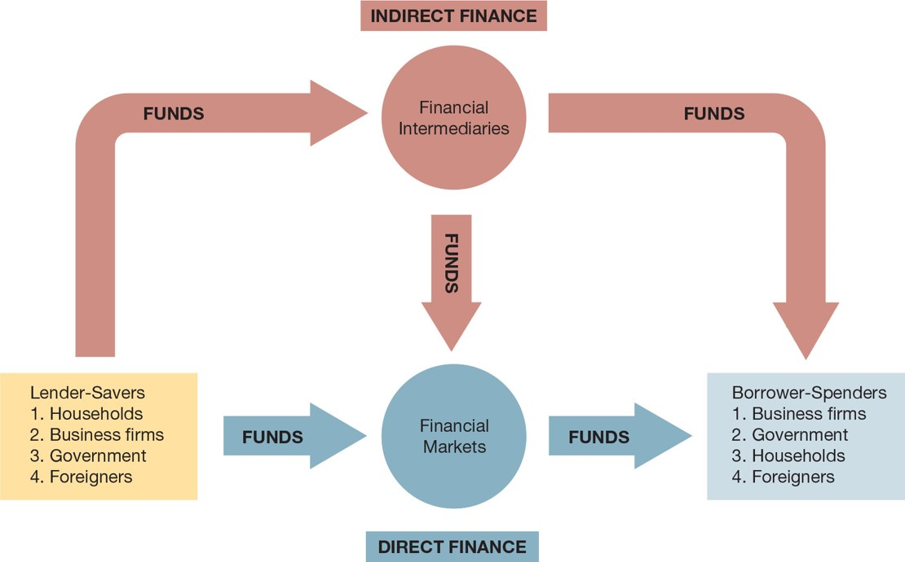
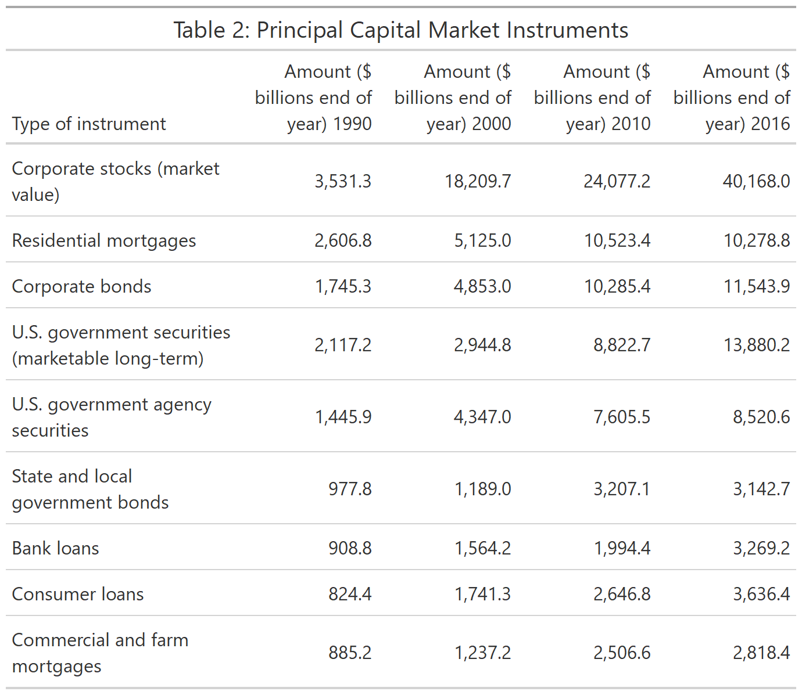

class: center,middle,mctitle-slide 


# An Overview of the Financial System

## Manolis Chatzikonstantinou  

---

class: my-one-page-font

# What will you learn in the next two lectures?

This lecture is an overview of financial markets:

  1. Compare and contrast direct and indirect finance.
  2. Identify the structure and components of financial markets.
  3. List and describe the different types of financial market instruments.
  4. Recognize the international dimensions of financial markets.
  5. Summarize the roles of transaction costs, risk sharing, and information costs as they relate to financial intermediaries.
  6. List and describe the different types of financial intermediaries.
  7. Identify the reasons for and list the types of financial market regulations.


???
To study the effects of financial markets and financial intermediaries on the economy, we need to acquire an understanding of their general structure and operation.

---

class: my-one-page-font

# Function of Financial Markets 

- channeling funds from agents that have excess funds (savings) to those that have a shortage of funds


```{r  out.width = "50%",echo=FALSE,fig.align='center',fig.cap='Flow of Funds'}
 
```


---

class: my-one-page-font

# Direct Finance

- __Direct finance:__ borrowers borrow funds directly from lenders in financial markets by selling them securities

--

- Promotes economic efficiency by producing an efficient allocation of capital, which increases production

- Directly improve the well-being of consumers by allowing them to time purchases better

--

- Debt and Equity Markets
    - Debt instruments ( __maturity__ )
    - Equities ( __dividends__ )

---

class: my-one-page-font

# Structure of Financial Markets 

- Primary and Secondary Markets
    -   __Investment banks underwrite__ securities in __primary markets.__
    - __Brokers and dealers__ work in __secondary markets.__
    
--

- Exchanges and Over-the-Counter (O T C) Markets:
    - __Exchanges__: N Y S E, Chicago Board of Trade
    - __OTC markets__: Foreign exchange, Federal funds

--

- Money and Capital Markets:
    - __Money markets__ deal in short-term debt instruments
    - __Capital markets__ deal in longer-term debt and equity instruments

---

class: my-one-page-font

# Financial Market Instruments: Money Market

| Type of Instrument | Amount (USD billions, end of year) 1990 | Amount ( USD billions, end of year) 2000 |  Amount (USD billions, end of year) 2010 | Amount (USD billions, end of year) 2016 |
| :--- | :---: | :---: |  :---: | :---: |
| U.S. Treasury bills | 527 | 647 |1767 | 1816 |
| Negotiable bank certificates of deposit (large denominations) | 547 | 1053 |1923 | 1727 |
| Commercial paper | 558 | 1602 | 1058 | 885 |
| Federal funds and security repurchase agreements | 372 | 1197 | 3598 | 3778 |


Source: __Federal Reserve Flow of Funds Accounts__

---

class: my-one-page-font

# Financial Market Instruments: Capital Market


```{r include=TRUE, fig.align="center", echo=FALSE, out.height="45%",out.width = "45%"}

```

Source: __Federal Reserve Flow of Funds Accounts__


---

class: my-one-page-font

# Indirect Finance

- The Function of Financial Intermediaries: 
  - Lower transaction costs 
  - Economies of scale
  
--

  - Liquidity services
  - Reduce the exposure of investors to risk
    - Risk sharing (asset transformation)
    - Diversification


---

class: my-one-page-font

# Indirect Finance


- Deal with asymmetric information problems:
  - __Adverse Selection__ (before the transaction): 
    - do not selecting the risky borrower,how?
    - banks gather information about them
    
--
  
  - __Moral Hazard__ (after the transaction): 
    - ensure borrower will repay the loan, how?  
      - Sign a contract with restrictive covenants,collateral ...
      
--
      
  -  economies of scope;
    - one information resource to many different services, 
  
--
    
__Provide access to financing for “small” savers and borrowers__

---

class: my-one-page-font

# Types of Financial Intermediaries


| Classification| Example of Intermediary | Primary Liabilities| Primary Assets |
| :--- | :--- | :--- | :--- |
| Depository | Commercial banks | Deposits | Loans, mortgages, Federal and municipal bonds |
| Contractual savings institutions| Pension Funds| Contributions | Stocks, Bonds |
| Investment intermediaries| Mutual Funds| Shares | Stocks, Bonds |
---

# Evolution of Financial Intermediaries

| Type of Intermediary | Value of Assets ( billions, end of year) 1990 | Value of Assets ( billions, end of year) 2000 | Value of Assets ( billions, end of year) 2010 | Value of Assets ( billions, end of year) 2016 |
| :--- | :---: | :---: | :---: | :---: |
| Commercial banks, s & l, and mutual savings banks | 4,744 | 7,687 | 12,821 | 16,834 |
| Credit unions | 217 | 441 | 876 | 1,238 |
| Life insurance companies | 1,367 | 3,136 | 5,168 | 6,764 |
| Fire and casualty insurance companies | 533 | 866 | 1,361 | 1,908 |
| Pension funds (private) | 1,619 | 4,423 | 6,614 | 9,099 |
| State retirement funds | 820 | 2,290 | 4,779 | 6,103 |
| Finance companies | 612 | 1,140 | 1,589 | 1,385 |
| Mutual funds | 608 | 4,435 | 7,873 | 13,616 |
| Money market mutual funds | 493 | 1,812 | 2,755 | 2,728 |

---

# Regulation of the Financial System

- To increase the information available to investors:
  - Reduce adverse selection and moral hazard problems
  - Reduce insider trading (SEC)

--

- To ensure the soundness of financial intermediaries:
  - Restrictions on entry (chartering process).
  - Disclosure of information.
  - Restrictions on assets and activities (control holding of risky assets).
  - Deposit Insurance (avoid bank runs).

--

- Limits on competition (mostly in the past):
  - Branching
  - Restrictions on interest rates


