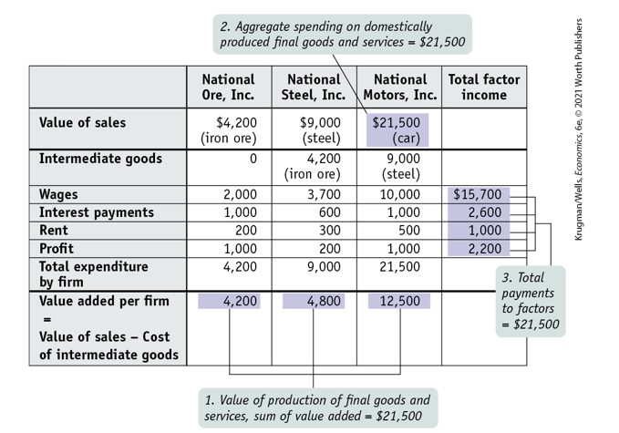
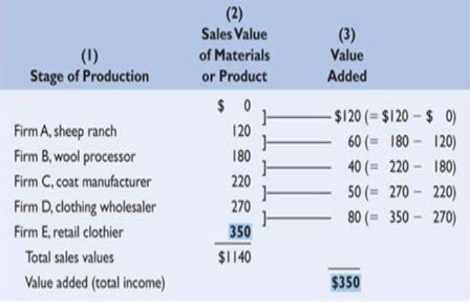
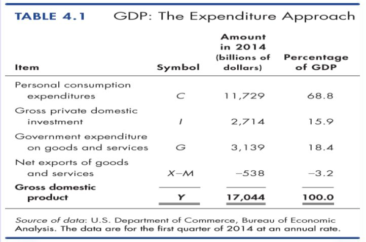
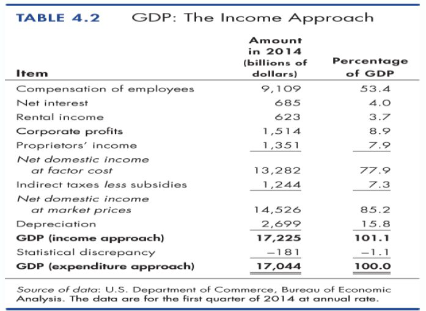
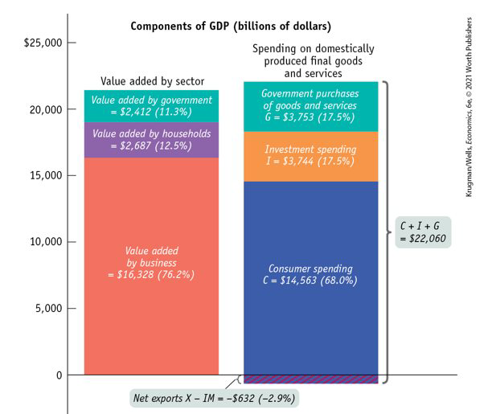

class: center,middle,mctitle-slide 


# GDP and the CPI: Tracking the Macroeconomy I

## Manolis Chatzikonstantinou  

---


# What will you learn in the next two lectures?

- __How do economists use aggregate measures to track the performance of the economy?__

  - There is a set of common rules used by economists called National Accounts
  
  - Aggregate Performance =  Sum of performance of different sectors in the economy!

--

- __What is gross domestic product (GDP), and how is it calculated?__

  - Sum of value of all goods and services produced in the economy
  
  - Aggregate Output = Aggregate Expenditure = Aggregate Income

--

- _What is the difference between real and nominal GDP, and why is real GDP the appropriate measure of economic activity?_

 - Prices of goods and services are different when we study the same economy in different time periods,
  
  - Real GDP adjusts for the different Price Level

--

- _What is a price index, and how is it used to calculate the inflation rate?_

 - Measures cost of the "same basket of goods" in different years. 

???
All heard of GDP,. but do we include the following in the measurent?
---

# The National Accounts

- The formal way we measure key aspects of an economy, and how can we compare economies.

--

- We use the national income and product accounts, often referred to as the national accounts. 

--

- The national accounts keep track of spending of consumers, sales of producers, business investment spending, government purchases, and other flows of money between different sectors of the economy. 

--

.center2[
```{r  out.width = "40%", fig.align = 'center' ,echo=FALSE}
knitr::include_graphics("week2graphs/circflow.png") 
```
]

???
Figure 7(22)-1 of the text, An Expanded Circular-Flow Diagram: The Flows of Money Through
the Economy, demonstrates the manner in which money flows from producers to households,
governments, and the rest of the world, and vice versa. break up the elements in the diagram and describe them individually!


---

# The National Accounts

- Consumer spending is household spending on goods and services.

--

- Government purchases of goods and services are total expenditures on goods and services by federal, state, and local governments.

--

- Investment spending is spending on productive physical capital (such as machinery and construction of buildings) and on changes to inventories.

--

- Goods and services sold to other countries are exports. Goods and services purchased from other countries are imports.

--

- If we add up consumer spending, investment spending, government purchases, exports and subtract imports, we will get the market value of the goods and services the economy produces—the country’s gross domestic product.


---

# Gross Domestic Product


> GDP  is the market value of all final goods and services produced in a
country in a given time period.

--

This definition has four parts:

--

  1.Market value

--

  2.Final goods and services

--

  3.Produced within a country

--

  4.In a given time period

--


__In or Out?__

- Financial transactions and income transfers( e.g. stimulus checks)

--

- Net additions to inventory

--


- __Digression: Stocks and Flows__ 

- A stock is a position at a moment of time, for example,
the stock of inventories in the economy at year end 2021

- A flow is the rate of change in a stock, for example, the
change in the stock of inventories in the economy in 2021


???
Value - we can't add apples and oranges (literally!) to find a meaningful number. Think of adding one car to one pair of socks and getting " 2 "- -it doesn't make sense. So, we add up the market value of the output (we can add dollars and dollars). This sets up the later discussion of the exclusion of nonmarket production from the calculation of GDP as well as the difference between real and nominal.

Final-explain that, to avoid double counting, we add up only final production (or we could use the value-added approach).

Goods and services-these are both included in GDP. The difference is that goods are tangible and can be stored in inventories, unlike a service, such as a haircut-you can't get two haircuts and save one for later!). However, both represent output and are included in GDP.

An economy-GDP can be calculated for any group of countries, individual country, state (gross state product), region, or whatever definition of an economy is of interest.

A given period—since we are continuously producing, we have to identify
the period over which we are measuring output. Output is a flow variable (like
a river) rather than a stock variable (like a lake). We don’t all stop and count
output on December 31, so we have to identify a time period and count only
what was produced during that time period. GDP can be calculated annually,
quarterly, monthly, and so on.


---

# Calculating GDP


Gross domestic product (GDP): the total **value** of all **final** goods and services produced within a country during a given year:

--

- Goods and services are final if they are sold to the final, or end, user. 
- Goods and services are intermediate if the purchaser—another firm—is not the final user.

  - If you buy a car from a dealer, the car is a final good. If an automobile manufacturer buys steel from a steel foundry, that steel is an intermediate good. 
  
--

  
- Market Value
  - GDP is a market value-goods and services are valued at their market prices.
  - To add apples and oranges, computers and popcorn, we add the market values so we have a total value of output in dollars.
  
--

- __Final__ Goods and Services
  - A final good (or service) is an item bought by its final user during a specified time period.
  - Excluding the value of intermediate goods and services avoids counting the same value more than once.

 
---


# Calculating GDP

Total expenditure on final goods and services equals GDP.
- GDP $=C+I+G+X-I M$.

--

- Aggregate income also equals the total amount paid for the use of factors of production: wages, interest, rent, and profit.

--

> GDP can be calculated in three ways:

1. Add up the total value of all final goods and services produced

2. Add up all aggregate spending on domestically produced final goods and services

3. Add up the total factor income earned by households from firms in the economy

--

It doesn’t matter if we add up all the spending or all the incomes because one person’s spending is another person’s income.

???
Three ways to calculate GDP. Because GDP can be calculated three different ways—summing
income earned, summing expenditures, and summing the value of production—students may
mistakenly believe that these three methods yield different values for GDP in a given period.
Emphasize to students that this is not the case, because ultimately the value of all final goods and
services produced must equal the value of income earned in the production of all final goods and
services in a given year.
 GDP: What’s in and what’s out. Students often have a hard time figuring out exactly what
counts in GDP. Be sure they understand the difference between investment goods and intermediate
goods. They may not understand why goods count when they are produced, even if they are not
sold. Explain that income was earned to produce the goods, even if they were not sold yet. These
goods are added to inventory, and then subtracted from inventory when sold. Explain that
purchases of financial assets are transfers and do not count in GDP. Make sure they understand
used goods do not count, though the service of selling a used good does count. The service is value
added. Finally, make sure they understand that purchases of foreign goods are subtracted from
consumption as imports because we are only counting domestic production.


---


# Example

This hypothetical economy consists of three firms:  

1. Iron Ore Producer and Seller
2. Steel Producer and Seller
3. Car manufacturer

--


```{r  out.width = "50%",echo=FALSE}
 
```

???
As a preview, ask students what
firms will do if consumers decide to reduce spending. Then ask them what happens to the
income of the people who work at the firm.

---


# The Value Added Approach


- Add up the value of all the final goods and services produced in the economy.


--

- We count only each producer’s value added in the calculation of GDP: the difference between the value of its sales and the value of the intermediate goods and services it purchases from other businesses. 


--

- It’s easy to confuse what is included in and excluded from GDP. For example, changes to inventories are included in GDP, but the steel used to make cars is not. Why? 

__We only include items that are newly produced and aren’t used up in production.__


--

- **In**/Out
 - **Changes to inventories**
--

 - Intermediate goods and services
 - Used goods
 - Financial assets like stocks and bonds
---

# The Value Added Approach

```{r  out.width = "60%",echo=FALSE}
 
```

---

#  GDP as Spendind on domestic production

> Add up all spending on domestically produced final goods and services. 


__Aggregate spending:__ the sum of consumer spending, investment spending, government purchases of goods and services, and exports minus imports


--

$$
GDP = C + I + G + X – IM 
$$

--
- C = consumer spending
  - Consumer Durables: **"has a life of over 3 years: cars, furniture, etc"**
  - Consumer Non Durables: **"food, utilities, clothing"**
  - Services: **"Housing, healthcare, recreation, education"**
--

- I = investment spending : adding to the capital stock
  - Residential Investment 
  - Non residential Investment (business investments in structures and equipment)
  - Changes in Inventories 
--

- G = government purchases of goods and services
  - Government Expenditures reflect direct consumption, not transfers,  **"Defense, Transportation and other infrastructure"**
  - Transfer payments $\rightarrow$ no production of new goods and services $\rightarrow$ Out


---

# External Accounts

- X = sales to foreigners, and
- IM = imports (purchases of foreign goods)
--

- Net Exports = NX = X

--

__Observe__

  - If NX = X- IM > 0 Trade Surplus
  - If NX = X - IM < 0 Trade Deficit
  
--

__Some examples of exports of services__

- Spending of foreign tourists in USA or Qatar:

  - transportation services

  - insurance / banking services

  - retail services (souvenirs)   

  - hotel accommodation services


---

# The Expenditure Approach

```{r  out.width = "70%",echo=FALSE}
 
```

---

#  The Income Approach

> The income approach measures GDP by summing the
incomes that firms pay households for production factors 

--

-  add all factor income earned from households and workers in the economy;

  - The wages earned by labor
  - The interest paid on savings
  - The rent earned by those who lease their assets
  - Dividends and profits paid to the shareholders

--

The National Income and Expenditure Accounts divide
incomes into two broad categories:

1. Compensation of employees

2. Net operating surplus

--

> Compensation of employees is the payments for labor
services. The sum of net wages plus taxes withheld plus
social security and pension fund contributions.

--

> Net operating surplus is the sum of other factor incomes. It
includes net interest, rental income, corporate profits, and
proprietor’s income.


---

# The Income Approach


```{r  out.width = "60%", fig.align = 'center' ,echo=FALSE}
 
```

---

# Different approaches, same result

```{r  out.width = "60%",echo=FALSE}
 
```


---

# What we will learn next:

- __Real GDP__
 - Aggregate output: the total quantity of final goods and services the economy produces 
 - We measure aggregate output by real GDP
 - calculated using the __prices of a selected base year__
 
 
--

- vs __Nominal GDP:__ the value of all final goods and services produced in the economy during a given year, calculated using the prices current in the year in which the output is produced


--

Remember GDP measures the size of the economy. 

- One must be careful when comparing economies over time. That’s because increases in GDP over time might represent increases in prices rather than increases in output. 

- We need to adjust GDP for price changes—we need real GDP!


---

# Interesting Links:

.pull-left[
```{r  out.width = "90%",echo=FALSE}
 
```
]

- [Trading Economics](https://tradingeconomics.com/)

- [Marketwatch](https://www.marketwatch.com/?showsmscrim=true)

- [Worldometers](https://www.worldometers.info/gdp)

- [Classroom economist resources by Fed Atlanta](https://www.atlantafed.org/education/classroom-economist/gdp/resources)

- [GDP resources in the Bureau of Economic Analysis](https://www.bea.gov/resources/learning-center/what-to-know-gdp)

- [OECD National Accounts Statistics](https://www.oecd.org/sdd/na/)