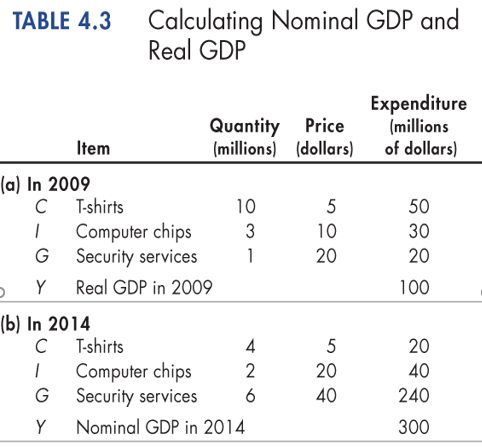
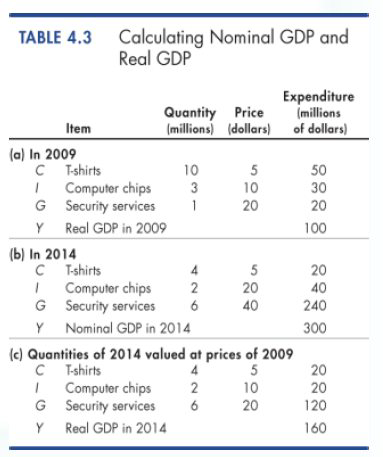
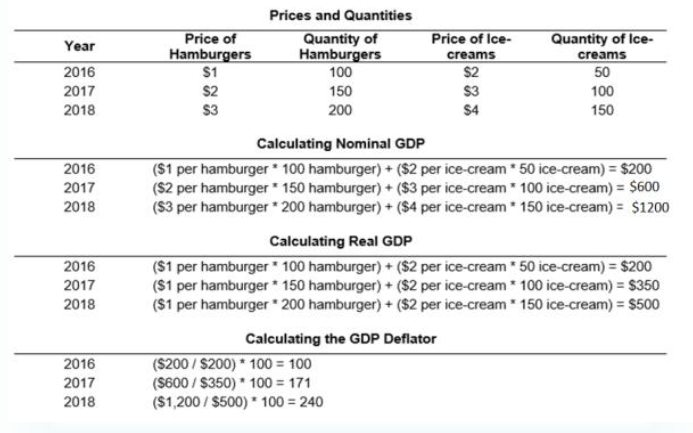
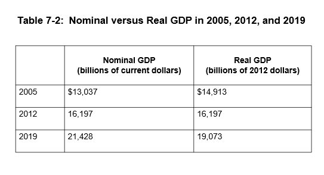
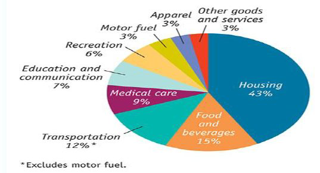
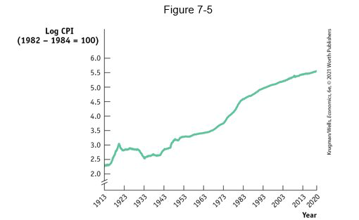
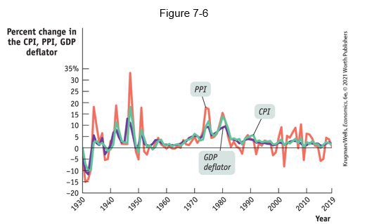
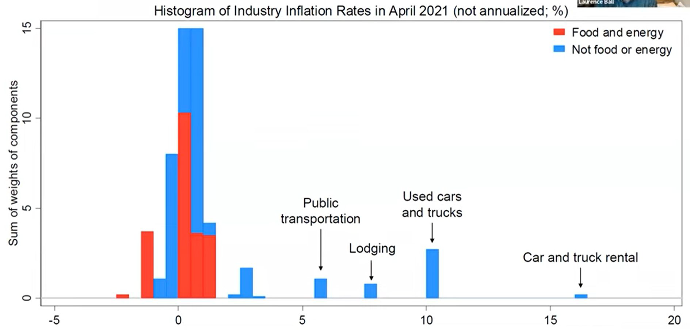

class: center,middle,mctitle-slide 


# GDP and the CPI: Tracking the Macroeconomy II

## Manolis Chatzikonstantinou  

---


# What will you learn today?


- _What is gross domestic product (GDP), and how is it calculated?_

--

- __What is the difference between real GDP and nominal GDP, and why is real GDP the appropriate measure of real economic activity?__

 - Prices of goods and services are different when we study the same economy in different time periods,
  
  - Real GDP adjusts for the different Price Level


--

- __What is a price index, and how is it used to calculate the inflation rate?__

 - Measures cost of the "same basket of goods" in different years. 
 
--

**Why?**

- From  **International Monetary Fund** data: In 2017–2018, the nominal GDP of Venezuela grew from 2 to 2,039 billion in national currency–a 101,850% increase.At the same time, there are food riots in the country. 

- From  **Bureau of Economic Analysis** data: In 2000, the value of output produced by the soft drink industry was $3.3 billion. In 2006, that number was $4.1 billion $\rightarrow$ the United States’ GDP increased by $800 million as a result of soft drink production. 


---

# Nominal GDP and Real GDP

- Nominal GDP is the value of goods and services produced during a given year **valued at the prices of that year**.
--


- Real GDP is the value of final goods and services produced in a given year **valued at the prices of a reference base year**.
--

- The current base year is 2012: **"Real GDP shows what GDP would have been in each year if goods were priced in 2012 dollars."**
--


.pull-left[
```{r  out.width = "70%",echo=FALSE}
 
```
]
.pull-right[
__Calculating nominal GDP__

- Table 4.3 (a) shows the quantities produced and the prices in 2009 (the base year) and in 2014. 

- Nominal GDP in 2009 is $100 million.

- Because 2009 is the base year, real GDP equals nominal GDP and is $100 million.

- Nominal GDP in 2014 is three times its value in 2009.
]
--
???
If we add up consumer spending, investment spending, government purchases, exports and subtract imports, we will get the market value of the goods and services the economy produces—the country’s gross domestic product.

---

# Calculating Nominal GDP

```{r  out.width = "55%",fig.align='center',echo=FALSE}
 
```

---

# Calculating Real GDP 


.pull-left[
```{r  out.width = "85%",echo=FALSE}
 
```
]


.pull-right[

- Let's calculate real GDP in 2014.


- The quantities are those of
2014, as in part (b).


- The prices are those in the
base year (2009) 


- The sum of these
expenditures is real GDP
in 2014, which is $160
million
]

---


# GDP Deflator


```{r  out.width = "80%",fig.align='center',echo=FALSE}
 
```

???
Exercise to follow the steps for 2018
---

# GDP Statistics

- How is GDP usually presented?

--

```{r  out.width = "50%",echo=FALSE}
 
```

- **What is the base year?**

--

- Where is the deflator?
???
Except for the base year, real GDP (output at prices of a base year) is not the same as nominal GDP (output at current prices).


--

-  Does Real GDP = Welfare/Standard of Living?

???
China: 14.72 trillion USD (2020) vs France 2.603 trillion USD(2020)
Not an end in itself as it does not address how a country uses that output to affect living standards.

---


# GDP and the meaning of life


$$
\text { Real GDP Per capita  }=\frac{\text { Real GDP }}{\text { Population }}
$$


--

__Uses and limitations of real GDP__

- Measure The Standard of Living Over Time
- Real GDP per person tells us the value of goods and services that the **average person** can enjoy.


--

- For example, in the U.S. in 1960, real GDP per person was $15,850$ $ and in 2012 , it was $42,800$ $.
- So real GDP per person in 2012 was $2.7$ times its 1960 level.

--

__Some Shortcomings:__

- Nonmarket activities and Leisure
- Improved product quality
- GDP and the environment
- Noneconomic sources of well being

--


[The Economist, Growth does not mean happiness](https://www.economist.com/graphic-detail/2019/03/21/economic-growth-does-not-guarantee-rising-happiness)


???
By using real GDP, we remove any influence that rising prices and a rising cost of living might have had on our comparison. 
HOUSEWORK AND CHILDCARE
Distributional Macroeconomics
GDP can also be a poor measure of the living standards in
various nations.
To get around the problem, economists use purchasing power
parity (PPP) PPP),

---

# Aggregate Price Indeces

- __Aggregate price level:__ a measure of the overall level of prices in the economy

- To measure the aggregate price level, economists calculate the cost of purchasing a market basket.

- **Market basket:** a hypothetical set of consumer purchases
of goods and services

--

__Price index:__ the cost of purchasing a given market basket
in a given year, where that cost is normalized so that it is
equal to 100 in the selected base year

--
$$
\text{Price index in a given year} = 
$$


$$
\frac{\text{Cost of market basket in a given year}}{\text{Cost of market basket in base year}}\times 100
$$


---

# Calculating the cost of a market basket

|  | January | February |
| :--- | :--- | :--- |
| Price of orange | $$ \$ 0.20 $$ | $$ \$ 0.40 $$ |
| Price of grapefruit | $$ \$ 0.60 $$ | $$ \$ 1.00 $$ |
| Price of lemon | $$ \$ 0.25 $$ | $$ \$ 0.45 $$ |
| Cost of market basket (200 oranges, 50 grapefruit, 100 lemons ) | $$(200 \times 0.20) + (50 \times 0.60)+ (100 \times 0.25) = \$95.00 $$| $$ = \$175.00 $$ |

--

- The CPI in the USA measures the cost of the market basket of a typical urban American family

--
- __The inflation rate:__ the yearly percentage change in a price
index, typically based on consumer price index (CPI), the
most common measure of the aggregate price level.

--


$$
\textbf{Inflation rate: } \frac{\text{Price index in year 2 - Price index in year 1}}{\text{Price index in year 1}}\times 100
$$

---

# The consumer price index 


The makeup of the consumer price index in 2010

```{r  out.width = "70%",echo=FALSE}
 
```


---

# Consumer Prices in the long run

.pull-left[
```{r  out.width = "100%",echo=FALSE}
 
```
]


.pull-right[
- The annual percentage increases in recent years have been much smaller than those of the 1970s and early 1980s.

- Evidence that using **real** GDP matters for comparisons over time

- Changes in **prices** + Changes in the **market basket**
]


---

# Other Price Indices

.pull-left[
```{r  out.width = "100%",echo=FALSE}
 
```
]

.pull-right[

- __CPI__: Based on consumption basket and prices consumers pay!

- __Producer price index (PPI):__ similar to the CPI, but measures changes in the prices of goods purchased by producers

- Economists also use the GDP deflator that measures the price level by calculating the ratio of nominal to real GDP.


$$
\text { GDP deflator }=100 \times \frac{\text { Nominal GDP }}{\text { Real GDP }}
$$
]
---

# Practice Problem: Calculating GDP

|  | 2012 |  | 2013 |  | 2014 |  |
| :---: | :---: | :---: | :---: | :---: | :---: | :---: |
|  | P | Q | P | Q | P | Q |
| good A | $30 | 900 | $31 | 1,000 | $36 | 1,050 |
| good B | $100 | 192 | $102 | 200 | $100 | 205 |

--

- Compute nominal GDP in each year.

- Compute real GDP in each year using 2012 as the base year.

--

- nominal GDP multiply Ps and Qs from same year

  - 2012: $$ \$ 46,200= \$30 \times 900+ \$ 100 \times 192$$

--
  - 2013: $ 51,400
  - 2014: $ 58,300

--

---


# Practice Problem: Calculating GDP

|  | 2012 |  | 2013 |  | 2014 |  |
| :---: | :---: | :---: | :---: | :---: | :---: | :---: |
|  | P | Q | P | Q | P | Q |
| good A | $30 | 900 | $31 | 1,000 | $36 | 1,050 |
| good B | $100 | 192 | $102 | 200 | $100 | 205 |

--

- Compute real GDP in each year using 2012 as the base year.


--

real GDP multiply each year's Qs by 2012 Ps

  - 2012: $46,200

--

- 2014: $$ \$ 52,000=\$ 30 \times 1050+\$ 100 \times 205 $$

---


# Practice Problem: Inflation


- Use your previous answers to compute the GDP deflator in each
year.
- Use GDP deflator to compute the inflation rate from 2012 to
2013, and from 2013 to 2014.

--


|  | Nom. GDP | Real GDP | GDP deflator | Inflation rate |
| :---: | :---: | :---: | :---: | :---: |
| 2012 | $46,200 | $46,200 | 100.0 | n.a. |
| 2013 | 51,400 | 50,000 | 102.8 | 2.8% |
| 2014 | 58,300 | 52,000 | 112.1 | 9.1% |


--

* GDP deflator $(2008)=100 \times \frac{51,400}{50000}=102.8$

--

* Inflation rate $(2008)= \frac{102.8 - 100}{100} = 0.028$

---


# What we learned?


__Useful Links__

.pull-left[
```{r  out.width = "100%",echo=FALSE}
 
```

]

.pull-right[

The following websites provide information on U.S. GDP, inflation, unemployment, and many other interesting macroeconomic variables:

- [Federal Reserve Economic Data](https://fred.stlouisfed.org/)

- [Consumer Price Index (CPI) in the BLS](https://fred.stlouisfed.org/)

- [Inflation during the pandemic](https://www.youtube.com/watch?v=Yrr9X62A1o4)

- [Learning more about Prices & Inflation](https://www.bea.gov/resources/learning-center/what-to-know-prices-inflation)

- [The Billion Price Project—Inflation in real time](http://www.thebillionpricesproject.com/) 

]

