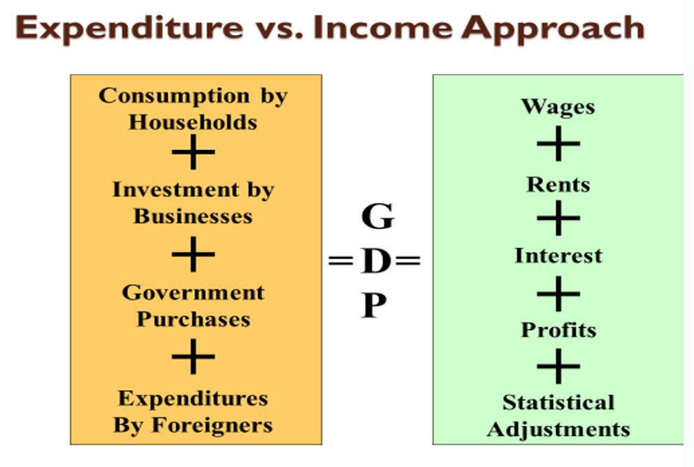

class: center,middle,mctitle-slide 


# GDP and the CPI: Tracking the Macroeconomy II

## Manolis Chatzikonstantinou  

---


# What will you learn today?

- _How do economists use aggregate measures to track the performance of the economy?_

--

- _What is gross domestic product (GDP), and how is it calculated?_

--

- __What is the difference between real GDP and nominal GDP, and why is real GDP the appropriate measure of real economic activity?__

--

- __What is a price index, and how is it used to calculate the inflation rate?__

---

# Review


```{r  out.width = "70%",echo=FALSE}
 
```

 
---

# Nominal GDP and Real GDP

- Real GDP is the value of final goods and services produced in a given year when valued at valued at the prices of a reference base year.

-- 

- The current base year is 2012. Real GDP shows what GDP would have been in each year if it were priced in 2012 dollars. That's how it removes the effect of inflation.

- Nominal GDP is the value of goods and services produced during a given year valued at the prices that prevailed in that same year.

- Nominal GDP is just a more precise name for GDP.

right side picture

```{r  out.width = "70%",echo=FALSE}
knitr::include_graphics("week3graphs/nominalgdptable.png") 
```


__Calculating nominal GDP__

Table 4.3 (a) shows the quantities produced and the prices in 2009 (the base year). 
Nominal GDP in 2009 is $100 million.
Because 2009 is the base year, real GDP equals nominal GDP and is $100 million.
Table 4.3(b) shows the quantities produced and the prices in 2014. 
Nominal GDP in 2014 is $300 million. 
Nominal GDP in 2014 is three times its value in 2009.

--

- If we add up consumer spending, investment spending, government purchases, exports and subtract imports, we will get the market value of the goods and services the economy produces—the country’s gross domestic product.

---


# Calculating Real GDP 


right side picture

```{r  out.width = "70%",echo=FALSE}
knitr::include_graphics("week3graphs/realgdptable.png") 
```


In Table 4.3(c), we
calculate real GDP in
2014.
•
The quantities are those of
2014, as in part (b).
•
The prices are those in the
base year (2009) as in part
(
•
The sum of these
expenditures is real GDP
in 2014, which is $160
million


---


# GDP Deflator in 2016

fix as table that fills every click

```{r  out.width = "70%",echo=FALSE}
knitr::include_graphics("week3graphs/gdpdeflator.png") 
```

---

# GDP Statistics

- How is GDP usually presented?

```{r  out.width = "70%",echo=FALSE}
knitr::include_graphics("week3graphs/gdpdeflator.png") 
```


- Where is the deflator?

Except for the base year, real GDP (output at prices of a base year) is not the same as nominal GDP (output at current prices).
Chained dollars: the method of calculating changes in real GDP using the average between the GDP growth rate calculated on an early base year and the GDP growth rate calculated on a late base year
GDP per capita: average GDP per person; not by itself an appropriate policy goal because there is not a one-to-one match between GDP and the quality of life

---

# Consumer Prices in the long run

left side: 


rigt sideThe annual percentage increases in recent years have been much smaller than those of the 1970s and early 1980s.


---

# Other Price Indices


```{r  out.width = "70%",echo=FALSE}
knitr::include_graphics("week3graphs/cpistats.png") 
```


- __CPI__

Producer price index (PPI): similar to the CPI, but measures changes in the prices of goods purchased by producers
Economists also use the GDP deflator that measures the price level by calculating the ratio of nominal to real GDP.
The GDP deflator for a given year is 100 times the ratio of nominal GDP to real GDP in that year.

---

# What we learned?


__Useful Links__

- tradingeconomics

-


