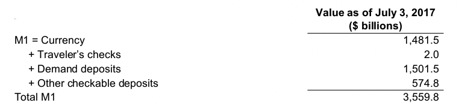
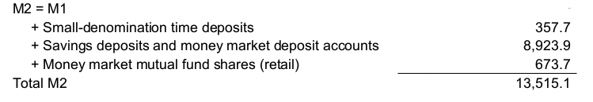

class: center,middle,mctitle-slide 


# Money and Interest rates: A definition

## Manolis Chatzikonstantinou  

---

class: my-one-page-font

# What will you learn today?

1. Develop precise definitions by exploring the functions of money
2. List and summarize the functions of money
  - why and how it promotes economic efficiency
3. Identify different types of payment systems
  - tracing how money have evolved over time, 
4. Compare and contrast the M1 and M2 money supplies
  - how money is currently measured.
5. The cost of holding money
  - Define Interest Rates
---

class: my-one-page-font

# Meaning of Money


- Money (or the “money supply”): anything that is generally accepted as __payment for goods or services__ or in the repayment of debts.

Money (a stock concept) is different from:

- __Wealth:__ the total collection of pieces of property that serve to store value
- __Income:__ flow of earnings per unit of time (a flow concept)

__Functions of Money__
  - Medium of Exchange
  - Unit of Account:
  - Store of Value:

---

class: my-one-page-font

# Functions of Money 

- Medium of Exchange:
  - Eliminates the trouble of finding a double coincidence of needs 
  - reduces transaction costs
  - Promotes specialization

A medium of exchange must:
  - be easily standardized
  - be widely accepted
  - be divisible
  - be easy to carry
  - not deteriorate quickly

---

class: my-one-page-font

# Functions of Money 

- Unit of Account:
  - Used to measure value in the economy
  - Reduces transaction costs

- Store of Value:
  - Used to save purchasing power over time.
  - Other assets also serve this function.
  - Money is the most liquid of all assets but loses value during inflation.

---

class: my-one-page-font

# Evolution of the Payments System

- __Commodity Money:__
  - valuable, easily standardized, and divisible commodities 
  - e.g. precious metals, cigarettes

--
  
- __Fiat Money:__ 
  - Paper money decreed by governments as legal tender
  - __Checks:__ an instruction to your bank to transfer money from your account
--

- __E-Money (electronic money):__
  - Debit card,smart card,E-cash

--

- Are We Headed for a Cashless Society?

--

- Will Bitcoin Become the Money of the Future?

---

class: my-one-page-font

# How do we measure money? 

- Which particular assets can be called “money”?

```{r  out.width = "65%", fig.align="center",echo=FALSE}
knitr::include_graphics("week3graphs/maggregates.png") 
```


[Source: Federal Reserve Statistical Release, H.6, Money Stock Measures](https://www.federalreserve.gov/releases/H6/current)

---

class: my-one-page-font

# How do we measure money? 

```{r  out.width = "80%", fig.align="center",echo=FALSE}
 
```

--


```{r  out.width = "80%", fig.align="center",echo=FALSE}
 
```

---

class: my-one-page-font

# The Federal Reserve’s Monetary Aggregates 

-  Does it matter which measure of money is considered?
  - M1 and M2 can move in different directions in the short run (see figure).
  -  the choice of monetary aggregate is important for policymakers.


```{r  out.width = "50%",fig.align='center',echo=FALSE}
knitr::include_graphics("week3graphs/m1m2g.jpg") 
```

- https://fred.stlouisfed.org/series/M1SL


---

class: my-one-page-font

# The opportunity cost of holding money

- We all carry some cash for the convenience, but that convenience comes with a price:
  - Cash yields no return, no interest
  - Funds in demand deposits are more accessible than those in Treasury bills, but they earn only 0.06%. 
  - The most accessible asset—cash in your wallet—earns zero. 

--

- __Short-term interest rates:__ financial assets that mature within less than a year
- __Long-term interest rates:__ financial assets that mature a number of years in the future

---

class: my-one-page-font

# The opportunity cost of holding money

|  | March 2019 | March 2020 |
| :--- | :---: | :---: |
| Federal funds rate | 2.41% | 0.65% |
| One-month Treasury bills | 2.45% | 0.37% |
| Interest-bearing demand deposits | 0.06% | 0.06% |
| Treasury bills minus interest-bearing demand deposits | 2.35 | 0.31 |
| Treasury bills minus currency| 2.41 | 0.37 |

- What happened to the opportunity cost of holding money between 2019 and 2020? 

???
The opportunity cost of holding money declined sharply between 2019 and 2020. 

---

class: my-one-page-font

# Measuring Interest Rates

- __Present value:__ a dollar in a year is less valuable than a dollar paid to you today.
- Why: a dollar deposited today can earn interest and become $\$ 1 \times(1+i)$ one year from today.

--

- What is the value off 100 saved after $n$ years?
  - __Depends on how you save, let $i=.10$__
    - In one year: $100 \times(1+0.10)= 110$
    - In two years: $110 \times(1+0.10)= 121$
    - or $100 \times(1+0.10)^{2}$
    - In $n$ years
$$
 100 \times(1+i)^{n}
$$

--

- What is the value off 100 received after 1 or 2 or $n$ years?


---

class: my-one-page-font

# Measuring Present Value

  - Can not directly compare, but:

$$
\mathrm{PV}=\frac{\mathrm{CF}}{(1+i)^{\mathrm{n}}}
$$
- PV = today’s (present) value
- CF = future cash flow (payment)
- i = the interest rate
--

- You got a 2 m contract, which promises you a payment of 100 th every year for 20 years:

```{r  out.width = "60%",fig.align='center',echo=FALSE}
knitr::include_graphics("week4graphs/presentvalues.png") 
```

---

class: my-one-page-font

# Four Types of Credit Market Instruments

  - Simple Loan
  - Fixed Payment Loan
  - Coupon Bond
  - Discount Bond

--

Unifying way to measure returns:

  - Yield to Maturity
  - the interest rate that equates 
    - PV of cash flow payments received from a debt instrument with its value today

---

class: my-one-page-font

# Yield to Maturity on a Simple Loan
$$
\begin{split}
&\mathrm{PV}=\text { amount borrowed }=\$ 100 \\
&\mathrm{CF}=\text { cash flow in one year }=\$ 110 \\
\end{split}
$$
--
$$
\begin{split}
&\text { Value Today}=\text { PV cash flow in one year }\\
\end{split}
$$
--

$$
\begin{gather*}
&\$ 100=\frac{\$ 110}{(1+i)^{1}} \\
&(1+i) \$ 100=\$ 110 \\
&(1+i)=\frac{\$ 110}{\$ 100} \\
&i=0.10=10 \%
\end{gather*}
$$
--


- __For simple loans, the simple interest rate equals the yield to maturity__

---

class: my-one-page-font

# Fixed-Payment Loan

The same cash flow payment every period throughout the life of the loan
  - $\mathrm{LV}=$ Ioan value
  - $\mathrm{FP}=$ fixed yearly payment
  - $n=$ number of years until maturity
$$
\mathrm{LV}=\frac{\mathrm{FP}}{1+i}+\frac{\mathrm{FP}}{(1+i)^{2}}+\frac{\mathrm{FP}}{(1+i)^{3}}+\ldots+\frac{\mathrm{FP}}{(1+i)^{n}}
$$

```{r  out.width = "60%",fig.align='center',echo=FALSE}
knitr::include_graphics("week4graphs/presentvalues.png") 
```

---

# Coupon Bond

Using the same strategy used for the fixed-payment loan:
  - $P$ = price of coupon bond
  - $C$ = yearly coupon payment
  - $F$ = face value of the bond
  - $n$ = years to maturity date

$$
\mathrm{P}=\frac{\mathrm{C}}{1+i}+\frac{\mathrm{C}}{(1+i)^{2}}+\frac{\mathrm{C}}{(1+i)^{3}}+\ldots+\frac{\mathrm{C}}{(1+i)^{n}}+\frac{\mathrm{F}}{(1+i)^{n}}
$$

- When the coupon bond is priced at its face value, the yield to maturity equals the coupon rate.
- The price of a coupon bond and the yield to maturity are negatively related.

| Price of Bond ($) | Yield to Maturity (%) |
| :---: | :---: |
| 1,100 | 8.48 |
| 1,000 | 10.00 |
| 900 | 11.75 |

---

class: my-one-page-font

# Consols and Discount Bonds

- __Consol__ or __perpetuity__: a bond with no maturity date that does not repay principal but pays fixed coupon payments forever

- $P=C / i_{c}$
- $P_{c}=$ price of the consol
- $C=$ yearly interest payment
- $i_{C}=$ yield to maturity/current yield
- can rewrite above equation as this: $i_{c}=C / P_{c}$


---

class: my-one-page-font

# Consols and Discount Bonds

- For any one year discount bond

$$
i=\frac{\mathrm{F}-\mathrm{P}}{\mathrm{P}}
$$

- $\mathrm{F}=$ Face value of the discount bond
- $P=$ Current price of the discount bond
- The yield to maturity equals the increase in price over the year divided by the initial price.
- What is a negative interest rate ? ( recent experience in Japan and several European states.)


---

class: my-one-page-font

# The Distinction Between Interest Rates and Returns 

Rate of Return:

- The payments to the owner plus the change in value expressed as a fraction of the purchase price

$$\text { RET }=\frac{C}{P_{t}}+\frac{P_{t+1}-P_{t}}{P_{t}}$$
- $\mathrm{RET}=$ return from holding the bond from time $t$ to time $t+1$
- $P_{t}=$ price of bond at time $t$
- $\mathrm{P}_{t+1}=$ price of the bond at time $t+1$
- $C=$ coupon payment
- $\frac{\mathrm{C}}{\mathrm{P}_{t}}=$ current yield $=i_{c} \quad \frac{\mathrm{P}_{t+1}-\mathrm{P}_{t}}{\mathrm{P}_{t}}=$ rate of capital gain $=g$

---

class: my-one-page-font

# The Distinction Between Interest Rates and Returns 

- __The return equals the yield to maturity only if the holding period equals the time to maturity.__

- A rise in interest rates is associated with a fall in bond prices, resulting in a capital loss if time to maturity is longer than the holding period.

- The more distant a bond’s maturity, the greater the size of the percentage price change associated with an interest-rate change.

- Even if a bond has a substantial initial interest rate, its return can be negative if interest rates rise.

---

# 10%-Coupon-Rate Bonds When Interest Rates Rise

- This table shows the One-Year Returns on Different-Maturity Bonds after $i \uparrow$  from 10 to 20 percent

| (1) Years to Maturity When Bond Is Purchased | (2) Initial Current Yield (%) | Initial Price I | Price Next Year* ($)| Rate of Capital Gain (%)| Rate of Return (%)|
| :---: | :---: | :---: | :---: | :---: | :---: |
| 30 | 10 | 1,000 | 503 | -49.7 | -39.7 |
| 20 | 10 | 1,000 | 516 | -48.4 | -38.4 |
| 10 | 10 | 1,000 | 597 | -40.3 | -30.3 |
| 5 | 10 | 1,000 | 741 | -25.9 | -15.9 |
| 2 | 10 | 1,000 | 917 | -8.3 | +1.7 |
| 1 | 10 | 1,000 | 1,000 | 0.0 | +10.0 |

- Returns (Prices) for long-term bonds are more volatile than those for shorter-term bonds.

- No interest-rate risk for any bond whose time to maturity matches the holding period.

---

class: my-one-page-font

# Accounting for Inflation

- __Nominal__ interest rates are not adjusted for inflation but __Real__ interest rates are.
  - Ex ante real interest rate is adjusted for __expected__ changes in the price level
  - Ex post real interest rate is adjusted for __actual__ changes in the price level

--

__Fisher Equation__
$$
\begin{aligned}
&i=i_{r}+\pi^{e} \\
&i=\text { nominal interest rate } \\
&i_{r}=\text { real interest rate } \\
&\pi^{e}=\text { expected inflation rate }
\end{aligned}
$$

???
When the real interest rate is low, there are greater incentives to borrow and fewer incentives to lend. The real interest rate is a better indicator of the incentives to borrow and lend.

---

# Replication


```{r  out.width = "80%",fig.align = "center",echo=FALSE}
knitr::include_graphics("week4graphs/Picture1.jpg") 
```

- https://fred.stlouisfed.org/series/TB3MS
- https://fred.stlouisfed.org/series/CPIAUCSL
