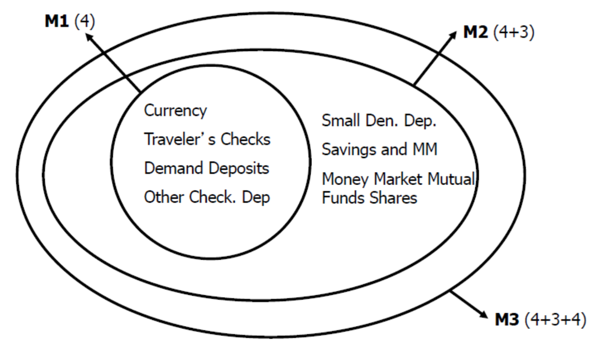
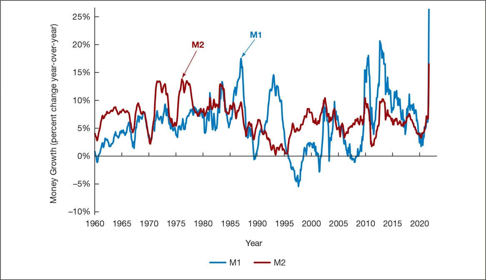
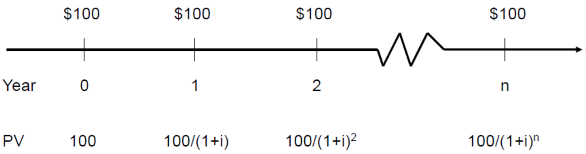
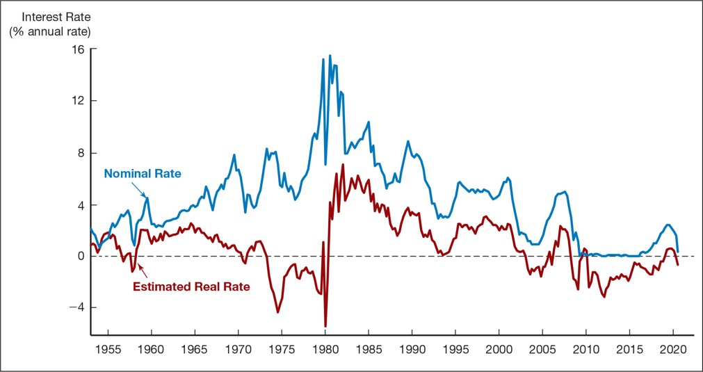

class: center,middle,mctitle-slide 


# Money and Interest rates: A definition

## Manolis Chatzikonstantinou  

---


# What will you learn today?


- In this chapter, we develop precise definitions by exploring the functions of money, looking at why and how it promotes economic efficiency, tracing how its forms have evolved over time, and examining how money is currently measured.

--

3.1 Describe what money is
3.2 List and summarize the functions of money
3.3 Identify different types of payment systems
3.4 Compare and contrast the M1 and M2 money supplies
3.5 The cost of holding money
---

# Meaning of Money

- Money (or the “money supply”): anything that is generally accepted as payment for goods or services or in the repayment of debts.
A broad definition

Money (a stock concept) is different from:
__Wealth:__ the total collection of pieces of property that serve to store value
__Income:__ flow of earnings per unit of time (a flow concept)

Functions of Money
  - Medium of Exchange
  - Unit of Account:
  - Store of Value:

---

# Functions of Money 

Medium of Exchange:
Eliminates the trouble of finding a double coincidence of needs (reduces transaction costs)
Promotes specialization
A medium of exchange must:
be easily standardized
be widely accepted
be divisible
be easy to carry
not deteriorate quickly

Unit of Account:
Used to measure value in the economy
Reduces transaction costs
Store of Value:
Used to save purchasing power over time.
Other assets also serve this function.
Money is the most liquid of all assets but loses value during inflation.

---

# Evolution of the Payments System (1 of 2)

Commodity Money: valuable, easily standardized, and divisible commodities (e.g. precious metals, cigarettes)
Fiat Money: paper money decreed by governments as legal tender
Checks: an instruction to your bank to transfer money from your account
Electronic Payment (e.g. online bill pay)
E-Money (electronic money):
Debit card
Stored-value card (smart card)
E-cash

- Are We Headed for a Cashless Society?

Predictions of a cashless society have been around for decades, but they have not come to fruition.
Although e-money might be more convenient and efficient than a payments system based on paper, several factors work against the disappearance of the paper system.
However, the use of e-money will likely still increase in the future.

- Will Bitcoin Become the Money of the Future?

---

# Measuring Mone

How do we measure money? Which particular assets can be called “money”?
Construct monetary aggregates using the concept of liquidity:

```{r  out.width = "50%",echo=FALSE}
 
```


- Table 1 Measures of the Monetary Aggregates

Source: Federal Reserve Statistical Release, H.6, Money Stock Measures:
https://www.federalreserve.gov/releases/H6/current


---

# The Federal Reserve’s Monetary Aggregates 

M1 versus M2: Does it matter which measure of money is considered?
M1 and M2 can move in different directions in the short run (see figure).
Conclusion: the choice of monetary aggregate is important for policymakers.

- Where Are All the U.S. Dollars?
The more than $4,500 of U.S. currency held per person in the United States is a surprisingly large number.


```{r  out.width = "50%",echo=FALSE}
 
```

- https://fred.stlouisfed.org/series/M1SL


---

class: my-one-page-font

# The opportunity cost of holding money

- We all carry some cash for the convenience, but that convenience comes with a price:
  - Cash yields no return, no interest
  - Funds in demand deposits are more accessible than those in Treasury bills, but they earn only 0.06%. 
  - The most accessible asset—cash in your wallet—earns zero. 

--

- __Short-term interest rates:__ financial assets that mature within less than a year
- __Long-term interest rates:__ financial assets that mature a number of years in the future

--

|  | March 2019 | March 2020 |
| :--- | :---: | :---: |
| Federal funds rate | 2.41% | 0.65% |
| One-month Treasury bills | 2.45% | 0.37% |
| Interest-bearing demand deposits | 0.06% | 0.06% |
| Treasury bills minus interest-bearing demand deposits | 2.35 | 0.31 |
| Treasury bills minus currency| 2.41 | 0.37 |

- What happened to the opportunity cost of holding money between 2019 and 2020? 

???
The opportunity cost of holding money declined sharply between 2019 and 2020. 

---

# Measuring Interest Rates

Present value: a dollar paid to you one year from now is less valuable than a dollar paid to you today.
- Why: a dollar deposited today can earn interest and become $\$ 1 \times(1+i)$ one year from today.

-- 

- What is the value off 100 saved after $n$ years?
  - Depends on how you save:
Let $i=.10$
    - In one year: $\$ 100 \times(1+0.10)=\$ 110$
    - In two years: $\$ 110 \times(1+0.10)=\$ 121$
    - or $\$ 100 \times(1+0.10)^{2}$
    - In $n$ years
$$
\$ 100 \times(1+i)^{n}
$$

--

- What is the value off 100 received after 1 or 2 or $n$ years?
  - Can not directly compare, but:

$$
\mathrm{PV}=\frac{\mathrm{CF}}{(1+i)^{\mathrm{n}}}
$$
where P V = today’s (present) value
C F = future cash flow (payment)
i = the interest rate


# What Is Money?

## Manolis Chatzikonstantinou  

---


# What will you learn today?


- Can we directly compare money received in different dates?

```{r  out.width = "100%",echo=FALSE}
 
```


--

4.1 Calculate the present value of future cash flows and the yield to maturity on the four types of credit market instruments.
4.2 Recognize the distinctions among yield to maturity, current yield, rate of return, and rate of capital gain.
4.3 Interpret the distinction between real and nominal interest rates.

---

#  How Much Is That Jackpot Worth? 


Assume that you just hit the $20 million jackpot in the New York State Lottery, which promises you a payment of $1 million every year for the next 20 years. You are clearly excited, but have you really won $20 million?


Assume that you just hit the $20 million jackpot in the New York State Lottery, which promises you a payment of $1 million every year for the next 20 years. You are clearly excited, but have you really won $20 million?
No, not in the present value sense. In today’s dollars, that $20 million is worth a lot less.
(Clue: assume an interest rate of 10% and work out the present value of $20 million over ten years)

---

# Four Types of Credit Market Instruments

Simple Loan
Fixed Payment Loan
Coupon Bond
Discount Bond

--

Unifying way to measure returns:

  - Yield to Maturity
  Yield to maturity: the interest rate that equates the present value of cash flow payments received from a debt instrument with its value today

--- 

# Yield to Maturity on a Simple Loan

$$
\begin{aligned}
&\mathrm{PV}=\text { amount borrowed }=\$ 100 \\
&\mathrm{CF}=\text { cash flow in one year }=\$ 110 \\
&n=\text { number of years }=1 \\
&\$ 100=\frac{\$ 110}{(1+i)^{1}} \\
&(1+i) \$ 100=\$ 110 \\
&(1+i)=\frac{\$ 110}{\$ 100} \\
&i=0.10=10 \%
\end{aligned}
$$
For simple loans, the simple interest rate equals the yield to maturity

---

# Fixed-Payment Loan

The same cash flow payment every period throughout the life of the Ioan
$\mathrm{LV}=$ Ioan value
$\mathrm{FP}=$ fixed yearly payment
$n=$ number of years until maturity
$$
\mathrm{LV}=\frac{\mathrm{FP}}{1+i}+\frac{\mathrm{FP}}{(1+i)^{2}}+\frac{\mathrm{FP}}{(1+i)^{3}}+\ldots+\frac{\mathrm{FP}}{(1+i)^{n}}
$$

---

# Coupon Bond

Using the same strategy used for the fixed-payment loan:
P = price of coupon bond
C = yearly coupon payment
F = face value of the bond
n = years to maturity date

$$
\mathrm{P}=\frac{\mathrm{C}}{1+i}+\frac{\mathrm{C}}{(1+i)^{2}}+\frac{\mathrm{C}}{(1+i)^{3}}+\ldots+\frac{\mathrm{C}}{(1+i)^{n}}+\frac{\mathrm{F}}{(1+i)^{n}}
$$

When the coupon bond is priced at its face value, the yield to maturity equals the coupon rate.
The price of a coupon bond and the yield to maturity are negatively related.
The yield to maturity is greater than the coupon rate when the bond price is below its face value.


| Price of Bond ($) | Yield to Maturity (%) |
| :---: | :---: |
| 1,200 | 7.13 |
| 1,100 | 8.48 |
| 1,000 | 10.00 |
| 900 | 11.75 |
| 800 | 13.81 |

--- 

# Consols and Discount Bonds

Consol or perpetuity: a bond with no maturity date that does not repay principal but pays fixed coupon payments forever

$P=C / i_{c}$
$P_{c}=$ price of the consol
$C=$ yearly interest payment
$I_{C}=$ yield to maturity of the consol
can rewrite above equation as this: $i_{c}=C / P_{c}$

For coupon bonds, this equation gives the current yield, an easy to calculate approximation to the yield to maturity

--

Discount Bond

For any one year discount bond
$$
i=\frac{\mathrm{F}-\mathrm{P}}{\mathrm{P}}
$$
$\mathrm{F}=\mathrm{Face}$ value of the discount bond
$P=$ Current price of the discount bond

- The yield to maturity equals the increase in price over the year divided by the initial price.
- What is a negative interest rate ? ( recent experience in Japan and several European states.)


---

# The Distinction Between Interest Rates and Returns 

Rate of Return:

- The payments to the owner plus the change in value expressed as a fraction of the purchase price

$$
\text { RET }=\frac{C}{P_{t}}+\frac{P_{t+1}-P_{t}}{P_{t}}
$$
$\mathrm{RET}=$ return from holding the bond from time $t$ to time $t+1$
$P_{t}=$ price of bond at time $t$
$\mathrm{P}_{t+1}=$ price of the bond at time $t+1$
$C=$ coupon payment
$\frac{\mathrm{C}}{\mathrm{P}_{t}}=$ current yield $=i_{c} \quad \frac{\mathrm{P}_{t+1}-\mathrm{P}_{t}}{\mathrm{P}_{t}}=$ rate of capital gain $=g$

The return equals the yield to maturity only if the holding period equals the time to maturity.
A rise in interest rates is associated with a fall in bond prices, resulting in a capital loss if time to maturity is longer than the holding period.
The more distant a bond’s maturity, the greater the size of the percentage price change associated with an interest-rate change.


---

# The Distinction Between Interest Rates and Returns


The more distant a bond’s maturity, the lower the rate of return the occurs as a result of an increase in the interest rate.
Even if a bond has a substantial initial interest rate, its return can be negative if interest rates rise.


Table 2 One-Year Returns on Different-Maturity 10%-Coupon-Rate Bonds When Interest Rates Rise from 10% to 20%

| (1) Years to Maturity When Bond Is Purchased | (2) Initial Current Yield (%) | Initial Price I | Price Next Year* ($)
| Rate of Capital Gain (%)| Rate of Return (%)|

| :---: | :---: | :---: | :---: | :---: | :---: |
| 30 | 10 | 1,000 | 503 | -49.7 | -39.7 |
| :---: | :---: | :---: | :---: | :---: | :---: |
| 20 | 10 | 1,000 | 516 | -48.4 | -38.4 |
| 10 | 10 | 1,000 | 597 | -40.3 | -30.3 |
| 5 | 10 | 1,000 | 741 | -25.9 | -15.9 |
| 2 | 10 | 1,000 | 917 | -8.3 | +1.7 |
| 1 | 10 | 1,000 | 1,000 | 0.0 | +10.0 |

---

# Maturity and the Volatility of Bond Returns: Interest-Rate Risk


Prices and returns for long-term bonds are more volatile than those for shorter-term bonds.
There is no interest-rate risk for any bond whose time to maturity matches the holding period.

Nominal interest rate makes no allowance for inflation.
Real interest rate is adjusted for changes in price level so it more accurately reflects the cost of borrowing.
Ex ante real interest rate is adjusted for expected changes in the price level
Ex post real interest rate is adjusted for actual changes in the price level

-- 

__Fisher Equation
$$
\begin{aligned}
&i=i_{r}+\pi^{e} \\
&i=\text { nominal interest rate } \\
&i_{r}=\text { real interest rate } \\
&\pi^{e}=\text { expected inflation rate }
\end{aligned}
$$

???
When the real interest rate is low, there are greater incentives to borrow and fewer incentives to lend. The real interest rate is a better indicator of the incentives to borrow and lend.

---

# Replication


```{r  out.width = "50%",echo=FALSE}
 
```

- https://fred.stlouisfed.org/series/TB3MS
- https://fred.stlouisfed.org/series/CPIAUCSL

---


# What we learned?


__Useful Links__


The following websites provide information on U.S. GDP, inflation, unemployment, and many other interesting macroeconomic variables:

- [Federal Reserve Economic Data](https://fred.stlouisfed.org/)

- [Consumer Price Index (CPI) in the BLS](https://fred.stlouisfed.org/)

- [Inflation during the pandemic](https://www.youtube.com/watch?v=Yrr9X62A1o4)

- [Learning more about Prices & Inflation](https://www.bea.gov/resources/learning-center/what-to-know-prices-inflation)

- [The Billion Price Project—Inflation in real time](http://www.thebillionpricesproject.com/) 

