class: center,middle,mctitle-slide 


#Unemployment and its causes

## Manolis Chatzikonstantinou  

---


# What will you learn this week?


- **How is unemployment measured and how is the unemployment rate calculated?**

--

- **What is the significance of the unemployment rate for the economy?**

--

- **What is the relationship between the unemployment rate and economic growth?**

--

- **What factors determine the natural rate of unemployment?**

---

# The unemployment rate in the US, 1948-2020

- Unemployment always rises during recessions and usually (but not always) falls during periods of economic expansion.


```{r  out.width = "75%", fig.align = 'center',echo=FALSE}
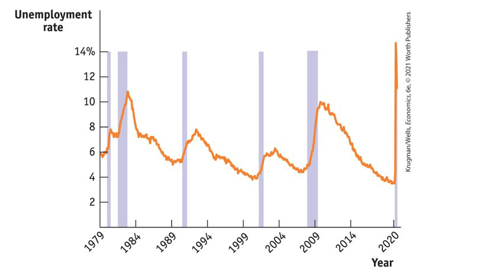 
```


---

#  Employment and Unemployment

- Why Unemployment Is a Problem ?
  
--

- **Lost incomes and production**

  - Lost income $\rightarrow$ reduction in demand and welfare
  - Unmployment benefits create a safety net $\rightarrow$ not fully and not for long

--

- **Lost human capital**

.pull-left[
```{r  out.width = "70%", fig.align = 'center',echo=FALSE}
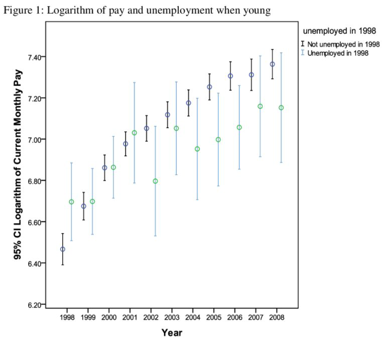 
```

]

.pull-right[

 - Prolonged unemployment permanently damages a
person’s job prospects 
- destroying human capital: experiance and connections
]

---


#  Who is unemployed? 

 - Is everyone not working, unemployed?
 
--

 - Female—45, worked full time during the month as computer analyst 
 - Male—50, laid off last year, did not work or look for work during the month

--

 - 	Female—22, not working, applied for positions in retail sales during the month 
 -	Male—15, worked part time during the month at a restaurant 

--

 -	Male—70, retired
 -	Female—68, worked 30 hours per week as a substitute middle school teacher


--

The working age population is divided into two groups:

1. People in the labor force
2. People not in the labor force

--

__The labor force is the sum of employed and unemployed workers.__


---

# Labor Force Statistics

> **Employment:** the total number of people currently employed, either full time or part time 

> **Unemployment:** the total number of people who are actively looking for work but aren’t currently employed 

> **Labor force:** the sum of employment and unemployment

- __Unemployment rate:__ the percent of the total number of people in the labor force who are unemployed


--

>  __Working age population__: the sum of active labor force + and thos not participating 


-  __Labor force participation rate:__ the percentage of adults (people 16 and older) in the labor force

--


$$
\text { Labor force participation rate }=\frac{\text { Labor force }}{\text { Population age } 16 \text { and older }} \times 100
$$

$$
\text { Unemployment rate }=\frac{\text { Number of unemployed workers }}{\text { Labor force }} \times 100
$$

---

# Unemployment: Significance and Pitfalls

 - The unemployment rate is a good but imperfect indicator of how easy or difficult it is to find a job:

--

- It can overstate the true difficulty of finding a job:
    - It takes time to change jobs
    - The unemployment rate never falls to zero, even in boom times when jobs are plentiful. 

--


- It can understate the true level of difficulty of finding a job
    - **Discouraged workers:** those who have given up looking for a job because there are no jobs available. 
    
    — **marginally attached  workers:** those who looked for work in the past (looked in the past 12 months but NOT in the past 4 weeks) but are not currently looking for work.
    
--

- The underemployed: those who would like to work full time but are currently working part time.

--

- So how good an indicator is the unemployment rate? 
    - Quality of jobs or how well people are matched to their jobs.
    - Labor force participation rate
    - Number of full-time jobs
    - Average wages

???
Discouraged workers are part of a larger group
---

# Alternative measures of unemployment


- The unemployment rate counts people as unemployed if they have been looking for work during the past four weeks. 
- Broader measures also count discouraged workers, marginally attached workers, and the underemployed. 

--
.pull-left[
```{r  out.width = "100%", fig.align = 'center',echo=FALSE}
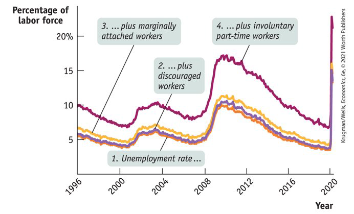 
```
]

.pull-right[

- U-A: Those unemployed for 15 or more weeks
- U-B: Unemployed job losers
- U-1: The official unemployment rate
 
__Broader measures are:__

 -  U-2: U-3 + Discouraged workers
 -  U-3: U-4 + Marginally attached workers
 -  U-4: U-4 + Part-time workers who want full-time jobs
]
---

# Unemployment rates and demographics

- Data show that unemployment rates vary greatly between groups.


--

```{r  out.width = "70%", fig.align = 'center',echo=FALSE}
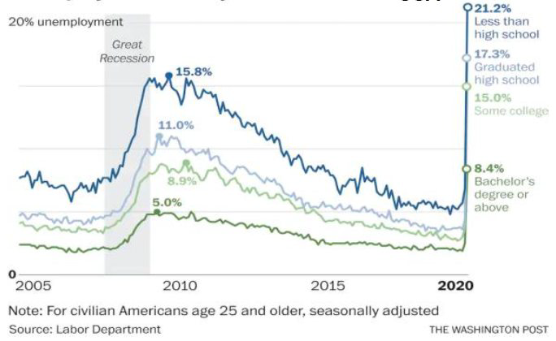 
```

---

# Unemployment rates and demographics

- Data show that unemployment rates vary greatly between groups.


--

```{r  out.width = "60%", fig.align = 'center',echo=FALSE}
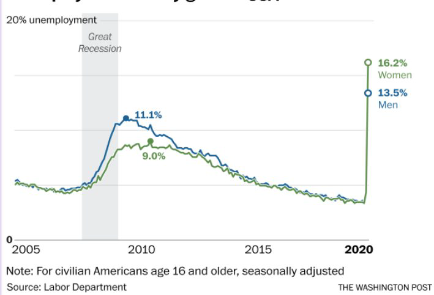 
```

---

# Unemployment rates and demographics

- Data show that unemployment rates vary greatly between groups.


--

```{r  out.width = "70%", fig.align = 'center',echo=FALSE}
knitr::include_graphics("week4graphs/unemploymentrace.png") 
```

---

# Unemployment rates and demographics

- Data show that unemployment rates vary greatly between groups.


--

```{r  out.width = "70%", fig.align = 'center',echo=FALSE}
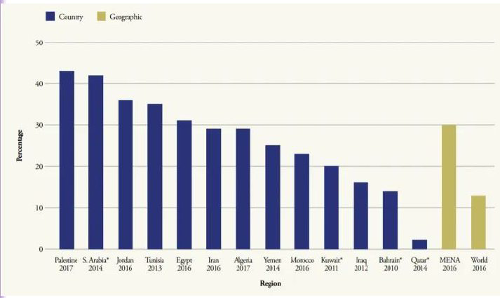 
```


---

# Unemployment and growth


-  Generally there is a negative relationship between economic growth and the unemployment rate


--


```{r  out.width = "90%", fig.align = 'center',echo=FALSE}
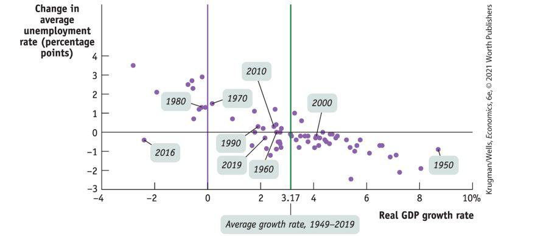 
```

--
-  A __jobless recovery__ is a period in which the real GDP growth rate is positive but the unemployment rate is still rising

???
There is a generally strong negative relationship between growth and unemployment. 
The green vertical line indicates the average growth rate of real GDP. Points to the right of the green line: above-average growth and falling unemployment. 
Points to the left of the green line: below-average growth and usually rising unemployment. A period when the growth is below the average and unemployment is rising is called a jobless recovery or a growth recession. 

---

# Job Creation and destruction

- If fast economic growth reduces the unemployment rate, how low can it go?


--

- Over the past 50 years, the national unemployment rate has never dropped below 2.9%.

- Even in the best of times, jobs are constantly being created and destroyed. 

--


There are three types of unemployment:

  1. frictional
  2. structural
  3. cyclical
  
--

Even in low-employment months, many workers move into and out of both employment and unemployment.

>The Great Resignation, also known as the Big Quit, is an economic trend in which employees voluntarily resign from their jobs en masse, beginning in early 2021, primarily in the United States. 

--

> According to a PricewaterhouseCoopers survey conducted in early August 2021, 65% of employees said they are looking for a new job and 88% of executives said their company is experiencing higher turnover than normal.


---

# Frictional Unemployment

- __Frictional Unemployment__ is unemployment that arises from normal __labor market turnover__.

--

- The creation and destruction of jobs requires that unemployed workers search for new jobs.

--

- Increases in the number of people entering and reentering the labor force 
- increases in unemployment benefits raise frictional unemployment.

--

.pull-left[
```{r  out.width = "70%", fig.align = 'center',echo=FALSE}
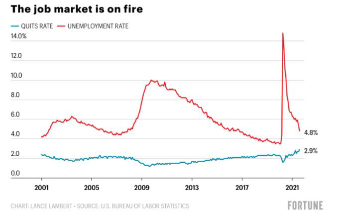 
```
]

.pull-right[

__Duration:__ The short duration of unemployment for most workers suggests that unemployment in early 2020 and 2021 was mostly frictional.

- Frictional unemployment is a permanent and healthy phenomenon of a growing economy

]


---

# Frictional Unemployment?

```{r  out.width = "50%", fig.align = 'center',echo=FALSE}
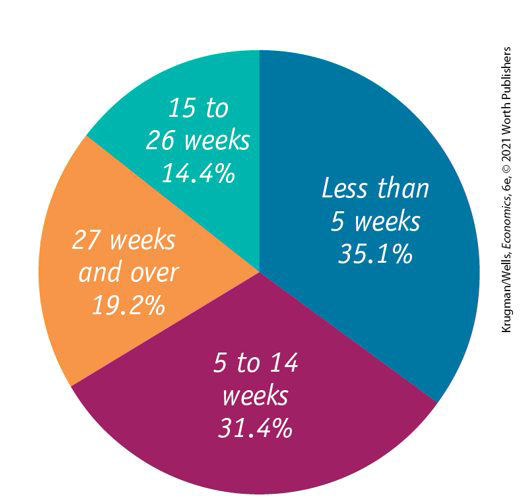 
```

---

# Structural Unemployment

- Sometimes there is a persistent surplus of job-seekers in a particular labor market:
  - There may be more workers with a particular skill than there are jobs available for that skill, or 
  - There may be more workers in a particular geographic region than there are jobs in that region.  

--

**Structural unemployment:** more people are seeking jobs in a particular labor market than there are jobs available at the current wage rate, even when the economy is at the peak of the business cycle.

--

- Structural unemployment occurs when the wage rate is persistently above the equilibrium wage rate. 

.pull-left[
```{r  out.width = "100%", fig.align = 'center',echo=FALSE}
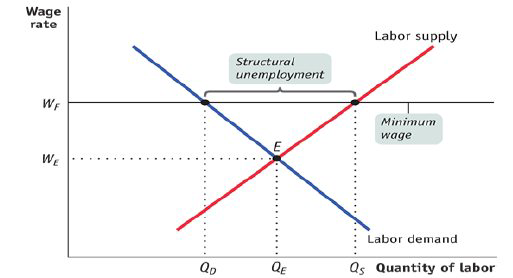 
```
]

.pull-right[
  
1. Minimum wages
2. Unions
3. Efficiency wages
4. Side effects of government policies
5. Mismatches between employees and employers
]

???
A minimum wage is a government-mandated floor on the wage rate.
A binding minimum wage leads to a persistent surplus in the labor market.
A sufficiently high minimum wage leads to structural unemployment. 
The minimum wage in the United States is quite low and isn’t binding for the majority of workers. 
__Side effects:__ Benefits to laid-off workers reduce workers’ incentive to quickly find a new job. 
During the 1980s, generous unemployment benefits in some European countries contributed to Eurosclerosis, persistently high unemployment.
---


# Cyclical unemployment

>__Cyclical Unemployment__ is the higher than normal unemployment at a business cycle trough and lower than normal unemployment at a business cycle peak.

--

- A worker laid off because the economy is in a
recession and is then rehired when the expansion
begins experiences cycle unemployment.

--

**“Natural” Unemployment** is the unemployment that arises from frictions and structural change when there is no cyclical unemployment.
--

- [FRED Natural rate of unemployment](https://fred.stlouisfed.org/series/NROU)
- The natural rate of unemployment (NAIRU) is the rate of unemployment arising from all sources except fluctuations in aggregate demand

???
It takes time for workers and firms to adjust to shifts in the economy. 
The result can be a mismatch between what employees have to offer and what employers are looking for. 
A skills mismatch
A geographic mismatch

--

- Frictional and structural unemployment are always present;they are “natural.”

- Actual unemployment = natural unemployment + cyclical unemployment


---

# Unemployment and full employment


.pull-left[
```{r  out.width = "100%", fig.align = 'center',echo=FALSE}
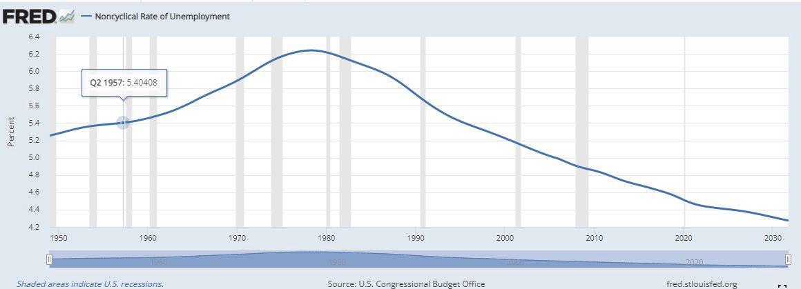 
```
]

.pull-right[
- The natural unemployment rate changes over time and is
influenced by many factors:

 - Changes in characteristics of the labor force
 - Changing demographics
 - Changes in labor market institutions
 - Unions, temp agencies, and new technology
 - Changes in government policies
 - Job-training programs
]

--

- **Potential GDP is the quantity of real GDP produced at full employment,** corresponds to the _capacity_ of the economy to produce output.
- Real GDP minus potential GDP is the **output gap**.

- **Business cycle:** fluctuation in the output gap and in the unemployment rate around the natural unemployment rate.

---

# Useful Links


```{r  out.width = "100%",out.length = "100%", fig.align = 'center',echo=FALSE}
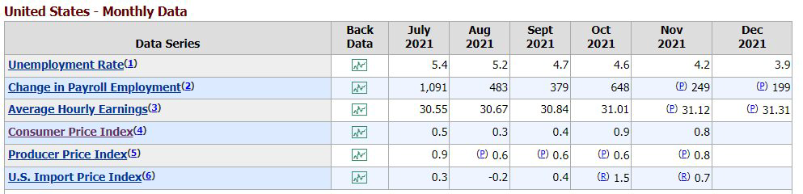 
```


- [US Economy at a Glance](http://www.bls.gov/eag/eag.us.htm)

- [Unemployment rate in Qatar](https://www.statista.com/statistics/808890/unemployment-rate-in-qatar/)

- [Labor Force Characteristics](https://www.bls.gov/cps/lfcharacteristics.htm#unemp)

- [Impact of covid-19 and gender in the labor market](https://www.bbc.com/worklife/article/20201021-why-this-recession-disproportionately-affects-women)
