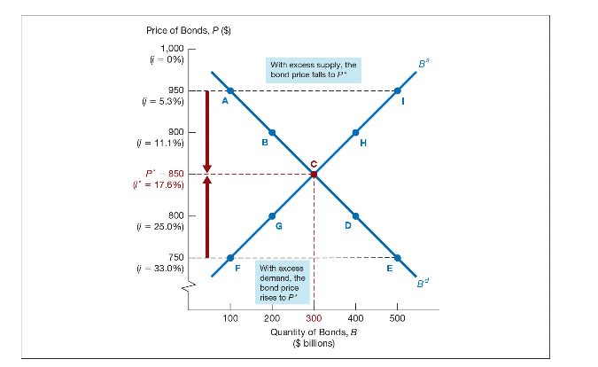
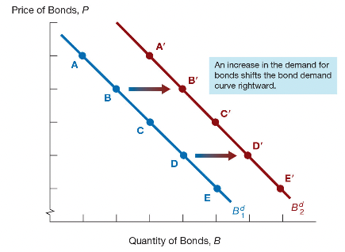
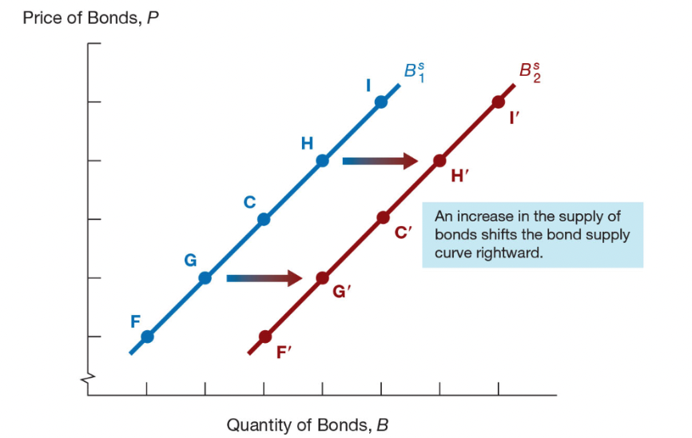
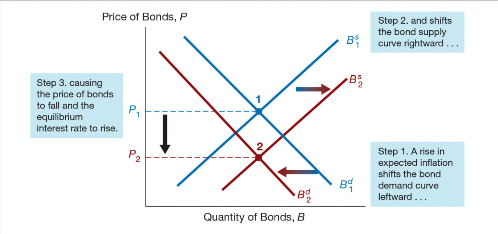
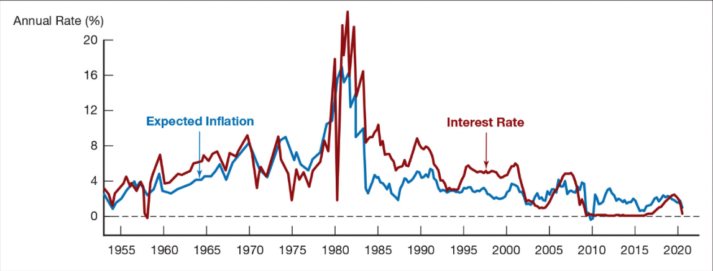
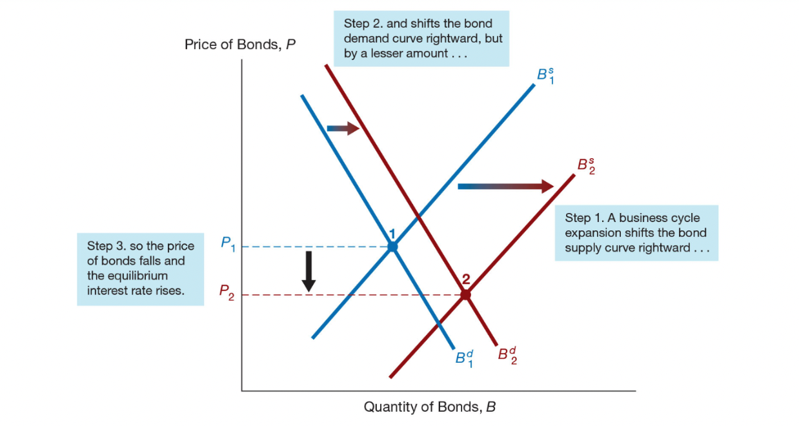
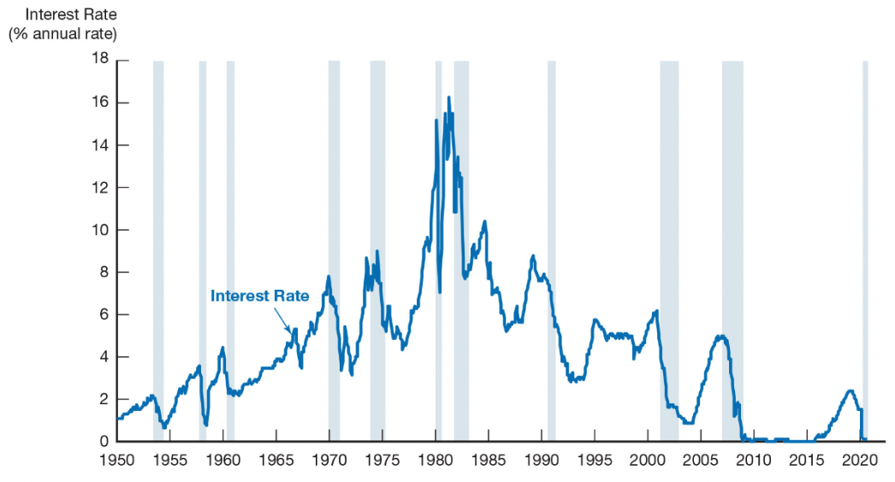
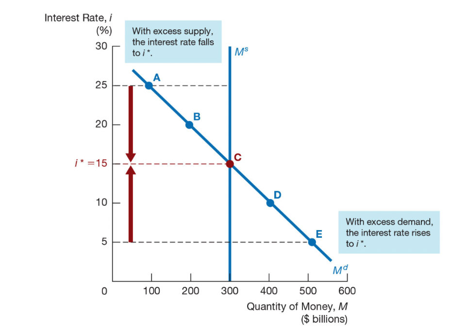
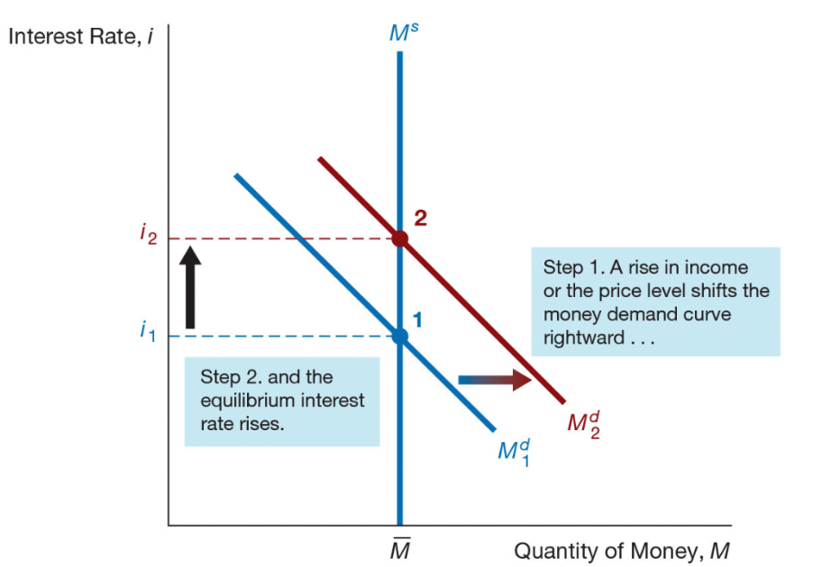
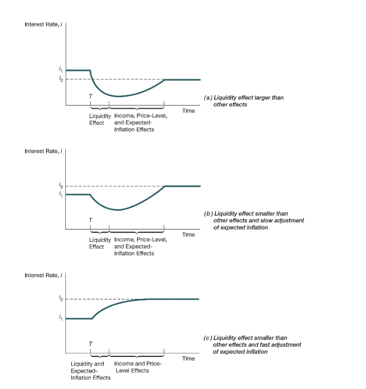

class: center,middle,mctitle-slide 

# The behavior of interest rates

## Manolis Chatzikonstantinou  

---

class: my-one-page-font

# What will you learn today?

1. Identify the factors that affect the demand for assets.

2. Draw the demand and supply curves for the bond market 
  - identify the equilibrium interest rate $i^*$. 

3. List and describe the factors that affect the equilibrium  $i^*$

4. Describe the connection between the bond market and the money market
  - Liquidity Preference model
  
5. List and describe the factors that affect the money market

6. Changes in money growth and $i^*$

---

class: my-one-page-font

# Determinants of Asset Demand

- Economic agents hold a variety of different assets. 
    - What are the primary assets you hold?
--
    - An asset is anything that can be owned and has value.
    - money, laptops, cellphones, bonds, stocks, art, real estate ...

--

- __Wealth:__ the total resources owned by the individual, including all assets

- __Expected Return:__ the asset return expected over the next period 

- __Risk:__ the degree of uncertainty associated with asset return (relative to others)

- __Liquidity:__ "ease and speed to transform an asset into money"

---

class: my-one-page-font

# Theory of Portfolio Choice 

- Ceteris Paribus, The quantity demanded of an asset is: 
  1. positively related to wealth
  2. positively related to its expected return relative to alternative assets
  3. negatively related to the risk of its returns relative to alternative assets
  4. positively related to liquidity

| Variable | Change in Variable | Change in Quantity Demanded |
| :--- | :---: | :---: |
| Wealth | $\uparrow$ | $\uparrow$ |
| Expected return relative to other assets | $\uparrow$ | $\uparrow$ |
| Risk relative to other assets | $\uparrow$ | $\downarrow$ |
| Liquidity relative to other assets | $\uparrow$ | $\uparrow$ |

---

class: my-one-page-font

# Supply and Demand in the Bond Market

- Ceteris Paribus, At lower prices (higher interest rates):
  1. the quantity demanded of bonds is higher
  2. the quantity supplied of bonds is lower


```{r  out.width = "60%", fig.align="center",echo=FALSE}
 
```

---

class: my-one-page-font

# Changes in Equilibrium Interest Rates

Shifts in the demand for bonds:

Wealth: in an expansion with growing wealth, the demand curve
for bonds shifts to the right

Expected Returns: higher expected interest rates in the future
lower the expected return for long-term bonds, shifting the
demand curve to the left

Expected Inflation: an increase in the expected rate of inflations
lowers the expected return for bonds, causing the demand curve
to shift to the left

Risk: an increase in the riskiness of bonds causes the demand
curve to shift to the left

Liquidity: increased liquidity of bonds results in the demand curve
shifting right

---

class: my-one-page-font

# Shift in the Demand Curve for Bonds

```{r  out.width = "60%", fig.align="center",echo=FALSE}
 
```

---

class: my-one-page-font


# Factors that shift the Demand Curve

| Variable | Change in Variable  | Change in Quantity Demanded at Each Bond Price |
| :--- | :---: | :---: |
| Wealth | $\uparrow$ | $\uparrow$  |
| Expected interest rate |   | |
| Expected inflation |  |  |
| Riskiness of bonds relative to other assets|  |  |
| Liquidity of bonds relative to other assets|  |  |

---

# Shifts in the supply for bonds:

- __Expected profitability of investment opportunities:__
  - in an expansion, the supply curve shifts to the right

- As __Expected inflation__ increases the supply curve for bonds shifts to the right

- __Government budget:__
  - increased budget deficits shift the supply curve to the right
  
```{r  out.width = "40%", fig.align="center",echo=FALSE}
 
```

---

# The Fisher Effect

```{r  out.width = "100%", fig.align="center",echo=FALSE}
 
```

---

# The Fisher Effect

```{r  out.width = "100%", fig.align="center",echo=FALSE}
 
```

- https://fred.stlouisfed.org/series/TB3MS
- https://fred.stlouisfed.org/series/CPIAUCSL/


---

# The cyclicality of the Interest Rate

```{r  out.width = "80%", fig.align="center",echo=FALSE}
 
```
 
---

# Business Cycle and Interest Rates

```{r  out.width = "80%", fig.align="center",echo=FALSE}
 
```
 
---

class: my-one-page-font

# The Liquidity Preference Model


- Supply and Demand in the Market for __Money__:
  - Keynesian model that determines the equilibrium interest rate     
  - Reminder: popular store of wealth: money and bonds.

$$ \text{Total wealth in the economy}  =  B^S + M^S  =  B^D + M^D $$
$$ \text{Rearranging: }  B^S - B^D  =  M^D - M^S $$

__If the market for money is in equilibrium then the bond market is also in equilibrium__

$$ M^D =  M^S \Rightarrow B^S = B^D $$
---

# The Liquidity Preference Framework 

```{r  out.width = "60%", fig.align="center",echo=FALSE}
 
```

- As the interest rate increases: The opportunity cost of holding money increases $\rightarrow$ 
  - The relative expected return of money decreases $\rightarrow$ and therefore the quantity demanded of money decreases.
 
---

# Factors affecting the Money Market Equilibrium

Shifts in the demand for money:

Income Effect: a higher level of income causes the
demand for money at each interest rate to increase
and the demand curve to shift to the right

Price-Level Effect: a rise in the price level causes
the demand for money at each interest rate to
increase and the demand curve to shift to the right

Shifts in the supply of money:

Assume that the supply of money is controlled by the
central bank.

An increase in the money supply engineered by the
Federal Reserve will shift the supply curve for money
to the right.

---

# Factors affecting the Money Market Equilibrium

| Variable | Change in Variable | Demand or Supply at Each Interest Rate | Change in $i$ |
| :--- | :---: | :---: | :---: |
| Income | uarr | M^(d)uarr | uarr |
| Price level |  |  |  |
| Money Supply |  |  |  |

- If Income or Prices increase:

```{r  out.width = "40%", fig.align="center",echo=FALSE}
 
```

---

# Response to a Change in the Money Supply


---
class: my-one-page-font
 
# Money and Interest Rates

A one time increase in the money supply will cause prices
to rise to a permanently higher level by the end of the year.
The interest rate will rise via the increased prices.

Price-level effect remains even after prices have stopped
rising.

A rising price level will raise interest rates because people
will expect inflation to be higher over the course of the year.
When the price level stops rising, expectations of inflation
will return to zero.

Expected-inflation effect persists only as long as the price
level continues to rise.


---

class: my-one-page-font
 
# Poll

## Does a Higher Rate of Growth of the Money Supply Lower $i^*$?


---

class: my-one-page-font
 
# Let's see:

Liquidity preference framework leads to the conclusion
that an increase in the money supply will lower interest
rates: the liquidity effect.

Income effect finds interest rates rising because increasing
the money supply is an expansionary influence on the
economy (the demand curve shifts to the right).

Price-Level effect predicts an increase in the money
supply leads to a rise in interest rates in response to the
rise in the price level (the demand curve shifts to the
right).

Expected-Inflation effect shows an increase in interest
rates because an increase in the money supply may lead
people to expect a higher price level in the future (the
demand curve shifts to the right).


---

class: my-one-page-font
 
# Increase in Money Supply Growth

- Three Scenarios:


```{r  out.width = "40%", fig.align="center",echo=FALSE}
 
```


---

class: my-one-page-font

# Money Growth and Interest Rates


```{r  out.width = "80%", fig.align="center",echo=FALSE}
knitr::include_graphics("week1graphs/Picture6.jpg") 
```

