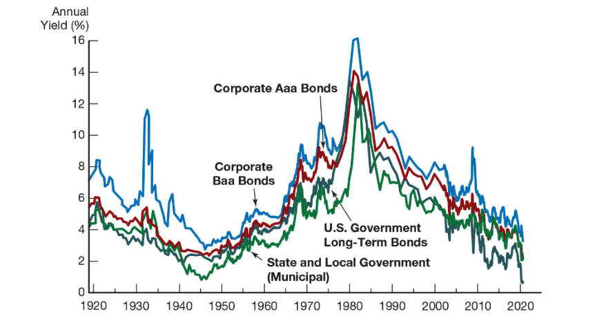
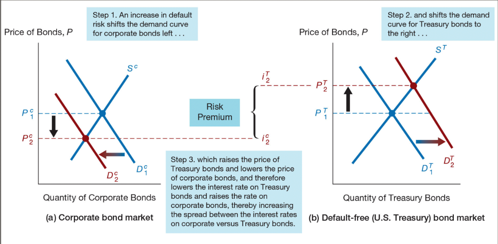
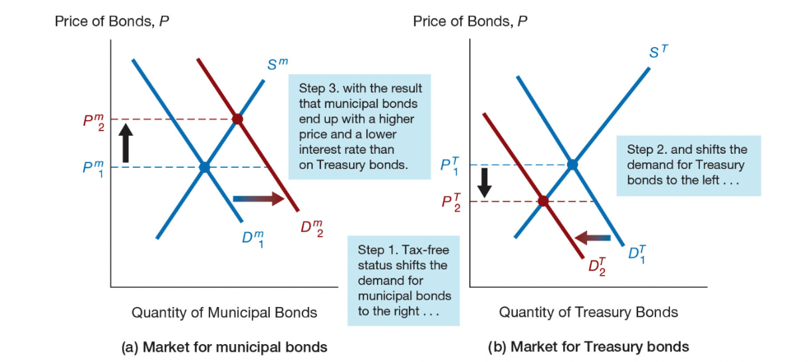
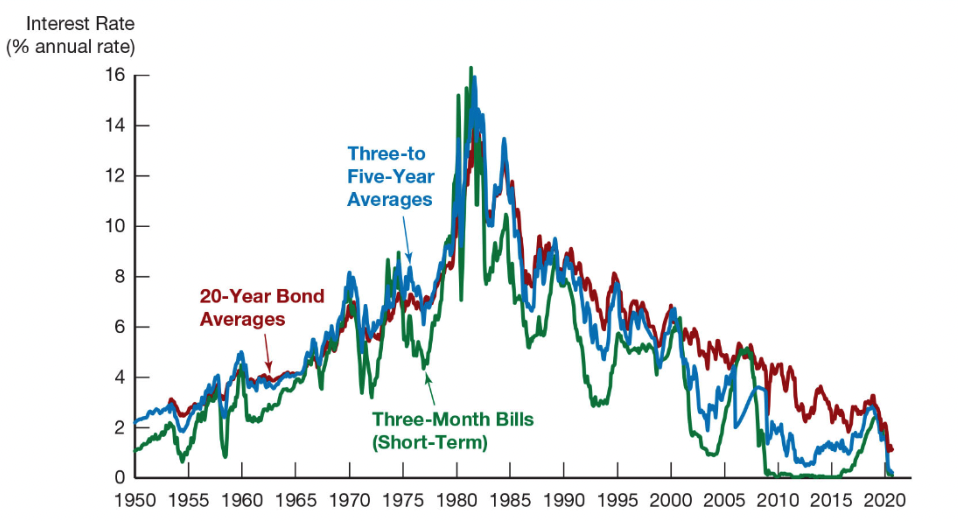
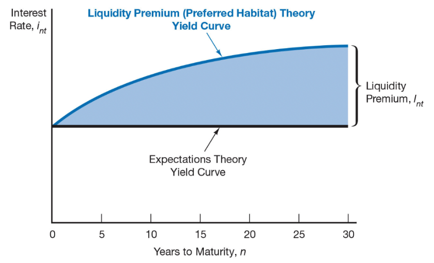
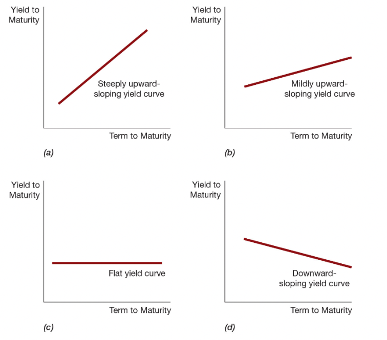
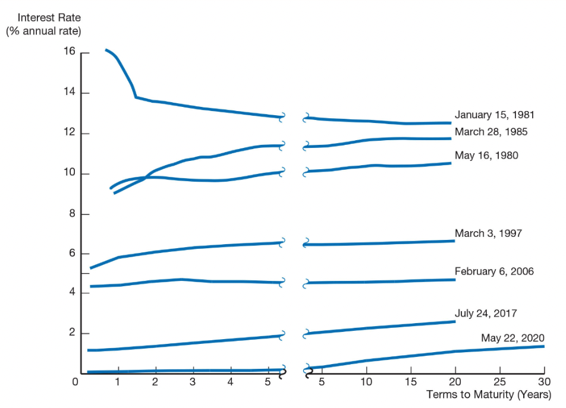

class: center,middle,mctitle-slide 


# The Risk and Term Structure of Interest Rates

## Manolis Chatzikonstantinou  

---

# Risk Structure of Interest Rates 


```{r  out.width = "50%", fig.align="center",echo=FALSE}

```


Bonds with the same maturity have different interest rates due to:

- Default risk

- Liquidity
  - Number of buyers/sellers in a bond market

- Tax considerations

---

# Risk Structure of Interest Rates 


- Default risk: probability that the issuer of the bond is
unable to make interest payments or pay off
the face value

- U.S. Treasury bonds are considered default free
    - (government can raise taxes).

- Risk premium: the spread between the interest rates
on bonds with default risk and risk-free rate

| Moody's | Rating Agency S&P | Fitch | Definitions |
| :--- | :--- | :--- | :--- |
| Aaa | AAA | AAA | Prime Maximum Safety |
| Aa1 | AA+ | AA+ | High Grade High Quality |
| Aa2 | AA | AA |  |
| Aa3 | AA- | AA- |  |
| Ba2 | BB | BB | Speculative |


---

# Default Risk

| Moody's | Rating Agency S&P | Fitch | Definitions |
| :--- | :--- | :--- | :--- |
| Ba2 | BB | BB | Speculative |
| Ba3 | BB - | BB- |  |
| B1 | B+ | B+ | Highly Speculative |
| B2 | B | B |  |
| B3 | B- | B- |  |
| Caa1 | CCC+ | CCC | Substantial Risk |
| Caa2 | CCC |  | In Poor Standing |
| Caa3 | CCC - |  |  |
| Ca |  |  | Extremely Speculative |
| C |  |  | May Be in Default |
|  |  | D | Default |

---

# Increase in Default Risk

```{r  out.width = "100%", fig.align="center",echo=FALSE}

```

---

class: my-one-page-font

# Two Tales

- The Global Financial Crisis and the Baa–Treasury Spread:

> Starting in August 2007, the collapse of the subprime
mortgage market led to large losses among financial
institutions. As a consequence, many investors began to
doubt the financial health of corporations with low credit
ratings such as Baa and even the reliability of the ratings
themselves. The perceived increase in default risk for
Baa bonds made them less desirable at any given price.

--

- The Coronavirus Pandemic Crisis and the Baa–Treasury Spread:


> When the coronavirus officially became a pandemic in
March 2020, it dealt a knockout blow to the world economy.
Many investors began to doubt the financial health of
corporations with low credit ratings such as Baa.
The perceived increase in default risk for Baa bonds
made them less desirable at any given price, decreased
the quantity demanded, and shifted the demand curve for
Baa bonds to the left.

---

# Income Tax considerations

```{r  out.width = "100%", fig.align="center",echo=FALSE}

```


---

class: my-one-page-font

# Term Structure of Interest Rates 

- Bonds with identical risk, liquidity, and tax characteristics
may have different interest rates because the time
remaining to maturity is different

- __Yield curve:__ a plot of the yield on bonds with differing
terms to maturity but the same risk, liquidity, and tax
considerations
  - Upward-sloping: long-term rates are above
short-term rates
  - Flat: short- and long-term rates are the same
  - Inverted: long-term rates are below short-term rates


---

class: my-one-page-font

# Term Structure of Interest Rates 

- The theory of the term structure of interest rates must
explain the following facts:

1. Interest rates on bonds of different maturities move
together over time.

2. When short-term interest rates are low(high), yield curves
are more likely to have an upward(downward) slope;

3. Yield curves almost always slope upward.

--

- Three theories to explain the three facts:

1. Expectations theory explains the first two facts but not the third.

2. Segmented markets theory explains the third fact but not the first two.

3. Liquidity premium theory combines the two theories to explain all three facts.

---

# U.S. Government Bonds With Different Maturities

```{r  out.width = "80%", fig.align="center",echo=FALSE}

```

---

class: my-one-page-font

# Expectations Theory 

- The interest rate on a long-term bond will equal an
average of all short-term interest rates long-term maturity.

- Buyers of bonds do not prefer bonds of one maturity over another; 
  - expected returns are equalized over time.
  - Bond holders consider bonds with different maturities to be perfect substitutes.

--

- Example: Let the current rate on one-year bond be 6%.   
    - You expect the interest rate on a one-year bond to be 8% in a year.

- Then the expected return for buying two one-year bonds is 7%.
  - the two-year bond must be 7% for you to purchase it.
  - we can recover expectations.

---

class: my-one-page-font


# Return on 2-year bond

For an investment:
- $i_{t}=$ today's interest rate on a one-period bond
- $i_{t+1}^{e}=$ interest rate on a one-period bond expected for next period
- $i_{2 t}=$ today's interest rate on the two-period bond

Expected return over the two periods from investing $1 in
the two-period bond and holding it for the two periods

$$
\begin{gathered}
\left(1+i_{2 t}\right)\left(1+i_{2 t}\right)-1 \\
=1+2 i_{2 t}+\left(i_{2 t}\right)^{2}-1 \\
=2 i_{2 t}+\left(i_{2 t}\right)^{2}
\end{gathered}
$$

- the expected return for holding the two-period bond for two periods is


$$
\begin{gathered}
2 i_{2 t}
\end{gathered}
$$


---

# Return on two one-period bonds


For an investment:
- $i_{t}=$ today's interest rate on a one-period bond
- $i_{t+1}^{e}=$ interest rate on a one-period bond expected for next period
- $i_{2 t}=$ today's interest rate on the two-period bond


$$
\begin{gathered}
\left(1+i_{t}\right)\left(1+i_{t+1}^{e}\right)-1 \\
1+i_{t}+i_{t+1}^{e}+i_{t}\left(i_{t+1}^{e}\right)-1 \\
i_{t}+i_{t+1}^{e}+i_{t}\left(i_{t+1}^{e}\right)
\end{gathered}
$$
--

- If the second term is very small,  the expected return is 

$$i_{t}+i_{t+1}^{e}$$

- Both bonds will be held only if the expected returns are equal

$$i_{t}+i_{t+1}^{e} = 2i_{2t}$$

$$i_{2 t}=\frac{i_{t}+i_{t+1}^{e}}{2}$$

---

class: my-one-page-font

# Expectations Theory

For bonds with longer maturities
$$i_{n t}=\frac{i_{t}+i_{t+1}^{e}+i_{t+2}^{e}+\ldots+i_{t+(n-1)}^{e}}{n}$$
The $n$-period interest rate equals the average of the one-period interest rates expected to occur over the $n$-period life of the bond!

Expectations theory explains:

- Why the term structure of interest rates changes at different times.

- Why interest rates on bonds with different maturities move together over time (fact 1).

- Why yield curves tend to slope up when short-term rates are low (fact 2).

- __Cannot explain why yield curves usually slope upward(fact 3)__

---

class: my-one-page-font

# Segmented Markets Theory

- Bonds of different maturities are not substitutes at all.

- The interest rate for each bond with a different maturity is determined by the demand for and supply of that bond.

--

- Investors have preferences for bonds of one maturity over another.
   - generally  bonds with shorter maturities preferred
   - have less interest-rate risk, then this explains why yield curves usually slope upward (fact 3).

---

class: my-one-page-font

# Liquidity Premium 

> The interest rate on a long-term bond will equal an 
average of short-term interest rates expected to occur
over the life of the long-term bond plus a liquidity
premium that responds to supply and demand conditions
for that bond.

- Bonds of different maturities are partial (not perfect) substitutes.

--

- Liquidity Premium Theory 

$$i_{n t}=\frac{i_{t}+i_{t+1}^{e}+i_{t+2}^{e}+\ldots+i_{t+(n-1)}^{e}}{n}+l_{nt}$$

- $l_{nt}$ is the liquidity premium
  - always positive
  - Rises with the term to maturity
  
---

# Preferred Habitat Theory

- Investors have a preference for bonds of one maturity over another:

```{r  out.width = "70%", fig.align="center",echo=FALSE}

```

---

class: my-one-page-font

# Predictions


- Interest rates on different maturity bonds move together over time; 
  - explained by the first term in the equation

- Yield curves tend to slope upward when short-term rates are low and
- to be inverted when short-term rates are high; 
  - explained by the liquidity premium term in the first case and by a low expected average in the second case

- Yield curves typically slope upward; 
  - explained by a larger liquidity premium as the term to maturity lengthens


---

# Predictions

```{r  out.width = "50%", fig.align="center",echo=FALSE}

```

---

# Yield Curves and Business Cycles

```{r  out.width = "60%", fig.align="center",echo=FALSE}

```
