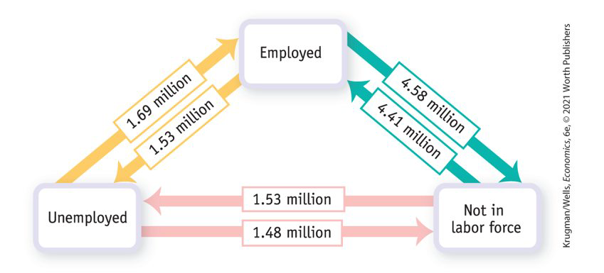
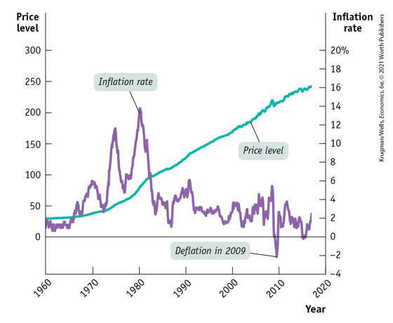

class: center,middle,mctitle-slide 


# Unemployment and Inflation

## Manolis Chatzikonstantinou  

---

# Review: Labor Market Flows


```{r  out.width = "100%",out.length = "100%", fig.align = 'center',echo=FALSE}
 
```


---


# Price level, inflation and deflation 

- The price level is the average level of prices and the value of money.

--

- A persistently rising price level is called inflation

- A persistently falling price level is called deflation

--

-  We are interested in the price level because we want to
  
  1. Measure the inflation rate or the deflation rate
  2. Distinguish between money values and real values of economic variables

--

- Are high prices bad ?


**Real wage** is the wage rate divided by the price level.

**Real income** is income divided by the price level.

???
The rise in prices in the United States since the 1960s hasn’t made the country poorer because it has also raised incomes by the same amount.
The level of prices doesn’t matter.

--

- Is inflation bad? The level of prices doesn’t matter, but the inflation rate does. 

$$
\text { Inflation rate }=\frac{\text { Price level in year } 2-\text { Price level in year } 1}{\text { Price level in year } 1} \times 100
$$

???
Example: If the CPI increases from 120 to 135 over 1 year, what is the inflation rate?


---

# The price vs the inflation level

.pull-left[

```{r  out.width = "80%", fig.align = 'center',echo=FALSE}
 
```

]


.pull-right[
- The price level has changed a lot. 
- The inflation rate has had both ups and downs. And in 2009, the inflation rate briefly turned negative, a phenomenon called deflation. 
]

High rates of inflation impose significant costs: 
- __Shoe-leather costs__  
- __Menu costs__  
- __Unit-of-account costs__  
--


---

# Winners and losers of inflation

- __Interest rate:__ the return a lender receives for allowing borrowers the use of their savings for one year, calculated as a percentage of the amount borrowed. 
- __Nominal interest rate:__ the interest rate expressed in dollar terms
- __Real interest rate:__ the nominal interest rate minus the rate of inflation

--

- A borrower and a lender enter into a loan contract, the contract specifies a nominal interest rate. But each party has an expectation about the future rate of inflation. 

--

If actual inflation > expected:

- borrowers gain at the expense of lenders:  fund payments to lenders have a lower real value than had been expected. 
- borrowers are the winners and lenders are the losers.

--

If actual inflation < expected:

- lenders gain at the expense of borrowers:  fund payments to lenders have a higher real value than had been expected. 
- lenders are the winners and borrowers are the losers.

--

Uncertainty about future inflation discourages people from entering into any form of long-term contract


---

# Why inflation and deflation cause problems?

- Low, steady, and anticipated inflation or deflation is not a problem.

--

- Unpredictable inflation or deflation is a problem because it:

1. Redistributes income and wealth

2. Lowers real GDP and employment

3. Diverts resources from production

--

- Unpredictable changes in the inflation rate redistribute
income in arbitrary ways between employers and workers
and between borrowers and lenders.

--

- At its worse, inflation becomes hyperinflation an inflation rate
that is so rapid that workers are paid twice a day because money
loses its value so quickly.

---

# Inflation in History!

TYPES OF INFLATION
•
Demand pull inflation :
increases in aggregate
demand outpace
increases in aggregate
supply.
•
Cost push inflation :
increases in production
costs cause firms to
raise prices.
•
Hyperinflation :
extremely high rate of
inflation.

---

#  INFLATION IS EASY, DISINFLATION IS HARD

Disinflation: bringing the inflation rate down
Two major periods of disinflation happened in the mid-1970s and the early 1980s. 
Disinflation is difficult and costly because it requires a temporary but large increase in the unemployment rate.


