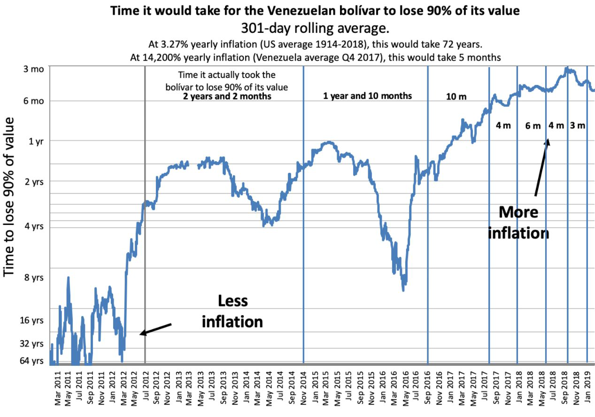
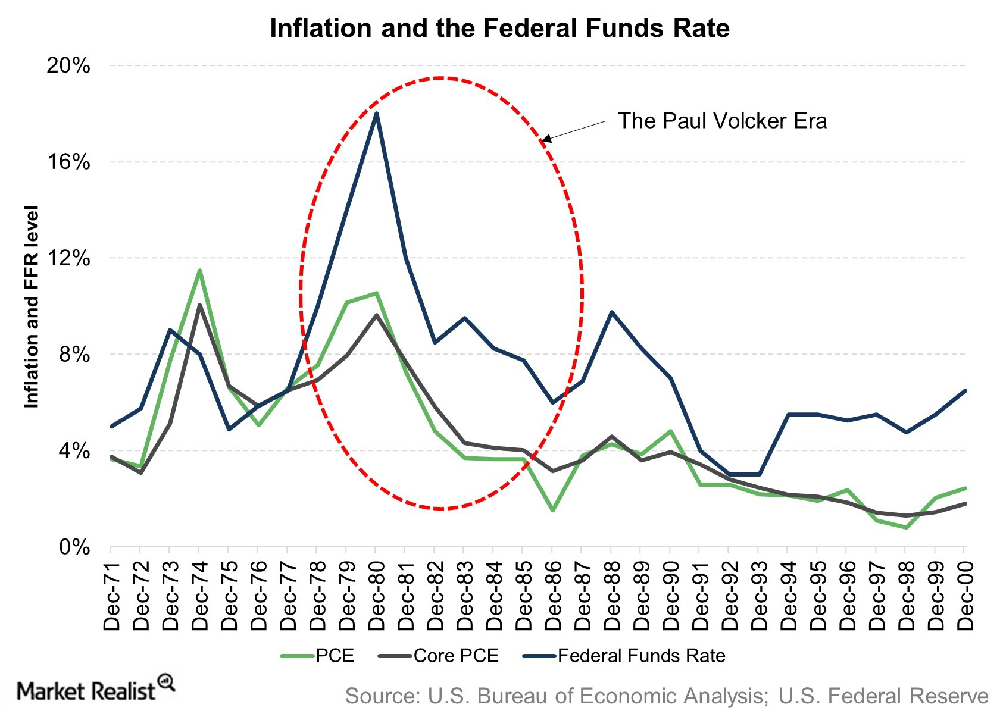

class: center,middle,mctitle-slide 


# Inflation and Deflation

## Manolis Chatzikonstantinou  

---


# What will you learn this week?


- __What is a price index, and how is it used to calculate the inflation rate?__

 - Measures cost of the "same basket of goods" in different years. 

--

- __What are the economic costs of inflation?__

--

- __How do inflation and deflation create winners and losers?__

--

- __Why do policy makers try to maintain a stable rate of inflation?__
---


# Aggregate Price Indices

- __Aggregate price level:__ a measure of the overall level of prices in the economy

- To measure the aggregate price level, economists calculate the cost of purchasing a market basket.

- **Market basket:** a hypothetical set of consumer purchases of goods and services

--

__Price index:__ the cost of purchasing a given market basket
in a given year, where that cost is normalized so that it is
equal to 100 in the selected base year

--
$$
\text{Price index in a given year} = 
$$


$$
\frac{\text{Cost of market basket in a given year}}{\text{Cost of market basket in base year}}\times 100
$$


---

# Calculating the cost of a market basket

|  | January | February |
| :--- | :--- | :--- |
| Price of orange | $$ \$ 0.20 $$ | $$ \$ 0.40 $$ |
| Price of grapefruit | $$ \$ 0.60 $$ | $$ \$ 1.00 $$ |
| Price of lemon | $$ \$ 0.25 $$ | $$ \$ 0.45 $$ |
| Cost of market basket (200 oranges, 50 grapefruit, 100 lemons ) | $$(200 \times 0.20) + (50 \times 0.60)+ (100 \times 0.25) = \$95.00 $$| $$ = \$175.00 $$ |

--

- The CPI in the USA measures the cost of the market basket of a typical urban American family

--
- __The inflation rate:__ the yearly percentage change in a price
index, typically based on consumer price index (CPI), the
most common measure of the aggregate price level.

--


$$
\textbf{Inflation rate: } \frac{\text{Price index in year 2 - Price index in year 1}}{\text{Price index in year 1}}\times 100
$$

---

# The consumer price index 


The makeup of the consumer price index in 2010

```{r  out.width = "70%",echo=FALSE}
knitr::include_graphics("week3graphs/cpibasket.png") 
```


---

# Consumer Prices in the long run

.pull-left[
```{r  out.width = "100%",echo=FALSE}
knitr::include_graphics("week3graphs/cpichange.png") 
```
]


.pull-right[
- The annual percentage increases in recent years have been much smaller than those of the 1970s and early 1980s.

- Evidence that using **real** GDP matters for comparisons over time

- Changes in **prices** + Changes in the **market basket**
]


---

# Other Price Indices

.pull-left[
```{r  out.width = "100%",echo=FALSE}
knitr::include_graphics("week3graphs/cpistats.png") 
```
]

.pull-right[

- __CPI__: Based on consumption basket and prices consumers pay!

- __Producer price index (PPI):__ similar to the CPI, but measures changes in the prices of goods purchased by producers

- Economists also use the GDP deflator that measures the price level by calculating the ratio of nominal to real GDP.


$$
\text { GDP deflator }=100 \times \frac{\text { Nominal GDP }}{\text { Real GDP }}
$$
]

---


# Price level, inflation and deflation 

- The price level is the average level of prices and the value of money.

--

- A persistently rising price level is called inflation

- A persistently falling price level is called deflation

--

-  We are interested in the price level because we want to
  
  1. Measure the inflation rate or the deflation rate
  2. Distinguish between money values and real values of economic variables

--

- Are high prices bad ?


**Real wage** is the wage rate divided by the price level.

**Real income** is income divided by the price level.

???
The rise in prices in the United States since the 1960s hasn’t made the country poorer because it has also raised incomes by the same amount.
The level of prices doesn’t matter.

--

- Is inflation bad? The level of prices doesn’t matter, but the inflation rate does. 

$$
\text { Inflation rate }=\frac{\text { Price level in year } 2-\text { Price level in year } 1}{\text { Price level in year } 1} \times 100
$$

???
Example: If the CPI increases from 120 to 135 over 1 year, what is the inflation rate?


---

# The price vs the inflation level

.pull-left[

```{r  out.width = "80%", fig.align = 'center',echo=FALSE}
knitr::include_graphics("week5graphs/pricesinflation.png") 
```

]


.pull-right[
- The price level has changed a lot. 
- The inflation rate has had both ups and downs. And in 2009, the inflation rate briefly turned negative, a phenomenon called deflation. 
]

High rates of inflation impose significant costs: 
- __Shoe-leather costs__  
- __Menu costs__  
- __Unit-of-account costs__  
--


---

# Winners and losers of inflation

- __Interest rate:__ the return a lender receives for allowing borrowers the use of their savings for one year, calculated as a percentage of the amount borrowed. 
- __Nominal interest rate:__ the interest rate expressed in dollar terms
- __Real interest rate:__ the nominal interest rate minus the rate of inflation

--

- A borrower and a lender enter into a loan contract, the contract specifies a nominal interest rate. But each party has an expectation about the future rate of inflation. 

--

If actual inflation > expected:

- borrowers gain at the expense of lenders:  fund payments to lenders have a lower real value than had been expected. 
- borrowers are the winners and lenders are the losers.

--

If actual inflation < expected:

- lenders gain at the expense of borrowers:  fund payments to lenders have a higher real value than had been expected. 
- lenders are the winners and borrowers are the losers.

--

Uncertainty about future inflation discourages people from entering into any form of long-term contract


---

# Why inflation and deflation cause problems?

- Low, steady, and anticipated inflation or deflation is not a problem.

--

- Unpredictable inflation or deflation is a problem because it:

1. Redistributes income and wealth

2. Lowers real GDP and employment

3. Diverts resources from production

--

- Unpredictable changes in the inflation rate redistribute
income in arbitrary ways between employers and workers
and between borrowers and lenders.

--

- At its worse, inflation becomes hyperinflation an inflation rate
that is so rapid that workers are paid twice a day because money
loses its value so quickly.

---

# Inflation in History!

.pull-left[
```{r  out.width = "80%", fig.align = 'center',echo=FALSE}
 
```
]

.pull-right[

- __Hyperinflation :__ extremely high rate of inflation.

- __Demand pull inflation :__ increases in aggregate demand outpace increases in aggregate supply.

- __Cost push inflation :__ increases in production costs cause firms to raise prices.

]
---

#  Inflation is easy, disinflation in hard

.pull-left[
```{r  out.width = "80%", fig.align = 'center',echo=FALSE}
 
```
]

.pull-right[
- Disinflation: bringing the inflation rate down

- Two major periods of disinflation happened in the mid-1970s and the early 1980s. 

- Disinflation is difficult and costly because it requires a temporary but large increase in the unemployment rate.

- Cold-Turkey policies try to reduce the inflation rate as quickly as possible towards a target.

- Gradualist policies reduce the rate of inflation at a slow pace

]

???
To reduce inflation, policymakers must choose between cold-turkey and gradualist policies. Cold-Turkey policies try to reduce the inflation rate as quickly as possible towards a target. Gradualist policies reduce the rate of inflation at a slow pace, which is to say that these policies move the economy slowly towards a target.
Cold-turkey policies create a shock-effect, which might not be good for the economy if the shock is great, but can be good for the economy if it builds policymaker trustworthiness. Gradualist policies allow policymakers to incorporate new information when playing out the policies

