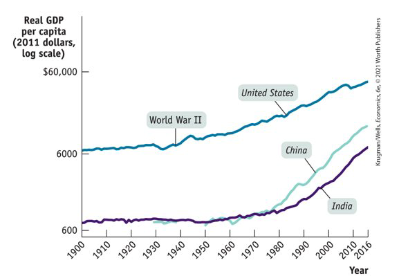
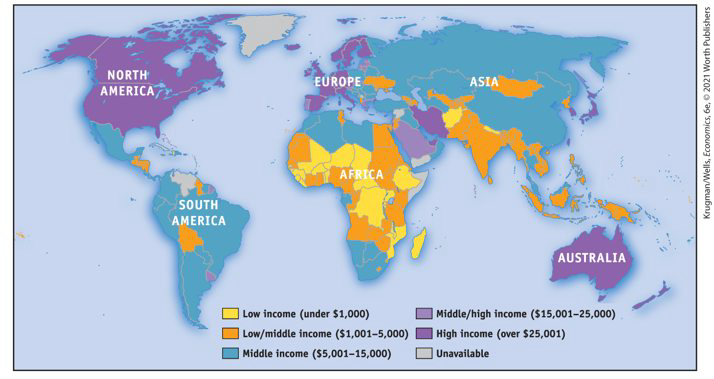
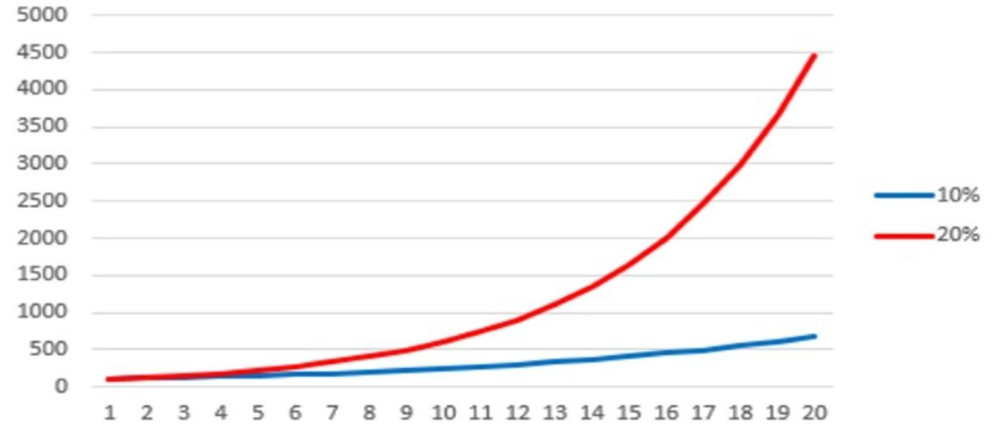
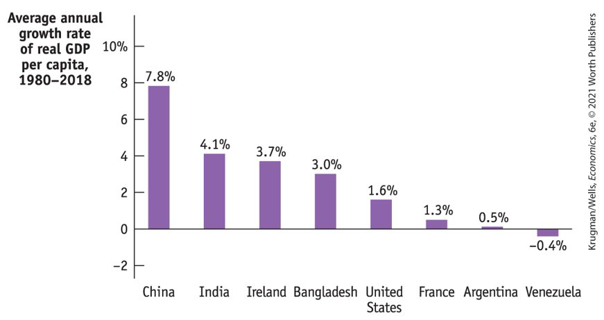
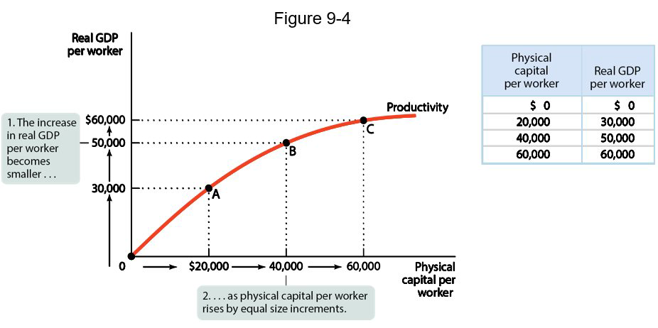
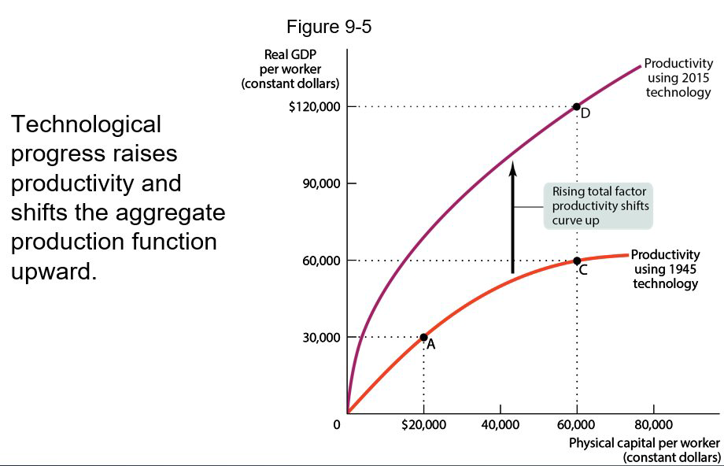
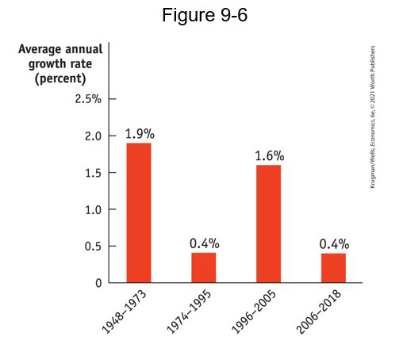
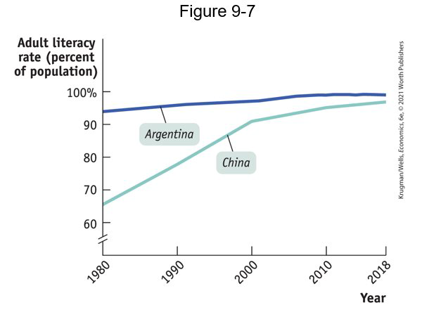
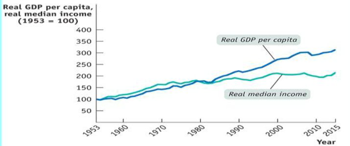

class: center,middle,mctitle-slide 


# Long Run Economic Growth I

## Manolis Chatzikonstantinou  

---


# What will you learn today?


- __Why is long run economic growth measured as the increase in real GDP per capita?__

- __Why is productivity the key to long run economic growth? How is productivity measured?__

- __Why do long run growth rates differ so much among countries?__

--

- How does growth vary among several important regions of the world?

- Convergence Hypothesis and applications

- How does scarcity of natural resources and environmental degradation pose a challenge to sustainable long run economic growth?

---

# Growth has benefits and costs

```{r  out.width = "70%",fig.align='center',echo=FALSE}
 
```

???
Delhi and Beijing have terrible air quality—which is a bad thing. But it’s a by-product of a very good thing: the remarkable economic growth. Why do you think that is? What are other issues with growth?

---

# Comparing economies across time and space


- The key statistic is __real GDP per capita__—real GDP divided by population. 

--

- We focus on GDP because GDP measures the income earned in the economy in a given year. 

- We use real GDP because we want to separate changes in the quantity of goods and services from the effects of a rising price level. 

- We focus on real GDP per capita because we want to isolate the effect of changes in the population.

--

.pull-left[
```{r  out.width = "85%",echo=FALSE}
 
```
]


.pull-right[
- Since 1980 India and China had a much higher growth rate than the United States. 

- The standard of living achieved in the United States in 1900 was attained by China in 2000 and by India in 2016.

]


---

# Real GDP in the US 


| Year | Percentage of 1900 real GDP per capita | Percentage of 2016 real GDP per capita |
| :---: | :---: | :---: |
| 1900 | 100% | 12% |
| 1920 | 136% | 16% |
| 1940 | 181% | 21% |
| 1980 | 474% | 56% |
| 2000 | 734% | 87% |
| 2016 | 848% | 100% |

--

- Growth rates:
    - for decades 1900-1920: 36%
    - for decades 1920-1940: 33%
    - for decades 1940-1980: 161%
    - for decades 1980-2000: 54%
    - for decades 2000-2016: 16%

---

# The Growth Rate – What it Means

- The growth rate between two years, such as 2014 and 2013, is given by the
formula:

$$\text { Growth Rate in 2014 }=\frac{G D P_{2014}-G D P_{2013}}{G D P_{2013}}$$

- GDP usually means real gdp per capita. 

- $GDP_{2014}$ is real GDP per capita in 2014

--

- In order to figure out the GDP over a longer period of time, say between 2009
and 2014 (a period of 5 years), when you know average annual growth rate, e.g. 1.3%

$$G D P_{2014}=G D P_{2009} \times(1.013)^{5}$$

- 1.3% is it the average annual growth rate or more exactly, the rate that would generate the end year result if one growth rate had obtained for the entire time). 

--

- $1.013^5 = 1.0667$, so __cumulative 5-year__ growth rate is 6.7%,

- 1 percent growth matters: $1.013^{50} =  1.91$.

---

# Logarithmic growth rates

- The growth rate between two years in a similar formula:

$$
\begin{gathered}
g=\frac{Y_{2}-Y_{1}}{Y_{1}}=\frac{Y_{2}}{Y_{1}}-1 \\
1+g=\frac{Y_{2}}{Y_{1}}
\end{gathered}
$$
- where $Y_{2}$ is the GDP in year 2 and $Y_{1}$ is the GDP in year 1 , and $g$ is the growth rate

--

- Taking natural log (ln) from both sides:

$$
\begin{gathered}
\ln (1+g)=\ln \left(\frac{Y_{2}}{Y_{1}}\right)=\ln \left(Y_{2}\right)-\ln \left(Y_{1}\right) \\
\text { By log approximation: } \quad g=\ln \left(\frac{Y_{2}}{Y_{1}}\right)=\ln Y_{2}-\ln Y_{1}
\end{gathered}
$$

--

- easy to go from short run to long run calculations:

- $\ln(1.013^5) = \ln(1.0667)$, or in other words (by approximation $\ln(1+x) = x$:)

- $5\times 0.0129 = 0.0645 \rightarrow$ pretty close to real number
???
- log approximation not great for large changes: $ln(1.9) = 0.64 \neq 0.9$!


---

# Incomes around the world
```{r  out.width = "70%",fig.align='center',echo=FALSE}
 
```


- The United States has grown quickly, while some nations have stalled. 

--

- Income levels tend to be similar in the same continent/region

- Geography/Institutions?

???
A quarter of the world’s population lives in countries where the standard of living is lower than it was in the United States in 1900.


---

# Growth rates

- How did the United States manage to produce over eight times as much real GDP per person in 2019 than in 1900? 
It’s a gradual process when real GDP per capita grows a few percent per year. 
It’s helpful to use the Rule of 70 that tells us how long it takes for a variable to double: 


$$
\text { Doubling time for } X=\frac{70}{\text { Annual growth rate of } X}
$$


--

 
- Example: If real GDP per capita is growing at an annual growth rate of 3.5%, it will double in 70/3.5 = 20 years.

```{r  out.width = "60%",fig.align='center',echo=FALSE}
 
```

???
Small improvements add up fast


---

# Comparing recent growth rates

```{r  out.width = "80%",fig.align='center',echo=FALSE}
 
```


---

# The sources of long run economic growth

- Long-run economic growth (per capita) depends on one ingredient: rising productivity. 

--

- Sustained economic growth occurs when the amount of output produced by the average worker $\uparrow$ or of __Labor productivity__ (output per worker) $\uparrow$.  


--


- labor productivity depends on

1. capital deepening 
2. human capital 
3. technical change

--

Point 1: Increase in physical capital

- __Physical capital:__ human-made resources, such as buildings and
machines

--

Point 2: Increase in human capital
- __Human capital:__ the improvement in labor created by the
education and knowledge embodied in the workforce

--

Point 3: ideas + blueprints
- __Technological progress:__ an advance in technology used in production + new products 


???
Why does the average worker today produce far more a century ago? Modern workers have more physical capital, are better educated, and take advantage of a century’s technological progress. 
Natural resources certainly influence productivity, but in the modern world, they are less important than human or physical capital.
Japan, for example, has very few natural resources but very high real GDP per capita. Nigeria is a resource-rich nation but low real GDP per capita.

---

# The aggregate production function

- How much does output change when we change inputs?

- __Aggregate production function:__ a hypothetical function that shows how productivity (real GDP per worker) depends on the quantities of physical capital per worker, human capital per worker, and technology.

--

$$ 
\text{GDP per worker} = T \times \text{(Physical capital per worker)}^{1/3} \times \text{(Human capital per worker)}^{2/3}
$$
- where $T$ is an estimate of the level of technology, and human capital is years of education

--

-  "diminishing returns to physical capital": 
> with  human capital per worker and the state of technology fixed, successive increases in the amount of physical capital per worker leads to a smaller increase in GDP

- For example, a second computer improves one’s productivity, but not by as much as the first computer did.

--

- In practice, all the factors contributing to higher productivity rise over time: both physical capital and human capital per worker increase, and technology advances as well. 

---

# Diminishing returns to physical capital

```{r  out.width = "80%",fig.align='center',echo=FALSE}
 
```

---

# Technological progress


```{r  out.width = "70%",fig.align='center',echo=FALSE}
 
```


---

# The productivity paradox

```{r  out.width = "55%",fig.align='center',echo=FALSE}
 
```


We live in an era of revolutionary technological change, but economic payoffs are hard to see. 
Why?

---

# Why growth rates differ?

Rapidly growing economies excel at:  
 
1. savings and investment spending. 
2. education. 
3. research and development. 

--

.pull-left[

```{r  out.width = "80%",fig.align='center',echo=FALSE}
 
```

]

.pull-right[

- China’s success at adding human capital 

- Research and development (R&D) + Science = New products and technology 

- __Invention to innovation__: U.S. businesses were among the first to adopt R&D

]

--
???
Saving and Investment Spending 
In 2019, investment spending was 43% of China’s GDP, compared with only 21% in the United States.
Money for investment spending comes from savings. Countries with that have high investment spending do so because they have high domestic savings. 


# Left behind by growth


```{r  out.width = "70%",echo=FALSE}
 
```

- A growing share of income went to a few people at the top.

???
Historically, rising real GDP per capita has translated into real income for most people.  This is less and less true in the United States.Two qualifications: economic growth still raises the standard of living of the great majority of the population and gives rise to a global middle class

---

# What we learned?


__Useful Links__

.pull-left[
```{r  out.width = "100%",echo=FALSE}
knitr::include_graphics("week3graphs/inflationpandemic.png") 
```

FIXME 


]

.pull-right[


FIXME 

The following websites provide information on U.S. GDP, inflation, unemployment, and many other interesting macroeconomic variables:

- [Federal Reserve Economic Data](https://fred.stlouisfed.org/)

- [Consumer Price Index (CPI) in the BLS](https://fred.stlouisfed.org/)

- [Inflation during the pandemic](https://www.youtube.com/watch?v=Yrr9X62A1o4)

- [Learning more about Growth](FIXME.com)

- [Distributional Macroeconomics](http://FIXME.com/) 

]

