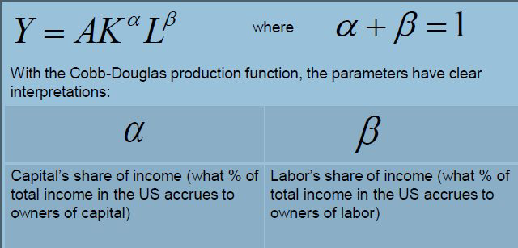
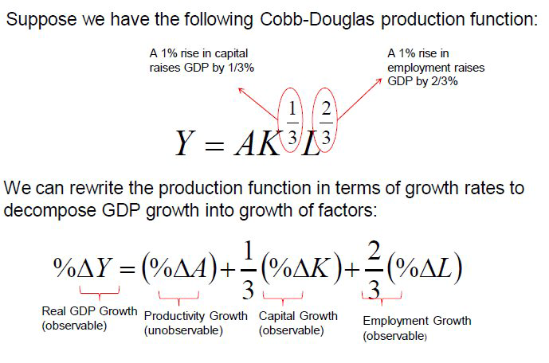
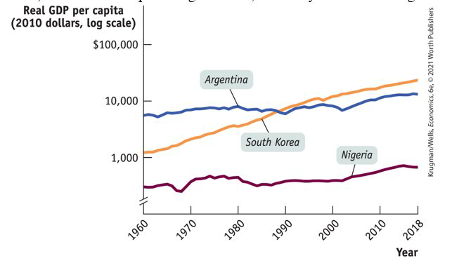
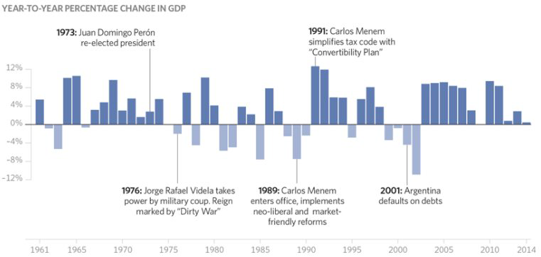
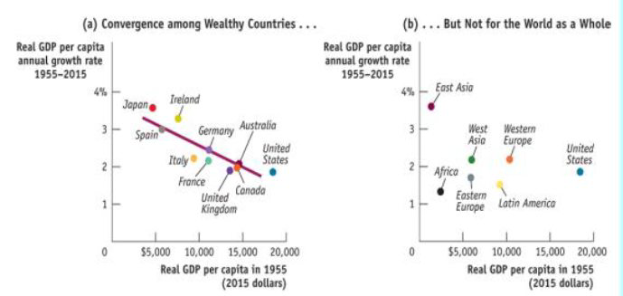
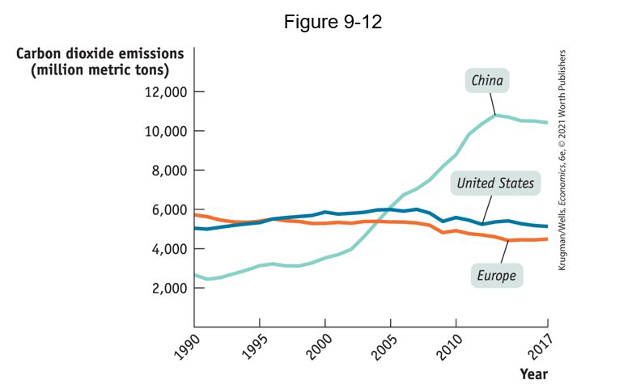
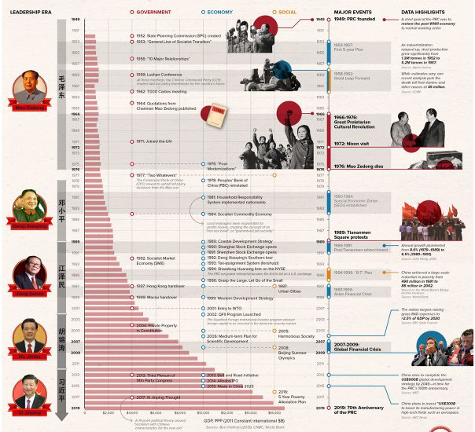

class: center,middle,mctitle-slide 


# Long Run Economic Growth II

## Manolis Chatzikonstantinou  

---


# What will you learn today?


- Why is long run economic growth measured as the increase in real GDP per capita?

- Why is productivity the key to long run economic growth? How is productivity measured?

- Why do long run growth rates differ so much among countries?

--

- __How do we account for different sources of growth?__

- __Convergence Hypothesis and applications__

- __How does scarcity of natural resources and environmental degradation pose a challenge to sustainable long run economic growth?__

---

# Growth accounting

> __Growth accounting:__ estimates of the contribution of each major factor in the aggregate production function to economic growth

> __Labor productivity:__ the amount of output that can be produced with a given amount of labor inputs

--

> __Total factor productivity:__ the amount of output that can be produced with a given amount of factor inputs

--

- When total factor productivity increases, the economy can produce more output with the same quantity of physical capital, human capital, and labor.

--

- Increases in total factor productivity are central to economic growth. 

- Technological progress drives increases in total factor productivity.

--

- According to the Bureau of Labor Statistics, over the period from 1948 to 2019 American labor productivity rose 2.1% per year. 

- 49% of that rise is explained by increases in physical and human capital per worker; the rest is explained by rising total factor productivity—by  technological progress. 

- How do we know? 

---

# Total Factor Productivity 

- From our aggregate production function:

$$ 
\text{GDP} = T \times \text{(Physical capital)}^{1/3} \times \text{(Human capital)}^{2/3} = T \times H  \times  \text{(K)}^{1/3} \times \text{(L)}^{2/3}
$$

- To Total Factor Productivity (anything that effects output other than capital input $\mathrm{K}$ and education-adjusted labor $\mathrm{L}$)

$$TFP =\mathrm{A}=\mathrm{Y} / \mathrm{F}(\mathrm{K}, \mathrm{L})$$

--

 
- __Cobb-Douglas production function:__

.pull-left[
```{r  out.width = "100%",echo=FALSE}
 
```
]

.pull-right[

- Regulation/Rule of law

- Infrastructure/Market access

- Misallocation/Quality of Inputs

- Innovation

- __Measure of our ignorance__
]

???
A convenient functional form for growth accounting is the
---

# Growth accounting 
.pull-left[
```{r  out.width = "100%",echo=FALSE}
 
```
]

.pull-right[
|  | 1939-1948 | 1948-1973 | 1973-1990 | 1990-2007 | 2007-2013 |
| :--- | :---: | :---: | :---: | :---: | :---: |
| Output | 5.79 | 4.00 | 3.10 | 3.60 | 1.1 |
| Capital | 3.34 | 3.70 | 4.20 | 4.10 | 1.4 |
| Labor | 4.46 | 1.00 | 1.90 | 1.60 | -0.1 |
| Productivity | 1.71 | 2.1 | 0.5 | 1.2 | 0.7 |
]

--

- Real GDP growth is declining over time.
- Capital has been growing faster than labor
- The contribution of productivity is diminishing!


---

# Questions for class

The change in read GDP per capita depends on 

$$\text{1.} \Delta K$$
- __What can affect the change in total capital units available?__

--

$$\text{2.} \Delta L$$
- __What can affect the change in labor input?__

--

$$\text{3.} \Delta TFP$$
- __What can affect the change in total capital units available?__

---

# Growth around the world


```{r  out.width = "80%",fig.align='center',echo=FALSE}
 
```


---

# East Asia’s miracle

- It took South Korea only 35 years to achieve growth that required centuries elsewhere.
- Since 1975, the East Asian region grew ( RGDP per capita) by 6% per year, more than three times the US growth rate. How?
--

- $K$:Very high savings rates allow businesses to borrow and add more physical capital per worker. 

--

- $L$:Very good basic education has permitted a rapid improvement in human capital. 

--

- $TFP$:Substantial technological progress

--

- Economic growth can be especially fast in countries that are playing catch-up to countries with higher GDP per capita.
- East Asian economies grew fast because they adopted the technologies that already existed.


---

#  Latin America's disappointment

- What’s holding Argentina (and other Latin American nations) back?


```{r  out.width = "70%",fig.align='center',echo=FALSE}
 
```


--

- Irresponsible government action that eroded savings through high inflation
- Lack of emphasis on education
- Political instability

---

# Africa’s Troubles and promise 

- What’s holding much of Africa back?

--

- Government corruption
- Civil wars and  political instability
- Unfavorable geography

--

- Is Africa poor because it’s politically unstable or unstable because it’s poor? 

--

- __The convergence hypothesis:__ differences in real GDP per capita among countries tend to narrow over time
- But having a low real GDP per capita is no guarantee of rapid growth, as the examples of Latin America and Africa demonstrate. Conditional convergence!
- Good news: Growth rates are up in sub-Saharan African nations since 2011.


???
Good news: Growth rates are up in sub-Saharan African nations since 2011.

---


# Convergence hypothesis

```{r  out.width = "90%",fig.align='center',echo=FALSE}
 
```

---

# The role of government in economic growth 

__Six channels:__

- Government subsidies to infrastructure    
  - China spends more on infrastructure than Western Europe and North America combined.


--

- Government subsidies to education
  - Literacy in China has been increasing more rapidly than in Argentina. 

--
- Government subsidies to R&D
  - the Advanced Research Projects Agency Network (ARPANET), created by the U.S. Department of Defense.

--

- Maintaining a well-functioning financial system
  - If people distrust banks $\rightarrow$ cash in safe deposit boxes $\rightarrow$  not  turned into productive investment spending.
--

- Protection of property rights
  - Well functioning markets, e.g. patents and invention markets 

--

- Political stability and good governance 


???
- Government policies can increase the economy’s growth rate through the following six channels: 
Infrastructure: roads, power lines, ports, information networks, and other underpinnings for economic activity
Property rights are the legal rights held by owners of valuable items to dispose of those items as they choose. 
Intellectual property rights are the rights of innovators to accrue the rewards of their innovations. 
(government-created temporary monopolies given to innovators for the use or sale of their innovations).
There’s not much point in investing in a business if rioting mobs are likely to destroy it.
Economic success of the United States has been possible because there are good laws, institutions that enforce those laws, and a stable political system that maintains those institutions

---

# Questions for class

- We would like all countries to achieve high rates of growth

- __Is it possible for all countries to have a level of per-capita GDP equivalent to that of the United States?__

--

- __Are there enough resources to sustain growth rates as those in SE Asia?__

--

- __Would the quality of the environment be negatively affected?__

---

# Is world growth sustainable?

.pull-left[
__Sustainable long-run economic growth:__ long-run growth that can continue in the face of the limited supply of natural resources and the impact of growth on the environment
]

.pull-right[
- Theory: economic growth will be severely limited by lack of resources. 
- Economists believe that modern economies handle scarcity fairly well. 
- Directed technical change!
]


--

```{r  out.width = "50%",fig.align='center',echo=FALSE}
 
```

???
Malthus argued that two types of checks hold population within resource limits: positive checks, which raise the death rate; and preventive ones, which lower the birth rat
Resource scarcity leads to high prices, and these high prices provide strong incentives to conserve the resource and find alternatives. 
For example, after the sharp oil price increases of the 1970s, U.S. consumers turned to smaller, more fuel-efficient cars.
The United States and Europe have historically been responsible for the great bulk of carbon dioxide emissions. 
As China and other emerging economies have grown, they began to emit much more carbon dioxide.


---

#  Economic growth and the environment

- Economic growth tends to have adverse impact on the environment:
  - pollution, loss of wildlife habitats, extinction of species, and reduced biodiversity.
  - There’s local effect and a global effect of environmental 
  - Tradeoff of developing counties: industrialize but generate harm for all households in the world  
--

__Climate change:__ changes in Earth’s climate brought about by human activity 

> Unmitigated climate change will cost 20% of world gross domestic product by 2100. Moreover, these costs tend to fall more heavily on poor countries.

--

- Climate change is been a hard problem to solve because it requires the cooperation of many countries.

- China and India agreed to limit their emissions, and the rich countries committed to help poorer countries pay the cost. 


---


# What we learned?


__Useful Links__

.pull-left[
```{r  out.width = "100%",fig.align='center',echo=FALSE}
 
```

]

.pull-right[

- [Innovation and Growth](https://www.ecb.europa.eu/ecb/educational/explainers/tell-me-more/html/growth.en.html)

- [Converging to convergence](https://www.youtube.com/watch?v=agrqciukZoU)

- [Boosting GDP growth by accounting for the environment](https://www-science-org.proxy.library.georgetown.edu/doi/10.1126/science.1253506)

- [Growth, sustainability, and the measurement of global gross product](https://voxeu.org/article/growth-sustainability-and-measurement-global-gross-product)

- [Climate Change, Climate Policy, and Economic Growth](https://www.youtube.com/watch?v=v4WzeuvBS_w)

- [IMF Asks James Stock about Climate Change and the Role of Integrated Assessment Models](https://www.youtube.com/watch?v=gj4W9V3gyT0)
]

