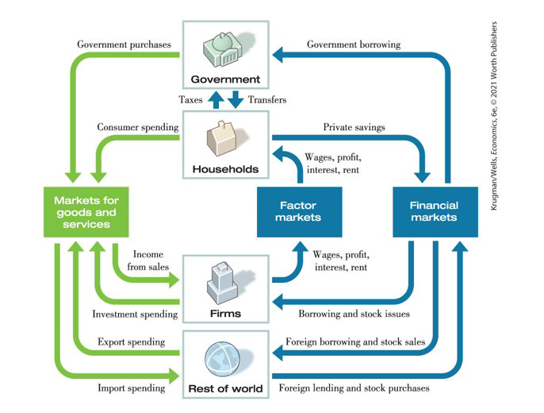

class: center,middle,mctitle-slide 


# The financial system

## Manolis Chatzikonstantinou  

---

# What will you learn today?


```{r  out.width = "100%",out.length = "100%", fig.align = 'center',echo=FALSE}
 
```

- The financial system

- Origins of the 2007-13 economic crisis: why did a failure of the financial system (of banks in particular) produce the largest recession
- Banks at the core of the economy
- The policy response to the Önancial crisis

---

# The necessity of finance

- Having a good idea isn’t enough to build a business.

- Who Pays for Private Investment Spending?

--

- Investment in the modern economy, individuals and firms that create physical capital often do it with other people’s money

--

It’s important to stay clear about the different kinds of
capital (as explained in the previous chapter):
1.
Physical capital consists of manufactured resources, such as
buildings and machines.
2.
Human capital is the improvement in the labor force
generated by education and knowledge.
3.
Financial capital is funds from savings that are available for
investment spending.


---

# The financial System

Financial markets are where households invest their current savings and their accumulated savings, or wealth, by purchasing financial assets. 
A financial asset is a paper claim that entitles the buyer to future income from the seller. For example, when a saver lends funds to a company, the loan is a financial asset sold by the company that entitles the lender (the buyer of the financial asset) to future income from the company. 
A household can also invest its current savings or wealth by purchasing a physical asset, a tangible object that can be used to generate future income. Examples: a house or a piece of equipment. 
If you get a loan from your local bank, you and the bank are creating a financial asset: your loan. 
A loan is a financial asset, owned by the lender. A loan creates a liability, a requirement to pay income in the future. 
Because a financial asset is a claim to future income that someone has to pay, it is also someone else’s liability.

---

Financial markets are split into debt and equity markets.
•
Debt titles are the most commonly traded security. In these
arrangements, the issuer of the title (borrower) earns some
initial amount of money (such as the price of a bond) and the
holder (lender) subsequently receives a fixed amount of
payments over a specified period of time, known as the
maturity of a debt title
•
Common debt titles are bonds or mortgages.
•
Equity titles are somewhat different from bonds. The most
common equity title is (common) stock.
•
First and foremost, an equity instruments makes its buyer
(lender) an owner of the borrower’s

---

# Markets and assets

Markets are divided into primary and secondary markets
•
Primary markets are markets in which financial instruments
are newly issued by borrowers.
•
Secondary markets are markets in which financial
instruments already in existence are traded among lenders.
Secondary markets can be organized as exchanges, in which
titles are traded in a central location, such as a stock
exchange, or alternatively as over the counter markets in
which titles are sold in several locations.
•
Finally, we make a distinction between money and capital
markets.
•
Money markets are markets in which only short term debt
titles are traded.
•
Capital markets are markets in which longer term debt and
equity instruments are traded.

--

Loans 
A loan is a lending agreement between an individual lender and an individual borrower.
Making a loan typically involves a lot of transaction costs (costs of negotiating the terms, investigating the borrower’s credit history, etc.). To minimize these costs, corporations and governments often issue bonds. 


Bond: an IOU issued by the borrower, usually with a set
interest and maturity date
•
A concern for investors is the possibility of default (failure of a
borrower to make payments as specified)
•
More risky bonds carry higher interest rates
•
Loan backed securities: assets created by pooling
individual loans and selling shares in that pool (a process
called securitization)
•
With so many loans packaged together, it can be difficult to
assess the true quality of the asset, as in the financial crisis of
2008.
•
Stock: a share in the ownership of a company

---

# The use of a financial system

A well-functioning financial system is a critical ingredient in achieving long-run growth because it encourages greater savings and investment spending. It also ensures that savings and investment spending are undertaken efficiently.
Three tasks of a financial system:
Reducing transaction costs
Transaction costs: the expenses of negotiating and executing a deal
Reducing risk
Financial risk: uncertainty about future outcomes that involve financial losses or gains
Most people are risk-averse, and a financial system helps people reduce their exposure to risk. 
Diversification: investing in several assets with unrelated, or independent, risks; reduces risk
Providing liquidity
Liquidity: a measure of how quickly an asset can be converted into cash with relatively little loss of value
If it can be converted into cash quickly, it’s liquid; if not, illiquid

---

# Financial intermediaries

Financial intermediary : an institution that transforms
the funds it GATHERS from many individuals into
financial assets.
•
mutual funds
•
pension funds and life insurance companies
•
banks

--

__Funds:__

.pull-left[
Pension fund: a type of mutual fund that holds assets to provide retirement income to its members
Life insurance company: sells policies that guarantee a payment to a policyholder’s beneficiaries when the policyholder dies
]

.pull-right[
Owning shares of a company means accepting risk in return for a higher potential reward. Investors can lower their risk by owning a diversified portfolio of stocks.
Building a diversified portfolio can incur high transaction costs (particularly fees paid to stockbrokers). The solution is mutual funds.
Mutual fund: financial intermediary that builds a stock portfolio and resells shares of this portfolio to individual investors

]
---

# Banks

Bank deposit: a claim on a bank that obliges the bank to give the depositor their cash when demanded
Bank: a financial intermediary that provides liquid assets in the form of bank deposits to lenders and uses those funds to finance the illiquid investment spending needs of borrowers who don’t want to use the stock or bond markets
A bank is lending for long periods of time while its depositors could demand their funds back at any time. How can it manage that?
On average, only a small fraction of depositors will want their cash at the same time. So the bank needs to keep only a limited amount of cash on hand to satisfy its depositors.
In addition, individual bank deposits are guaranteed up to $250,000 by the Federal Deposit Insurance Corporation, or FDIC. This reduces the incentive to withdraw funds if there are concerns about the bank.

--

U.S. companies tend to issue bonds, while European companies rely on bank borrowing. 
--
Why the difference? U.S. businesses are more inclined to take risks. Also, European banks have more money than 
U.S. banks because Europeans tend to keep more money in banks than Americans
---

# Macroeconomics and the Financial System

 Understanding banks
I balance sheets
I leverage
I non-linearities

--

The balance sheets of banks and other Önancial Örms are central
to understanding how a Önancial system works and why in 2007-08
it blew up
I Before studying the Önancial system we thus need to understand
what a balance sheet is. We do it in 3 steps:
I deÖnition
I balance sheet of a household
I balance sheet of a bank

---

# Balance sheets explained

.pull-left[
__Assets:__ Saving for a rainy day
]
.pull-right[
__Liabilities:__ Other people's money
]

--

 Assume you wished to set up a company and to start you need 100K$. You have 10K of your own (your
skin in the game) and borrow 90K from a bank. You then spend 95k to start the company (this is the
money working for you) and leave 5K in the bank as a bu§er in case something (small) goes wrong
I You can loose Your skin in the game. If you loose more, i.e. Other peopleís money, you are bankrupt. Your
skin in the game is the bu§er against possible losses: the smaller the bu§er, the smaller the losses you can
withstand without going bankrupt.

--

$$
\text { Leverage }=\frac{\text { Assets }}{\text { Your Skin in the Game }}=\frac{\text { Assets }}{\text { Equity }}
$$
---

# Example: the balance sheet of a household
I Consider a household which bought a house Önanced by a mortgage
I How large is the mortgage as a fraction of the value of the house
obviously makes a big di§erence
I Also the type of mortgage makes a di§erence: is the interest rate
Öxed, or does it áoat with market rates? At current interest rates
and at current house prices the household may look perfectly able to
make the mortgage payments, but what if house prices fall, or
interest rates rise?
I To understand how risky is the position of this household we need
to know its balance sheet, i.e. the value of the house and the size
and conditions of the mortgage

--

.pull-left[

week7graphs/bshouse
]


.pull-right[
 this family has purchased a house with a downpayment of 100 and a
mortgage worth 900. Its net worth (its Equity) is 160: 100 (equity
in the house) + 60 (cash and stocks)
I its leverage (the ratio of Assets to the familyís net worth) is
1060/160 = 6.625
]

---

# Balance sheet of a household (thousand US $)

-  Assume house prices fall 30% and the value of the house falls to
700. The family is broke: itís net worth has become negative:
60 + (100 300) = 140 (because the 100 of equity in the
house is less than the fall in the value of the house)

--

bshouse2

--

If the interest rate on the mortgage remains unchanged, he family is
still able to make its monthly mortgage payment: just looking at
áows (monthly income and monthly mortgage payments) we would
not have guessed the family could be in trouble.
I The problem is that this family had too much debt. What would
have happened if its leverage had been 2 instead of 6.625?

---

# The Balance Sheet of a Bank

$$ \text { Leverage }=\frac{\text { Assets }}{\text { Your Skin in the Game }}=\frac{\text { Assets }}{\text { Equity }}$$

--

The balance sheet of banks is crucial to understand
I their role in transferring savings from households to Örms
I why they are fragile institutions
I remember that the reason banks hold equity is to absorb
possible losses on the assets they own
I how much equity should a bank have is the central question in
the current debate about reforming the Önancial system and
thus avoid another Önancial disaster
I Thus there is a tradeo§
I the more equity a bank holds, the larger its bu§er, the stronger
the bank is, i.e. the less likely it goes bankrupt
I the more equity a bank has, the lower its proÖtability: this
explains why raising equity is di¢ cult

--

__A model of a bank__: 
Assume a bank has an amount of debt (e.g. deposits) $D$ and an amount of equity $(\bar{K})$ also called capital. Its liabilities are $L=D+\bar{K}$, equal to its total assets

 The bank holds two types of assets
I loans and other investments (what we called Money working
for you)
I reserves (what we called Savings for a rainy day)
Let α be the fraction of total assets invested, and (1 α) the
fraction kept as reserves


---

# Leverage and default

nvestment is risky: for each dollar invested today you get p
dollars tomorrow; where p is a random variable.

-- 

bankmodel.png

--

-  Here we see why banks hold equity: in order to be able to
absorb losses (or gains) on their assets. Note that the capital
tomorrow is equal to the original capital plus the realized

- The bank's leverage ratio is $\lambda=\frac{\text { Assets }}{\text { Capital }}=\frac{L}{\text { Capital, }}$, the ratio of total assets (equal to total liabilities) to capital

- $$ p(\alpha L)+(1-\alpha) L<D $$
The last line says that the bank is broke when the value of assets is not enough to pay for deposits

The possibility that the bank defaults (becomes unable to pay its debt) introduces a non-linearity

--- 

# Probability of default

What is the probability that a bank will go broke? Using the expression
for the leverage ratio $\lambda=\frac{L}{\bar{K}}$
$$
\operatorname{Prob}(\bar{K}-(1-p)(\alpha L)<0)=\operatorname{Prob}\left(p<1-\frac{\bar{K}}{\alpha L}\right)
$$
$$
\operatorname{Prob}\left(p<1-\frac{\bar{K}}{\alpha L}\right)=\operatorname{Prob}\left(p<1-\frac{1}{\alpha \lambda}\right)
$$

--

- which is increasing in α : for a given value K¯ , the higher the
fraction of total assets the bank invests in the risky asset, the
higher the probability it goes broke

- for given α, the probability that a bank will go broke is an
increasing function of the leverage ratio λ. To reduce λ the
bank can
I keep its assets, L, constant but Önance them with less debt
and more equity (remember, L = K¯ + D)
I keep K¯ constant but reduce L ó for example reducing loans to
Örms and householdsó thus reducing 

??? 
Banks may have a high λ and still be safe by keeping α lowñand indeed
this was thought to be the case for European banks which own lots of
"safe" government bonds. This is why Deutsche Bank was considered
safe even with a value of λ almost three times that of Citi.

---

# The Leverage of European Banks and the Crisis in the Euro Area

euleverage

---

# Review and useful readings
We have studied 2 reasons why banks (more generally a financial system) are 
useful:
1. by monitoring firms and making it harder for entrepreneurs to shirk banks allow 
projects that otherwise could not be financed to be implemented (as we studied in the 
Holmstrom- Tirole model) 
2. by transforming maturities they allow the savings that households wish to keep 
“liquid” (i.e. immediately accessible) to be used to fund long-term projects (as we 
studied in the Diamond-Dybvig model) 
We have also learned (with the Tirole model) that it is important that banks be 
diversified, otherwise too much liquidity may end up in some places that do 
not need it, and too little where it would be needed 
Finally we have learned how financial contracts may amplify macro shocks
We now ask why this helps us understand the origin of financial crisis exploded in 
2007-08 and not yet over

Promises that proved ultimately empty
“Unless banks can better demonstrate their usefulness to society, they face a 
debilitating battle against new regulation.” 
John Gapper, Financial Times, January 10, 2012.
Playing with Fire
“Financial Innovation can do a lot of good. It its tendency to excess that must be 
curbed”
Andrew Palmer, The Economist, February 25, 2012

