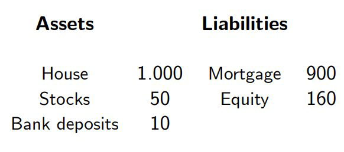
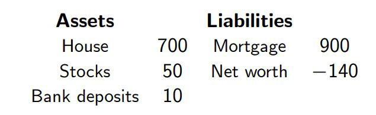
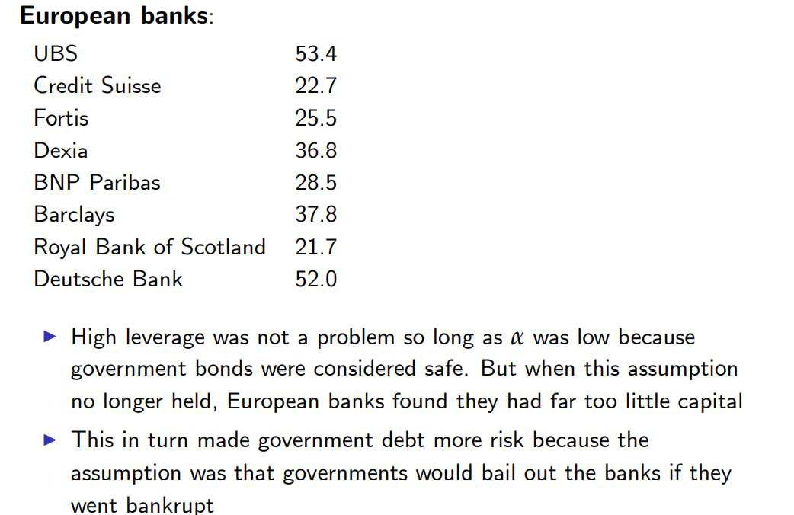

class: center,middle,mctitle-slide 


# The financial system

## Manolis Chatzikonstantinou  

---

# What will you learn today?


- What is the financial system

--

- Banks at the core of the economy


--

- The different financial instruments that people use to invest and borrow.

--

- What are the origins of the 2007-13 economic crisis: 

--

- How did a failure of the financial system (of banks in particular) produce the largest modern recession

---

# The necessity of finance

- Having a good idea isn’t enough to build a business.

- You need to go from idea to production, which requires capital!

- Who Pays for Private Investment Spending?

--

- Investment in the modern economy:

- individuals and firms that create physical capital often do it with other people’s money

- they borrow from banks, and use cash inflows from investors.

--

__Know the different kinds of capital__:

  1. Physical capital consists of manufactured resources, such as
buildings and machines.

  2. Human capital is the improvement in the labor force
generated by education and knowledge.

  3. Financial capital is funds from savings that are available for
investment spending.


---

# The financial System


```{r  out.width = "65%",out.length = "70%", fig.align = 'center',echo=FALSE}
knitr::include_graphics("week2graphs/circflow.png") 
```


---

# The financial System


- Financial markets are where households invest their accumulated savings, or wealth, by purchasing financial assets. 

--

- A financial asset is a paper claim that entitles the buyer to future income from the seller. For example, 
  - when a saver lends funds to a company, the loan is a financial asset promising future payments to the household.
  - A household invest its current savings or wealth by purchasing equity, a claim to the property of the firm
  - a physical asset, commercial real estate and houses.
  
--

Financial assets:

1. __Loans:__ asset for a bank, liability for the lender ,payments:(interest+principal)
2. __Bonds:__ issued directly by a borrower! payments:(interest+principal)
3. __Stocks:__ Stocks are shares in the ownership of a company. payments:(dividends)
4. __Asset backed securities__:pooling individual loans and selling shares in that pool 

--

- Cost of default is high for loans and bonds
- Values of stocks are more variable. Stocks are riskier!

???
If you get a loan from your local bank, you and the bank are creating a financial asset: your loan. 
A loan is a financial asset, owned by the lender. A loan creates a liability, a requirement to pay income in the future. 
Because a financial asset is a claim to future income that someone has to pay, it is also someone else’s liability.
Loan-backed securities are assets created by pooling individual loans and selling shares in that pool (“securitization”). 
With many loans packaged together, it can be difficult to assess the quality of the asset. 
A bond is an IOU issued by a borrower.
The bond’s issuer promises to pay a fixed interest each year and to repay the principal to the bondholder on a particular date. 
Default is the risk that the bond issuer will fail to make payments. Bonds with a higher default risk must pay a higher interest rate to attract investors.
The bursting of the housing bubble in 2008 led to widespread defaults on supposedly “safe” mortgage-backed securities.  
Stocks  For example,  Microsoft has nearly 8 billion shares; if you buy a share, you are entitled to one eight billionth of the company’s profit.
Owning stocks is riskier than owning bonds

---

# Financial markets

- Financial markets are split into debt and equity markets.

  - Debt titles are the most commonly traded security.
  
  - Common debt titles are bonds or mortgages.

  - The most common equity title is (common) stock.

--

- Markets are divided into primary and secondary markets

  - Primary markets are markets in which titles are newly issued by borrowers/firms.

  - Secondary markets are markets in which financial instruments already in existence are trades

--

- Money vs capital markets.

  - Money markets are markets in which only short term debt titles are traded.
  - Capital markets are markets in which longer term debt and equity instruments are traded.


---

# The use of a financial system

- A well-functioning financial system is  critical for long-run growth 
  - it encourages greater savings and investment spending.
  - efficient allocation of savings and efficient investment spending 
  
--

Three tasks of a financial system:

- __Reducing transaction costs:__
  - _Transaction costs:_ the expenses of negotiating and executing a deal Reducing risk

- __Financial risk:__ uncertainty about future outcomes that involve financial losses or gains
  - Most people are risk-averse, and a financial system helps people reduce their exposure to risk. 
  - _Diversification:_ investing in several assets with unrelated, or independent, risks; reduces risk
  
- __Providing liquidity:__
  - _Liquidity:_ a measure of how quickly an asset can be converted into cash with relatively little loss of value
  - If it can be converted into cash quickly, it’s liquid; if not, illiquid

---

# Financial intermediaries

- __Financial intermediary:__ an institution that transforms the funds it gets from many individuals into financial assets.

 1. mutual funds

 2. pension funds and life insurance companies

 3. banks

--


.pull-left[

__Funds:__

- Mutual fund: financial intermediary that builds a stock portfolio and resells shares of this portfolio to individual investor

- Pension fund: a type of mutual fund that holds assets to provide retirement income to its members

- Life insurance company: sells policies that guarantee a payment to a policyholder’s beneficiaries when the policyholder dies
]

.pull-right[

__Why do they exist?:__

- Investors can lower their risk by owning a diversified portfolio of stocks.

- Building a diversified portfolio can incur high transaction costs (particularly fees paid to stockbrokers). The solution is mutual funds.

]
---

# Banks

__Bank:__ a financial intermediary that provides liquid assets to lenders and finances illiquid investment spending


--

- __Bank deposit:__ a claim on a bank that obliges the bank to give the depositor their cash when demanded
- __Bank Loan:__ a claim of a bank that determines the time of payments from lenders

--

- A bank is lending for long periods of time while deposits can be demanded  at any time. How can it manage that?
  - On average, only a small fraction of depositors will want their cash at the same time.
  - a bank keeps only a limited amount of cash on hand to satisfy its depositors.
  - bank deposits are guaranteed up to $250,000 by the Federal Deposit Insurance Corporation, or FDIC.
  - __Bank runs__
  
  
--

- U.S. companies tend to issue bonds, while European companies rely on bank borrowing. Why the difference?

???
This reduces the incentive to withdraw funds if there are concerns about the bank.
U.S. businesses are more inclined to take risks. Also, European banks have more money than 
U.S. banks because Europeans tend to keep more money in banks than Americans
---

# Macroeconomics and Banks: Balance sheets explained

- The balance sheets of households, banks and other financial firms are central to Macro

--

.pull-left[
__Assets:__ Saving for a rainy day
]
.pull-right[
__Liabilities:__ Other people's money
]

--

- Assume you wished to set up a company and to start you need 100K$. 
- You have 10K of your own (your skin in the game) and borrow 90K from a bank. 
- You then spend 95k to start the company and leave 5K in the bank 

--

| Assets| Liabilities|
|-------|------------|
|95 M.V. firm| Loan 90|
|5 Cash| Equity 10|
--

$$
\text { Leverage }=\frac{\text { Assets }}{\text { Your Skin in the Game }}=\frac{\text { Assets }}{\text { Equity }}
$$
---

# Example: the balance sheet of a household

- Example: buying a house financed by a mortgage
  - the mortgage as a fraction of the value of the house is important
  -  the type of mortgage makes a difference: fixed/flexible interest rate
  - To understand how risky is the position of this household we need
to know its balance sheet, i.e. the value of the house and the size
and conditions of the mortgage

--

.pull-left[
```{r  out.width = "65%",out.length = "70%", fig.align = 'center',echo=FALSE}
 
```

]


.pull-right[
 - this family has purchased a house with a downpayment of 100 and a
mortgage worth 900.
- Its net worth (its Equity) is 160: 100 (equity in the house) + 60 (cash and stocks)
- its leverage (the ratio of Assets to  net worth) is 1060/160 = 6.625
]

---

# Balance sheet of a household

-  Assume house prices fall 30% and the value of the house falls to 700. 
- The family is close to default: net worth has become negative: 60 + (100 - 300) = - 140 

--

```{r  out.width = "65%",out.length = "70%", fig.align = 'center',echo=FALSE}
 
```

--

- If the interest rate on the mortgage remains unchanged, 
  - the family is still able to make its monthly mortgage payment: 
  - looking at monthly income and monthly mortgage payments, we would not have guessed the family could be in trouble.

--

- The problem is that this family had too much debt. 
- What would have happened if its leverage had been 2 instead of 6.625?

---

# The Balance Sheet of a Bank

$$ \text { Leverage }=\frac{\text { Assets }}{\text { Your Skin in the Game }}=\frac{\text { Assets }}{\text { Equity }}$$

--

The balance sheet of banks is crucial to understand
  - their role in transferring savings from households to firms
  - why they are fragile institutions
  - remember that the reason banks hold equity is to absorb possible losses on the assets they own

__How much equity should a bank have?__

--

__A model of a bank__: 

Assume a bank has an amount of debt (e.g. deposits) $D$ and an amount of equity(net worth) $(\bar{K})$ also called capital. Its liabilities are $L=D+\bar{K}$, equal to its total assets

The bank's balance sheet can also be understood, the same way as a household's balance sheet.


- Leverage ratio  $\lambda=\frac{\text { Assets }}{\text { Net Worth }}=\frac{L}{K}$


---

# Probability of default

What is the probability that a bank will go broke? 

It is the probability, that after a negative shock, the net worth becomes negative.
--

When is it higher?

- the higher the
fraction of total assets the bank invests in  risky assets, e.g. risky loans that
ofter lose their value

-  the higher the leverage ratio of the bank is. 


???
Banks may have a high λ and still be safe by keeping α lowñand indeed
this was thought to be the case for European banks which own lots of
"safe" government bonds. This is why Deutsche Bank was considered
safe even with a value of λ almost three times that of Citi.


---

# The Leverage of European Banks and the EU Crisis 

```{r  out.width = "65%",out.length = "70%", fig.align = 'center',echo=FALSE}
 
```


---

# Useful readings

.pull-left[
```{r  out.width = "65%",out.length = "70%", fig.align = 'center',echo=FALSE}
 
```
]

.pull-right[

- [Banking on leverage](https://www.bis.org/speeches/sp140226.htm)


- [Leverage in the financial sector](https://www.federalreserve.gov/publications/2020-may-financial-stability-report-leverage.htm)


- [Household Debt](https://www.federalreserve.gov/releases/z1/dataviz/household_debt/)

]
