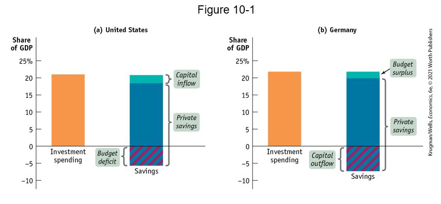
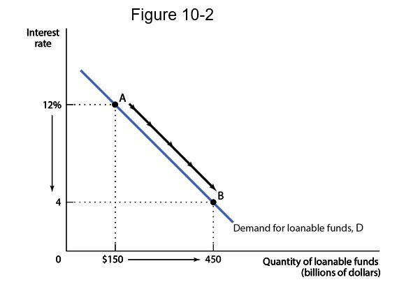
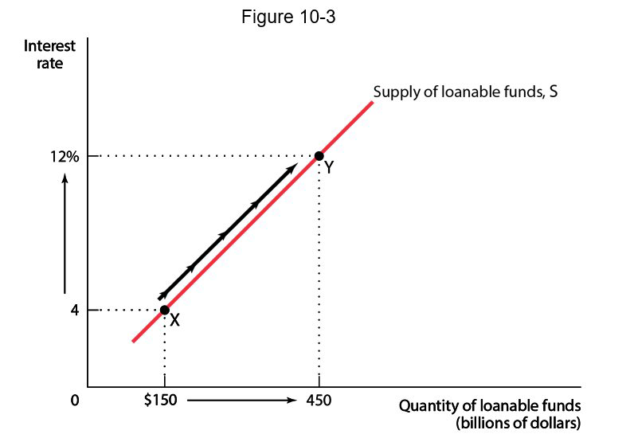
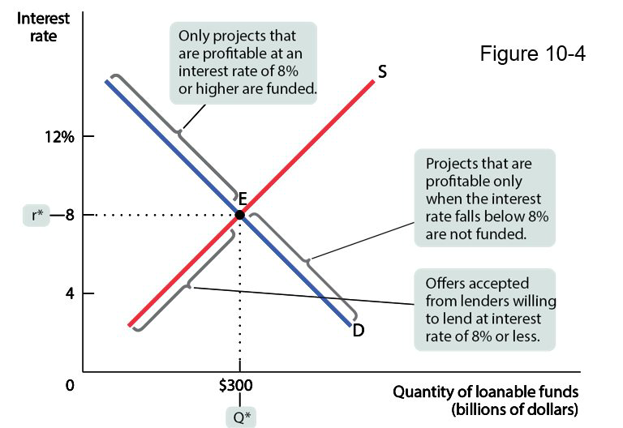
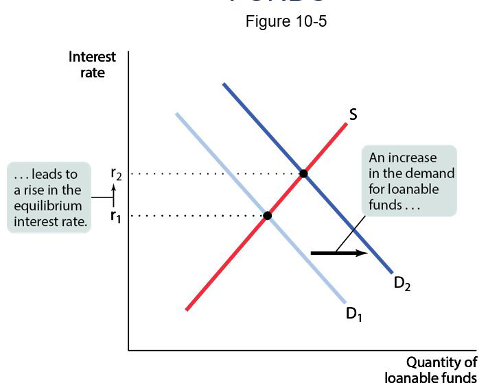
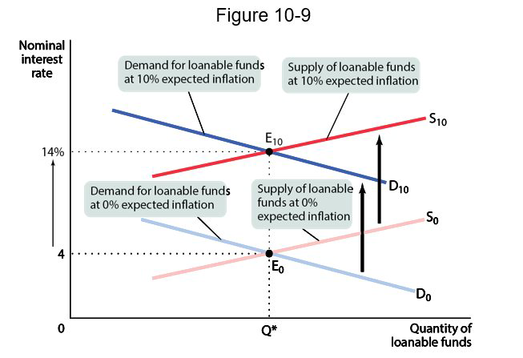
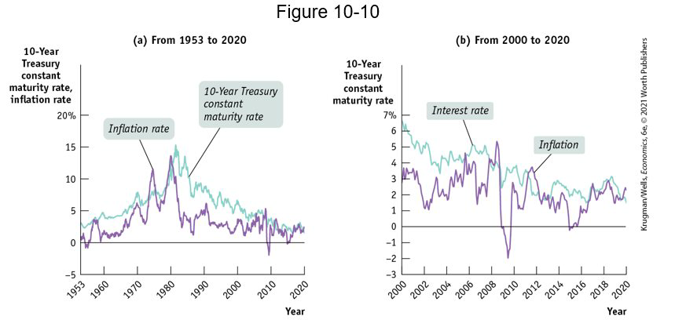

class: center,middle,mctitle-slide 


# The financial system

## Manolis Chatzikonstantinou  

---

# # What will you learn in this lecture?


```{r  out.width = "100%",out.length = "100%", fig.align = 'center',echo=FALSE}
knitr::include_graphics("week9graphs/nyse.jpg") 
```

- What is the relationship between savings and investment spending?
How does the loanable funds market match savers with borrowers?


---

# MATCHING UP SAVINGS AND INVESTMENT SPENDING

Who pays for private investment spending?
In the modern economy, individuals and firms that create physical capital often do it with other people’s money.
Savings–investment spending identity: savings and investment spending are always equal for the economy as a whole

--

- In a closed economy, exports: $X=0$ and imports: $I M=0$ so that

$$ GDP =C+I+G .$$

---

Total income = Total spending. 

Income can either be spent on consumption—consumer spending (C) plus government purchases of goods and services (G)—or saved (S):

GDP $=C+G+S$
Total income $=$ Consumption spending $+$ Savings
Meanwhile, total income = consumption spending + investment spending:
GDP $=C+G+I .$

---

# THE SAVINGS–INVESTMENT SPENDING IDENTITY IN A CLOSED ECONOMY 

- Total income = consumption spending + savings 
Total income = consumption spending + investment spending

- Putting these equations together, we get:

$$ C+G+S =C+I+G .$$
Subtracting (C + G) from both sides, we get:

$$S \text{ (Savings) } =I  \text{ (Investment) }$$ 

--

Now let’s take a closer look at savings. Households are not the only ones that can save; the government can save, too.
Budget surplus: excess of tax revenue over government spending
Budget deficit: excess of government spending over tax revenue
Government borrowing: the amount of funds borrowed by federal, state, and local governments in the financial markets
Budget balance: the difference between tax revenue and government spending
National savings: the sum of private savings and the budget balance (the total amount of savings generated within the economy

--

$S_{\text {Government }}=T-T R-G$
$T$ is the value of tax revenues
$T R$ is the value of government transfers
$S_{\text {National }}=S_{\text {Government }}+S_{\text {Private }}$

The savings-investment spending identity takes the following form:

$$
S_{\text {National }} \text{  ( National Savings) } =I \text{  ( Investment Spending) }
$$
---

# THE SAVINGS–INVESTMENT SPENDING IDENTITY IN AN OPEN ECONOMY 

In an open or international economy, goods and money can flow into and out of the country. 
A country can receive inflows of funds—foreign savings that finance investment spending in that country. 
A country can also generate outflows of funds—domestic savings that finance investment spending in another country. 
Net capital inflow is the total flow of funds into a country minus the total flow of funds out of a country.
A country with a positive net capital inflow has an extra flow of funds from abroad that can be used for investment spending.

--

If a country spends more on imports than it earns from exports, it must borrow the difference from foreigners

$$
N C I=I M-X
$$
Net capital inflow = imports - exports
Rearrange it to
$$
I=(\text { GDP }-C-G)+(I M-X)
$$
Since GDP $-C-G$ is equal to national savings,
$$
I=S_{\text {National }}+(I M-X)=S_{\text {National }}+N C I
$$

- Investment spending $=$ National savings + Net capital inflow

---

# THE SAVINGS–INVESTMENT SPENDING IDENTITY IN OPEN ECONOMIES


```{r  out.width = "100%",out.length = "100%", fig.align = 'center',echo=FALSE}
 
```

- U.S. investment spending was financed by a private savings and positive net capital inflow and partly offset by a government budget deficit. 
- German investment spending was financed by private savings and a government budget surplus but was offset by a capital outflow. 
- We will consider only __closed economies__!

--- 

# THE MARKET FOR LOANABLE FUNDS

On any given day, the people with money to lend are not usually the same as people who want to borrow.
How are savers and borrowers brought together?
Financial markets channel the savings of households to businesses that want to borrow in order to purchase capital equipment.
There are many financial markets. For our purposes we’ll assume there’s just one market that brings savers and borrowers together.

--

The loanable funds market: a hypothetical market that illustrates the market outcome of the demand for funds generated by borrowers and the supply of funds provided by lenders 
We assume the price of loans is the (nominal) interest rate.  

--

__PRESENT VALUE__

An investment is worth making only if it generates a future return that is greater than the monetary cost of making the investment today. 
Present value is the amount of money needed today to receive a given amount of money at a future date given the interest rate.
- If you need 1,000 dollars in a year and the interest rate on savings is r, how much do you need to put in the bank now ($X$)?
$$ X \times (1 + r) = 1000 \text{ or rearrange: } X = 1,000/(1 + r)$$


???
(Again, we assume a simplified world with just one interest rate, knowing that the real world contains many interest rates according to length of loan, risk, and customers.)
Example: A firm has two potential investment projects, each of which will yield $1,000 a year from now. 
One project requires that the firm borrow $900. 
The other requires that the firm borrow $950. 
Which of these projects is worth borrowing money to finance and undertake?
It depends on the interest rate.
A 10% interest rate means $1,000 is worth $909 now, so only the first project is worth it, since its initial cost ($900) is less than the present value. 
More projects are worth it as the interest rate falls.

---


# THE DEMAND FOR LOANABLE FUNDS

```{r  out.width = "100%",out.length = "100%", fig.align = 'center',echo=FALSE}
 
```

--

The interest rate measures the opportunity cost of investment spending. 
The lower the interest rate, the less attractive it is to put money into the bank. The lower the interest rate, the more projects firms want to carry out, the higher the quantity of loanable funds demanded. That’s why the demand curve for loanable funds is downward sloping.

---

# The supply of loanable funds

```{r  out.width = "100%",out.length = "100%", fig.align = 'center',echo=FALSE}
 
```

--

Why does the supply of loanable funds curve slope upward?
Loanable funds are supplied by savers. 
By saving money today and earning interest, savers are rewarded with higher consumption in the future. More people are willing to forgo current consumption and make a loan to a borrower when the interest rate is higher. 

---

# THE EQUILIBRIUM INTEREST RATE

```{r  out.width = "100%",out.length = "100%", fig.align = 'center',echo=FALSE}
 
```

---

# THE EQUILIBRIUM INTEREST RATE

-pull-left[
```{r  out.width = "100%",out.length = "100%", fig.align = 'center',echo=FALSE}
 
```
]

.pull-right[
The equilibrium interest rate: the interest rate at which the quantity of loanable funds supplied equals the quantity of loanable funds demanded. 
The market for loanable funds matches up desired savings with desired investment spending.
This match-up is efficient:
Right investments get made: projects with higher payoffs get financed. 
Right people do the saving and lending: those who are willing to lend for lower interest rates get to save and lend.
]

---

# INCREASE IN THE DEMAND FOR LOANABLE FUNDS


-pull-left[
```{r  out.width = "100%",out.length = "100%", fig.align = 'center',echo=FALSE}
 
```
]

.pull-right[

- Crowding out occurs when a government budget deficit drives up the interest rate and leads to reduced investment spending.

- When the economy is depressed, government spending can lead to higher incomes, and these higher incomes lead to increased savings, which will allow the government to borrow without raising interest rates. 
]

???
Large budget deficits that the U.S. government ran from 2008 to 2013 in the face of a depressed economy caused little if any crowding out.

---

# INCREASE IN THE DEMAND FOR LOANABLE FUNDS

-pull-left[
```{r  out.width = "100%",out.length = "100%", fig.align = 'center',echo=FALSE}
knitr::include_graphics("week9graphs/shiftS.png") 
```
]

.pull-right[

Factors that can cause the supply curve for loanable funds to shift:
Changes in private savings behavior
In April 2020, following the coronavirus pandemic, savings as a percent of disposable income increased from 8% to 33%, which shifted the supply curve shifted to the right.
Changes in net capital inflows

]

???
When Greece adopted the euro as its currency, investors believed that Greece was a safe place to put their funds and Greece experienced large net capital inflows, which shifted the supply curve shifted to the right. 
By 2009, worries about the Greek government’s solvency led to a collapse in investor confidence, the net inflow of funds dried up, which shifted the supply curve to the left

---

# INFLATION AND INTEREST RATES

Anything that shifts either the supply of loanable funds curve or the demand for loanable funds curve changes the interest rate.
Major changes in interest rates have been driven by many factors, including:
changes in government policy;
technological innovations that created new investment opportunities.
most importantly, people’s expectations about future inflation.
Real interest rate = nominal interest rate – inflation rate.
The true cost of borrowing (and payoff to lending) is the real interest rate.
But neither lenders nor borrowers know what inflation will be, so loan contracts specify a nominal interest rate.
All figures above are drawn with the vertical axis measuring the nominal interest rate for a given expected future inflation rate.

---

# THE FISHER EFFECT

The Fisher Effect defines the relationship between real rates,
nominal rates and inflation

- $(1+R($ or $i)=(1+r)(1+\pi)$
- $R=$ nominal rate (Quoted rate)
- $r=$ real rate
- $\pi=$ expected inflation rate
- $1+R=1+r+\pi+r \pi$
Approximation: $R=r+\pi$ (we assume $r \pi$ is relatively small and close to 0 .

--

According to the Fisher effect, an increase in expected future inflation drives up the nominal interest rate, leaving the expected real interest rate unchanged.
If the tide rises, these boats will still float on the surface.


---

# REAL INTEREST RATE IS UNAFFECTED BY CHANGES IN EXPECTED FUTURE INFLATION

```{r  out.width = "100%",out.length = "100%", fig.align = 'center',echo=FALSE}
 
```

---

# SIXTY YEARS OF U.S. INTEREST RATES

Changes in expected future inflation and changes in the expected return on investment spending clearly move interest rates.

```{r  out.width = "100%",out.length = "100%", fig.align = 'center',echo=FALSE}
 
```

---

# Financial Fluctuations

The financial system sometimes doesn’t function well and causes instability. 
What causes asset price fluctuations?
The demand for stocks 
Demand for stocks depends on investors’ expectations about the future stock prices. 
It is also affected by attractiveness of bonds and other substitute assets. 
The demand for other assets 
The demand for other assets depends on the expected income and expected prices.
Demand for housing, for example, depends on implicit rent (an estimate of the 
amount that homeowners, in effect, pay to themselves). 

--

Asset Price Expectations
There are two competing views about asset price expectations:
You look at fundamentals (earnings, for example), you come up with the value, and if the current price is lower, you buy the asset.
The efficient markets hypothesis: 
asset prices reflect all available information. 
At any point in time, stock prices are fairly valued. Stock prices are neither overpriced nor underpriced. 
Prices are unpredictable—they follow a random walk (the movement of an unpredictable variable). 
Many economists regard the efficient market hypothesis as an oversimplification because investors aren’t that rational. Still, economists are very skeptical about anyone claiming that they can outsmart the market.

--- 

# Asset Prices and Macroeconomics

How should economists and policy makers deal with the fact that asset prices fluctuate a lot and that these fluctuations affect the economy? 
On one side, policy makers are reluctant to assume that the market is wrong—that asset prices are either too high or too low. 
On the other side, the past 25 years were marked by two huge asset bubbles:
The dot-com bubble: In the late 1990s the prices of technology stocks soared, then plunged, helping to cause the 2001 recession. 
The housing bubble: In 2008, the collapse of the housing market triggered a severe financial crisis followed by a deep recession. 
These events have prompted much debate over whether and how to limit financial instability. We discuss it in Chapter 14. 


