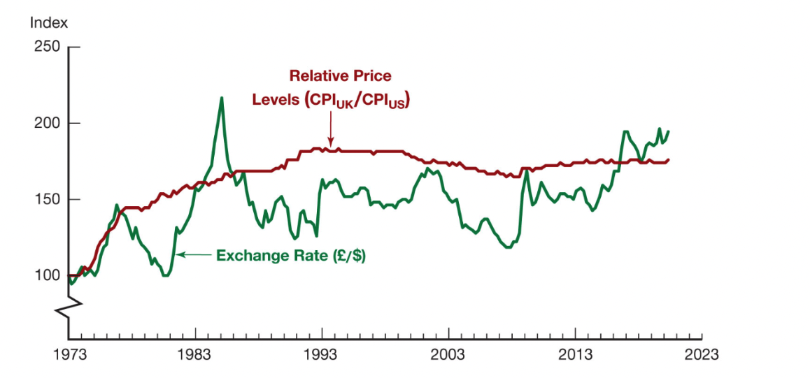
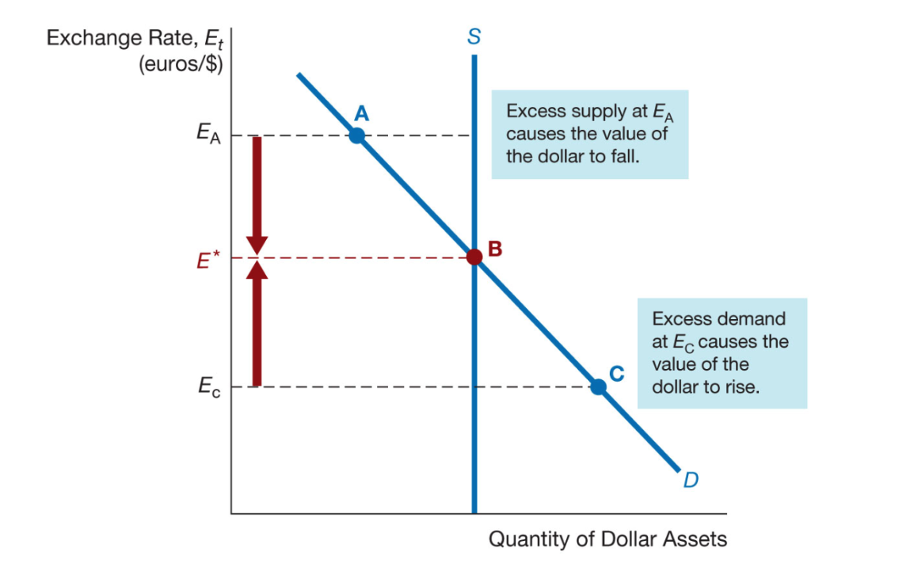

class: center,middle,mctitle-slide 


# Exchange rates

## Manolis Chatzikonstantinou  

---

class: my-one-page-font

# What will you learn in this lecture?

- Explain how the foreign exchange market works and why exchange rates are importance.

--

-  Identify the main factors that affect exchange rates in the long run.

--

-  Draw the demand and supply curves for foreign exchange market and interpret the equilibrium in the market for foreign exchange.

--

-  List and illustrate the factors that affect the exchange rates in the short run.


---

class: my-one-page-font

# Foreign Exchange Market

__Exchange rate:__ price of one currency in terms of another

__Foreign exchange market:__ 
  - the financial market where exchange rates are determined
  - over-the-counter market
  - trading reserves
  
__Spot transaction:__ immediate (two-day) exchange of bank deposits
  - Spot exchange rate

__Forward transaction:__ the exchange of bank deposits at some specified future date
  - Forward exchange rate

---

class: my-one-page-font

# Foreign Exchange Market 

- Appreciation: a currency rises in value relative to another currency
 
- Depreciation: a currency falls in value relative to another currency

--


Theory of Purchasing Power Parity:
  - Exchange Rates in the Long Run  
  - Assumption 1: All goods are identical in both countries
  - Assumption 2: Trade barriers and transportation costs are low

---

class: my-one-page-font

# Foreign Exchange Market 

But, Many goods and services are not traded across borders

```{r  out.width = "80%", fig.align="center",echo=FALSE}

```

- [Big Macs and PPP]()

---

class: my-one-page-font

# Factors That Affect Exchange Rates in the Long Run

| Factor | Change in Factor | Response of the Exchange Rate |
| :--- | :---: | :---: |
| Domestic prices, Relative to other countries |  |  |
| Trade barriers, Relative to other countries |  |  |
| Import demand |  |  |
| Export demand |  |  |
| Productivity, Relative to other countries |  |  |

---

class: my-one-page-font

# Exchange Rates in the Short Run

- An exchange rate is the price of domestic assets in terms of foreign assets

Supply curve for domestic assets
  - Assume amount of domestic assets is fixed 
  - Supply curve is vertical

Demand curve for domestic assets
  - Most important determinant is the relative expected return of domestic assets
  - At lower current values of the dollar, the quantity demanded of dollar assets is higher

---

# Exchange Rate, $E_{t}$


```{r  out.width = "80%", fig.align="center",echo=FALSE}

```

---

# Shifts in the demand for domestic assets

- Domestic interest rate

- Foreign interest rate

- Expected future exchange rate


---

class: my-one-page-font

# Factors affecting the interest rate 

| Factor | Change in Factor | Assets at Each Exchange Rate | Response of Exchange Rate |
| :--- | :---: | :---: | :---: |
| Domestic interest rate|  |  |  |
| Foreign interest rate |  |  |  |
|Expected domestic price level||||
|Expected trade barriers||||
|Expected import demand||||
|Expected export demand||||
|Expected productivity||||

---

class: my-one-page-font


# Changes in Interest Rates and the Exchange Rate


- When domestic real interest rates rise, the domestic currency appreciates.

- When domestic interest rates rise due to an expected increase in inflation, the domestic currency depreciates.

- Changes in the Money Supply
  - A higher domestic money supply causes the domestic currency to depreciate.

- An Increase in Expected Inflation -> rise in interest rate

Step 1. shifts the demand curve to the left...

Step 2. this leads to a fall in the exchange rate

---

class: my-one-page-font

# Applications

Application 1: The Global Financial Crisis and the Dollar

> With the start of the global financial crisis in August
2007, the dollar began an accelerated decline in value,
falling by 9% against the euro until mid-July of 2008.
After hitting an all-time low against the euro on July 11,
the value of the dollar suddenly shot upward, by over
20% against the euro by the end of October. What is
the relationship between the global financial crisis and
these large swings in the value of the dollar?

--

Application 2: Brexit and the British Pound

>As noted in the introduction, the Brexit vote in the
United Kingdom on June 23, 2016, led to nearly a 10%
depreciation in the British pound, from $1.48 to the
pound on June 23, just before the vote, to $1.36 per
pound on June 24. What explains the large one-day
decline in the exchange rate for the pound?

